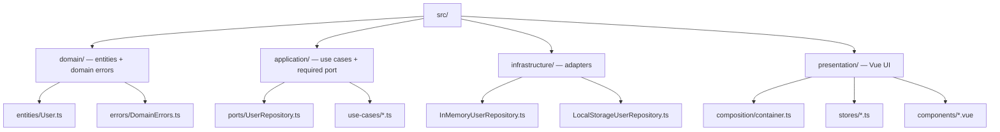

# Onion Architecture — live demo

A tiny Vue 3 app that puts the [Onion Architecture guide](../README.md) into practice. It is the
single home for everything behind the GitHub Pages site.

**Live:** https://andrestaoflorez.github.io/onion-architecture/

## What it shows

- The **four layers** wired exactly as the guide prescribes, with dependencies pointing inward.
- A **runtime [adapter](../GLOSSARY.md#adapter) swap** (in-memory ↔ localStorage): the same [port](../GLOSSARY.md#port), two implementations, and the
  [Application](../GLOSSARY.md#application-layer) and [Presentation](../GLOSSARY.md#presentation-layer) layers never change.
- A **data-flow tracer** that animates each request travelling `View → Store → UseCase → Repository`.

## Layout (the four rings)



## Run it locally

```bash
bun install
bun dev          # http://localhost:5173
bun run build    # type-check + production build into dist/
```

## Deployment

A GitHub Actions workflow (`.github/workflows/deploy.yml` at the repo root) builds this folder with
Bun and publishes `demo/dist` to GitHub Pages on every push to `main`.
