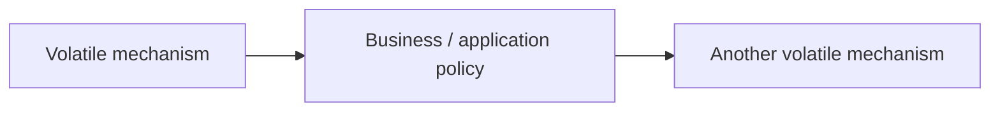
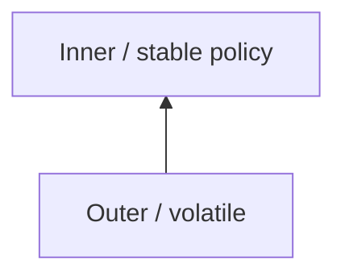
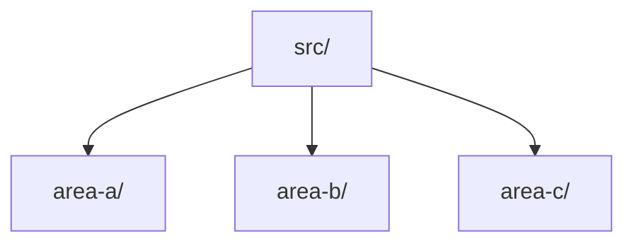
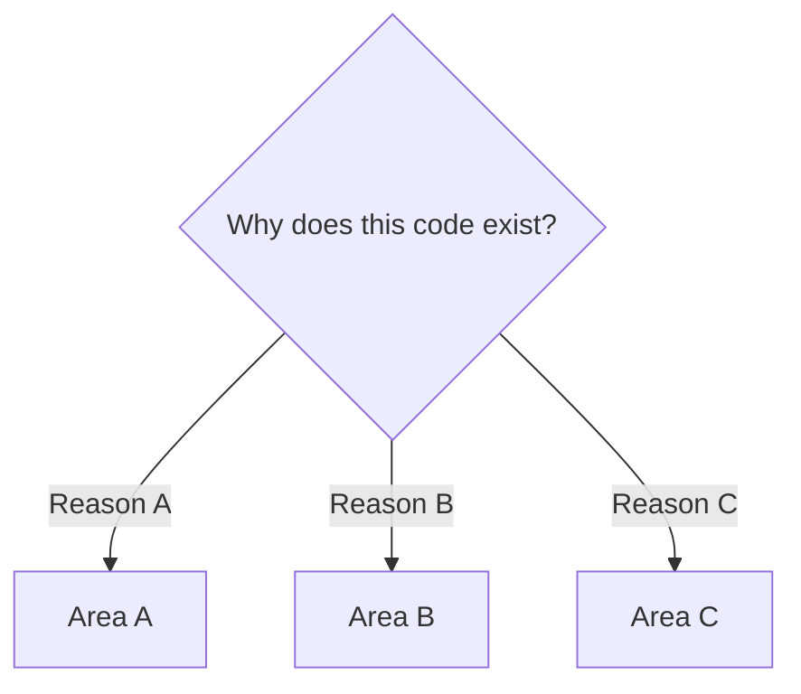

# Architecture Guide Template

> Copy this structure when introducing a new architecture or presentation pattern. Replace placeholders; do not move foundational placement/dependency guidance behind advanced material.
>
> **Teaching rule:** Follow the [first-principles explanation protocol](../CONTRIBUTING.md#3-progressive-disclosure). The headings organize a full guide, but inside every explanation start with a concrete situation, identify the difficulty, trace the smallest mechanism, and only then give it a technical name. Define unfamiliar words locally; a glossary link alone does not explain them. Keep the formal definition, responsibilities and limitations after the example.

← [Repository home](../README.md) · [Glossary](../GLOSSARY.md) · [Code placement](../foundations/code-placement.md) · [Naming](../conventions/naming-and-file-placement.md)

## 1. History and origin

Explain who introduced or popularized the architecture, approximately when, which concrete design problem motivated it, and how the original meaning differs from later reinterpretations. Cite the primary/original source first.

## 2. What problem does it solve?

State the failure mode before presenting the solution.

Explain what the architecture protects and what it does not attempt to solve.

## 3. When it is a strong fit

Describe forces, not company size: domain complexity, expected lifetime, integration volatility, testing needs, and ownership pressure.

## 4. When it is a weak fit

Name the costs: extra abstractions, mapping, indirection, files/modules, and operational complexity where relevant. Give concrete scenarios where a simpler design is preferable.

## 5. Mental model

Use the minimum Mermaid needed to establish the model.

Immediately explain what every node and arrow means. Never assume the reader already knows the vocabulary.

## 6. Layers or roles

For every layer/role, include all of the following.

### 6.x Layer or Role

**Responsibility.** Why it exists.

**Put here.** Concrete code kinds, filenames, and examples.

**Do not put here.** Common mistakes and neighboring responsibilities.

**Allowed dependencies.** Which architectural areas it may import.

**Forbidden dependencies.** What must not cross the boundary and why.

**Example.** One minimal source-code example.

**Placement.**

| Question | Answer |
| --- | --- |
| Folder | example source folder |
| Example filename | example file |
| Why this owner | explain the meaning it owns |
| Why not neighboring layer A | explain |
| Why not neighboring layer B | explain |

## 7. Physical project structure

Use Mermaid for ownership hierarchy:

Then explain every folder:

| Path | Owns | Why | Must not contain |
| --- | --- | --- | --- |
| source area | responsibility | architectural reason | examples of forbidden ownership |

Link to [Naming and File Placement Conventions](../conventions/naming-and-file-placement.md).

## 8. Where does this code go?

Provide a beginner-facing placement decision:

Cover at minimum a business rule, use-case workflow, HTTP/database/SDK code, UI rendering/state, type/[DTO](../GLOSSARY.md#data-transfer-object-dto), helper/utility, and composition/bootstrap.

If the architecture is only a presentation pattern, state which decisions are outside its scope and point to the layered architecture/code-placement guide.

## 9. Naming

Link to [Naming and File Placement Conventions](../conventions/naming-and-file-placement.md). Separate architecture-defined vocabulary, framework naming requirements, and documentation naming conventions.

## 10. One feature end to end

Start from one requirement and build progressively.

| Artifact | File | Owner | Why here | Why not elsewhere |
| --- | --- | --- | --- | --- |

Show the rule/model, [use case](../GLOSSARY.md#use-case)/workflow, justified [ports](../GLOSSARY.md#port)/contracts, [adapter](../GLOSSARY.md#adapter), presentation, composition, and runtime flow versus source dependency direction. Use Mermaid for all flows.

## 11. Testing

Explain pure/domain tests, application/use-case tests, [adapter](../GLOSSARY.md#adapter)/integration tests, presentation tests, architecture/dependency tests, and end-to-end tests where relevant. Do not prescribe arbitrary percentages.

## 12. Trade-offs and failure modes

Document real decay modes such as god services, god [ViewModels](../GLOSSARY.md#viewmodel), generic utility buckets, [service locator](../GLOSSARY.md#service-locator), technology types leaking inward, ceremonial interfaces, or duplicated models without boundary translation.

## 13. Advanced topics

Only now introduce optional topics such as [CQRS](../GLOSSARY.md#cqrs), [domain events](../GLOSSARY.md#domain-event), offline synchronization, [microservices](../GLOSSARY.md#microservice), [microfrontends](../GLOSSARY.md#microfrontend), [DI containers](../GLOSSARY.md#di-container), or [event sourcing](../GLOSSARY.md#event-sourcing). State the force that justifies each option.

## 14. Learning path

List chapters from fundamentals to advanced material. A reader must be able to place and name simple code before reaching advanced chapters.

## Sources

Primary source first, then official framework/standards documentation, then high-quality secondary sources.

For every claim ask: is this a historical fact, framework rule, architectural [invariant](../GLOSSARY.md#invariant), recommended default, or documentation convention? Make that status clear.
