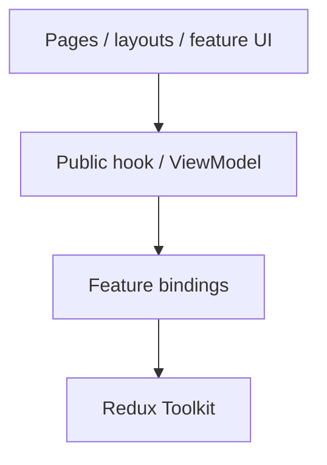

# Executable Architecture

Suppose the ticket policy must not import database code. Writing that rule in a guide helps a developer understand it, but does not stop a later change from adding `import { db } from '../infrastructure/db'` to the wrong module. A check that scans imports can reject that change before it is merged.

Architecture rules that can be checked mechanically should not exist only in prose. Documentation explains *why*; automated checks in CI can catch violations when code changes. They do not replace tests of actual ticket behavior.

## 1. What to enforce

Good automated checks include:

- [Domain](../GLOSSARY.md#domain) cannot import [Application](../GLOSSARY.md#application-layer), [Infrastructure](../GLOSSARY.md#infrastructure) or [Presentation](../GLOSSARY.md#presentation-layer).
- [Application](../GLOSSARY.md#application-layer) cannot import [Infrastructure](../GLOSSARY.md#infrastructure), [Presentation](../GLOSSARY.md#presentation-layer) or UI frameworks.
- [Presentation](../GLOSSARY.md#presentation-layer) cannot import concrete [Infrastructure](../GLOSSARY.md#infrastructure) [adapters](../GLOSSARY.md#adapter) when the project requires use-case boundaries.
- Feature consumers cannot deep-import another feature's internals.
- UI components cannot import Redux internals when a public [ViewModel](../GLOSSARY.md#viewmodel)/hook boundary is part of the architecture.
- [Domain](../GLOSSARY.md#domain)/[Application](../GLOSSARY.md#application-layer) cannot import browser, [ORM](../GLOSSARY.md#orm) or generated transport types.
- Circular dependencies are forbidden.
- Deprecated folder names and legacy APIs cannot return.

Do not test subjective preferences as architecture unless the team has intentionally made them a contract.

## 2. AST-based tests

A TypeScript project can inspect imports directly. This is a policy sketch, not a runnable import resolver: implement the helper functions with the compiler API and test alias, external-package and file-resolution behavior.

```ts
const allowed = {
  domain: ['domain'],
  application: ['application', 'domain'],
  infrastructure: ['infrastructure', 'application', 'domain'],
  presentation: ['presentation', 'application'],
  composition: ['composition', 'presentation', 'infrastructure', 'application', 'domain'],
}

for (const file of sourceFiles(root)) {
  const owner = topLevelArea(file)

  for (const imported of collectImports(file)) {
    // collectImports must resolve local specifiers, including re-exports
    // and type-only/dynamic imports. Check external packages separately.
    if (imported.kind === 'external-package') continue
    const target = topLevelArea(imported.path)

    if (!allowed[owner]?.includes(target)) {
      violations.push({ file, imported })
    }
  }
}

expect(violations).toEqual([])
```

Parse the language syntax tree rather than relying only on regular expressions. Include:

- static imports;
- exports/re-exports;
- dynamic imports;
- [type-only imports](../GLOSSARY.md#type-only-import);
- path aliases;
- relative paths.

[Type-only imports](../GLOSSARY.md#type-only-import) still represent design-time coupling.

## 3. Dependency graph tools

For JavaScript/TypeScript, dependency-cruiser can enforce `forbidden`, `allowed` and `required` dependency rules. Cross-feature rules that need to compare source and target feature identities may require a more specific tool/configuration or a custom [AST](../GLOSSARY.md#abstract-syntax-tree-ast) check; do not assume a single regular expression compares capture groups across both sides.

Partial configuration covering two local rules; add the full project matrix and external-package rules:

```js
export default {
  forbidden: [
    {
      name: 'domain-does-not-depend-outward',
      severity: 'error',
      from: { path: '^src/domain(?:/|$)' },
      to: { path: '^src/(application|infrastructure|presentation|composition)(?:/|$)' },
    },
    {
      name: 'application-does-not-depend-on-outer-layers',
      severity: 'error',
      from: { path: '^src/application(?:/|$)' },
      to: { path: '^src/(infrastructure|presentation|composition)(?:/|$)' },
    },
  ],
}
```

Other ecosystems have equivalent tools. The tool is replaceable; the rule is the architecture.

## 4. Public API tests

If each feature exposes only `index.ts`, enforce that cross-feature imports target that [public API](../GLOSSARY.md#public-api).

Allowed:

```ts
import { useAuth } from '@/presentation/features/auth'
```

Forbidden:

```ts
import { authSlice } from '@/presentation/features/auth/model/auth.slice'
```

The feature itself may freely import its own internals.

## 5. Framework-boundary tests

When the UI architecture intentionally hides Redux behind a feature [facade](../GLOSSARY.md#facade-pattern), make that rule executable:



Tests can forbid `react-redux`, `@reduxjs/toolkit`, [store](../GLOSSARY.md#store) modules and slices from UI surface folders.

This is stricter than Redux's general recommendation, which permits React components to use typed Redux hooks directly. It is therefore a **project architecture choice**, not a universal Redux rule. Document that distinction.

## 6. Test behavior and boundaries separately

[Architecture tests](../GLOSSARY.md#architecture-test) do not replace:

- domain unit tests;
- use-case tests;
- [adapter](../GLOSSARY.md#adapter) contract/integration tests;
- component tests;
- end-to-end tests.

They answer a different question: "Is the [dependency graph](../GLOSSARY.md#dependency-graph) still the one we designed?"

## 7. Keep the rules small and explainable

Every automated architecture rule should have:

1. a stable name;
2. a short rationale;
3. examples of legal and illegal imports;
4. a documented escape hatch for exceptional cases;
5. ownership.

If developers cannot explain a rule, the rule will eventually be bypassed.

## Sources

- dependency-cruiser rules reference: https://github.com/sverweij/dependency-cruiser/blob/main/doc/rules-reference.md
- Redux Style Guide: https://redux.js.org/style-guide/
- Robert C. Martin, "The [Clean Architecture](../GLOSSARY.md#clean-architecture)": https://blog.cleancoder.com/uncle-bob/2012/08/13/the-clean-architecture.html
