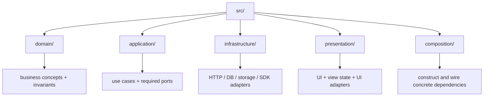
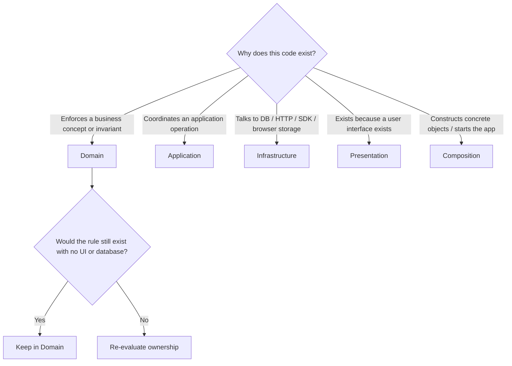
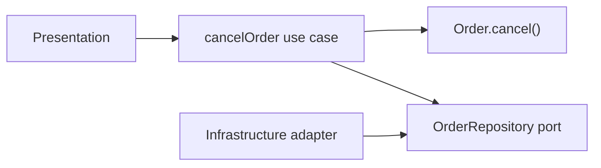
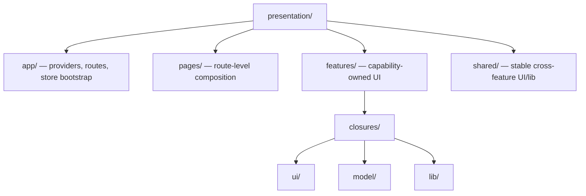
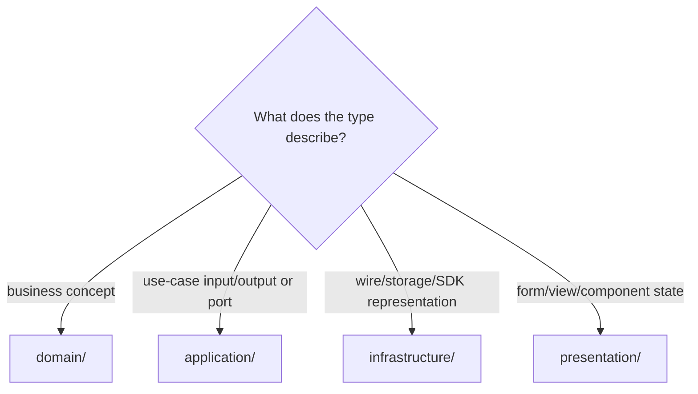
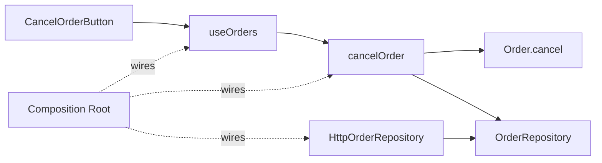

# Code Placement: Where Does This Code Belong?

This guide answers the question a beginner encounters first:

> I have a function, type, class, hook, [adapter](../GLOSSARY.md#adapter), or component. Which folder owns it, and why?

For example, suppose an analyst creates a support ticket. The code that draws the form belongs with the UI; the operation that checks the submitted subject belongs with the application workflow; the code that sends an HTTP request belongs with the external integration; and the startup code connects these pieces. If a rule says which ticket statuses are valid regardless of screen or server, that rule belongs with the business concepts. We name these responsibilities below.

The default layered structure used throughout this repository is:



## 1. First decision: why does the code exist?



## 2. Domain

Put code in `domain/` when its meaning is business/domain meaning and it should survive replacement of UI, HTTP transport, database, Redux, or framework.

Examples:

| Code | Why [Domain](../GLOSSARY.md#domain) owns it |
| --- | --- |
| `Order` | business entity with identity |
| `Money` | value semantics and [invariants](../GLOSSARY.md#invariant) |
| `ClosurePeriod` | valid/invalid date-range business rule |
| `ShippedOrderCannotBeCancelled` | failure expressed in domain language |

Do **not** put here:

- React hooks/components;
- Redux slices;
- API [DTOs](../GLOSSARY.md#data-transfer-object-dto);
- [ORM](../GLOSSARY.md#orm) rows;
- `FormState`;
- `UploadQueueItem`;
- browser `File`;
- CSS/Panda [recipes](../GLOSSARY.md#recipe).

The short snippets below isolate responsibilities; supporting constructors, contracts, imports and transport bodies are omitted. They are not complete modules. For checked complete files and wiring, use [the cancellation walkthrough](../clean-architecture/4-building-a-feature.md). Its application boundary returns plain results to UI and uses a version precondition for persistence.

### Function example

Requirement:

> An order may not be cancelled after shipment.

The rule belongs in [Domain](../GLOSSARY.md#domain) because the rule is true regardless of how cancellation was requested.

```ts
// src/domain/orders/Order.ts
import { ShippedOrderCannotBeCancelled, type OrderStatus } from './order.types'
// In this excerpt, supporting order.types contains the status union/error.
export class Order {
  constructor(readonly id: string, private status: OrderStatus) {}
  cancel() {
    if (this.status === 'shipped') {
      throw new ShippedOrderCannotBeCancelled()
    }

    this.status = 'cancelled'
  }
}
```

It must **not** live in `CancelOrderButton.tsx`, because a CLI/API could cancel orders too.

## 3. Application

Put code in `application/` when it expresses **what the application does** and coordinates domain behavior plus external capabilities.



Example:

```ts
// src/application/orders/use-cases/cancelOrder.ts
export function makeCancelOrder(deps: {
  orders: OrderRepository
}) {
  return async function cancelOrder(id: OrderId) {
    const order = await deps.orders.findById(id)

    if (!order) throw new OrderNotFound(id)

    order.cancel()
    await deps.orders.save(order)
  }
}
```

Why [Application](../GLOSSARY.md#application-layer)?

- loading + saving is use-case orchestration;
- the business [invariant](../GLOSSARY.md#invariant) remains in `Order`;
- the concrete database/HTTP mechanism remains outside.

Do **not** import `PrismaClient`, `axios`, React, or Redux here.

## 4. Ports

A [port](../GLOSSARY.md#port) belongs with the inner policy that requires the capability.

```ts
// src/application/orders/ports/OrderRepository.ts
export interface OrderRepository {
  findById(id: OrderId): Promise<Order | null>
  save(order: Order): Promise<void>
}
```

Why here?

[Application](../GLOSSARY.md#application-layer) needs "load/save Orders". It does not need "SQL" or "REST".

The concrete implementation goes outward.

## 5. Infrastructure

Put technical I/O implementations in `infrastructure/`.

```ts
// src/infrastructure/orders/HttpOrderRepository.ts
export class HttpOrderRepository implements OrderRepository {
  constructor(private readonly http: HttpClient) {}

  // translate HTTP DTOs at this boundary
}
```

[Infrastructure](../GLOSSARY.md#infrastructure) may know [Application](../GLOSSARY.md#application-layer) contracts. [Application](../GLOSSARY.md#application-layer) must not know this concrete class.

Typical [Infrastructure](../GLOSSARY.md#infrastructure) files:

- `HttpOrderRepository.ts`
- `PrismaUserRepository.ts`
- `SessionStorageDraftStorage.ts`
- `StripePaymentGateway.ts`
- API [DTOs](../GLOSSARY.md#data-transfer-object-dto) and [mappers](../GLOSSARY.md#mapper).

## 6. Presentation

Put code in `presentation/` when it exists because the current UI exists.



Examples:

| Code | Location | Why |
| --- | --- | --- |
| `ClosuresPage.tsx` | `presentation/pages/closures/` | route-level composition |
| `QueryFilters.tsx` | `features/closures/ui/` | feature UI |
| `useClosures.ts` | `features/closures/model/` | public [Presentation](../GLOSSARY.md#presentation-layer) [facade](../GLOSSARY.md#facade-pattern) |
| `closures.slice.ts` | `features/closures/model/` | shared client feature state |
| `closure-validation.ts` | `features/closures/lib/` | UI input feedback only; authoritative business validity belongs inward |
| `Button.tsx` | `shared/ui/` | cross-feature primitive |

## 7. Composition

Composition is where concrete implementations are selected.

```ts
// src/composition/bootstrap.ts
const orders = new HttpOrderRepository(http)
const cancelOrder = makeCancelOrder({ orders })
const store = createAppStore({ cancelOrder })

startUi({ store })
```

Do not import this container from a [use case](../GLOSSARY.md#use-case), hook, component, or controller to locate dependencies.

## 8. Where does a type belong?



Examples:

| Type | Owner |
| --- | --- |
| `Money` | [Domain](../GLOSSARY.md#domain) |
| `ExecuteClosureCommand` | [Application](../GLOSSARY.md#application-layer) |
| `ApiClosureDto` | [Infrastructure](../GLOSSARY.md#infrastructure) |
| `ClosureFormState` | [Presentation](../GLOSSARY.md#presentation-layer) |
| `UploadQueueItem` | [Presentation](../GLOSSARY.md#presentation-layer) |

## 9. Where does a helper function belong?

Do not default to `utils/`.

Ask what owns the meaning.

- formats a closure-specific message → `features/closures/lib/`;
- maps an API [DTO](../GLOSSARY.md#data-transfer-object-dto) → [Infrastructure](../GLOSSARY.md#infrastructure) [mapper](../GLOSSARY.md#mapper);
- validates a business [invariant](../GLOSSARY.md#invariant) → [Domain](../GLOSSARY.md#domain);
- coordinates a [use case](../GLOSSARY.md#use-case) → [Application](../GLOSSARY.md#application-layer);
- generic `formatBytes` used across unrelated features → `presentation/shared/lib/` or another explicit shared library.

<a id="10-a-complete-placement-example"></a>

## 10. A placement map for a complete feature

Requirement:

> The user submits a cancellation from a React page. The application must reject shipped orders and persist a successful cancellation through HTTP.

| Artifact | File | Reason |
| --- | --- | --- |
| [invariant](../GLOSSARY.md#invariant) | `domain/orders/Order.ts` | business truth |
| [repository](../GLOSSARY.md#repository) capability | `application/orders/ports/OrderRepository.ts` | required by application policy |
| [use case](../GLOSSARY.md#use-case) | `application/orders/use-cases/cancelOrder.ts` | orchestrates operation |
| HTTP [adapter](../GLOSSARY.md#adapter) | `infrastructure/orders/HttpOrderRepository.ts` | technical detail |
| feature [facade](../GLOSSARY.md#facade-pattern) | `presentation/features/orders/model/useOrders.ts` | view-facing API |
| button | `presentation/features/orders/ui/CancelOrderButton.tsx` | rendering + interaction |
| wiring | `composition/bootstrap.ts` | selects concrete [adapter](../GLOSSARY.md#adapter) |

The following arrows describe source references and construction, not a runtime [port](../GLOSSARY.md#port) object:



## 11. Naming

Before creating the file, apply [Naming and File Placement Conventions](../conventions/naming-and-file-placement.md).

The folder answers **who owns it**. The filename answers **what role it plays**.
