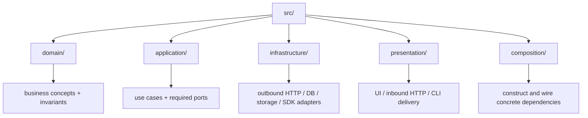
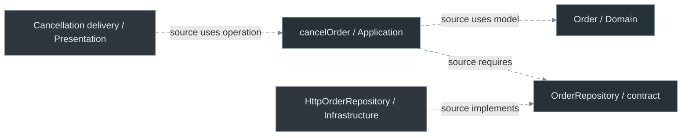
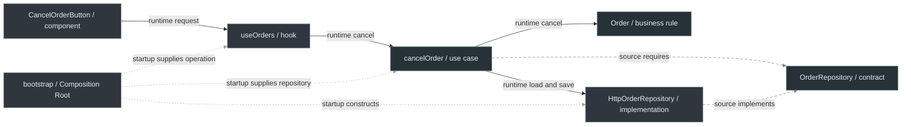
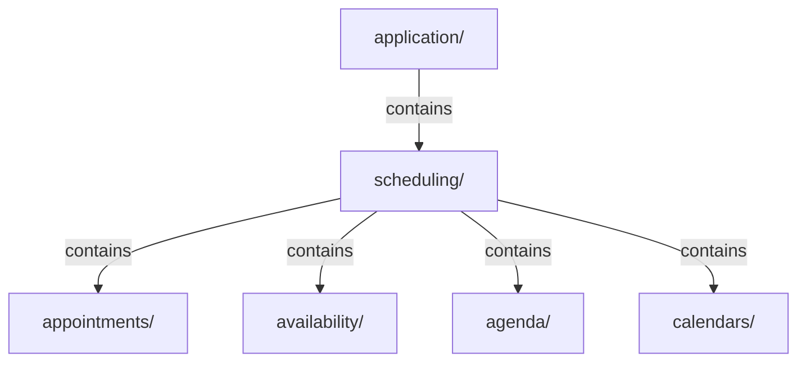

# Code Placement: Where Does This Code Belong?

This guide answers the question a beginner encounters first:

> I have a function, type, class, hook, [adapter](../GLOSSARY.md#adapter), or component. Which folder owns it, and why?

For example, suppose an analyst creates a support ticket. The code that draws the form belongs with the UI; the operation that checks the submitted subject belongs with the application workflow; the code that sends an HTTP request belongs with the external integration; and the startup code connects these pieces. If a rule says which ticket statuses are valid regardless of screen or server, that rule belongs with the business concepts. We name these responsibilities below.

The canonical physical convention is **layer first, capability second**. This diagram shows the top-level folders; arrows mean containment, not runtime calls:



## 1. First decision: why does the code exist?


## 2. Domain

Put code in `domain/` when its meaning is business/domain meaning and it should survive replacement of UI, HTTP transport, database, Redux, or framework.

Examples:

| Code | Why [Domain](../GLOSSARY.md#domain) owns it |
| --- | --- |
| `Order` | business entity with identity |
| `Money` | value semantics and [invariants](../GLOSSARY.md#invariant) |
| `ClosurePeriod` | valid/invalid date-range business rule |
| `ShippedOrderCannotBeCancelled` | failure expressed in domain language |

Do **not** put here:

- React hooks/components;
- Redux slices;
- API [DTOs](../GLOSSARY.md#data-transfer-object-dto);
- [ORM](../GLOSSARY.md#orm) rows;
- `FormState`;
- `UploadQueueItem`;
- browser `File`;
- CSS/Panda [recipes](../GLOSSARY.md#recipe).

The short snippets below isolate responsibilities; supporting constructors, contracts, imports and transport bodies are omitted. They are not complete modules. For checked complete files and wiring, use [the cancellation walkthrough](../clean-architecture/4-building-a-feature.md). Its application boundary returns plain results to UI and uses a version precondition for persistence.

### Function example

Requirement:

> An order may not be cancelled after shipment.

The rule belongs in [Domain](../GLOSSARY.md#domain) because the rule is true regardless of how cancellation was requested.

```ts
// src/domain/orders/Order.ts
import { ShippedOrderCannotBeCancelled, type OrderStatus } from './order.types'
// In this excerpt, supporting order.types contains the status union/error.
export class Order {
  constructor(readonly id: string, private status: OrderStatus) {}
  cancel() {
    if (this.status === 'shipped') {
      throw new ShippedOrderCannotBeCancelled()
    }

    this.status = 'cancelled'
  }
}
```

It must **not** live in `CancelOrderButton.tsx`, because a CLI/API could cancel orders too.

## 3. Application

Put code in `application/` when it expresses **what the application does** and coordinates domain behavior plus external capabilities.

Dashed arrows show source references: the operation knows the model and its required storage contract; the concrete implementation also knows that contract. At runtime, it calls the supplied storage object directly, without an intermediate [port](../GLOSSARY.md#port) process.



Example:

```ts
// src/application/orders/use-cases/cancelOrder.ts
export function makeCancelOrder(deps: {
  orders: OrderRepository
}) {
  return async function cancelOrder(id: OrderId) {
    const order = await deps.orders.findById(id)

    if (!order) throw new OrderNotFound(id)

    order.cancel()
    await deps.orders.save(order)
  }
}
```

Why [Application](../GLOSSARY.md#application-layer)?

- loading + saving is use-case orchestration;
- the business [invariant](../GLOSSARY.md#invariant) remains in `Order`;
- the concrete database/HTTP mechanism remains outside.

Do **not** import `PrismaClient`, `axios`, React, or Redux here.

## 4. Ports

A [port](../GLOSSARY.md#port) belongs with the inner policy that requires the capability.

```ts
// src/application/orders/ports/OrderRepository.ts
export interface OrderRepository {
  findById(id: OrderId): Promise<Order | null>
  save(order: Order): Promise<void>
}
```

Why here?

[Application](../GLOSSARY.md#application-layer) needs "load/save Orders". It does not need "SQL" or "REST".

The concrete implementation goes outward.

## 5. Infrastructure

Put technical I/O implementations in `infrastructure/`.

```ts
// src/infrastructure/http/orders/adapters/HttpOrderRepository.ts
export class HttpOrderRepository implements OrderRepository {
  constructor(private readonly http: HttpClient) {}

  // translate HTTP DTOs at this boundary
}
```

[Infrastructure](../GLOSSARY.md#infrastructure) may know [Application](../GLOSSARY.md#application-layer) contracts. [Application](../GLOSSARY.md#application-layer) must not know this concrete class.

Typical [Infrastructure](../GLOSSARY.md#infrastructure) files:

- `HttpOrderRepository.ts`
- `PrismaUserRepository.ts`
- `SessionStorageDraftStorage.ts`
- `StripePaymentGateway.ts`
- API [DTOs](../GLOSSARY.md#data-transfer-object-dto) and [mappers](../GLOSSARY.md#mapper).

<a id="6-presentation-placement-in-a-feature-oriented-frontend"></a>

## 6. Presentation

An analyst can create a ticket through a browser screen or through a server endpoint. Both accept a caller's input and present results, but their technical responsibilities differ:

| Layer | Frontend | Backend |
| --- | --- | --- |
| [Domain](../GLOSSARY.md#domain) | Business rules/values used by the client; server remains authoritative | Authoritative business rules/values |
| [Application](../GLOSSARY.md#application-layer) | [Use cases](../GLOSSARY.md#use-case) and required [ports](../GLOSSARY.md#port) | [Use cases](../GLOSSARY.md#use-case) and required [ports](../GLOSSARY.md#port) |
| [Infrastructure](../GLOSSARY.md#infrastructure) | Outgoing HTTP, browser storage, external SDKs | Persistence, external APIs, messaging |
| [Presentation](../GLOSSARY.md#presentation-layer) | Pages, components, hooks, render/interaction state | Incoming HTTP controllers, guards, pipes, parsers, [DTOs](../GLOSSARY.md#data-transfer-object-dto) and CLI handlers |
| Composition | Providers and dependency/bootstrap assembly | [Nest modules](../GLOSSARY.md#nestjs-module), tokens and startup |

An outbound HTTP client calls another system, so it belongs to [Infrastructure](../GLOSSARY.md#infrastructure) in both environments. An incoming HTTP request enters backend [Presentation](../GLOSSARY.md#presentation-layer). Neither “HTTP” nor “[DTO](../GLOSSARY.md#data-transfer-object-dto)” identifies a layer by itself.

Keep the five top-level layers. For frontend [Presentation](../GLOSSARY.md#presentation-layer), begin with `presentation/scheduling/{pages,components,hooks,state}/`; Tickets and Patients use the same sibling capability convention. Backend delivery begins with `presentation/http/tickets/{controllers,guards,pipes,parsers,dto,mappers}/` and `presentation/cli/tickets/handlers/`. These describe available places, not files to generate without a responsibility.

### Exact owned paths

Prefix these paths with `src/`. The [complete frontend Scheduling map](../frontend/presentation-architecture.md#2-organize-by-ownership-not-only-by-technical-type) and [backend Ticket map](../backend/4-create-ticket-with-nestjs.md#physical-structure) explain the surrounding capability.

| Artifact | Exact path | Why |
| --- | --- | --- |
| Nest [Controller](../GLOSSARY.md#controller) | `presentation/http/tickets/controllers/TicketsController.ts` | Groups incoming [route handlers](../GLOSSARY.md#route-handler) |
| [Nest Guard](../GLOSSARY.md#nestjs-guard) | `presentation/http/tickets/guards/AuthenticatedGuard.ts` | Decides access using an already verified principal |
| [Nest Pipe](../GLOSSARY.md#nestjs-pipe) | `presentation/http/tickets/pipes/CreateTicketPipe.ts` | Integrates the [Parser](../GLOSSARY.md#parser) with a Nest handler argument and maps failure |
| Plain request [Parser](../GLOSSARY.md#parser) | `presentation/http/tickets/parsers/parseCreateTicketRequest.ts` | Checks unknown transport shape without Nest |
| HTTP request [DTO](../GLOSSARY.md#data-transfer-object-dto) | `presentation/http/tickets/dto/CreateTicketRequestDto.ts` | Incoming HTTP representation |
| HTTP response [DTO](../GLOSSARY.md#data-transfer-object-dto) | `presentation/http/tickets/dto/TicketResponseDto.ts` | Outgoing HTTP representation |
| HTTP response [mapper](../GLOSSARY.md#mapper) | `presentation/http/tickets/mappers/mapCreateTicketResponse.ts` | Converts successful [Application](../GLOSSARY.md#application-layer) data into HTTP fields |
| Prisma [adapter](../GLOSSARY.md#adapter) | `infrastructure/persistence/tickets/adapters/PrismaTicketRepository.ts` | Implements the persistence capability with Prisma |
| Persistence [mapper](../GLOSSARY.md#mapper), when retrieval requires one | `infrastructure/persistence/tickets/mappers/mapTicketPersistenceRecord.ts` | Converts stored representation without resetting existing business state |
| Frontend Page | `presentation/scheduling/pages/AgendaPage.tsx` | Composes the route/screen |
| Frontend Component | `presentation/scheduling/components/AppointmentCard/AppointmentCard.tsx` | Focused appointment display/interaction |
| Frontend Hook | `presentation/scheduling/hooks/useAgenda.ts` | Reuses React interaction/composition |
| Frontend State | `presentation/scheduling/state/agenda.state.ts` | Render/interaction data |
| Frontend API [Parser](../GLOSSARY.md#parser) | `infrastructure/http/scheduling/parsers/parseAgendaApiResponse.ts` | Checks unknown data returned by another system |
| Frontend API [DTO](../GLOSSARY.md#data-transfer-object-dto) | `infrastructure/http/scheduling/dto/AgendaApiDto.ts` | Owns that external wire shape |

[Presentation](../GLOSSARY.md#presentation-layer) must reuse inward-owned business checks rather than duplicate them in a form or request [Parser](../GLOSSARY.md#parser). The [Parser](../GLOSSARY.md#parser) checks transport shape; [Domain](../GLOSSARY.md#domain) checks business validity. The [backend mechanism guide](../backend/3-nestjs-building-blocks.md#guard-and-pipe-answer-different-questions) explains the separate access and framework decisions.

## 7. Composition

Composition is where concrete implementations are selected.

```ts
// src/composition/bootstrap.ts
const orders = new HttpOrderRepository(http)
const cancelOrder = makeCancelOrder({ orders })
const store = createAppStore({ cancelOrder })

startUi({ store })
```

Do not import this container from a [use case](../GLOSSARY.md#use-case), hook, component, or controller to locate dependencies.

## 8. Where does a type belong?

Suppose HTTP calls the field `ticket_id` while [Application](../GLOSSARY.md#application-layer) uses `id`. The HTTP type describes the protocol; the [Application](../GLOSSARY.md#application-layer) result describes the operation. Even structurally identical objects can have different owners. A [DTO](../GLOSSARY.md#data-transfer-object-dto) is a representation crossing a particular data boundary, not every plain object.

| Representation | Exact file and owner |
| --- | --- |
| Backend incoming HTTP request | `presentation/http/tickets/dto/CreateTicketRequestDto.ts` |
| Backend outgoing HTTP response | `presentation/http/tickets/dto/TicketResponseDto.ts` |
| Frontend backend-API response | `infrastructure/http/tickets/dto/TicketApiDto.ts` |
| External payment provider | `infrastructure/integrations/payments/dto/StripePaymentDto.ts` |
| Custom database record, only when needed | `infrastructure/persistence/tickets/dto/TicketPersistenceRecord.ts` |
| [Application](../GLOSSARY.md#application-layer) input, **not an HTTP [DTO](../GLOSSARY.md#data-transfer-object-dto)** | `application/tickets/contracts/CreateTicketCommand.ts` |
| [Application](../GLOSSARY.md#application-layer) output, **not an HTTP response [DTO](../GLOSSARY.md#data-transfer-object-dto)** | `application/tickets/contracts/CreateTicketResult.ts` |
| Business value | `domain/billing/Money.ts` |
| Component-only props | `presentation/scheduling/components/AppointmentCard/AppointmentCard.types.ts` |

A generated Prisma record type can make a custom `TicketPersistenceRecord` unnecessary. [Domain](../GLOSSARY.md#domain) values and [Application](../GLOSSARY.md#application-layer) contracts do not gain an external owner because several callers use them.

### Parsing and mapping follow the boundary

A [Parser](../GLOSSARY.md#parser) accepts unknown input and either returns an accepted representation or reports failure. A [mapper](../GLOSSARY.md#mapper) translates a representation whose validity has already been established. Neither name implies one architectural layer.

| What is parsed? | Exact file | Why |
| --- | --- | --- |
| Incoming backend `POST /tickets` body | `presentation/http/tickets/parsers/parseCreateTicketRequest.ts` | The calling transport is [Presentation](../GLOSSARY.md#presentation-layer)'s boundary |
| Backend `GET /agenda` response received by the frontend | `infrastructure/http/scheduling/parsers/parseAgendaApiResponse.ts` | The client is consuming an external integration |
| Stripe provider event, after signature verification | `infrastructure/integrations/payments/parsers/parseStripeEvent.ts` | It interprets provider-specific data; signature verification must use the provider's supported mechanism |
| A business Money representation | `domain/billing/Money.ts`, or `domain/billing/parsers/parseMoney.ts` if a separate parser is useful | [Domain](../GLOSSARY.md#domain) owns the value's validity, not the transport |

For a webhook, the HTTP [Controller](../GLOSSARY.md#controller) owns request delivery/access and delegates provider interpretation to the integration. A shape [Parser](../GLOSSARY.md#parser) alone does not authenticate a webhook.

| Mapping | Exact file |
| --- | --- |
| Frontend API [DTO](../GLOSSARY.md#data-transfer-object-dto) to internal agenda representation | `infrastructure/http/scheduling/mappers/mapAgendaApiDto.ts` |
| Stored record to [Domain](../GLOSSARY.md#domain)/[Application](../GLOSSARY.md#application-layer) representation, when needed | `infrastructure/persistence/tickets/mappers/mapTicketPersistenceRecord.ts` |
| Successful [Application](../GLOSSARY.md#application-layer) ticket data to HTTP response [DTO](../GLOSSARY.md#data-transfer-object-dto) | `presentation/http/tickets/mappers/mapCreateTicketResponse.ts` |
| [Application](../GLOSSARY.md#application-layer) data to a display row | `presentation/scheduling/formatters/formatAppointmentRow.ts`; use a specific [Presentation](../GLOSSARY.md#presentation-layer) [mapper](../GLOSSARY.md#mapper) instead when structural mapping deserves its own responsibility |

Do not introduce a global `mappers/` folder. A persistence [mapper](../GLOSSARY.md#mapper) restores stored identity/status through the domain's supported restoration mechanism. It must not call a creation factory that resets a resolved ticket to `open`. The current creation-only example needs no retrieval [mapper](../GLOSSARY.md#mapper).

## 9. Where does a helper function belong?

A function used twice still has a meaning. Name/place it for the responsibility that owns that meaning, rather than for the fact that it is reusable.

| Meaning | Exact file |
| --- | --- |
| Scheduling policy: working hours, overlaps, breaks, closure dates | `domain/scheduling/availability/calculateAvailableSlots.ts` |
| Agenda-loading orchestration | `application/scheduling/use-cases/GetAgenda.ts` |
| Backend API translation | `infrastructure/http/scheduling/mappers/mapAgendaApiDto.ts` |
| Appointment time displayed in the selected locale | `presentation/scheduling/formatters/formatAppointmentTime.ts` |
| Ticket status displayed as a label | `presentation/tickets/formatters/formatTicketStatusLabel.ts` |
| Visible HTTP error response formatting, if reused | `presentation/http/tickets/formatters/formatTicketErrorResponse.ts` |
| Byte-size display shared by unrelated screens | `presentation/shared/formatters/formatBytes.ts`, only after shared ownership is established |

Avoid `src/utils/`, `src/helpers/`, `src/common/` and `src/lib/`. A formatter producing a payment provider's protocol belongs to that [Infrastructure](../GLOSSARY.md#infrastructure) integration, not to display formatting.

Placement follows **meaning and reason to change, not size**. A complex availability function can contain hundreds of lines of actual scheduling policy and remain [Domain](../GLOSSARY.md#domain) code; its size may justify splitting cohesive functions within [Domain](../GLOSSARY.md#domain), not moving them to “utils”. A five-line persistence [mapper](../GLOSSARY.md#mapper) remains [Infrastructure](../GLOSSARY.md#infrastructure) code. Neither complexity nor brevity establishes a generic shared owner.

<a id="10-a-complete-placement-example"></a>

## 10. A placement map for a complete feature

Requirement:

> The user submits a cancellation from a [React page](../GLOSSARY.md#react-page). The application must reject shipped orders and persist a successful cancellation through HTTP.

| Artifact | File | Reason |
| --- | --- | --- |
| [invariant](../GLOSSARY.md#invariant) | `domain/orders/Order.ts` | business truth |
| [repository](../GLOSSARY.md#repository) capability | `application/orders/ports/OrderRepository.ts` | required by application policy |
| [use case](../GLOSSARY.md#use-case) | `application/orders/use-cases/cancelOrder.ts` | orchestrates operation |
| HTTP [adapter](../GLOSSARY.md#adapter) | `infrastructure/http/orders/adapters/HttpOrderRepository.ts` | technical detail |
| feature [facade](../GLOSSARY.md#facade-pattern) | `presentation/orders/hooks/useOrders.ts` | view-facing API |
| button | `presentation/orders/components/CancelOrderButton/CancelOrderButton.tsx` | rendering + interaction |
| wiring | `composition/bootstrap.ts` | selects concrete [adapter](../GLOSSARY.md#adapter) |

The button requests cancellation through the hook; the operation applies the order rule and calls its supplied HTTP storage implementation. Solid arrows show those runtime calls. Long dashes show selected source requirements/implementation; short dotted arrows show startup construction. The operation also imports its domain model, as section 3 shows. The contract is not a runtime hop:



## 11. Naming

Before creating the file, apply [Naming and File Placement Conventions](../conventions/naming-and-file-placement.md).

The folder answers **who owns it**. The filename answers **what role it plays**.

## 12. Grow capabilities inside each layer

Suppose Tickets gains a neighboring Scheduling capability for appointments, availability and calendars. A flat `application/` with hundreds of unrelated files would make ownership hard to find. Keep architectural responsibility as the first directory and group business capability inside it: `application/tickets/`, `application/scheduling/`, `application/patients/` and `application/billing/`. [Domain](../GLOSSARY.md#domain) and the outer layers use their corresponding owners; [Infrastructure](../GLOSSARY.md#infrastructure) can group persistence/integrations, and [Presentation](../GLOSSARY.md#presentation-layer) can group HTTP/CLI delivery before the capability.

Start with stable responsibility folders inside each capability: [Application](../GLOSSARY.md#application-layer) uses `use-cases/`, `ports/` and `contracts/`; frontend [Presentation](../GLOSSARY.md#presentation-layer) uses `pages/`, `components/`, `hooks/` and `state/`. If real separate business responsibilities emerge, subdivide them **within their layer**. Arrows below mean containment; this is a possible later subdivision, not a full stack per entity:



These folders represent cohesive responsibilities, not automatically every entity or table. Do not create a complete architectural stack for each appointment or doctor just because both have database records. A Scheduling team owns its supported operations across layers; another capability uses its narrow [public API](../GLOSSARY.md#public-api) instead of internal files. A new scheduling rule changes its inward owner, a new calendar integration changes its outer [adapter](../GLOSSARY.md#adapter) and wiring, and additional teams require explicit contracts rather than a global shared bucket.

This convention keeps layer responsibilities visible while capabilities prevent flat dumping grounds. It does not itself enforce imports, guarantee easy changes or prove scalability. Dependency direction and ownership are architectural rules; this physical layout is the handbook's choice, not a filesystem prescription from Martin, Palermo or Cockburn. Capability-first packaging can be valid in another project. See [module boundaries and supported APIs](module-boundaries-and-public-apis.md) for the separate ownership constraint.
