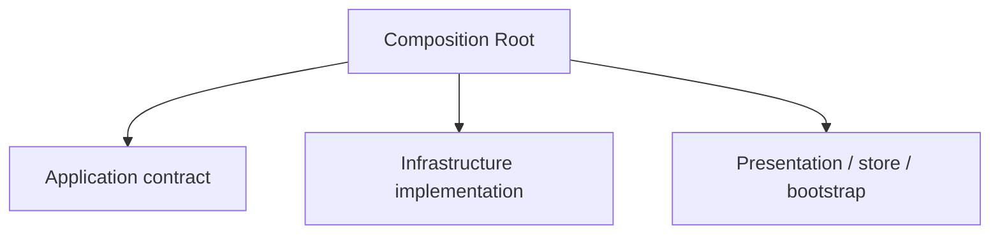

# Composition Root and Dependency Injection

## 1. Composition is a boundary, not business policy

The Composition Root is where abstract dependencies and concrete implementations are connected.

Mark Seemann defines it as a preferably unique location, as close as possible to the application's entry point, where modules are composed together.

A browser application may look like:

```ts
const closureGateway = new HttpClosureGateway(httpClient)
const executeClosure = makeExecuteClosure({ closureGateway })

const store = createAppStore({
  executeClosure,
})

createRoot(document.getElementById('root')!).render(
  <Provider store={store}>
    <App />
  </Provider>,
)
```

The Composition Root is allowed to know both sides:



That is not an exception to the Dependency Rule. Composition is at the outer edge of the application and exists specifically to assemble details around policy.

## 2. Keep composition out of inner modules

Avoid service location:

```ts
// Bad: the consumer goes looking for a dependency.
export function useClosures() {
  const gateway = container.resolve('closureGateway')
}
```

Prefer injection:

```ts
export function makeExecuteClosure(deps: {
  closureGateway: ClosureGateway
}) {
  return async function execute(command: ExecuteClosureCommand) {
    return deps.closureGateway.execute(command)
  }
}
```

The consumer declares what it needs. The edge decides what satisfies it.

## 3. A DI container is optional

Dependency Injection is a design technique. A DI container is a tool.

Manual composition is usually the clearest default while the object graph is small:

```ts
const repository = new HttpOrderRepository(http)
const service = new OrderService(repository)
```

A container becomes useful when it meaningfully improves management of a complex graph, lifetimes/scopes, interception/decorators or framework integration.

Do not introduce one based on an arbitrary number of dependencies.

## 4. Inject capabilities, not global bags

Avoid:

```ts
class CreateOrder {
  constructor(private readonly services: AppServices) {}
}
```

when `AppServices` contains dozens of unrelated dependencies.

Prefer:

```ts
class CreateOrder {
  constructor(
    private readonly orders: OrderRepository,
    private readonly clock: Clock,
  ) {}
}
```

This keeps dependencies visible and improves testability.

## 5. Framework bootstrap belongs at the edge

Entry points may import:

- framework bootstrap APIs;
- concrete adapters;
- application factories;
- store creation;
- providers;
- router creation.

Inner code should never import the entry point or the container.

## 6. Store injection is still dependency injection

For Redux Toolkit, injecting application services through thunk `extraArgument` can preserve the same boundary:

```ts
export function createAppStore(deps: AppDependencies) {
  return configureStore({
    reducer,
    middleware: getDefaultMiddleware =>
      getDefaultMiddleware({
        thunk: { extraArgument: deps },
      }),
  })
}
```

A thunk can then invoke an application contract without importing Infrastructure:

```ts
export const saveOrder = createAsyncThunk<
  SaveOrderResult,
  SaveOrderCommand,
  { extra: AppDependencies }
>('orders/save', async (command, { extra }) => {
  return extra.saveOrder(command)
})
```

Redux Toolkit explicitly supports an injected thunk `extra` argument. The architectural point is not Redux; it is that the concrete adapter remains wired at the edge.

## 7. Multiple composition roots

"Preferably unique" is a useful default, not dogma. Separate independently deployed processes, workers, CLIs or test harnesses naturally have separate roots.

Each executable owns the graph it starts.

## Sources

- Mark Seemann, "Composition Root", 2011: https://blog.ploeh.dk/2011/07/28/CompositionRoot/
- Mark Seemann interview on Dependency Injection, InfoQ, 2011: https://www.infoq.com/articles/DI-Mark-Seemann/
- Redux Toolkit, `createAsyncThunk`: https://redux-toolkit.js.org/api/createAsyncThunk
