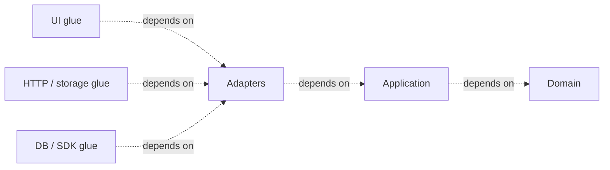
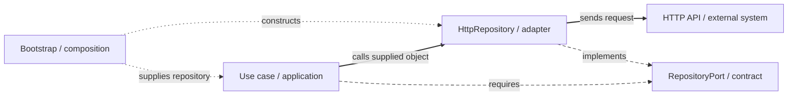
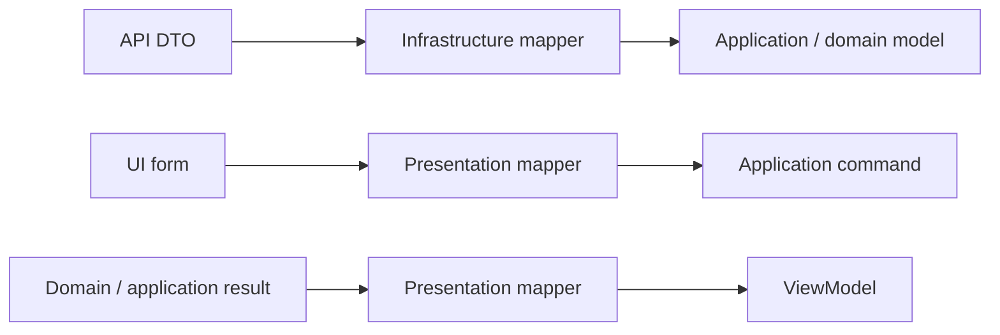

# Dependency Boundaries

## 1. The rule

Suppose our ticket rules say a resolved ticket cannot be assigned again. The rule should continue to work if we replace React, change an HTTP library, or move the records to another database. If the rule imports `fetch`, a database model, or a UI component, a technical change can force us to revisit code that has no reason to change.

A *source dependency* means one code module refers to another—for example, through an `import`. A *policy* is a rule or operation the application is responsible for. A *detail* is a particular way of displaying, storing, or transporting it; that detail is often easier to replace.

The most reusable rule across Clean, Onion and [Ports & Adapters](../GLOSSARY.md#hexagonal-architecture-ports-and-adapters) can now be stated precisely:

> Source dependencies should point from volatile details toward stable policy, never the reverse.

Robert C. Martin's [Clean Architecture](../GLOSSARY.md#clean-architecture) describes the outer circles as mechanisms and the inner circles as policies, and states that names and data formats owned by an outer circle should not leak inward.

A useful generic model is:



The exact number of circles is not architectural law. Martin explicitly describes the four-circle diagram as schematic and allows additional boundaries as long as the [Dependency Rule](../GLOSSARY.md#dependency-rule) holds.

These dashed arrows describe application-owned source modules, not imports inside third-party SDK packages. A practical [adapter](../GLOSSARY.md#adapter) combining translation and technical glue follows [section 11](#combined-outer-modules).

## 2. A practical four-area mapping

For application code, a useful default is:

| Area | Owns | May depend on |
| --- | --- | --- |
| [Domain](../GLOSSARY.md#domain) | business concepts, [invariants](../GLOSSARY.md#invariant), [value objects](../GLOSSARY.md#value-object), [domain errors](../GLOSSARY.md#domain-error) | domain only |
| [Application](../GLOSSARY.md#application-layer) | use-case policy, application contracts, required [ports](../GLOSSARY.md#port) | application + domain |
| [Infrastructure](../GLOSSARY.md#infrastructure) | HTTP/database/storage/SDK [adapters](../GLOSSARY.md#adapter), external [DTOs](../GLOSSARY.md#data-transfer-object-dto) and [mappers](../GLOSSARY.md#mapper) | infrastructure + application + domain |
| [Presentation](../GLOSSARY.md#presentation-layer) | UI/view state and incoming HTTP/CLI delivery, parsing and result mapping | presentation + application; domain only when deliberately exposed as an application contract |

This table is a **recommended project policy**, not a quotation from [Clean Architecture](../GLOSSARY.md#clean-architecture). Projects may split or merge outer areas while preserving inward dependency direction.

The canonical backend uses the stricter [Application](../GLOSSARY.md#application-layer) entry-point boundary: [Presentation](../GLOSSARY.md#presentation-layer) imports `application/tickets` instead of [Domain](../GLOSSARY.md#domain) files directly, even for types. [Infrastructure](../GLOSSARY.md#infrastructure) can import inward data/contracts; Composition imports all pieces needed for assembly. [Its fixture check](../scripts/backend-ticket-example.test.mjs) enforces that complete layer matrix. Capability privacy is a separate rule. Physical paths follow the [layer-first handbook convention](code-placement.md#12-grow-capabilities-inside-each-layer), which those architecture sources do not prescribe.

## 3. Do not confuse runtime flow with source dependency

At runtime a [use case](../GLOSSARY.md#use-case) can call an outer supplied repository, while both source modules refer to an inner contract. Trace the same system below: solid paths are calls, long dashes are source dependencies, short dots are startup wiring. The [port](../GLOSSARY.md#port) is not a forwarding object.



Dependency inversion exists specifically to make those two directions different.

## 4. Ports model capabilities, not files

A [port](../GLOSSARY.md#port) describes a purposeful conversation with something outside the protected policy. Cockburn describes [ports](../GLOSSARY.md#port) as application conversations and notes that both "one [port](../GLOSSARY.md#port) per [use case](../GLOSSARY.md#use-case)" and collapsing everything into only two giant [ports](../GLOSSARY.md#port) are unhelpful extremes.

Prefer [ports](../GLOSSARY.md#port) with coherent capability boundaries:

For the same distinction applied to a browser UI, follow **[Ports & Adapters in a frontend ticket-support application](../frontend/ports-and-adapters.md)** ([port](../GLOSSARY.md#port), HTTP [adapter](../GLOSSARY.md#adapter), [use case](../GLOSSARY.md#use-case), React hook and [Composition Root](../GLOSSARY.md#composition-root)).

```ts
export interface ClosureGateway {
  execute(command: ExecuteClosureCommand): Promise<ClosureJob>
  getJob(id: ClosureJobId): Promise<ClosureJob>
}
```

Avoid god interfaces:

```ts
// Bad: authentication, preferences, catalogs, uploads and closures
// have unrelated reasons to change.
interface SessionRepository {
  login(): Promise<void>
  saveTheme(): Promise<void>
  listOffices(): Promise<void>
  uploadFile(): Promise<void>
  executeClosure(): Promise<void>
}
```

Also avoid ceremonial fragmentation where every [HTTP endpoint](../GLOSSARY.md#http-endpoint) receives its own interface despite sharing one cohesive external capability.

## 5. A port is not automatically a Repository

[Repository](../GLOSSARY.md#repository) is a specific pattern: it presents persistence or retrieval in domain/application terms, often resembling a collection of domain objects.

Other external capabilities deserve names that express what they do:

Examples include `PaymentGateway`, `Clock`, `IdGenerator`, `ClosureExecutor`, `FileStorage`, `JudicialCatalogGateway`, `Telemetry`, and `SessionStore`.

Calling every dependency `Repository` hides intent.

## 6. External technology types stop at the boundary

Inner contracts should not accidentally expose framework or platform types.

For example, the browser `File` interface is part of the Web File API. Passing `File` through an [Application](../GLOSSARY.md#application-layer) [port](../GLOSSARY.md#port) couples the [Application layer](../GLOSSARY.md#application-layer) to a browser API.

Prefer an application-owned shape:

```ts
export interface UploadContent {
  name: string
  mediaType: string
  size: number
  bytes: Uint8Array
}

export interface ClosureFileGateway {
  upload(file: UploadContent): Promise<UploadedFile>
}
```

For large files, use an application-owned streaming abstraction instead of eagerly buffering bytes. The important point is ownership: the inner layer defines the contract; an outer [adapter](../GLOSSARY.md#adapter) translates the browser/Node/native object into it.

The same rule applies to:

- [ORM](../GLOSSARY.md#orm) entities;
- generated OpenAPI clients;
- framework request/response objects;
- Redux action types;
- router locations;
- DOM events;
- browser storage records.

## 7. Data crossing a boundary

Boundary data should be simple and owned by the receiving policy.

Do not pass a database row, API response [DTO](../GLOSSARY.md#data-transfer-object-dto) or UI form state inward unchanged just because TypeScript says the shape is compatible.

Prefer explicit mapping:



Not every boundary needs a bespoke mapping class. Plain functions are often enough.

**Two different questions must not be conflated:**

- **External-data validation (outer [adapter](../GLOSSARY.md#adapter)):** is this untrusted response actually an object with fields such as `ticket_id` and `status` of the expected shape? Map external names and convert integration failures here.
- **Business validity ([Domain](../GLOSSARY.md#domain)):** which status values or ticket transitions are permitted? Declare each rule in one domain-owned place. Export a runtime guard or factory if unknown values must be checked; a TypeScript union disappears at runtime. The technical boundary **calls** the domain guard rather than repeating its list of values.
- **[Application](../GLOSSARY.md#application-layer) orchestration:** use the validated model to perform the requested operation; do not silently redefine a business rule in a [use case](../GLOSSARY.md#use-case) or UI component.

For a concrete example, see [the ticket gateway and its domain status checker](../frontend/ports-and-adapters.md#3-physical-ownership). An API can have a different external vocabulary: the integration maps that protocol to the domain's vocabulary, rather than extending the domain merely to accept a transport string. The backend remains authoritative for its own persisted state and enforcement; separate deployments should check compatibility through API contract/integration tests.

## 8. Domain is not "all shared types"

A type belongs to the layer that owns its meaning.

Examples:

| Type | Owner |
| --- | --- |
| `Money`, `ClosurePeriod`, `OrderStatus` | [Domain](../GLOSSARY.md#domain) |
| `ExecuteClosureCommand`, `SearchCasesResult` | [Application](../GLOSSARY.md#application-layer) |
| `ApiClosureDto`, `LocalStorageDraftRecord` | [Infrastructure](../GLOSSARY.md#infrastructure) |
| `ClosureFormState`, `UploadQueueItem`, `TableColumn` | [Presentation](../GLOSSARY.md#presentation-layer) |

A type named `FormState`, `Toast`, `UploadQueueItem` or `TableRow` should trigger skepticism if it appears in [Domain](../GLOSSARY.md#domain).

## 9. Presentation is an outer policy boundary too

The UI is allowed to have real logic: display state, interaction workflows, sorting/filtering, optimistic feedback, focus behavior and accessibility state. That does not make it domain logic.

Fowler's [Presentation Model](../GLOSSARY.md#presentation-model) describes a model that owns state and behavior specifically for the view while remaining independent of concrete GUI controls. Modern React hooks or headless [view models](../GLOSSARY.md#viewmodel) can fill this role.

## 10. When not to add another boundary

Do not introduce a [port](../GLOSSARY.md#port) or [mapper](../GLOSSARY.md#mapper) because a diagram has an empty box.

Ask:

1. Is this dependency volatile or external?
2. Does the inner policy need to be testable without it?
3. Are there likely multiple implementations or a meaningful [test double](../GLOSSARY.md#test-double)?
4. Does translating the external shape protect the inner model?
5. Does the abstraction have a coherent domain/application name?

If the answers are mostly no, direct code may be simpler and more honest.

<a id="combined-outer-modules"></a>

## 11. Translation and framework glue can share an outer module

`TicketsController` selects HTTP fields and invokes creation, but also uses Nest decorators. `PrismaTicketRepository` maps ticket fields and invokes a generated database client. Each file combines **boundary translation** with **framework/driver glue**: the small technical code connecting a framework to our operation.

Clean names translation **[Interface Adapters](../GLOSSARY.md#interface-adapter)** and the concrete mechanisms **[Frameworks & Drivers](../GLOSSARY.md#frameworks-and-drivers)**. Those are conceptual responsibilities, not a demand for two files for every integration. Here we explicitly merge those outer responsibilities while protecting [Domain](../GLOSSARY.md#domain) and [Application](../GLOSSARY.md#application-layer) from both. That is a pragmatic physical mapping, not a claim that a pure inner [adapter](../GLOSSARY.md#adapter) can import an outward application module.

| Choice | What imports what | When the cost pays off |
| --- | --- | --- |
| Combined outer module, as in the ticket walkthrough | controller/repository imports inner contracts plus the external library | a small cohesive integration with little independent translation complexity |
| Separate translation from technical glue | plain translator uses inner data and any translator-owned contract; external glue supplies that contract | translation needs independent reuse/testing or several concrete mechanisms |

Do not introduce a transport interface, [presenter](../GLOSSARY.md#presenter) or [mapper](../GLOSSARY.md#mapper) class solely to reproduce the four-circle picture. Start with the actual change: would replacing Nest require rewriting ticket validity, or just delivery? Would another storage [adapter](../GLOSSARY.md#adapter) reuse a substantial translator, or merely four field assignments? Separate the modules when the answer identifies a protected responsibility.

In either choice, an inner policy module cannot import a concrete outer implementation, its request objects or generated records. Source dependencies cross each **chosen** boundary inward. A third-party library import and an import into an outer application module are different kinds of dependency; show which conceptual responsibilities the actual code combines rather than infer its role from the library name alone.

This is the handbook's physical mapping and trade-off, informed by [Martin's translation and mechanism circles](https://blog.cleancoder.com/uncle-bob/2012/08/13/the-clean-architecture.html). It does not change [the runtime/wiring distinction](#3-do-not-confuse-runtime-flow-with-source-dependency).

## Sources

- Robert C. Martin, "The [Clean Architecture](../GLOSSARY.md#clean-architecture)", 2012: https://blog.cleancoder.com/uncle-bob/2012/08/13/the-clean-architecture.html
- Alistair Cockburn, "[Hexagonal Architecture](../GLOSSARY.md#hexagonal-architecture-ports-and-adapters)", 2005: https://alistair.cockburn.us/hexagonal-architecture/
- Jeffrey Palermo, "The [Onion Architecture](../GLOSSARY.md#onion-architecture)", 2008: https://jeffreypalermo.com/2008/07/
- Martin Fowler, "[Presentation Model](../GLOSSARY.md#presentation-model)", 2004: https://martinfowler.com/eaaDev/PresentationModel.html
- MDN, "File API": https://developer.mozilla.org/en-US/docs/Web/API/File_API
