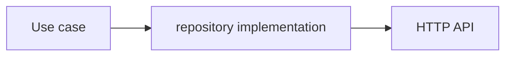
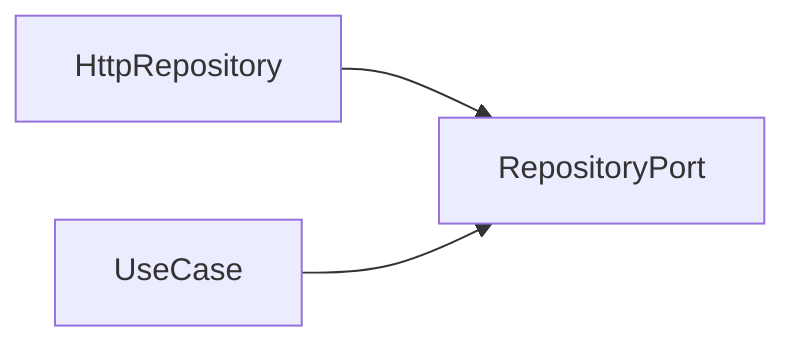

# Dependency Boundaries

## 1. The rule

The most reusable rule across Clean, Onion and Ports & Adapters is simple:

> Source dependencies should point from volatile details toward stable policy, never the reverse.

Robert C. Martin's Clean Architecture describes the outer circles as mechanisms and the inner circles as policies, and states that names and data formats owned by an outer circle should not leak inward.

A useful generic model is:

```text
                 volatile / concrete

  UI ───────────────┐
  HTTP / storage ───┼──> adapters ───> application ───> domain
  DB / SDKs ────────┘

                 stable / policy
```

The exact number of circles is not architectural law. Martin explicitly describes the four-circle diagram as schematic and allows additional boundaries as long as the Dependency Rule holds.

## 2. A practical four-area mapping

For application code, a useful default is:

| Area | Owns | May depend on |
| --- | --- | --- |
| Domain | business concepts, invariants, value objects, domain errors | domain only |
| Application | use-case policy, application contracts, required ports | application + domain |
| Infrastructure | HTTP/database/storage/SDK adapters, external DTOs and mappers | infrastructure + application + domain |
| Presentation | UI composition, view state, view models/hooks, UI framework state | presentation + application; domain only when deliberately exposed as an application contract |

This table is a **recommended project policy**, not a quotation from Clean Architecture. Projects may split or merge outer areas while preserving inward dependency direction.

## 3. Do not confuse runtime flow with source dependency

At runtime a use case can call outward:



while source dependencies still point inward:



Dependency inversion exists specifically to make those two directions different.

## 4. Ports model capabilities, not files

A port describes a purposeful conversation with something outside the protected policy. Cockburn describes ports as application conversations and notes that both "one port per use case" and collapsing everything into only two giant ports are unhelpful extremes.

Prefer ports with coherent capability boundaries:

```ts
export interface ClosureGateway {
  execute(command: ExecuteClosureCommand): Promise<ClosureJob>
  getJob(id: ClosureJobId): Promise<ClosureJob>
}
```

Avoid god interfaces:

```ts
// Bad: authentication, preferences, catalogs, uploads and closures
// have unrelated reasons to change.
interface SessionRepository {
  login(): Promise<void>
  saveTheme(): Promise<void>
  listOffices(): Promise<void>
  uploadFile(): Promise<void>
  executeClosure(): Promise<void>
}
```

Also avoid ceremonial fragmentation where every HTTP endpoint receives its own interface despite sharing one cohesive external capability.

## 5. A port is not automatically a Repository

Repository is a specific pattern: it presents persistence or retrieval in domain/application terms, often resembling a collection of domain objects.

Other external capabilities deserve names that express what they do:

```text
PaymentGateway
Clock
IdGenerator
ClosureExecutor
FileStorage
JudicialCatalogGateway
Telemetry
SessionStore
```

Calling every dependency `Repository` hides intent.

## 6. External technology types stop at the boundary

Inner contracts should not accidentally expose framework or platform types.

For example, the browser `File` interface is part of the Web File API. Passing `File` through an Application port couples the Application layer to a browser API.

Prefer an application-owned shape:

```ts
export interface UploadContent {
  name: string
  mediaType: string
  size: number
  bytes: Uint8Array
}

export interface ClosureFileGateway {
  upload(file: UploadContent): Promise<UploadedFile>
}
```

For large files, use an application-owned streaming abstraction instead of eagerly buffering bytes. The important point is ownership: the inner layer defines the contract; an outer adapter translates the browser/Node/native object into it.

The same rule applies to:

- ORM entities;
- generated OpenAPI clients;
- framework request/response objects;
- Redux action types;
- router locations;
- DOM events;
- browser storage records.

## 7. Data crossing a boundary

Boundary data should be simple and owned by the receiving policy.

Do not pass a database row, API response DTO or UI form state inward unchanged just because TypeScript says the shape is compatible.

Prefer explicit mapping:

```text
API DTO -> infrastructure mapper -> application/domain model
UI form -> presentation mapper -> application command
domain/application result -> presentation mapper -> ViewModel
```

Not every boundary needs a bespoke mapping class. Plain functions are often enough.

## 8. Domain is not "all shared types"

A type belongs to the layer that owns its meaning.

Examples:

| Type | Owner |
| --- | --- |
| `Money`, `ClosurePeriod`, `OrderStatus` | Domain |
| `ExecuteClosureCommand`, `SearchCasesResult` | Application |
| `ApiClosureDto`, `LocalStorageDraftRecord` | Infrastructure |
| `ClosureFormState`, `UploadQueueItem`, `TableColumn` | Presentation |

A type named `FormState`, `Toast`, `UploadQueueItem` or `TableRow` should trigger skepticism if it appears in Domain.

## 9. Presentation is an outer policy boundary too

The UI is allowed to have real logic: display state, interaction workflows, sorting/filtering, optimistic feedback, focus behavior and accessibility state. That does not make it domain logic.

Fowler's Presentation Model describes a model that owns state and behavior specifically for the view while remaining independent of concrete GUI controls. Modern React hooks or headless view models can fill this role.

## 10. When not to add another boundary

Do not introduce a port or mapper because a diagram has an empty box.

Ask:

1. Is this dependency volatile or external?
2. Does the inner policy need to be testable without it?
3. Are there likely multiple implementations or a meaningful test double?
4. Does translating the external shape protect the inner model?
5. Does the abstraction have a coherent domain/application name?

If the answers are mostly no, direct code may be simpler and more honest.

## Sources

- Robert C. Martin, "The Clean Architecture", 2012: https://blog.cleancoder.com/uncle-bob/2012/08/13/the-clean-architecture.html
- Alistair Cockburn, "Hexagonal Architecture", 2005: https://alistair.cockburn.us/hexagonal-architecture/
- Jeffrey Palermo, "The Onion Architecture", 2008: https://jeffreypalermo.com/2008/07/
- Martin Fowler, "Presentation Model", 2004: https://martinfowler.com/eaaDev/PresentationModel.html
- MDN, "File API": https://developer.mozilla.org/en-US/docs/Web/API/File_API
