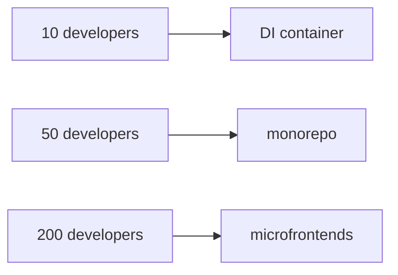

# Architecture Evolution and Scaling

Architecture should evolve in response to observed forces, not headcount or lines-of-code thresholds.

There is no defensible rule such as:



Those decisions solve different problems and carry different costs.

---

## 1. Prefer evidence over maturity phases

Ask what is actually hurting:

| Signal | Possible response |
| --- | --- |
| manual object graph is hard to understand/test | improve composition; possibly use a DI container |
| one capability is scattered across many technical folders | reorganize by feature/capability |
| teams repeatedly edit the same modules | strengthen ownership and module APIs |
| cross-module dependencies form cycles | redefine boundaries / introduce contracts |
| release coordination dominates delivery | investigate independently deployable boundaries |
| one deployable has excessive runtime scaling constraints | separate runtime workloads where evidence supports it |
| a domain area has distinct language/rules/ownership | consider a bounded context |
| frontend teams block each other on one build/deploy pipeline | evaluate modular frontend ownership; microfrontends only if independent deployment is worth the premium |

The response is not automatic. Each option has trade-offs.

---

## 2. Manual composition vs. DI container

A DI container solves object-graph/lifetime/composition problems. It does not make an architecture "enterprise".

Keep manual composition while it remains obvious:

```ts
const orders = new HttpOrderRepository(http)
const clock = new SystemClock()
const placeOrder = makePlaceOrder({ orders, clock })
```

Consider a container when:

- object lifetimes/scopes are complex;
- framework integration benefits from it;
- decorators/interceptors are consistently required;
- registration is clearer than hand wiring;
- the team can inspect/debug the graph.

Do not switch because the team crossed an arbitrary size.

---

## 3. Layer-first vs. capability-first filesystem

Layer-first structures can be clear in smaller codebases:

```text
domain/
application/
infrastructure/
presentation/
```

As a capability grows, feature ownership may become the stronger change axis:

```text
application/
├── orders/
├── billing/
└── identity/
```

or within a Presentation layer:

```text
presentation/features/
├── orders/
├── billing/
└── identity/
```

The question is not "which phase are we in?". It is:

> Which grouping makes code that changes together easiest to own without weakening dependency rules?

---

## 4. Modular monolith before distribution by default

A process boundary is expensive:

- network failure;
- versioned contracts;
- observability;
- deployment coordination;
- distributed data consistency;
- latency;
- operational ownership.

Martin Fowler's "Monolith First" describes the common benefit of discovering stable boundaries before paying the microservice premium, while also acknowledging counterarguments and exceptions.

A strong default for many business systems is therefore:

```text
modular monolith
-> explicit module APIs
-> measured coupling
-> split deployables only where forces justify it
```

This is guidance, not a law. Teams with mature distributed-systems capability and already-known boundaries may make a different decision.

---

## 5. Bounded contexts are semantic boundaries

Do not create a bounded context because a folder is large.

DDD bounded contexts are justified by model/language boundaries:

```text
same word, different meaning
different invariants
different lifecycle/ownership
different source of truth
different change cadence
```

A bounded context may initially live in the same process as another context.

Logical modularity and physical deployment are separate decisions.

---

## 6. Team boundaries and software boundaries influence each other

Team Topologies focuses on flow of change and cognitive load rather than organization size alone.

Useful questions:

- Can a stream-aligned team deliver value end-to-end?
- How many other teams must approve a normal change?
- Does a shared module create a coordination queue?
- Is a platform capability genuinely reducing cognitive load?
- Is cross-team collaboration temporary discovery or permanent coupling?

Architecture should reduce unnecessary communication paths, not mirror an org chart blindly.

---

## 7. Microservices

Consider independently deployable services when there is a concrete need such as:

- independent scaling characteristics;
- separate availability/security constraints;
- stable business capability boundaries;
- different release cadence;
- ownership that benefits from autonomous deployment;
- regulatory/data isolation;
- technology/runtime constraints that justify separation.

Do not use microservices to repair poor module boundaries. Distribution makes unclear boundaries more expensive.

---

## 8. Microfrontends

Microfrontends primarily address **organizational and delivery independence** in large frontend products.

They may help when:

- multiple autonomous teams own distinct product areas;
- independent build/release is valuable;
- one frontend release train is a material bottleneck;
- boundaries map to coherent user/business capabilities.

Costs include:

- duplicated runtime/framework code;
- inconsistent UX;
- cross-application communication complexity;
- routing/composition complexity;
- performance overhead;
- design-system governance.

A large frontend does not automatically need microfrontends.

Cam Jackson's Martin Fowler article frames microfrontends around scaling frontend development across teams and discusses both benefits and implementation costs; it does not establish a headcount threshold.

---

## 9. Shared code vs. platform capability

As systems grow, a giant shared library often becomes a coupling hub.

Prefer one of:

```text
feature-local implementation
explicit reusable library with stable owner/API
platform capability consumed as a product/service
duplicated tiny code when coupling would cost more
```

"DRY" is not a reason to erase ownership boundaries.

---

## 10. Architecture fitness signals

Track evidence such as:

- dependency cycles;
- cross-feature deep imports;
- change coupling;
- build/test blast radius;
- deployment frequency and failure rate;
- number of teams required for a normal change;
- lead time for changes;
- incidents caused by unclear ownership;
- object-graph complexity;
- runtime scaling hotspots.

The point is not to optimize a vanity metric. The point is to know **which force is asking the architecture to evolve**.

---

## Sources

- Martin Fowler, "Monolith First": https://martinfowler.com/bliki/MonolithFirst.html
- Martin Fowler, Microservices Guide: https://martinfowler.com/microservices/
- Cam Jackson, "Micro Frontends": https://martinfowler.com/articles/micro-frontends.html
- Team Topologies, Key Concepts: https://teamtopologies.com/key-concepts
- Mark Seemann, "Composition Root": https://blog.ploeh.dk/2011/07/28/CompositionRoot/
