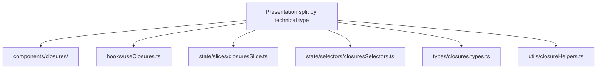
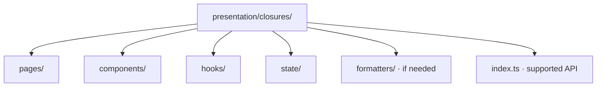
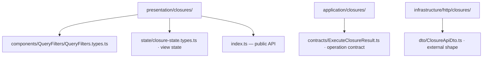

# Module Boundaries and Public APIs

Suppose the ticket screen, its input validation, and its UI state are spread across many unrelated folders. Every small ticket change sends us hunting across the project. Now suppose the ticket feature imports a private setting from the billing feature: changing billing could unexpectedly break tickets.

A *module boundary* groups code responsible for one capability and defines what other parts of the program may use. A *layer boundary* addresses a different question: whether business and application rules know about specific technologies. A growing codebase may need both.

## 1. Optimize for high cohesion and low coupling

**High cohesion** means related ticket code is close together because it serves the same purpose. **Low coupling** means the ticket module needs to know as little as possible about billing or other modules' internal files. Code that changes for the same reason should be easy to find together. Code owned by different capabilities should interact through narrow contracts.

A common frontend failure mode is technically neat but behaviorally scattered:



Every file belongs to the same capability, but changing that capability requires jumping across the entire [Presentation](../GLOSSARY.md#presentation-layer) tree.

Within `presentation/`, start with a capability-owned UI module:



Arrows mean directory containment. These stable responsibility names are our convention; ownership and supported dependencies are the boundary. They start together without forcing empty files. See the [full Scheduling map](../frontend/presentation-architecture.md#2-organize-by-ownership-not-only-by-technical-type).

Redux's [style guide](https://redux.js.org/style-guide/) recommends feature grouping. [Feature-Sliced Design](https://feature-sliced.design/docs/get-started/overview) is a separate architectural methodology, presented as an alternative in the frontend landing page rather than a partial taxonomy used here.

## 2. Public API per non-trivial module

External consumers should import through a module entry point:

```ts
// presentation/closures/index.ts
export { ClosuresPanel } from './components/ClosuresPanel/ClosuresPanel'
export { useClosures } from './hooks/useClosures'
export type { ClosureViewModel } from './hooks/useClosures'
```

Consumer:

```ts
import { ClosuresPanel, useClosures } from '@/presentation/closures'
```

Avoid deep imports:

```ts
import { executeClosureThunk } from '@/presentation/closures/state/closures.thunks'
```

A [public API](../GLOSSARY.md#public-api) makes internal refactors local.

## 3. Barrels are contracts, not export dumpsters

An `index.ts` should intentionally expose supported API.

Avoid:

```ts
export * from './slice'
export * from './selectors'
export * from './internalHelpers'
export * from './types'
```

This erases the difference between public and private implementation.

Prefer explicit exports:

```ts
export { useClosures } from './hooks/useClosures'
export type { ClosureViewModel } from './hooks/useClosures'
```

A single application-wide "contract.ts" that re-exports unrelated domain, application and presentation types can hide ownership rather than improve it.

## 4. Shared is earned

Default ownership is local.

Move code to `shared` only when it is genuinely independent of the originating feature and has a stable cross-feature purpose.

Good:

- `presentation/shared/components/Button/Button.tsx`
- `presentation/shared/components/DataTable/DataTable.tsx`
- `presentation/shared/formatters/formatBytes.ts`

Suspicious:

- `shared/helpers.ts`
- `shared/common.ts`
- `shared/misc.ts`
- `shared/utils.ts`

A shared library should be nameable by purpose. If its purpose is "things used in many places", it is not a coherent module.

**Change-pressure example.** Tickets and Billing may both display a status badge. Sharing the visual `Badge` component can be justified by one [design-system](../GLOSSARY.md#design-system) owner; moving `TicketStatus` and `InvoiceStatus` into a global `shared/status.ts` is not. Their business values and transitions have different owners, even if both currently include `pending`.

| Change in a growing support product | Module that should own it | Modules that should not change merely because of it |
| --- | --- | --- |
| A ticket gains `reopened` | Tickets domain vocabulary and affected ticket policy; UI translation where explicitly needed | Billing, generic visual Badge, unrelated stores |
| The billing API renames `invoice_state` | Billing's transport [mapper](../GLOSSARY.md#mapper) / API contract | Tickets domain model, shared UI primitives |
| Notifications reacts to `TicketResolved` | Tickets publishes an intentionally supported fact; Notifications interprets it through a documented contract | Notifications must not deep-import `presentation/tickets/state/internal*.ts` |

One large codebase needs **local ownership**, not one all-purpose model package. Reuse a stable shared policy only when the semantics, lifecycle and owner are truly the same.

## 5. `common` vs. `shared`

Do not maintain both categories without a written distinction.

Recommended default:

- `presentation/shared/components/` — independently reusable visual primitives;
- `presentation/shared/formatters/` — display formatting with several unrelated consumers;
- `presentation/closures/formatters/` — display transformations owned only by Closures.

Avoid a generic `common` folder. It tends to become a second shared dump.

## 6. Type ownership follows meaning

Do not centralize every TypeScript interface into `types/`.

Prefer:



Types erased at runtime still create source-level coupling.

## 7. Avoid horizontal feature coupling

Feature A should not casually reach into Feature B's internals.

When two capabilities repeatedly depend on each other, consider:

- moving shared domain meaning inward;
- composing them at a page/widget/application level;
- defining an explicit public contract;
- revisiting whether the original feature boundary is wrong.

Do not solve coupling by adding more [barrels](../GLOSSARY.md#barrel-file).

## 8. Naming should reveal purpose

Prefer:

- `presentation/closures/formatters/formatClosureMessage.ts` for visible text;
- `domain/closures/ClosurePeriod.ts` for the business date-range value;
- `infrastructure/http/catalogs/mappers/mapCatalogApiDto.ts` for API field translation.

over:

- `helpers.ts`
- `utils2.ts`
- `common.ts`
- `manager.ts`
- `service.ts`

Role suffixes are useful when they add information: `*.mapper.ts`, `*.selector.ts`, `*.adapter.ts`, `*.recipe.ts`.

## 9. Backend APIs across layer-first capabilities

Suppose Billing needs to create a support ticket. It needs the supported creation operation, not Tickets' HTTP parser or database [adapter](../GLOSSARY.md#adapter). In the canonical backend, `application/tickets/index.ts` exports `CreateTicket`, its command and result. A consumer imports that source entry; outer startup imports `TicketsModule` through `composition/modules/index.ts` when Nest registration is needed. [The complete backend wiring](../backend/4-create-ticket-with-nestjs.md#4-wire-memory-first) shows both entries.

TypeScript `export` exposes source names. [Nest module](../GLOSSARY.md#nestjs-module) `exports` makes selected providers available to importing [Nest modules](../GLOSSARY.md#nestjs-module). An **architectural [public API](../GLOSSARY.md#public-api)** is the supported conversation the capability owner commits to preserving; neither mechanism alone blocks deep imports. Review/enforce those imports separately. A Tickets capability can own related code across layers without putting a complete stack under a top-level `tickets/` folder.

Layer checks and capability checks answer different questions. [Application](../GLOSSARY.md#application-layer) importing Tickets' database [adapter](../GLOSSARY.md#adapter) violates a layer boundary. Billing importing a private Tickets helper can violate capability ownership even if both files are in [Application](../GLOSSARY.md#application-layer). Our [backend fixture test](../scripts/backend-ticket-example.test.mjs) checks layer direction; it does not claim to enforce every capability's [public API](../GLOSSARY.md#public-api).

## Sources

- Redux Style Guide — [feature folders](../GLOSSARY.md#feature-folder) and state organization: https://redux.js.org/style-guide/
- Redux FAQ — code structure: https://redux.js.org/faq/code-structure/
- Feature-Sliced Design — slices and [public APIs](../GLOSSARY.md#public-api): https://feature-sliced.design/docs/reference/slices-segments
- Feature-Sliced Design — [public API](../GLOSSARY.md#public-api): https://feature-sliced.design/docs/reference/public-api
