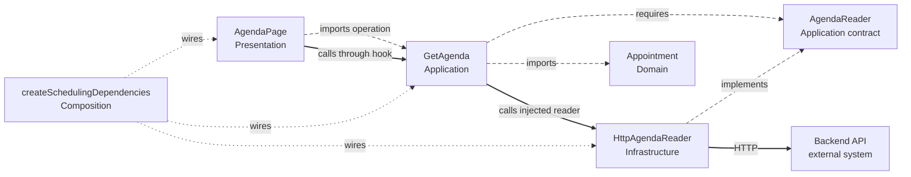
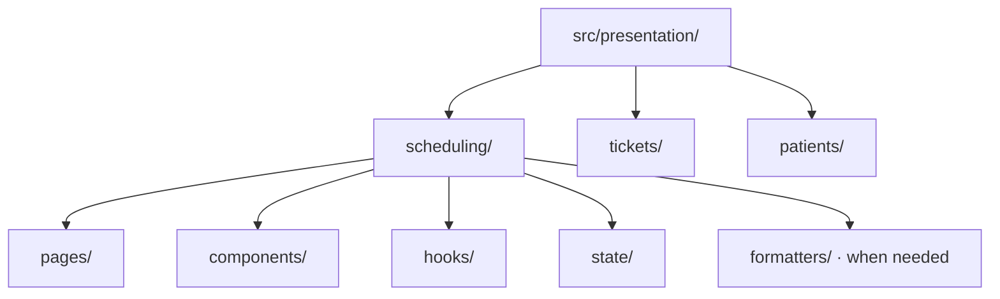

# Frontend Architecture

Imagine a clinic agenda: a receptionist changes the selected day, opens an appointment and sees whether the request failed. Those screen decisions should stay close together. Rules about valid appointments and operations that load the agenda should also work when the screen changes.

This is the canonical frontend guidance. Keep `src/domain/`, `application/`, `infrastructure/`, `presentation/` and `composition/`, with capabilities **inside** each layer. Clean and Onion protect dependency direction; this handbook adds a concrete folder convention so a reader can place the first feature without guessing.

## Core model

| Layer | Frontend responsibility | Backend responsibility |
| --- | --- | --- |
| [Domain](../GLOSSARY.md#domain) | Business values and rules used by the client; the server remains authoritative | Authoritative business values and rules |
| [Application](../GLOSSARY.md#application-layer) | [Use cases](../GLOSSARY.md#use-case) and contracts for required capabilities | [Use cases](../GLOSSARY.md#use-case) and contracts for required capabilities |
| [Infrastructure](../GLOSSARY.md#infrastructure) | Calls to backend APIs, browser storage and external SDKs | Database access, external APIs and messaging |
| [Presentation](../GLOSSARY.md#presentation-layer) | Pages, components, hooks and interaction/render state | Incoming HTTP controllers, guards, pipes, parsers, [DTOs](../GLOSSARY.md#data-transfer-object-dto) and CLI handlers |
| Composition | Creates dependencies and connects providers/bootstrap | Connects [Nest modules](../GLOSSARY.md#nestjs-module), tokens and startup |

An HTTP request **sent** by the browser belongs to [Infrastructure](../GLOSSARY.md#infrastructure). An HTTP request **received** by the backend enters [Presentation](../GLOSSARY.md#presentation-layer). The protocol name alone does not identify a layer. See the [exact placement guide](../foundations/code-placement.md#6-presentation-placement-in-a-feature-oriented-frontend).

Long dashes show source dependencies, short dots show startup wiring, and stronger solid arrows show runtime calls. Wiring supplies the reader; [Application](../GLOSSARY.md#application-layer) imports its own contract, not the HTTP implementation.

## Recommended source layout

Start [Presentation](../GLOSSARY.md#presentation-layer) with a capability and stable responsibility folders:

Tickets and Patients use the same `pages/`, `components/`, `hooks/` and `state/` convention from the beginning. A directory in a placement diagram is not a demand for empty files. Add files only for responsibilities the product actually needs.

| Responsibility | First Scheduling file |
| --- | --- |
| Screen composition | `presentation/scheduling/pages/AgendaPage.tsx` |
| Focused UI unit and local props | `presentation/scheduling/components/AppointmentCard/AppointmentCard.tsx` and `AppointmentCard.types.ts` beside it |
| Reusable React interaction/composition | `presentation/scheduling/hooks/useAgenda.ts` |
| Rendering/interaction state | `presentation/scheduling/state/agenda.state.ts` |
| Display formatting | `presentation/scheduling/formatters/formatAppointmentTime.ts` |

The [complete Scheduling map](./presentation-architecture.md#2-organize-by-ownership-not-only-by-technical-type) includes all five layers and exact API [DTO](../GLOSSARY.md#data-transfer-object-dto)/parser/[mapper](../GLOSSARY.md#mapper) locations. A router may require particular physical entry files; those entry files delegate to these owned pages and do not determine business ownership.

## Feature ownership

A capability owns its screen, components, hooks, state and display transformations. A change to appointment selection should lead to `presentation/scheduling/`, rather than unrelated global `components/` and `utils/` trees. A business availability rule stays in `domain/scheduling/availability/calculateAvailableSlots.ts`, even when the first caller is a form.

Redux's [style guide](https://redux.js.org/style-guide/) recommends grouping related logic by feature; its [code-structure FAQ](https://redux.js.org/faq/code-structure/) leaves folder choice to the application. The layout above is this handbook's convention, not a requirement imposed by React, Redux, Clean or Onion.

[Feature-Sliced Design](https://feature-sliced.design/docs/get-started/overview) is a separate methodology with its own layers, slices and dependency rules. It is a valid alternative to evaluate as a whole; this handbook does not combine part of its taxonomy with the canonical five-layer structure.

## Public Presentation facade

A page can use a hook that exposes `rows`, `busy` and `reload()`, while the hook coordinates [Presentation](../GLOSSARY.md#presentation-layer) state and an injected [Application](../GLOSSARY.md#application-layer) operation. This keeps Redux actions and HTTP details out of rendering code. The hook is a [Presentation](../GLOSSARY.md#presentation-layer) [facade](../GLOSSARY.md#facade-pattern): one screen-facing entry to several internal decisions.

This boundary is stricter than React Redux requires. Use it when it protects a real state-library boundary; it does not make every small component need another wrapper. Other capabilities import the chosen [public API](../GLOSSARY.md#public-api), not internal state modules.

## Read next

1. [Presentation architecture](./presentation-architecture.md) — complete Scheduling placement, pages, components, hooks, state and [public APIs](../GLOSSARY.md#public-api).
2. [Ports & Adapters in a Frontend: Support Tickets](./ports-and-adapters.md) — executable [Application](../GLOSSARY.md#application-layer) [port](../GLOSSARY.md#port), HTTP [adapter](../GLOSSARY.md#adapter), [DTO](../GLOSSARY.md#data-transfer-object-dto), [Parser](../GLOSSARY.md#parser), [mapper](../GLOSSARY.md#mapper), injected React hook and composition.
3. [State management](./state-management.md) — [local state](../GLOSSARY.md#local-state), Redux, [selectors](../GLOSSARY.md#selector), effects and [server state](../GLOSSARY.md#server-state).
4. [Styling and design systems](./styling-and-design-system.md) — tokens, Panda CSS and component ownership.
5. [Reference case study](./reference-case-study.md) — lessons from an existing UI; its historical paths are not the canonical layout.
6. [References](./references.md) — primary and framework sources.

For cross-layer rules, read [Architecture Foundations](../foundations/README.md). For incoming HTTP and CLI code, follow the [backend guide](../backend/README.md).
