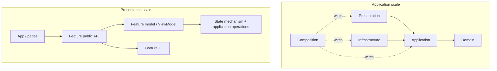
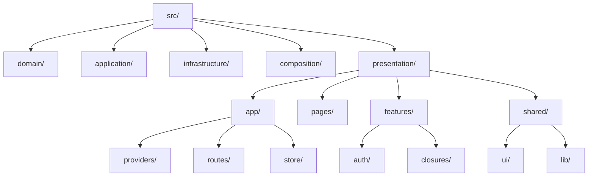
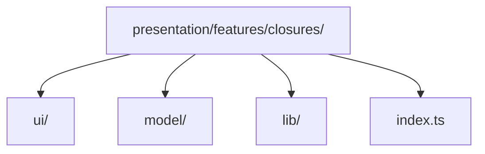
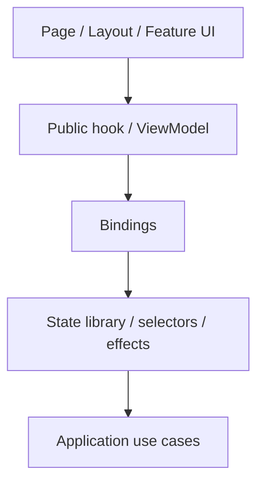

# Frontend Architecture

This section is the canonical frontend guidance for this repository.

Clean Architecture and Onion Architecture define **dependency direction across application boundaries**. They do not prescribe how a large React/Vue/Svelte Presentation layer must be organized internally. This section fills that gap without pretending framework conventions are part of Clean or Onion.

The examples use React, Redux Toolkit and Panda CSS because they make the boundaries concrete. The underlying rules are framework-independent.

---

## Core model

A serious frontend commonly has two architectural scales:

The first scale protects business policy from technology. The second keeps the UI itself cohesive as it grows.

## Recommended source layout

This is a recommended default, not a law. Folder names may change. Ownership and dependency direction matter more than the spelling.

## Feature ownership

A feature owns the Presentation code that changes with that capability:

This keeps `closures` UI, state, selectors, bindings and feature-specific helpers close together instead of scattering them across global `components/`, `hooks/`, `state/`, `types/` and `utils/` trees.

This repository borrows the **high-cohesion feature slice** and **public API** ideas found in Redux's feature-folder guidance and Feature-Sliced Design. It does **not** require the complete FSD taxonomy; in particular, using a second unrelated meaning of `entities` beside Domain-Driven Design often creates needless vocabulary collisions.

## Public Presentation facade

A useful strict boundary for complex applications is:

This makes the rendering surface depend on semantic operations such as `saveClosure()` instead of Redux actions, HTTP clients or framework internals.

It is deliberately stricter than what React Redux itself requires. A smaller application may legitimately let components call typed Redux hooks directly. When a project chooses the facade boundary, enforce it consistently.

## Read next

1. **[Presentation architecture](./presentation-architecture.md)** — pages, features, shared UI, public hooks/ViewModels and feature APIs.
2. **[State management](./state-management.md)** — local state, Redux, selectors, thunks, listeners, server state and persistence.
3. **[Styling and design systems](./styling-and-design-system.md)** — token hierarchy, Panda CSS, `sva`, config recipes and component ownership.
4. **[Reference case study](./reference-case-study.md)** — lessons extracted from the XXI web UI: what to promote and what to correct.
5. **[References](./references.md)** — primary and framework sources.

For cross-layer rules, read **[Architecture Foundations](../foundations/README.md)** first.
