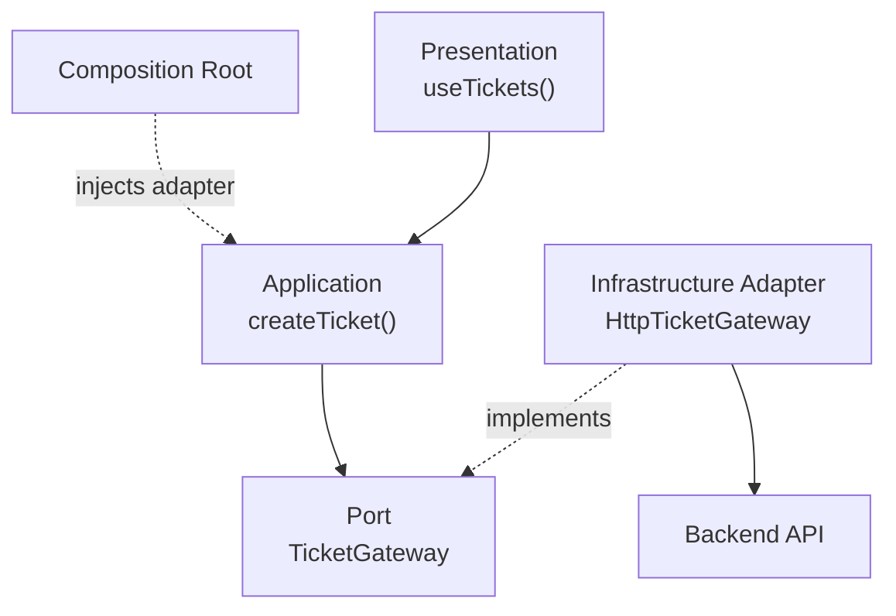

# Ports & Adapters in a Frontend: Support Tickets

← [Frontend Architecture](./README.md) · [Dependency Boundaries](../foundations/dependency-boundaries.md) · [Glossary](../GLOSSARY.md)

## 1. The problem

An analyst creates a support ticket in a React application. The application must call a backend API, but its application policy should not depend on `fetch`, an endpoint URL, or the API response's field names.

A **[port](../GLOSSARY.md#port)** defines the capability in the application's language. An **[adapter](../GLOSSARY.md#adapter)** implements that contract using a particular technology. This is the outbound side of **[Ports & Adapters](../GLOSSARY.md#hexagonal-architecture-ports-and-adapters)**: the **frontend application is the system whose boundary we are designing**. The backend is an external actor *from that frontend's perspective*.

## 2. Visual model


**Figure 1.** Vector version of the supplied reference image. The solid arrows show conceptual calls/dependencies; dotted arrows show assembly and implementation relationships. This is **not** a runtime sequence: the [port](../GLOSSARY.md#port) is a TypeScript contract, **not** a separate runtime object forwarding to the HTTP [adapter](../GLOSSARY.md#adapter). The [Composition Root](../GLOSSARY.md#composition-root) constructs `HttpTicketGateway`, passes it into `makeCreateTicket`, and passes the resulting operation to [Presentation](../GLOSSARY.md#presentation-layer).

<details>
<summary>Editable Mermaid source of the figure</summary>



</details>

## 3. Physical ownership

| File | Owns | Why it belongs there |
| --- | --- | --- |
| `domain/tickets/Ticket.ts` | Ticket's business-oriented shape | Independent of server field names and React |
| `application/tickets/ports/TicketGateway.ts` | **Outbound [port](../GLOSSARY.md#port)** and command | The [use case](../GLOSSARY.md#use-case) defines what capability it needs |
| `application/tickets/use-cases/createTicket.ts` | Use-case orchestration | No HTTP or React imports |
| `infrastructure/tickets/HttpTicketGateway.ts` | **Outbound [adapter](../GLOSSARY.md#adapter)**, [DTO](../GLOSSARY.md#data-transfer-object-dto) validation and mapping | Only the external boundary understands `fetch` and the API response |
| `presentation/features/tickets/model/useTickets.ts` | React-facing state/operations | Loading/error feedback belongs to the UI |
| `composition/bootstrap.tsx` | Dependency construction and injection | Chooses the concrete [adapter](../GLOSSARY.md#adapter) without becoming a [Service Locator](../GLOSSARY.md#service-locator) |

These names are **repository conventions**, not universal requirements of Cockburn's architecture. `Gateway` expresses interaction with an external service. Use `Repository` when the abstraction genuinely models retrieval/persistence of domain objects as a collection, not simply because an HTTP endpoint exists.

### Domain contract

`src/domain/tickets/Ticket.ts`:

```ts
export interface Ticket {
  readonly id: string
  readonly subject: string
  readonly status: 'open' | 'in_progress' | 'resolved'
}
```

### Port: what the Application needs

`src/application/tickets/ports/TicketGateway.ts`:

```ts
import type { Ticket } from '../../../domain/tickets/Ticket'

export interface CreateTicketInput {
  subject: string
  description: string
}

export interface TicketGateway {
  create(input: CreateTicketInput): Promise<Ticket>
}
```

Notice what is *absent*: HTTP verbs, endpoint paths, `Response`, Axios, React and API-specific `ticket_id`.

### Use case: what the Application does

`src/application/tickets/use-cases/createTicket.ts`:

```ts
import type {
  CreateTicketInput,
  TicketGateway,
} from '../ports/TicketGateway'

export function makeCreateTicket(gateway: TicketGateway) {
  return (input: CreateTicketInput) => {
    const subject = input.subject.trim()
    if (!subject) throw new Error('Subject is required')

    return gateway.create({ ...input, subject })
  }
}

export type CreateTicket = ReturnType<typeof makeCreateTicket>
```

The example uses a small function factory for explicit **[dependency injection](../GLOSSARY.md#dependency-injection-di)**. No [DI container](../GLOSSARY.md#di-container) is required. The backend must independently validate authorization and ticket constraints; frontend checks are not a security boundary.

### Adapter: how the Application reaches the backend

`src/infrastructure/tickets/HttpTicketGateway.ts`:

```ts
import type { Ticket } from '../../domain/tickets/Ticket'
import type {
  CreateTicketInput,
  TicketGateway,
} from '../../application/tickets/ports/TicketGateway'

type TicketDto = {
  ticket_id: string
  subject: string
  status: Ticket['status']
}

function parseTicketDto(value: unknown): Ticket {
  if (typeof value !== 'object' || value === null) {
    throw new Error('Invalid ticket response')
  }
  const dto = value as Partial<Record<keyof TicketDto, unknown>>
  const status = dto.status
  if (
    typeof dto.ticket_id !== 'string' ||
    typeof dto.subject !== 'string' ||
    (status !== 'open' && status !== 'in_progress' && status !== 'resolved')
  ) {
    throw new Error('Invalid ticket response')
  }
  return { id: dto.ticket_id, subject: dto.subject, status }
}

export class HttpTicketGateway implements TicketGateway {
  constructor(private readonly request: typeof fetch = fetch) {}

  async create(input: CreateTicketInput): Promise<Ticket> {
    const response = await this.request('/api/tickets', {
      method: 'POST',
      headers: { 'Content-Type': 'application/json' },
      body: JSON.stringify(input),
    })

    if (!response.ok) throw new Error('Ticket creation unavailable')
    return parseTicketDto(await response.json())
  }
}
```

The transport response **[DTO](../GLOSSARY.md#data-transfer-object-dto)** is translated at this boundary. In a larger application, map transport failures to an application-owned error/result as well; never expose raw HTTP mechanics through the public feature API.

### Presentation and Composition: using the operation

`src/presentation/features/tickets/model/useTickets.ts` (React-facing excerpt):

```tsx
import { useState } from 'react'
import type { CreateTicket } from '../../../../application/tickets/use-cases/createTicket'

export function useTickets(createTicket: CreateTicket) {
  const [busy, setBusy] = useState(false)
  const [error, setError] = useState<string | null>(null)

  async function submit(input: Parameters<CreateTicket>[0]) {
    setBusy(true)
    setError(null)
    try {
      return await createTicket(input)
    } catch {
      setError('The ticket could not be created')
      return null
    } finally {
      setBusy(false)
    }
  }

  return { submit, busy, error }
}
```

`src/composition/bootstrap.tsx` (assembly excerpt):

```tsx
const ticketGateway = new HttpTicketGateway()
const createTicket = makeCreateTicket(ticketGateway)

// Pass createTicket to the root/page via props or context.
// A TicketPage can then call useTickets(createTicket).
```

Composition imports the concrete [adapter](../GLOSSARY.md#adapter) and application factory. The [use case](../GLOSSARY.md#use-case) and the hook **do not import the [Composition Root](../GLOSSARY.md#composition-root)** to locate their dependencies.

## 4. Why this separation matters

A test may replace `HttpTicketGateway` without network access:

```ts
const fakeGateway: TicketGateway = {
  async create(input) {
    return { id: 'T-001', subject: input.subject, status: 'open' }
  },
}

const createTicket = makeCreateTicket(fakeGateway)
```

A GraphQL or offline [adapter](../GLOSSARY.md#adapter) could also implement the same [port](../GLOSSARY.md#port) if the product needs it. **Do not introduce extra [ports](../GLOSSARY.md#port) solely to reproduce a diagram**: a simple read-only remote-data screen may be better served by a [server-state](../GLOSSARY.md#server-state)/query solution.

### Inbound vs. outbound, without extra ceremony

- **Inbound/driving side:** the React page (UI [adapter](../GLOSSARY.md#adapter)) invokes the [Application](../GLOSSARY.md#application-layer)'s `createTicket` operation. A plain function can be the entry contract; an extra interface is not automatically required.
- **Outbound/driven side:** `createTicket` requires `TicketGateway`; `HttpTicketGateway` implements it and communicates with the backend.

The frontend/backend are independently bounded systems. Calling the backend's API from a browser does **not** make that API a frontend [Application layer](../GLOSSARY.md#application-layer).

## 5. Terminology and references

- **[Port](../GLOSSARY.md#port):** application-owned, purpose-oriented contract.
- **[Adapter](../GLOSSARY.md#adapter):** technology-facing implementation/translation.
- **[Use case](../GLOSSARY.md#use-case):** application-specific operation coordinating behavior.
- **[Composition Root](../GLOSSARY.md#composition-root):** outer assembly where the concrete [adapter](../GLOSSARY.md#adapter) is selected and injected.
- **[DTO](../GLOSSARY.md#data-transfer-object-dto)/[Mapper](../GLOSSARY.md#mapper):** external representation and the translation that stops it leaking inward.
- **Public feature hook:** UI-facing [facade](../GLOSSARY.md#facade-pattern); it is not an [Infrastructure](../GLOSSARY.md#infrastructure) [adapter](../GLOSSARY.md#adapter) merely because it invokes the [use case](../GLOSSARY.md#use-case).

**Primary source:** Alistair Cockburn, *[Hexagonal Architecture](../GLOSSARY.md#hexagonal-architecture-ports-and-adapters)* (2005): https://alistair.cockburn.us/hexagonal-architecture/

**Related sources:** Robert C. Martin, *The [Clean Architecture](../GLOSSARY.md#clean-architecture)*: https://blog.cleancoder.com/uncle-bob/2012/08/13/the-clean-architecture.html · Mark Seemann, *[Composition Root](../GLOSSARY.md#composition-root)*: https://blog.ploeh.dk/2011/07/28/CompositionRoot/ · React, *Reusing Logic with [Custom Hooks](../GLOSSARY.md#custom-hook)*: https://react.dev/learn/reusing-logic-with-custom-hooks
