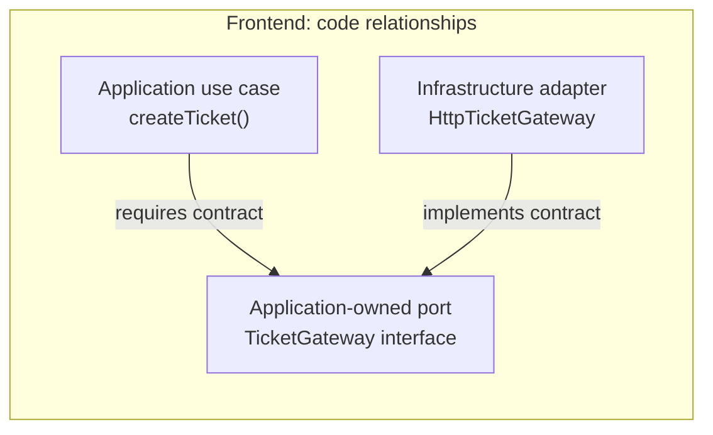
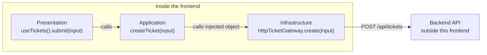

# Ports & Adapters in a Frontend: Support Tickets

← [Frontend Architecture](./README.md) · [Dependency Boundaries](../foundations/dependency-boundaries.md) · [Glossary](../GLOSSARY.md)

## 1. The problem

An analyst fills out a ticket form in our React application and clicks **Create Ticket**. The frontend needs to check that the subject is not empty and then ask the backend to create the ticket.

These are two different jobs: deciding which information is required to create a ticket, and handling the technical details of communicating with the server. If the endpoint, HTTP client, or server response format changes, we should not need to rewrite the rule that checks the subject.

Our ticket-creation operation therefore needs an object with a method named `create(input)` that returns the created ticket. We record this requirement as the TypeScript interface `TicketGateway`. Here, a *contract* simply means the method that must be available, the input it accepts, and the result it returns. The interface does not perform any network request.

This requirement is an **outbound [port](../GLOSSARY.md#port)**: it says what the application needs without deciding how it will be done. `HttpTicketGateway` is an **[adapter](../GLOSSARY.md#adapter)** that meets that requirement. It uses `fetch` to call the backend and translates the response—for example, turning the API field `ticket_id` into the application's `id`.

When we assemble the frontend, we give the ticket-creation operation an `HttpTicketGateway` object. The operation calls its `create` method; the interface is not a separate object that forwards calls at runtime. A test could instead supply an object that creates tickets in memory, without changing the operation.

This is the outbound side of **[Ports & Adapters](../GLOSSARY.md#hexagonal-architecture-ports-and-adapters)** *from the frontend's point of view*: we are designing this frontend's separation from the technologies and systems it uses. Its backend is external to that frontend, even if both belong to the same product.

## 2. Visual model


**Figure 1. Read the panels separately, from top to bottom:**

1. **Code relationships (design):** `createTicket` requires the application-owned `TicketGateway` interface; `HttpTicketGateway` implements it. These arrows show the relationship between code definitions, **not** which objects are called in sequence.
2. **Startup (assembly):** the [Composition Root](../GLOSSARY.md#composition-root) creates a concrete `HttpTicketGateway`, passes it to `makeCreateTicket`, and makes the resulting operation available to the UI. The use case does not construct its dependency.
3. **After the click (runtime):** `useTickets().submit()` calls `createTicket()`, which calls the **injected adapter object**; the adapter sends `POST /api/tickets` to the backend. The frontend boundary encloses Presentation, Application and its Infrastructure adapter. The backend is external **to this frontend**, even if both belong to the same product.

The [port](../GLOSSARY.md#port) is a TypeScript contract, **not a separate runtime forwarding object**. That is why it appears in the first panel but not as an extra stop in the third. On the way back, the HTTP [adapter](../GLOSSARY.md#adapter) validates the server response and translates `ticket_id` into the application's `id`.

<details>
<summary>Editable Mermaid sources corresponding to the figure</summary>

**1. Code relationships — arrows describe required/implemented source contracts:**



**2. Startup — the concrete objects are assembled before the UI uses them:**

```ts
const gateway = new HttpTicketGateway()
const createTicket = makeCreateTicket(gateway)
// Supply createTicket to the page / useTickets hook.
```

**3. Runtime — arrows show actual calls, not source-code dependency direction:**



</details>

## 3. Physical ownership

| File | Owns | Why it belongs there |
| --- | --- | --- |
| `domain/tickets/Ticket.ts` | Ticket's business-oriented shape | Independent of server field names and React |
| `application/tickets/ports/TicketGateway.ts` | **Outbound [port](../GLOSSARY.md#port)** and command | The [use case](../GLOSSARY.md#use-case) defines what capability it needs |
| `application/tickets/use-cases/createTicket.ts` | Use-case orchestration | No HTTP or React imports |
| `infrastructure/tickets/HttpTicketGateway.ts` | **Outbound [adapter](../GLOSSARY.md#adapter)**, [DTO](../GLOSSARY.md#data-transfer-object-dto) validation and mapping | Only the external boundary understands `fetch` and the API response |
| `presentation/features/tickets/model/useTickets.ts` | React-facing state/operations | Loading/error feedback belongs to the UI |
| `composition/bootstrap.tsx` | Dependency construction and injection | Chooses the concrete [adapter](../GLOSSARY.md#adapter) without becoming a [Service Locator](../GLOSSARY.md#service-locator) |

These names are **repository conventions**, not universal requirements of Cockburn's architecture. `Gateway` expresses interaction with an external service. Use `Repository` when the abstraction genuinely models retrieval/persistence of domain objects as a collection, not simply because an HTTP endpoint exists.

### Domain contract

`src/domain/tickets/Ticket.ts`:

```ts
export interface Ticket {
  readonly id: string
  readonly subject: string
  readonly status: 'open' | 'in_progress' | 'resolved'
}
```

### Port: what the Application needs

`src/application/tickets/ports/TicketGateway.ts`:

```ts
import type { Ticket } from '../../../domain/tickets/Ticket'

export interface CreateTicketInput {
  subject: string
  description: string
}

export interface TicketGateway {
  create(input: CreateTicketInput): Promise<Ticket>
}
```

Notice what is *absent*: HTTP verbs, endpoint paths, `Response`, Axios, React and API-specific `ticket_id`.

### Use case: what the Application does

`src/application/tickets/use-cases/createTicket.ts`:

```ts
import type {
  CreateTicketInput,
  TicketGateway,
} from '../ports/TicketGateway'

export function makeCreateTicket(gateway: TicketGateway) {
  return (input: CreateTicketInput) => {
    const subject = input.subject.trim()
    if (!subject) throw new Error('Subject is required')

    return gateway.create({ ...input, subject })
  }
}

export type CreateTicket = ReturnType<typeof makeCreateTicket>
```

The example uses a small function factory for explicit **[dependency injection](../GLOSSARY.md#dependency-injection-di)**. No [DI container](../GLOSSARY.md#di-container) is required. The backend must independently validate authorization and ticket constraints; frontend checks are not a security boundary.

### Adapter: how the Application reaches the backend

`src/infrastructure/tickets/HttpTicketGateway.ts`:

```ts
import type { Ticket } from '../../domain/tickets/Ticket'
import type {
  CreateTicketInput,
  TicketGateway,
} from '../../application/tickets/ports/TicketGateway'

type TicketDto = {
  ticket_id: string
  subject: string
  status: Ticket['status']
}

function parseTicketDto(value: unknown): Ticket {
  if (typeof value !== 'object' || value === null) {
    throw new Error('Invalid ticket response')
  }
  const dto = value as Partial<Record<keyof TicketDto, unknown>>
  const status = dto.status
  if (
    typeof dto.ticket_id !== 'string' ||
    typeof dto.subject !== 'string' ||
    (status !== 'open' && status !== 'in_progress' && status !== 'resolved')
  ) {
    throw new Error('Invalid ticket response')
  }
  return { id: dto.ticket_id, subject: dto.subject, status }
}

export class HttpTicketGateway implements TicketGateway {
  constructor(private readonly request: typeof fetch = fetch) {}

  async create(input: CreateTicketInput): Promise<Ticket> {
    const response = await this.request('/api/tickets', {
      method: 'POST',
      headers: { 'Content-Type': 'application/json' },
      body: JSON.stringify(input),
    })

    if (!response.ok) throw new Error('Ticket creation unavailable')
    return parseTicketDto(await response.json())
  }
}
```

The transport response **[DTO](../GLOSSARY.md#data-transfer-object-dto)** is translated at this boundary. In a larger application, map transport failures to an application-owned error/result as well; never expose raw HTTP mechanics through the public feature API.

### Presentation and Composition: using the operation

`src/presentation/features/tickets/model/useTickets.ts` (React-facing excerpt):

```tsx
import { useState } from 'react'
import type { CreateTicket } from '../../../../application/tickets/use-cases/createTicket'

export function useTickets(createTicket: CreateTicket) {
  const [busy, setBusy] = useState(false)
  const [error, setError] = useState<string | null>(null)

  async function submit(input: Parameters<CreateTicket>[0]) {
    setBusy(true)
    setError(null)
    try {
      return await createTicket(input)
    } catch {
      setError('The ticket could not be created')
      return null
    } finally {
      setBusy(false)
    }
  }

  return { submit, busy, error }
}
```

`src/composition/bootstrap.tsx` (assembly excerpt):

```tsx
const ticketGateway = new HttpTicketGateway()
const createTicket = makeCreateTicket(ticketGateway)

// Pass createTicket to the root/page via props or context.
// A TicketPage can then call useTickets(createTicket).
```

Composition imports the concrete [adapter](../GLOSSARY.md#adapter) and application factory. The [use case](../GLOSSARY.md#use-case) and the hook **do not import the [Composition Root](../GLOSSARY.md#composition-root)** to locate their dependencies.

## 4. Why this separation matters

A test may replace `HttpTicketGateway` without network access:

```ts
const fakeGateway: TicketGateway = {
  async create(input) {
    return { id: 'T-001', subject: input.subject, status: 'open' }
  },
}

const createTicket = makeCreateTicket(fakeGateway)
```

A GraphQL or offline [adapter](../GLOSSARY.md#adapter) could also implement the same [port](../GLOSSARY.md#port) if the product needs it. **Do not introduce extra [ports](../GLOSSARY.md#port) solely to reproduce a diagram**: a simple read-only remote-data screen may be better served by a [server-state](../GLOSSARY.md#server-state)/query solution.

### Inbound vs. outbound, without extra ceremony

- **Inbound/driving side:** the React page (UI [adapter](../GLOSSARY.md#adapter)) invokes the [Application](../GLOSSARY.md#application-layer)'s `createTicket` operation. A plain function can be the entry contract; an extra interface is not automatically required.
- **Outbound/driven side:** `createTicket` requires `TicketGateway`; `HttpTicketGateway` implements it and communicates with the backend.

The frontend/backend are independently bounded systems. Calling the backend's API from a browser does **not** make that API a frontend [Application layer](../GLOSSARY.md#application-layer).

## 5. Terminology and references

- **[Port](../GLOSSARY.md#port):** application-owned, purpose-oriented contract.
- **[Adapter](../GLOSSARY.md#adapter):** technology-facing implementation/translation.
- **[Use case](../GLOSSARY.md#use-case):** application-specific operation coordinating behavior.
- **[Composition Root](../GLOSSARY.md#composition-root):** outer assembly where the concrete [adapter](../GLOSSARY.md#adapter) is selected and injected.
- **[DTO](../GLOSSARY.md#data-transfer-object-dto)/[Mapper](../GLOSSARY.md#mapper):** external representation and the translation that stops it leaking inward.
- **Public feature hook:** UI-facing [facade](../GLOSSARY.md#facade-pattern); it is not an [Infrastructure](../GLOSSARY.md#infrastructure) [adapter](../GLOSSARY.md#adapter) merely because it invokes the [use case](../GLOSSARY.md#use-case).

**Primary source:** Alistair Cockburn, *[Hexagonal Architecture](../GLOSSARY.md#hexagonal-architecture-ports-and-adapters)* (2005): https://alistair.cockburn.us/hexagonal-architecture/

**Related sources:** Robert C. Martin, *The [Clean Architecture](../GLOSSARY.md#clean-architecture)*: https://blog.cleancoder.com/uncle-bob/2012/08/13/the-clean-architecture.html · Mark Seemann, *[Composition Root](../GLOSSARY.md#composition-root)*: https://blog.ploeh.dk/2011/07/28/CompositionRoot/ · React, *Reusing Logic with [Custom Hooks](../GLOSSARY.md#custom-hook)*: https://react.dev/learn/reusing-logic-with-custom-hooks
