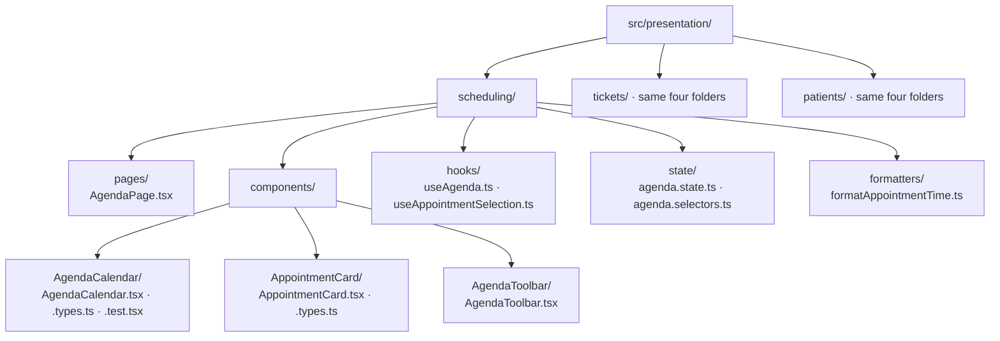
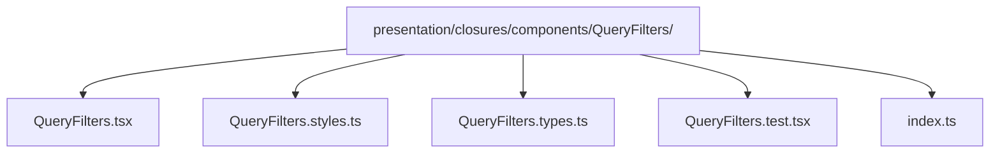
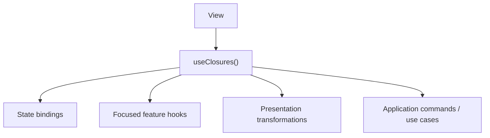
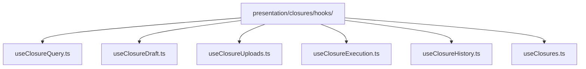
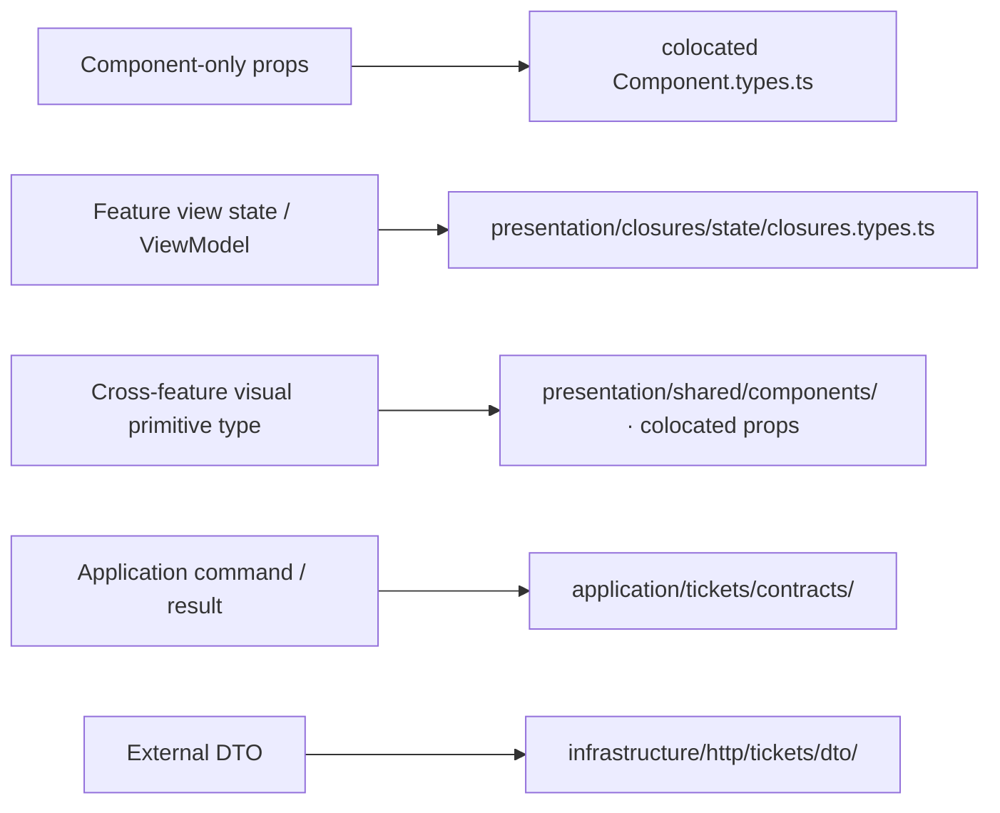

# Presentation Architecture

## 1. Presentation is an architectural boundary

When an analyst clicks **Create Ticket**, the screen needs to read the form, disable the submit button while saving, and show an error if the request fails. Those tasks exist because someone is using a screen. The rule deciding whether a ticket may be created is different: it should still hold if another screen or an API triggers the same operation.

That screen-facing responsibility is called [Presentation](../GLOSSARY.md#presentation-layer); it is not merely “the folder containing JSX”.

It owns concerns whose meaning exists because a user interface exists:

- pages and route composition;
- layouts and application shell;
- component composition;
- view state;
- interaction state;
- view-oriented transformations;
- accessibility state;
- sorting/filtering for display;
- transient feedback;
- UI framework bindings.

Business [invariants](../GLOSSARY.md#invariant) and application workflow policy do not move into [Presentation](../GLOSSARY.md#presentation-layer) just because the browser triggers them.

A useful test is:

> Would this rule still be required if the current UI were replaced by a CLI, API or another frontend?

If yes, inspect whether it belongs in [Application](../GLOSSARY.md#application-layer) or [Domain](../GLOSSARY.md#domain) instead.

---

## 2. Organize by ownership, not only by technical type

A receptionist needs an agenda, selected appointments and visible feedback when loading fails. Keep that screen capability in `presentation/scheduling/`. Tickets and Patients get sibling capability folders, each with `pages/`, `components/`, `hooks/` and `state/` from the start. Add `formatters/` when there is display formatting; do not wait for growth to make ownership explicit.



These connectors mean directory containment, not imports or runtime calls. Component-local types/tests share the full component name, for example `AgendaCalendar.types.ts` and `AgendaCalendar.test.tsx`. Folders describe available places; no empty placeholder file is required.

### Complete Scheduling capability map

The agenda also crosses other layers. The browser asks a backend API for appointments; the API response is untrusted, and the server owns authoritative booking decisions. A browser availability calculation can provide a preview without proving that an appointment is still available when the server commits it.

This is a **placement map**, not a claim that the following Scheduling implementation has been built or executed. Prefix every path with `src/`:

| Branch and exact file | What belongs here and why |
| --- | --- |
| `domain/scheduling/Appointment.ts` | Valid business values used by the client, independent of React and HTTP |
| `domain/scheduling/availability/calculateAvailableSlots.ts` | Working hours, overlaps, breaks and closure-date policy for a preview; final availability must be checked by the authoritative backend |
| `application/scheduling/use-cases/GetAgenda.ts` | Coordinates loading an agenda using the required reader contract |
| `application/scheduling/ports/AgendaReader.ts` | Describes the reading capability, without choosing HTTP |
| `application/scheduling/contracts/AgendaResult.ts` | Defines the operation's output, without wire-field or rendering assumptions |
| `infrastructure/http/scheduling/adapters/HttpAgendaReader.ts` | Sends the HTTP call and translates integration failures |
| `infrastructure/http/scheduling/dto/AgendaApiDto.ts` | Describes the backend API's external fields |
| `infrastructure/http/scheduling/parsers/parseAgendaApiResponse.ts` | Checks unknown API data before accepting that [DTO](../GLOSSARY.md#data-transfer-object-dto) |
| `infrastructure/http/scheduling/mappers/mapAgendaApiDto.ts` | Translates checked [DTO](../GLOSSARY.md#data-transfer-object-dto) fields into the representation the internal contract needs |
| `presentation/scheduling/pages/AgendaPage.tsx` | Composes the routed agenda screen |
| `presentation/scheduling/components/AgendaCalendar/AgendaCalendar.tsx` | Renders the calendar; its props and tests live beside it |
| `presentation/scheduling/components/AppointmentCard/AppointmentCard.tsx` | Renders one appointment; its props live beside it |
| `presentation/scheduling/components/AgendaToolbar/AgendaToolbar.tsx` | Renders day/navigation controls |
| `presentation/scheduling/hooks/useAgenda.ts` | Connects the screen to the injected operation, loading state and feedback |
| `presentation/scheduling/hooks/useAppointmentSelection.ts` | Reuses appointment-selection interaction |
| `presentation/scheduling/state/agenda.state.ts` | Owns the selected day, selection and visible loading/error state |
| `presentation/scheduling/state/agenda.selectors.ts` | Reads/derives display data from that state |
| `presentation/scheduling/formatters/formatAppointmentTime.ts` | Chooses the visible time string, locale and display convention |
| `composition/scheduling/createSchedulingDependencies.ts` | Creates the chosen reader and operation and makes them available to [Presentation](../GLOSSARY.md#presentation-layer) |

The contract is named for **what** is needed (`AgendaReader`); the implementation names **how** it works (`HttpAgendaReader`). An API [DTO](../GLOSSARY.md#data-transfer-object-dto) stays with the integration even when several screens consume its translated result.

| Change pressure | Expected change and limit |
| --- | --- |
| Clinic changes minimum appointment duration | Change the domain rule and its tests; coordinate with the authoritative server policy. A client preview cannot enforce a concurrent booking guarantee. |
| Backend changes its wire field names | Change the [Infrastructure](../GLOSSARY.md#infrastructure) [DTO](../GLOSSARY.md#data-transfer-object-dto)/[Parser](../GLOSSARY.md#parser)/[mapper](../GLOSSARY.md#mapper) and [contract tests](../GLOSSARY.md#contract-test); keep the internal result when its meaning is unchanged. |
| Many capabilities and teams appear | Give each capability a narrow [public API](../GLOSSARY.md#public-api) and owner. Folder count alone does not prevent deep imports or conflicting contracts. |

---

## 3. Pages compose; features own behavior

A React **Page** is a component responsible for composing a route or whole screen; “Page” is our responsibility name, not a JavaScript language primitive. A narrower **Component** renders an interaction unit such as a calendar or toolbar. A **Hook** is a React function that reuses interaction/composition logic. **State** here means data for rendering and interaction, such as the selected day and whether loading is visible; it does not own authoritative booking rules.

In `presentation/scheduling/pages/AgendaPage.tsx`:

```tsx
// Composition excerpt: useAgenda and the two components are supplied by
// their owned modules. Their implementations/prop declarations are omitted.
import { useAgenda } from '../hooks/useAgenda'
import { AgendaToolbar } from '../components/AgendaToolbar/AgendaToolbar'
import { AgendaCalendar } from '../components/AgendaCalendar/AgendaCalendar'

export function AgendaPage() {
  const agenda = useAgenda()
  return (
    <main>
      <AgendaToolbar selectedDay={agenda.selectedDay} onDayChange={agenda.selectDay} />
      <AgendaCalendar appointments={agenda.appointments} busy={agenda.busy} />
    </main>
  )
}
```

The hook receives the [Application](../GLOSSARY.md#application-layer) operation through the configured provider or composition boundary; it does not instantiate an HTTP reader. The [executable Ticket hook](./ports-and-adapters.md#presentation-and-composition-using-the-operation) shows explicit operation injection.

A Page may keep a local `isHistoryOpen` state when only that screen uses it. Shared agenda selection belongs to `state/agenda.state.ts` and its interaction hook. Neither place becomes the home for business validation or HTTP response parsing. React documents components and their composition in [Describing the UI](https://react.dev/learn/describing-the-ui).

---

## 4. Component colocation

For a non-trivial component, colocate what belongs only to that component:



Use only the files the component needs. Do not generate empty `types` or `test` files to satisfy a template.

Benefits:

- the component can be moved or removed as a unit;
- local visual behavior has an obvious owner;
- component props do not pollute global type folders;
- code review has a smaller search surface.

---

## 5. Public hook / ViewModel facade

For feature-heavy screens, a public [custom hook](../GLOSSARY.md#custom-hook) can act as a [Presentation Model](../GLOSSARY.md#presentation-model) / [ViewModel](../GLOSSARY.md#viewmodel) [facade](../GLOSSARY.md#facade-pattern).

For an explicit example of the hook receiving an injected [Application](../GLOSSARY.md#application-layer) operation (rather than importing the concrete HTTP [adapter](../GLOSSARY.md#adapter)), see [the ticket-support port/adapter walkthrough](./ports-and-adapters.md).



The hook exposes UI-semantic state and operations:

```ts
export interface ClosuresViewModel {
  readonly rows: readonly ClosureRow[]
  readonly busy: boolean
  readonly canSave: boolean

  query(input: ClosureQueryInput): Promise<Result<ClosureQueryResult, UiError>>
  save(): Promise<Result<ClosureId, ClosureError>>
  reset(): void
}

// A real implementation composes Presentation bindings and returns
// this contract. Types above are signature excerpts, not an implementation.
```

React's custom-hook guidance recommends hooks that express concrete, high-level [use cases](../GLOSSARY.md#use-case) rather than generic wrappers around lifecycle primitives. That maps well to feature [facades](../GLOSSARY.md#facade-pattern) such as `useAuth`, `useClosures` and `useTheme`.

### Do not expose state-library mechanics

Bad [public API](../GLOSSARY.md#public-api):

```ts
const result = await actions.query(input)

if (queryThunk.rejected.match(result)) {
  // Redux Toolkit has escaped the state boundary.
}
```

Better:

```ts
const result = await actions.query(input)

if (!result.ok) {
  toast.error(result.error.message)
}
```

The binding layer converts framework-specific outcomes to a semantic result.

---

## 6. Avoid the God ViewModel

A [facade](../GLOSSARY.md#facade-pattern) can become too large.

If one hook owns query orchestration, draft persistence, file uploads, history, validation, modal state, polling and execution, split internal concerns:



`useClosures.ts` can remain the public composition point if a page needs a unified surface.

The goal is not a file-size threshold. Split when concerns have different reasons to change or can be understood/tested independently.

---

## 7. Shared UI is earned

A component starts close to its feature.

Promote it to `presentation/shared/components` when it has a stable, feature-independent contract and multiple consumers.

Good candidates:

- `presentation/shared/components/Button`
- `presentation/shared/components/TextField`
- `presentation/shared/components/Dialog`
- `presentation/shared/components/DataTable`

Poor candidates:

- `presentation/shared/components/ClosureHeader`
- `presentation/shared/components/JusticeOfficePicker`

if they still encode one feature's vocabulary.

Avoid parallel generic buckets such as both `common` and `shared` unless their distinction is explicit and enforced.

---

<a id="8-feature-local-libraries-before-global-utils"></a>

## 8. Helpers follow their responsibility

A message formatter and an availability calculation can both be reused, but they change for different reasons. Name the folder for the responsibility that owns the meaning:

| Code does this | Exact owner |
| --- | --- |
| Formats a message on the Closures screen | `presentation/closures/formatters/formatClosureMessage.ts` |
| Formats an appointment date for display | `presentation/scheduling/formatters/formatAppointmentDate.ts` |
| Decides which scheduling slots business policy permits | `domain/scheduling/availability/calculateAvailableSlots.ts` |
| Translates the backend API's agenda fields | `infrastructure/http/scheduling/mappers/mapAgendaApiDto.ts` |
| Coordinates reading the agenda | `application/scheduling/use-cases/GetAgenda.ts` |
| Formats byte sizes for several unrelated screens | `presentation/shared/formatters/formatBytes.ts`, after reuse establishes that owner |

Do not create `src/utils/`, `src/helpers/`, `src/common/` or `src/lib/` just because code is reusable. Even a complex availability calculation stays in [Domain](../GLOSSARY.md#domain); a five-line API [mapper](../GLOSSARY.md#mapper) stays in [Infrastructure](../GLOSSARY.md#infrastructure). Meaning and reason to change determine placement, not file size. Split a large function within its owner when that improves understanding.

---

## 9. Public APIs protect feature internals

Feature consumers should normally import:

```ts
import {
  QueryFilters,
  useClosures,
} from '@/presentation/closures'
```

rather than:

```ts
import { closureSlice } from '@/presentation/closures/state/closures.slice'
```

The feature's `index.ts` is an intentional contract, not an automatic export of every internal symbol.

This makes it possible to replace Redux, split a hook or reorganize [selectors](../GLOSSARY.md#selector) without changing consumers.

---

## 10. Type placement inside Presentation

Types should follow meaning:



Do not move a type into [Domain](../GLOSSARY.md#domain) merely because several UI files use it.

---

## 11. Enforce chosen boundaries

If the architecture says Pages/UI cannot know Redux internals, make imports fail CI.

If the architecture says features expose only [public APIs](../GLOSSARY.md#public-api), reject cross-feature deep imports.

See **[Executable Architecture](../foundations/architecture-testing.md)**.

## Sources

- React, "Reusing Logic with [Custom Hooks](../GLOSSARY.md#custom-hook)": https://react.dev/learn/reusing-logic-with-custom-hooks
- Redux Style Guide: https://redux.js.org/style-guide/
- Martin Fowler, "[Presentation Model](../GLOSSARY.md#presentation-model)": https://martinfowler.com/eaaDev/PresentationModel.html
- React, “Describing the UI”: https://react.dev/learn/describing-the-ui
- Redux Code Structure FAQ: https://redux.js.org/faq/code-structure/
