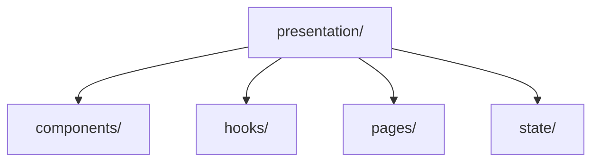
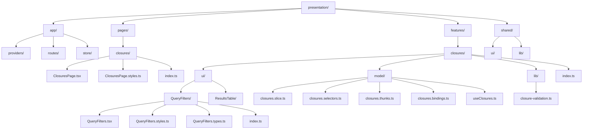
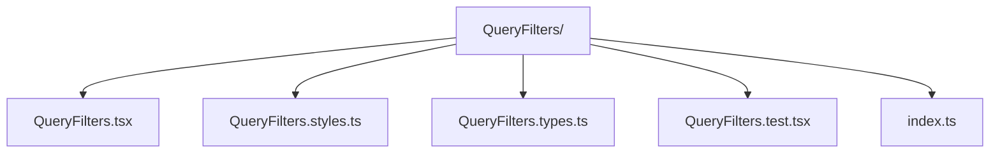
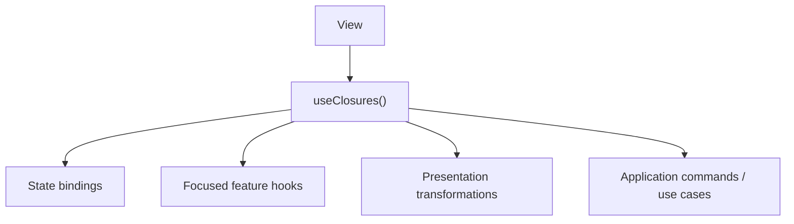
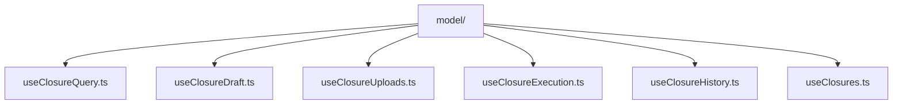
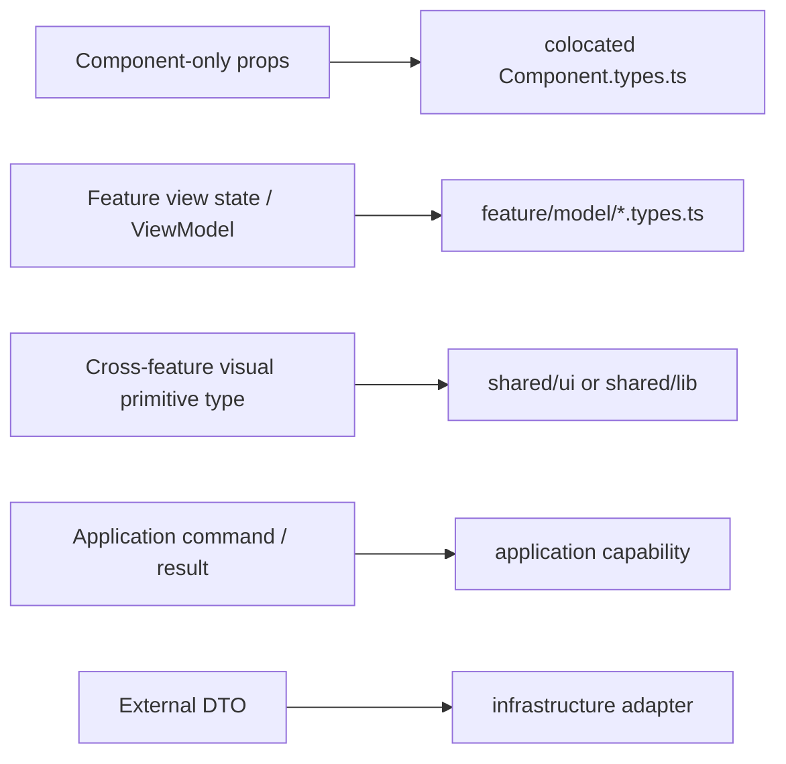

# Presentation Architecture

## 1. Presentation is an architectural boundary

[Presentation](../GLOSSARY.md#presentation-layer) is not merely "the folder containing JSX".

It owns concerns whose meaning exists because a user interface exists:

- pages and route composition;
- layouts and application shell;
- component composition;
- view state;
- interaction state;
- view-oriented transformations;
- accessibility state;
- sorting/filtering for display;
- transient feedback;
- UI framework bindings.

Business [invariants](../GLOSSARY.md#invariant) and application workflow policy do not move into [Presentation](../GLOSSARY.md#presentation-layer) just because the browser triggers them.

A useful test is:

> Would this rule still be required if the current UI were replaced by a CLI, API or another frontend?

If yes, inspect whether it belongs in [Application](../GLOSSARY.md#application-layer) or [Domain](../GLOSSARY.md#domain) instead.

---

## 2. Organize by ownership, not only by technical type

A small project can start with:



At scale, this becomes a horizontal "folder by type" architecture. A single change to `closures` may require editing six distant directories.

Prefer feature ownership:



Not every feature needs every segment or file. Start small and split only when responsibilities become independently meaningful.

---

## 3. Pages compose; features own behavior

A route-level Page should primarily compose capabilities:

```tsx
export function ClosuresPage() {
  const closure = useClosures()

  return (
    <PageLayout>
      <QueryFilters
        input={closure.input}
        onSubmit={closure.query}
      />
      <ResultsTable
        rows={closure.rows}
        selection={closure.selection}
        onSelectionChange={closure.changeSelection}
      />
    </PageLayout>
  )
}
```

A Page may own ephemeral state that has no meaning outside that page:

```ts
const [isHistoryOpen, setHistoryOpen] = useState(false)
```

It should not become the place where HTTP orchestration, domain validation, persistence and [store](../GLOSSARY.md#store) implementation details accumulate.

---

## 4. Component colocation

For a non-trivial component, colocate what belongs only to that component:



Use only the files the component needs. Do not generate empty `types` or `test` files to satisfy a template.

Benefits:

- the component can be moved or removed as a unit;
- local visual behavior has an obvious owner;
- component props do not pollute global type folders;
- code review has a smaller search surface.

---

## 5. Public hook / ViewModel facade

For feature-heavy screens, a public custom hook can act as a [Presentation Model](../GLOSSARY.md#presentation-model) / [ViewModel](../GLOSSARY.md#viewmodel) facade.



The hook exposes UI-semantic state and operations:

```ts
export interface ClosuresViewModel {
  readonly rows: readonly ClosureRow[]
  readonly busy: boolean
  readonly canSave: boolean

  query(input: ClosureQueryInput): Promise<void>
  save(): Promise<Result<ClosureId, ClosureError>>
  reset(): void
}

export function useClosures(): ClosuresViewModel {
  // compose internal Presentation concerns
}
```

React's custom-hook guidance recommends hooks that express concrete, high-level [use cases](../GLOSSARY.md#use-case) rather than generic wrappers around lifecycle primitives. That maps well to feature facades such as `useAuth`, `useClosures` and `useTheme`.

### Do not expose state-library mechanics

Bad [public API](../GLOSSARY.md#public-api):

```ts
const result = await actions.query(input)

if (queryThunk.rejected.match(result)) {
  // Redux Toolkit has escaped the state boundary.
}
```

Better:

```ts
const result = await actions.query(input)

if (!result.ok) {
  toast.error(result.error.message)
}
```

The binding layer converts framework-specific outcomes to a semantic result.

---

## 6. Avoid the God ViewModel

A facade can become too large.

If one hook owns query orchestration, draft persistence, file uploads, history, validation, modal state, polling and execution, split internal concerns:



`useClosures.ts` can remain the public composition point if a page needs a unified surface.

The goal is not a file-size threshold. Split when concerns have different reasons to change or can be understood/tested independently.

---

## 7. Shared UI is earned

A component starts close to its feature.

Promote it to `shared/ui` when it has a stable, feature-independent contract and multiple consumers.

Good candidates:

- `shared/ui/Button`
- `shared/ui/TextField`
- `shared/ui/Dialog`
- `shared/ui/DataTable`

Poor candidates:

- `shared/ui/ClosureHeader`
- `shared/ui/JusticeOfficePicker`

if they still encode one feature's vocabulary.

Avoid parallel generic buckets such as both `common` and `shared` unless their distinction is explicit and enforced.

---

## 8. Feature-local libraries before global utils

Prefer:

- `features/closures/lib/date-range-overlap.ts`
- `features/closures/lib/format-jxxi-message.ts`

until the code proves it has a broader owner.

Only then promote focused utilities:

- `shared/lib/date/`
- `shared/lib/format-bytes/`

Avoid `helpers.ts`, `misc.ts`, `utils2.ts` and large generic utility barrels.

---

## 9. Public APIs protect feature internals

Feature consumers should normally import:

```ts
import {
  QueryFilters,
  useClosures,
} from '@/presentation/features/closures'
```

rather than:

```ts
import { closureSlice } from '@/presentation/features/closures/model/closures.slice'
```

The feature's `index.ts` is an intentional contract, not an automatic export of every internal symbol.

This makes it possible to replace Redux, split a hook or reorganize [selectors](../GLOSSARY.md#selector) without changing consumers.

---

## 10. Type placement inside Presentation

Types should follow meaning:



Do not move a type into [Domain](../GLOSSARY.md#domain) merely because several UI files use it.

---

## 11. Enforce chosen boundaries

If the architecture says Pages/UI cannot know Redux internals, make imports fail CI.

If the architecture says features expose only [public APIs](../GLOSSARY.md#public-api), reject cross-feature deep imports.

See **[Executable Architecture](../foundations/architecture-testing.md)**.

## Sources

- React, "Reusing Logic with Custom Hooks": https://react.dev/learn/reusing-logic-with-custom-hooks
- Redux Style Guide: https://redux.js.org/style-guide/
- Martin Fowler, "[Presentation Model](../GLOSSARY.md#presentation-model)": https://martinfowler.com/eaaDev/PresentationModel.html
- Feature-Sliced Design, slices/segments: https://feature-sliced.design/docs/reference/slices-segments
- Feature-Sliced Design, [public API](../GLOSSARY.md#public-api): https://feature-sliced.design/docs/reference/public-api
