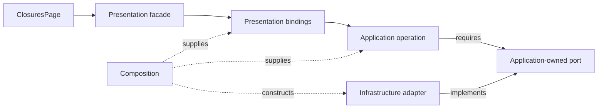

# Reference Case Study: XXI Web UI

Reviewed source: `AndresTaoFlorez/tyba-support-platform`, `experiments/xxi/web-ui`, **commit `982d861d442024331c84041c5a08c147ce2a01ec`**. Evidence below comes from that committed snapshot, not local uncommitted work. This is a reference implementation, not the architecture specification or an instruction to migrate that repository.

## 1. What should be promoted

### 1.1 Explicit application boundaries

The snapshot has [Domain](../GLOSSARY.md#domain), [Application](../GLOSSARY.md#application-layer), [Infrastructure](../GLOSSARY.md#infrastructure), [Presentation](../GLOSSARY.md#presentation-layer) and Composition areas. Its [architecture tests](https://github.com/AndresTaoFlorez/tyba-support-platform/blob/982d861d442024331c84041c5a08c147ce2a01ec/experiments/xxi/web-ui/tests/architecture.test.ts) inspect TypeScript import/export declarations and dynamic imports, resolve local references, and protect selected UI/hook boundaries. These checks establish the rules they implement, not every possible conceptual leak.

### 1.2 Explicit Composition Root

[The composition module](https://github.com/AndresTaoFlorez/tyba-support-platform/blob/982d861d442024331c84041c5a08c147ce2a01ec/experiments/xxi/web-ui/src/composition/container.ts) assembles concrete [adapters](../GLOSSARY.md#adapter), [use cases](../GLOSSARY.md#use-case) and presentation state. Retain injection into consumers rather than importing that module as a [service locator](../GLOSSARY.md#service-locator).

### 1.3 UI components grouped by capability

Auth, closures, profile and token components have recognizable owners. When a capability grows, its state, bindings and helpers can move under the same feature owner. This is a recommended evolution, not a required folder count.

### 1.4 Complex component colocation

DataTable keeps its rendering and style definitions together. Component-only types and tests can also be colocated when needed; empty files are unnecessary.

### 1.5 Public feature hooks

[`useClosures`](https://github.com/AndresTaoFlorez/tyba-support-platform/blob/982d861d442024331c84041c5a08c147ce2a01ec/experiments/xxi/web-ui/src/presentation/hooks/useClosures.ts) offers screen-oriented state and operations. This is an intentional [ViewModel](../GLOSSARY.md#viewmodel)-like [facade](../GLOSSARY.md#facade-pattern), not a role inferred from the `use` prefix.

### 1.6 Selectors separate derivation from mutation

The presentation state area separates derived values from update logic. Derivation remains a presentation concern unless it owns an authoritative business rule.

### 1.7 Architecture tests

[AST](../GLOSSARY.md#abstract-syntax-tree-ast)-based checks cover more than a folder drawing or a search for `import`. Type-only references also create coupling. A complete check must still account for the language constructs, resolution and package policy of its project.

### 1.8 Panda semantic tokens and slot recipes

Panda tokens and multipart [recipes](../GLOSSARY.md#recipe) provide reusable visual contracts. Keep one owner for each decision. Local atomic [recipes](../GLOSSARY.md#recipe) and registered config [recipes](../GLOSSARY.md#recipe) are both valid mechanisms; ownership determines which this guide recommends.

## 2. What should not be promoted unchanged

### 2.1 Port cohesion still needs review

The snapshot already has **AuthRepository, ClosuresRepository and PreferencesRepository**. It does not have the previously claimed all-purpose `SessionRepository`. [`ClosuresRepository`](https://github.com/AndresTaoFlorez/tyba-support-platform/blob/982d861d442024331c84041c5a08c147ce2a01ec/experiments/xxi/web-ui/src/application/ports/ClosuresRepository.ts) still combines catalogs, office lookup, search, execution, upload, jobs and history. Consider splitting conversations that have independently meaningful consumers or lifetimes; do not create a [port](../GLOSSARY.md#port) per endpoint mechanically.

### 2.2 Use-case cohesion follows capabilities

[`closuresUseCases.ts`](https://github.com/AndresTaoFlorez/tyba-support-platform/blob/982d861d442024331c84041c5a08c147ce2a01ec/experiments/xxi/web-ui/src/application/use-cases/closuresUseCases.ts) contains several closure operations and draft validation. Auth and Preferences are already separate. Further separation should follow independently understandable policy, not a claim that `SessionUseCases` still exists or a one-class-per-method rule.

### 2.3 `domain/session.ts` mixes unrelated ownership

[`domain/session.ts`](https://github.com/AndresTaoFlorez/tyba-support-platform/blob/982d861d442024331c84041c5a08c147ce2a01ec/experiments/xxi/web-ui/src/domain/session.ts) declares `ClosureFormState`, `UploadQueueItem`, `WebTable`, catalogs and execution shapes alongside session concepts. Review each by meaning: form/upload display state belongs in [Presentation](../GLOSSARY.md#presentation-layer); wire data belongs with [Infrastructure](../GLOSSARY.md#infrastructure); operation contracts belong in [Application](../GLOSSARY.md#application-layer); stable business meaning belongs in [Domain](../GLOSSARY.md#domain). Names alone are clues, not proof of ownership.

### 2.4 Browser `File` leaks into Application

`ClosuresRepository.uploadClosureFile` receives `File` and a progress callback. That conflicts with this guide's platform-independent [Application](../GLOSSARY.md#application-layer) default. A browser-specific application can intentionally choose otherwise, but must document the coupling. Translate to application-owned content metadata/bytes or a suitable stream contract when platform independence is required.

### 2.5 The application-wide `contract.ts` hides ownership

[`application/contract.ts`](https://github.com/AndresTaoFlorez/tyba-support-platform/blob/982d861d442024331c84041c5a08c147ce2a01ec/experiments/xxi/web-ui/src/application/contract.ts) re-exports many `domain/session` types. An inward-looking import path does not correct mixed semantic ownership. Prefer deliberate capability APIs with the representations the consumer needs.

### 2.6 The public facade coordinates many concerns

`useClosures` coordinates query inputs, catalogs, drafts, uploads, execution monitoring, history, previews and feedback. It may retain one public surface while separating internals by independently changing responsibilities. This is a cohesion judgment, not a line-count threshold.

### 2.7 Redux result translation is already inside bindings

[`closuresSlice.ts`](https://github.com/AndresTaoFlorez/tyba-support-platform/blob/982d861d442024331c84041c5a08c147ce2a01ec/experiments/xxi/web-ui/src/presentation/state/slices/closuresSlice.ts) performs `queryOfficeClassesThunk.rejected.match(...)` inside `useClosuresActions`, returning semantic `ok` outcomes. The public hook uses those outcomes; the previous claim that this matcher leaked into `useClosures` was stale. Preserve this boundary and examine other exported action results individually.

### 2.8 A slice file owns several mechanisms

The same file contains [reducers](../GLOSSARY.md#reducer), async [thunks](../GLOSSARY.md#thunk) and React bindings. They can stay colocated under the feature while being separated into focused files when that improves understanding. A [reducer](../GLOSSARY.md#reducer) itself should remain free of I/O.

### 2.9 Browser persistence has an explicit utility, but hook-owned orchestration

[`closureWorkspaceStorage.ts`](https://github.com/AndresTaoFlorez/tyba-support-platform/blob/982d861d442024331c84041c5a08c147ce2a01ec/experiments/xxi/web-ui/src/presentation/utils/closureWorkspaceStorage.ts) reads/writes `sessionStorage`; `useClosures` triggers it through effects. The snapshot does not put those storage calls in [reducers](../GLOSSARY.md#reducer). For a UI-only workspace, keeping this in [Presentation](../GLOSSARY.md#presentation-layer) can be deliberate. Isolate storage and consider [listener middleware](../GLOSSARY.md#listener-middleware) only when state-driven persistence warrants it; business persistence needs its own application boundary.

### 2.10 DataTable recipes have overlapping owners

[`DataTable.styles.ts`](https://github.com/AndresTaoFlorez/tyba-support-platform/blob/982d861d442024331c84041c5a08c147ce2a01ec/experiments/xxi/web-ui/src/presentation/components/shared/DataTable/DataTable.styles.ts) defines an atomic `dataTableRecipe`; [`shared.recipes.ts`](https://github.com/AndresTaoFlorez/tyba-support-platform/blob/982d861d442024331c84041c5a08c147ce2a01ec/experiments/xxi/web-ui/src/presentation/recipes/shared.recipes.ts) defines another config `dataTableRecipe`. Consolidate overlapping contracts rather than copying fixes between them. This is an ownership finding, not a Panda prohibition on sharing atomic [recipes](../GLOSSARY.md#recipe).

### 2.11 `global.css` also owns theme variables

[`global.css`](https://github.com/AndresTaoFlorez/tyba-support-platform/blob/982d861d442024331c84041c5a08c147ce2a01ec/experiments/xxi/web-ui/src/presentation/global.css) overrides theme colors such as `--colors-canvas`. Consolidate overlapping theme decisions with Panda configuration. CSS resets, fonts and vendor integration remain legitimate CSS owners.

### 2.12 `common` and `shared` need distinct meanings

Both component categories exist. Either document distinct contracts or consolidate them. Shared visual primitives should be feature-independent; domain-specific components stay with their capability.

## 3. Normalized target

Keep the five `src/` layers. The recommended [Presentation](../GLOSSARY.md#presentation-layer) target is capability-owned `presentation/closures/{pages,components,hooks,state}/`, with local `formatters/` when needed and established `presentation/shared/components/` for independent visual primitives. Follow the [canonical frontend layout](README.md) rather than copying historical paths from the snapshot.

This is a conceptual target for future projects. It is not a migration command for the referenced snapshot.

## 4. Canonical flow

Source-contract dependencies are solid arrows; executable assembly is dashed. These are **not** runtime calls:

At runtime the operation invokes the injected [adapter](../GLOSSARY.md#adapter) object. The [port](../GLOSSARY.md#port) is its source contract, not an extra runtime intermediary. A local checkbox may simply update local visual state.

## 5. Why this case study exists

Real growth pressure reveals both useful boundaries and accidental coupling. Promote demonstrated patterns, distinguish review judgments from facts, and pin evidence so later refactors do not silently change what a finding means.
