# Reference Case Study: XXI Web UI

This case study records architectural lessons extracted from:

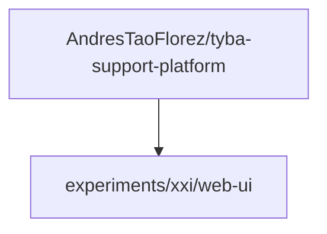

The reviewed snapshot is a **reference implementation, not the specification**.

Its useful patterns are generalized here. Its accidental complexity and boundary leaks are documented explicitly so they are not copied into new projects.

---

## 1. What should be promoted

### 1.1 Explicit application boundaries

The project uses:

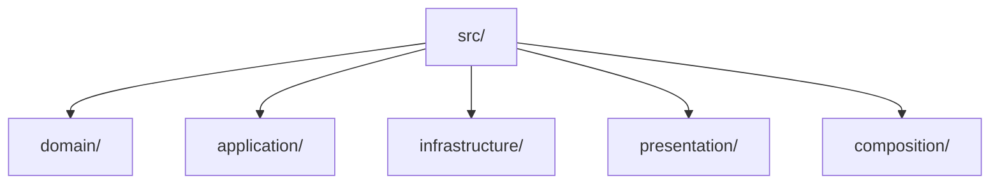

with [architecture tests](../GLOSSARY.md#architecture-test) that verify import direction.

That is stronger than a folder diagram alone.

### 1.2 Explicit Composition Root

Concrete [Infrastructure](../GLOSSARY.md#infrastructure) is wired to [Application](../GLOSSARY.md#application-layer) and the UI [store](../GLOSSARY.md#store) in one outer composition module.

The pattern should be retained; the concrete classes are project-specific.

### 1.3 UI components grouped by capability

Examples such as:

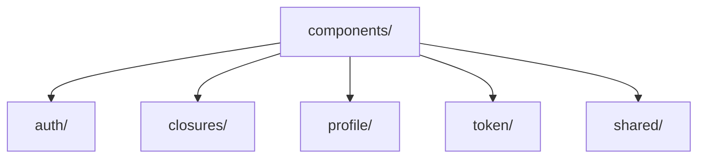

are materially better than one flat component directory.

The generalized version in this repository goes further: when a feature becomes large, its hooks, [selectors](../GLOSSARY.md#selector), state and helpers should migrate under the same feature owner rather than remaining distributed across application-wide technical folders.

### 1.4 Complex component colocation

The pattern:

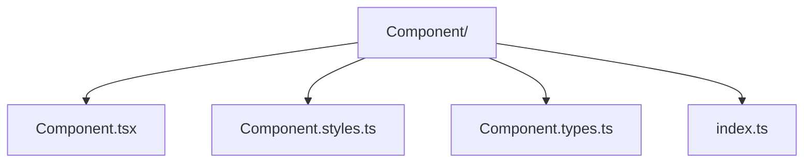

is a good default for non-trivial components.

Files remain optional. A component with no dedicated types file should not receive an empty one.

### 1.5 Public feature hooks

Hooks such as `useAuth`, `useClosures`, `useTheme`, `useToast` and `useUi` give React a semantic interface over state machinery.

That is a useful [Presentation Model](../GLOSSARY.md#presentation-model)/[ViewModel](../GLOSSARY.md#viewmodel)-style boundary.

### 1.6 Selectors separate derivation from mutation

Dedicated [selectors](../GLOSSARY.md#selector) keep derived state outside [reducers](../GLOSSARY.md#reducer) and components.

### 1.7 Architecture tests

The project checks import boundaries with the TypeScript [AST](../GLOSSARY.md#abstract-syntax-tree-ast), including relative and type-only imports. It also protects public hook boundaries and rejects direct Redux imports from selected UI surfaces.

This should become a first-class architectural practice.

### 1.8 Panda semantic tokens and slot recipes

The project has a mature direction:

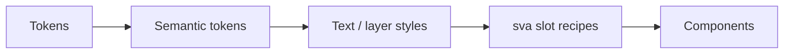

The local `sva` pattern for multipart components is worth preserving after duplicate [recipes](../GLOSSARY.md#recipe) are removed.

---

## 2. What should not be promoted unchanged

### 2.1 `SessionRepository` became a capability god-interface

At the reviewed snapshot, one interface owns authentication, environment switching, preferences, catalogs, office queries, account recovery, closure execution, upload, jobs and history.

That is no longer a session capability.

Refactor conceptually toward coherent [ports](../GLOSSARY.md#port):

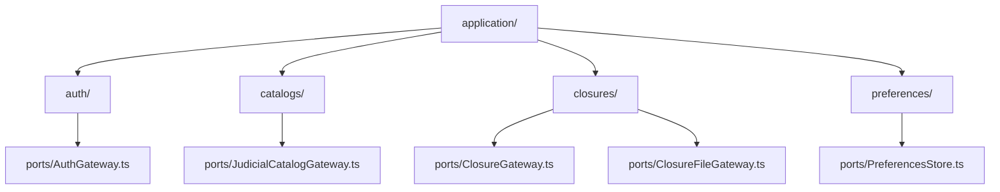

Do not mechanically create one interface per endpoint. [Port](../GLOSSARY.md#port) granularity follows cohesive external conversations.

### 2.2 `SessionUseCases` became an application god-service

The same capability sprawl appears in the use-case class.

Prefer use-case/capability ownership:

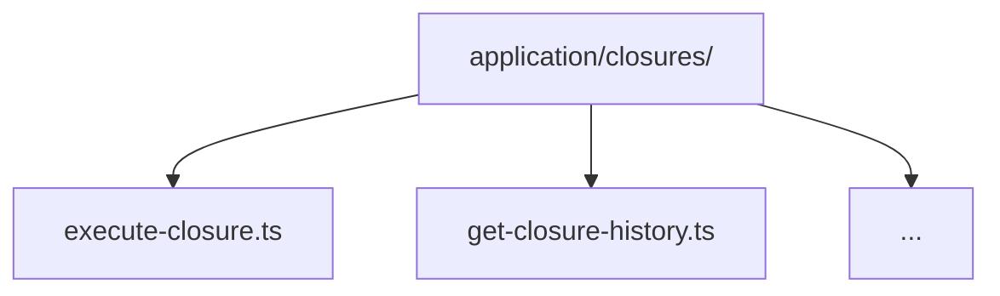

A class containing several strongly cohesive [use cases](../GLOSSARY.md#use-case) may still be reasonable. The rule is cohesion, not "one class per method".

### 2.3 `domain/session.ts` mixes unrelated ownership

The reviewed [Domain](../GLOSSARY.md#domain) file contains session concepts alongside:

- `ClosureFormState`;
- `UploadQueueItem`;
- table/cache representations;
- closure execution transport/application shapes.

Names such as `FormState`, `UploadQueueItem` and `WebTable` indicate UI or boundary concerns, not stable domain meaning.

A normalized model would separate:

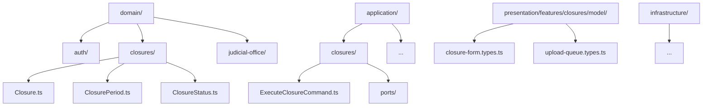

### 2.4 Browser `File` leaks into Application

An [Application](../GLOSSARY.md#application-layer) [port](../GLOSSARY.md#port) currently receives the browser `File` type.

`File` belongs to the Web File API. The outer [adapter](../GLOSSARY.md#adapter) should translate it to an application-owned content/stream abstraction.

### 2.5 The application-wide `contract.ts` hides ownership

A large barrel re-exports [Domain](../GLOSSARY.md#domain) and [Application](../GLOSSARY.md#application-layer) types to [Presentation](../GLOSSARY.md#presentation-layer).

That can make imports look clean while preserving conceptual coupling.

Prefer explicit capability [public APIs](../GLOSSARY.md#public-api):

- `application/auth/index.ts`
- `application/closures/index.ts`
- `application/catalogs/index.ts`

with deliberate exports.

### 2.6 `useClosures` has become a God ViewModel

The public facade is a good idea, but it accumulates query logic, draft behavior, uploads, execution, history, validation and UI feedback.

Keep the facade while splitting internal concerns:

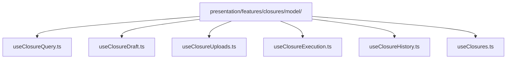

### 2.7 Redux Toolkit mechanics leak through the facade

The public hook inspects `queryOfficeClassesThunk.rejected.match(...)`.

A public feature hook should receive a semantic result from bindings:

```ts
type Result<T, E> =
  | { ok: true; value: T }
  | { ok: false; error: E }
```

The knowledge of `fulfilled` / `rejected` ends at the Redux [adapter](../GLOSSARY.md#adapter) boundary.

### 2.8 A slice owns too many mechanisms

The large closures slice contains or coordinates:

- Redux [reducers](../GLOSSARY.md#reducer)/state;
- async [thunks](../GLOSSARY.md#thunk);
- React bindings;
- [selectors](../GLOSSARY.md#selector) through imports;
- browser draft persistence.

As the feature grows, keep these responsibilities colocated under `features/closures/model`, but split them into meaningful files.

### 2.9 Browser persistence is mixed with React lifecycle/state

Draft persistence currently reaches `sessionStorage` from slice helpers and is triggered by a public hook effect.

Prefer a storage [adapter](../GLOSSARY.md#adapter) and, when Redux owns the state transition, a listener/[middleware](../GLOSSARY.md#middleware) workflow.

### 2.10 Panda recipes are duplicated

The project contains both:

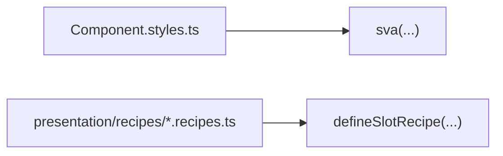

for overlapping visual definitions.

The corrected rule is:

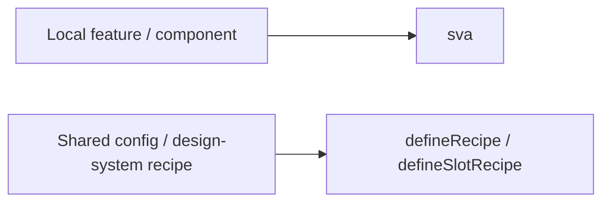

Never both for the same [recipe](../GLOSSARY.md#recipe).

### 2.11 `global.css` competes with Panda

A manual global stylesheet redefines theme variables that are also owned by `panda.config.ts`.

If Panda owns the [design system](../GLOSSARY.md#design-system), [semantic tokens](../GLOSSARY.md#semantic-token), global styles and keyframes should have one source of truth.

### 2.12 `common` and `shared` are ambiguous

Both categories exist.

Prefer:

- `shared/ui/`
- `shared/lib/`
- feature-local `lib/`

and remove a generic `common` bucket unless the project can define a non-overlapping responsibility for it.

---

## 3. Normalized target

The generalized structure is:

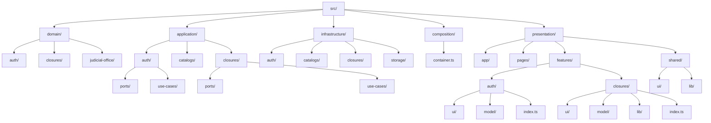

This structure is not a migration command for the XXI project. It is the **conceptual reference** extracted from it for future projects.

---

## 4. Canonical flow

For a policy-bearing closure operation:

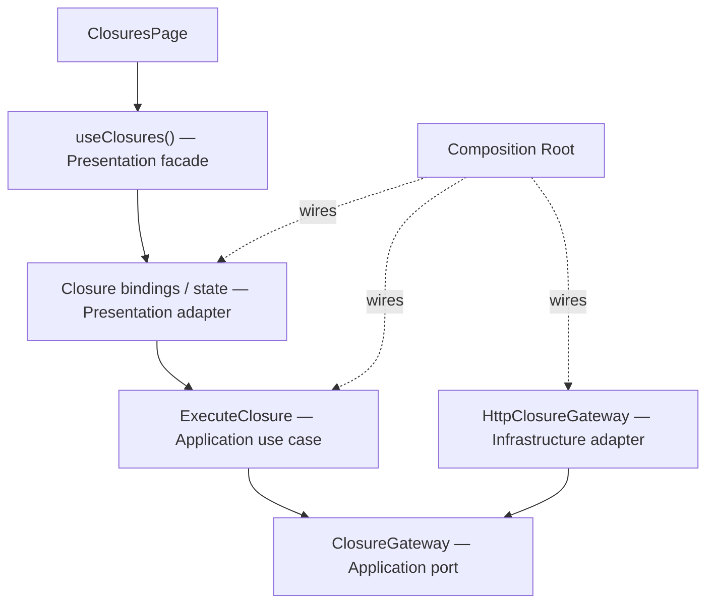

For a purely local visual concern:

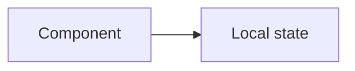

Do not route every checkbox through the entire onion.

---

## 5. Why this case study exists

A reference architecture becomes dangerous when example code is treated as scripture.

The XXI project is valuable because it demonstrates real growth pressure: state, uploads, persistence, feature UI, [design-system](../GLOSSARY.md#design-system) work and import enforcement. Those pressures expose both strong patterns and accidental coupling.

The documentation promotes the former and names the latter explicitly.
