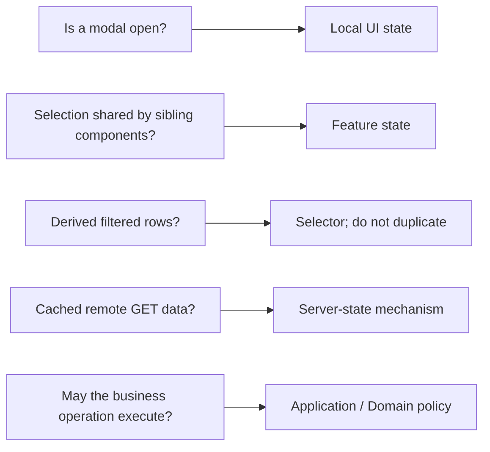
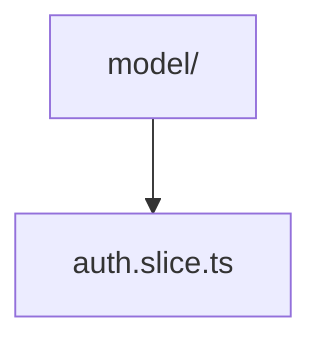
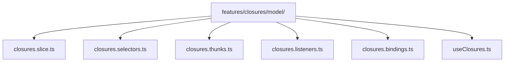
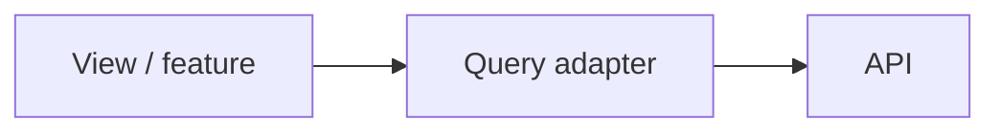
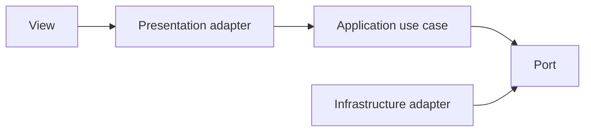

# State Management and Side Effects

A ticket screen remembers several different things: whether its dialog is open, which ticket the analyst selected, and the latest list received from the server. These values do not all belong in the same place. A dialog's open/closed flag can live inside its component; selection shared by several components may belong to the ticket feature; remotely owned ticket data may need a fetch/cache mechanism.

Choosing who keeps each value, who may update it, and when it must be refreshed is [state management](../GLOSSARY.md#state-management). It is not a layer of Clean or [Onion Architecture](../GLOSSARY.md#onion-architecture); in this guide the client-side mechanism is part of [Presentation](../GLOSSARY.md#presentation-layer). The first question is not “which [store](../GLOSSARY.md#store)?” but **who needs this value, who owns the authoritative copy, and how long must it live?**

---

## 1. Classify state before choosing a mechanism

A practical default:

| State | Typical owner |
| --- | --- |
| ephemeral component interaction | local component state |
| route/page-only transient state | Page or route state |
| shared client feature state | feature [store](../GLOSSARY.md#store)/slice |
| derived values | [selector](../GLOSSARY.md#selector) / computed value |
| remote cache | [server-state](../GLOSSARY.md#server-state)/query mechanism |
| application workflow policy | [Application](../GLOSSARY.md#application-layer) [use case](../GLOSSARY.md#use-case) |
| durable browser persistence | storage [adapter](../GLOSSARY.md#adapter) + controlled [side effect](../GLOSSARY.md#side-effect) |

Examples:



Redux's official style guide recommends keeping [global state](../GLOSSARY.md#global-state) minimal, deriving additional values, and keeping most form state local unless sharing it globally has a concrete benefit.

---

## 2. Keep a feature's state logic together

For a simple Redux Toolkit feature, one slice file may be enough:



Redux Toolkit intentionally encourages colocating [reducer](../GLOSSARY.md#reducer) logic and generated actions in `createSlice`.

As complexity grows, split by responsibility **inside the feature**, not back into application-wide technical folders:



This is a scaling technique, not a mandatory template. A five-line feature does not need six files.

---

## 3. Reducers are pure state transitions

[Reducers](../GLOSSARY.md#reducer) should calculate next state from previous state + action.

They should not:

- perform HTTP calls;
- write to `localStorage` / `sessionStorage`;
- start timers;
- read random/global mutable state;
- manipulate the DOM.

Redux's style guide requires [reducers](../GLOSSARY.md#reducer) to be free of [side effects](../GLOSSARY.md#side-effect).

---

## 4. Selectors own derivation

Do not store data that can be reliably calculated from existing state.

Bad:

```ts
state.rows = rows
state.filteredRows = rows.filter(...)
state.filteredCount = state.filteredRows.length
```

Better:

```ts
export const selectFilteredRows = createSelector(
  [selectRows, selectFilters],
  (rows, filters) => applyFilters(rows, filters),
)

export const selectFilteredCount = createSelector(
  [selectFilteredRows],
  rows => rows.length,
)
```

Memoize [selectors](../GLOSSARY.md#selector) when derivation is expensive or referential stability matters. Do not use [memoization](../GLOSSARY.md#memoization) as decoration.

---

## 5. Thunks: one-shot asynchronous orchestration

Redux recommends [thunks](../GLOSSARY.md#thunk) for imperative async logic that needs `dispatch`/`getState`.

In a layered application, [thunks](../GLOSSARY.md#thunk) are a useful [Presentation](../GLOSSARY.md#presentation-layer) [adapter](../GLOSSARY.md#adapter) around [Application](../GLOSSARY.md#application-layer) operations:

```ts
export const executeClosureThunk = createAsyncThunk<
  ClosureResult,
  ExecuteClosureCommand,
  ThunkConfig
>(
  'closures/execute',
  async (command, { extra, rejectWithValue }) => {
    try {
      return await extra.executeClosure(command)
    } catch (error) {
      return rejectWithValue(toPresentationError(error))
    }
  },
)
```

The concrete infrastructure dependency is assembled at the [Composition Root](../GLOSSARY.md#composition-root) and injected through [thunk](../GLOSSARY.md#thunk) `extraArgument`. Redux Toolkit supports this directly.

Do not import `HttpClosureGateway` from a [thunk](../GLOSSARY.md#thunk).

---

## 6. Listener middleware: reactive workflows and persistence

When behavior reacts to actions/state over time, Redux Toolkit's [listener middleware](../GLOSSARY.md#listener-middleware) is usually a better fit than putting [store](../GLOSSARY.md#store) synchronization into a React effect.

Example:

```ts
startAppListening({
  matcher: isAnyOf(
    closureDraftChanged,
    closureSelectionChanged,
  ),
  effect: async (_, api) => {
    const draft = selectClosureDraft(api.getState())
    await api.extra.draftStorage.save(draft)
  },
})
```

Good listener [use cases](../GLOSSARY.md#use-case) include:

- persistence after state changes;
- debounced workflows;
- reacting to multiple actions;
- timers/delays tied to [store](../GLOSSARY.md#store) events;
- coordinating state-driven [side effects](../GLOSSARY.md#side-effect).

A persistence [adapter](../GLOSSARY.md#adapter) still owns browser storage details.

---

## 7. Browser persistence is an external detail

Do not let a slice become the browser storage [adapter](../GLOSSARY.md#adapter):

```ts
// Avoid inside the reducer/slice module as the persistence mechanism:
window.sessionStorage.setItem(KEY, JSON.stringify(state))
```

Prefer an explicit [adapter](../GLOSSARY.md#adapter):

```ts
export interface ClosureDraftStorage {
  load(): Promise<ClosureDraft | null>
  save(draft: ClosureDraft): Promise<void>
  clear(): Promise<void>
}
```

with a browser implementation:

`SessionStorageClosureDraftStorage`

Depending on the application's boundary policy, the [port](../GLOSSARY.md#port) can live in [Application](../GLOSSARY.md#application-layer) or the persistence contract can remain entirely inside [Presentation](../GLOSSARY.md#presentation-layer) if the draft itself is purely UI state. What matters is that browser I/O is not hidden inside a pure state transition.

---

## 8. Bindings isolate the state library when the project needs that boundary

A strict [Presentation](../GLOSSARY.md#presentation-layer) architecture can keep React Redux behind feature bindings:

```ts
export function useClosuresState() {
  return useAppSelector(selectClosuresViewState)
}

export function useClosuresActions() {
  const dispatch = useAppDispatch()

  return useMemo(() => ({
    async query(input: QueryInput): Promise<Result<QueryResult, UiError>> {
      const action = await dispatch(queryClosuresThunk(input))

      if (queryClosuresThunk.fulfilled.match(action)) {
        return { ok: true, value: action.payload }
      }

      return {
        ok: false,
        error: normalizeUiError(action.payload ?? action.error),
      }
    },
  }), [dispatch])
}
```

Then `useClosures()` consumes semantic operations, not `fulfilled.match`, `dispatch` or action creators.

This boundary is optional. For smaller applications, direct typed `useSelector`/`useDispatch` in components is a valid Redux style.

---

## 9. Server state vs. application policy

Redux Toolkit recommends [RTK Query](../GLOSSARY.md#rtk-query) as the default Redux solution for data fetching/caching.

That does not mean every server call should bypass [Application](../GLOSSARY.md#application-layer).

### Server-state dominant operation

If a screen only needs cached remote data, with invalidation/refetch but little application policy:



[RTK Query](../GLOSSARY.md#rtk-query), TanStack Query or another [server-state](../GLOSSARY.md#server-state) library may be enough.

### Policy-bearing operation

If an operation validates business/application rules, coordinates multiple capabilities, has authorization policy or must stay independent of transport:



Use the architecture because it protects something meaningful, not to wrap every GET request in ceremony.

---

## 10. Forms are not global state by default

Redux recommends keeping most form state outside Redux.

Prefer local/form-library state when:

- only one form owns it;
- no other feature needs it;
- it can be discarded with the screen.

Promote state when there is a real requirement such as:

- multi-step cross-route workflow;
- draft recovery;
- collaborative editing;
- multiple distant consumers;
- navigation that must preserve progress.

---

## 11. React effects are synchronization tools

React describes Effects as a way to synchronize a component with an external system.

Do not use an Effect merely to derive one piece of React state from another. Calculate derived state during rendering or in [selectors](../GLOSSARY.md#selector).

If a [side effect](../GLOSSARY.md#side-effect) belongs to the [store](../GLOSSARY.md#store) rather than the component lifecycle, [middleware](../GLOSSARY.md#middleware)/listeners may be a better owner.

---

## 12. Memoization is not an architectural rule

Do not standardize "every callback uses `useCallback`" or "every derived value uses `useMemo`".

Use [memoization](../GLOSSARY.md#memoization) when:

- a calculation is actually expensive;
- a stable identity is required by an API or memoized child;
- profiling shows meaningful benefit;
- the framework/compiler cannot safely optimize the case.

Modern React Compiler can automatically memoize many values/functions in compiled code, so manual [memoization](../GLOSSARY.md#memoization) should remain intentional.

## Sources

- Redux Style Guide: https://redux.js.org/style-guide/
- Redux, "[Side Effects](../GLOSSARY.md#side-effect) Approaches": https://redux.js.org/usage/side-effects-approaches
- Redux Toolkit, `createAsyncThunk`: https://redux-toolkit.js.org/api/createAsyncThunk
- Redux Toolkit, [listener middleware](../GLOSSARY.md#listener-middleware): https://redux-toolkit.js.org/api/createListenerMiddleware
- Redux Toolkit, [RTK Query](../GLOSSARY.md#rtk-query) overview: https://redux-toolkit.js.org/rtk-query/overview
- React, "You Might Not Need an Effect": https://react.dev/learn/you-might-not-need-an-effect
- React, "Synchronizing with Effects": https://react.dev/learn/synchronizing-with-effects
- React Compiler: https://react.dev/learn/react-compiler/introduction
