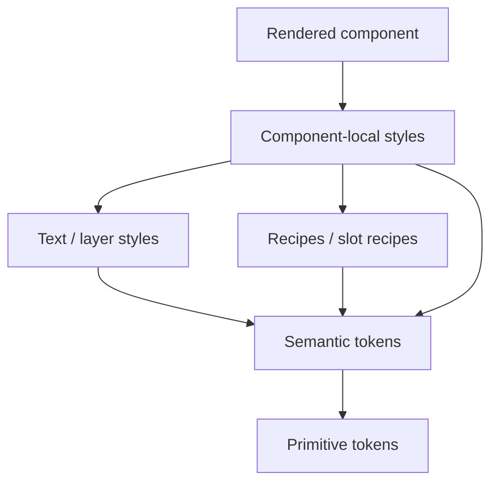
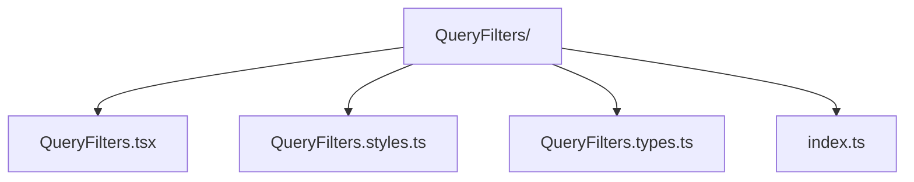
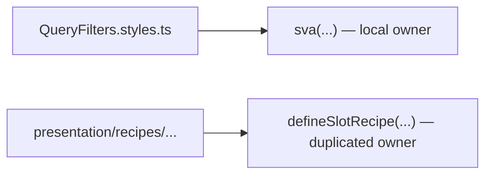
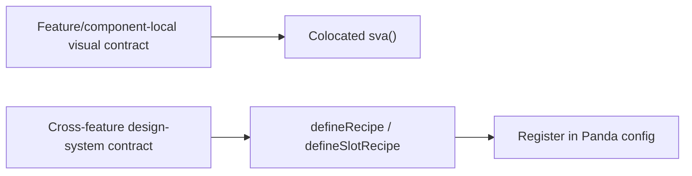
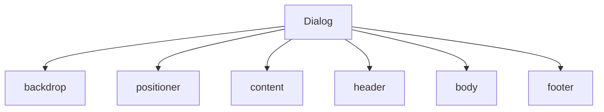
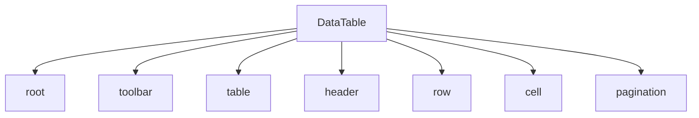
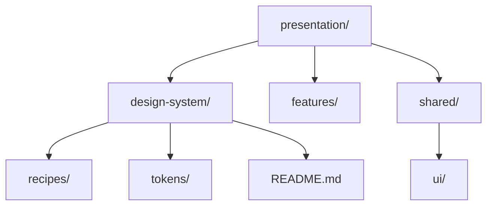

# Styling and Design-System Architecture

Styling is a [Presentation](../GLOSSARY.md#presentation-layer) concern, but a mature styling system still needs architecture: ownership, layers of abstraction, [public APIs](../GLOSSARY.md#public-api) and one source of truth.

This guide uses Panda CSS for concrete examples. The model also applies to other token/[recipe](../GLOSSARY.md#recipe)/component systems.

---

## 1. Use a layered design-system pipeline

Use explicit ownership and reuse. This is a [dependency graph](../GLOSSARY.md#dependency-graph) of style definitions, not a requirement that every component pass through every abstraction:



Each level answers a different question.

### Primitive tokens

Raw scales and values:

```ts
tokens: {
  colors: {
    neutral: {
      50: { value: '#f8f7f4' },
      900: { value: '#161719' },
    },
  },
  spacing: {
    2: { value: '8px' },
    3: { value: '12px' },
  },
}
```

### Semantic tokens

Contextual roles:

```ts
semanticTokens: {
  colors: {
    canvas: {
      value: {
        base: '{colors.neutral.50}',
        _dark: '{colors.neutral.900}',
      },
    },
  },
}
```

Panda's documentation explicitly positions [semantic tokens](../GLOSSARY.md#semantic-token) as context-dependent aliases and supports references back to raw tokens.

A [semantic token](../GLOSSARY.md#semantic-token) should usually answer **what the value means**, not merely duplicate a hex value under another name.

---

## 2. Keep typography reusable

Panda text styles are intended to capture typographic properties.

Prefer:

```ts
textStyles: {
  pageTitle: {
    value: {
      fontFamily: 'body',
      fontSize: '2xl',
      fontWeight: 'semibold',
      lineHeight: 'tight',
    },
  },
}
```

and apply context separately:

```tsx
<h1 className={css({
  textStyle: 'pageTitle',
  color: 'ink',
})}>
  Cierres
</h1>
```

Avoid baking layout or contextual color into every text style. Panda's text-style guidance recommends avoiding layout and color properties so styles remain reusable.

---

## 3. Local atomic slot recipes: `sva`

Panda's `sva` creates an [atomic slot recipe](../GLOSSARY.md#slot-recipe).

Use it for a multipart component whose styling belongs to that component/feature:

```ts
// QueryFilters.styles.ts
import { sva } from '@/styled-system/css'

export const queryFilters = sva({
  className: 'query-filters',
  slots: ['root', 'header', 'actions', 'grid'],
  base: {
    root: {
      display: 'flex',
      flexDirection: 'column',
      gap: '3',
    },
  },
  variants: {
    density: {
      normal: {},
      compact: {
        actions: { gap: '1' },
      },
    },
  },
})
```

The generated import assumes Panda's `outdir` is `styled-system` and the `@/*` TypeScript/bundler alias resolves from the project root. Adapt both together. Local `sva` ownership is this repository's default, not a Panda restriction: atomic [recipes](../GLOSSARY.md#recipe) can also be shared.

This fits colocated component ownership:



Use variants and compound variants to model visual states rather than creating a web of descendant [CSS selectors](../GLOSSARY.md#css-selector).

---

## 4. Config recipes: shared design-system API

Panda also provides `defineRecipe` and `defineSlotRecipe` for config [recipes](../GLOSSARY.md#recipe) registered in `theme.recipes` / `theme.slotRecipes`.

Use them when the [recipe](../GLOSSARY.md#recipe) is part of the reusable [design-system](../GLOSSARY.md#design-system) contract:

```ts
// design-system/button.recipe.ts
import { defineRecipe } from '@pandacss/dev'

export const buttonRecipe = defineRecipe({
  className: 'button',
  base: {
    display: 'inline-flex',
    alignItems: 'center',
  },
  variants: {
    tone: {
      primary: {
        background: 'action.primary',
        color: 'action.onPrimary',
      },
      secondary: {
        background: 'surface',
        color: 'ink',
      },
    },
  },
})
```

Register once:

```ts
import { defineConfig } from '@pandacss/dev'
import { buttonRecipe } from './design-system/button.recipe'

export default defineConfig({
  theme: {
    extend: {
      recipes: {
        button: buttonRecipe,
      },
    },
  },
})
```

Panda documents config [recipes](../GLOSSARY.md#recipe) as useful for [design systems](../GLOSSARY.md#design-system), shared presets and JIT-friendly reuse.

---

## 5. One recipe, one owner

Do **not** define the same visual [recipe](../GLOSSARY.md#recipe) twice:



That creates two sources of truth.

Choose based on ownership:



Promotion from local to shared should be deliberate. Move the [recipe](../GLOSSARY.md#recipe); do not copy it.

---

## 6. Slot recipes for multipart components

[Slot recipes](../GLOSSARY.md#slot-recipe) are a strong fit for components whose parts must vary together:



or:



Slots give each part a stable style contract while variants coordinate the complete component.

Do not use a [slot recipe](../GLOSSARY.md#slot-recipe) simply because a component has many DOM nodes. Use it when the parts form one reusable visual unit.

---

## 7. Prefer variants over selector escalation

A warning sign:

```ts
'&[data-density="minimal"]': {
  '& .feature__actions button span': {
    display: 'none !important',
  },
}
```

If `density` is a real visual state, model it:

```ts
variants: {
  density: {
    normal: {},
    compact: {
      actionLabel: { display: 'none' },
    },
    minimal: {
      actionLabel: { display: 'none' },
      secondaryLabel: { display: 'none' },
    },
  },
}
```

Use `data-*` attributes when they represent genuine runtime/semantic state that CSS needs to observe. Avoid using them to compensate for missing [recipe](../GLOSSARY.md#recipe) variants.

Treat `!important` as an escape hatch, not a normal specificity strategy.

---

## 8. Global styles have one owner

If Panda owns tokens and theme conditions, do not create a second handwritten theme in a global CSS file:

```css
:root {
  --colors-canvas: #fff;
}

html[data-theme='dark'] {
  --colors-canvas: #111;
}
```

while also defining `canvas` in `semanticTokens`.

That creates competing sources of truth.

Prefer Panda's:

- `globalCss`;
- [semantic tokens](../GLOSSARY.md#semantic-token);
- conditions;
- keyframes;
- global variables where appropriate.

Raw CSS remains valid for explicit integration boundaries such as:

- vendor/third-party styles;
- deliberate reset/preflight integration with one owner for browser defaults;
- browser rules the chosen styling abstraction cannot express cleanly;
- font-face integration;
- legacy migration boundaries;
- deliberately external stylesheets.

Therefore the repository does **not** establish "zero CSS files" as a universal architectural rule.

---

## 9. Keyframes and reduced motion

If Panda owns the styling system, define reusable animations in the theme:

```ts
theme: {
  extend: {
    keyframes: {
      spin: {
        to: { transform: 'rotate(360deg)' },
      },
    },
  },
}
```

Reduced-motion behavior is a cross-cutting accessibility concern. Prefer a central condition/global rule rather than reimplementing it component by component.

Animations that encode component-specific choreography may remain colocated with the component, but they should still consume [design tokens](../GLOSSARY.md#design-token) and accessibility policy where practical.

---

## 10. Responsive design

Use named breakpoints and mobile-first responsive values when viewport breakpoints are truly the right abstraction:

```ts
gridTemplateColumns: {
  base: '1fr',
  md: '1fr 1fr',
  xl: '2fr 3fr',
}
```

Do not proliferate one-off raw media queries when the [design system](../GLOSSARY.md#design-system) already defines the same breakpoint concept.

For a reusable component whose behavior depends on **its own available width**, prefer container-query/container-condition techniques rather than coupling it unnecessarily to the viewport.

Breakpoints are [design-system](../GLOSSARY.md#design-system) decisions, not architectural laws. Do not add intermediate breakpoints simply to make a scale look complete; add them when the layout has a real transition.

---

## 11. Inline styles

Do not prohibit inline styles categorically.

They are appropriate for values that are genuinely calculated at runtime and are not meaningful [design tokens](../GLOSSARY.md#design-token), for example:

```tsx
<th style={{ width: column.width }} />
```

They are poor substitutes for reusable visual policy:

```tsx
<button style={{
  background: '#22252a',
  padding: '6px 12px',
  borderRadius: 4,
}} />
```

The distinction is ownership: runtime data may stay runtime; design decisions belong in the [design system](../GLOSSARY.md#design-system)/component style owner.

---

## 12. Design-system folder

For a sufficiently large application:



or keep Panda's global configuration at the project root if that is what the build tool expects.

Do not create a second abstraction layer merely to move `panda.config.ts` into a prettier folder.

## Sources

- Panda CSS, [Recipes](../GLOSSARY.md#recipe): https://panda-css.com/docs/concepts/recipes
- Panda CSS, [Slot Recipes](../GLOSSARY.md#slot-recipe): https://panda-css.com/docs/concepts/slot-recipes
- Panda CSS, Tokens: https://panda-css.com/docs/theming/tokens
- Panda CSS, Text Styles: https://panda-css.com/docs/theming/text-styles
- Panda CSS, Global Styles: https://panda-css.com/docs/concepts/writing-styles
- Panda CSS, Animations/Keyframes: https://panda-css.com/docs/customization/theme#keyframes
