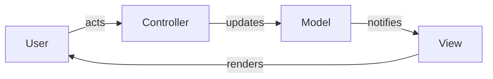

> **[Model-View-Controller](README.md)** › The Flow. Full reference list: [References](references.md).

## 2. The Flow

The three parts are only useful in motion. This page traces the cycle that connects them, then shows how
the well-known variants — MVP and [MVVM](../GLOSSARY.md#model-view-viewmodel-mvvm) — are the *same cycle* with one connection rewired.

---

### 2.1 The classic cycle

In Smalltalk-80 [MVC](../GLOSSARY.md#model-view-controller-mvc) the loop runs like this [Krasner & Pope 1988]:

The crucial detail is step 3–4: the [Model](../GLOSSARY.md#model) does **not** call the [View](../GLOSSARY.md#view). It emits a change notification, and
the [View](../GLOSSARY.md#view) — which subscribed to the [Model](../GLOSSARY.md#model) — pulls the new state and redraws. This is the **Observer**
pattern doing the synchronization, and it is what lets one [Model](../GLOSSARY.md#model) drive several [Views](../GLOSSARY.md#view) at once without
knowing any of them exist [Gamma et al. 1994].

Because the arrows only ever point one way around the loop, no part needs a back-reference to the part
that drives it. The [Model](../GLOSSARY.md#model) is the still center; the [View](../GLOSSARY.md#view) and [Controller](../GLOSSARY.md#controller) revolve around it.

---

### 2.2 Why the Observer link is the hard part

The elegance of classic [MVC](../GLOSSARY.md#model-view-controller-mvc) is also its friction. Wiring every [View](../GLOSSARY.md#view) to observe every relevant [Model](../GLOSSARY.md#model), and
keeping those subscriptions correct as screens come and go, is tedious and error-prone. Most of [MVC](../GLOSSARY.md#model-view-controller-mvc)'s
evolution is a search for a less manual way to keep [View](../GLOSSARY.md#view) and [Model](../GLOSSARY.md#model) in sync — which is exactly what the
variants below automate.

---

### 2.3 The variants: one rewired connection

The differences between [MVC](../GLOSSARY.md#model-view-controller-mvc), MVP, and [MVVM](../GLOSSARY.md#model-view-viewmodel-mvvm) are small and specific. Fowler's "GUI Architectures" is the
canonical map [Fowler]; the summary:

| Pattern | Who updates the [View](../GLOSSARY.md#view) | [View](../GLOSSARY.md#view) ↔ state coupling |
|---|---|---|
| **[MVC](../GLOSSARY.md#model-view-controller-mvc)** (classic) | the [View](../GLOSSARY.md#view) observes the [Model](../GLOSSARY.md#model) directly | [View](../GLOSSARY.md#view) reads the [Model](../GLOSSARY.md#model) |
| **MVP** ([Model](../GLOSSARY.md#model)-[View](../GLOSSARY.md#view)-Presenter) | the Presenter pushes state into a passive [View](../GLOSSARY.md#view) | [View](../GLOSSARY.md#view) is dumb; Presenter drives it |
| **[MVVM](../GLOSSARY.md#model-view-viewmodel-mvvm)** ([Model-View-ViewModel](../GLOSSARY.md#model-view-viewmodel-mvvm)) | a binding layer syncs [View](../GLOSSARY.md#view) ↔ [ViewModel](../GLOSSARY.md#viewmodel) automatically | declarative two-way binding |

- **MVP** [Potel 1996; Fowler]. The [Controller](../GLOSSARY.md#controller) grows into a **Presenter** that takes over updating the
  [View](../GLOSSARY.md#view). The [View](../GLOSSARY.md#view) becomes passive — it exposes setters and events, holds no logic, and is trivial to [fake](../GLOSSARY.md#fake)
  in a test. The Presenter, not the [View](../GLOSSARY.md#view), observes the [Model](../GLOSSARY.md#model).
- **[MVVM](../GLOSSARY.md#model-view-viewmodel-mvvm)** [Gossman 2005; Fowler's "[Presentation Model](../GLOSSARY.md#presentation-model)"]. A **[ViewModel](../GLOSSARY.md#viewmodel)** holds the [View](../GLOSSARY.md#view)'s state in
  display-ready form. A framework binding layer keeps [View](../GLOSSARY.md#view) and [ViewModel](../GLOSSARY.md#viewmodel) synchronized automatically, so no
  one writes the observer wiring by hand. This is the lineage modern frontend frameworks descend from —
  see [MVC on the Frontend](3-mvc-on-the-frontend.md), and the dedicated
  [MVVM guide](../model-view-viewmodel) for the pattern on its own terms.

All three keep the same [Model](../GLOSSARY.md#model) and the same separated-presentation principle. They differ only in how step
3–4 of the cycle — getting a [Model](../GLOSSARY.md#model) change onto the screen — is accomplished.

---

### 2.4 Server-side "MVC" is a different animal

When Rails or Spring say "[MVC](../GLOSSARY.md#model-view-controller-mvc)," the cycle is not the one above. There is no long-lived [View](../GLOSSARY.md#view) observing a
[Model](../GLOSSARY.md#model) in the user's session; instead a [Controller](../GLOSSARY.md#controller) handles a request, builds a [Model](../GLOSSARY.md#model), and renders a [View](../GLOSSARY.md#view)
(an HTML template) once per response [Fowler]. The names are borrowed, but the observer synchronization —
the heart of client-side [MVC](../GLOSSARY.md#model-view-controller-mvc) — is absent. Keep the two mental models separate, or the word "[Controller](../GLOSSARY.md#controller)"
will mean two incompatible things in the same conversation.

---

Next: **[MVC on the Frontend](3-mvc-on-the-frontend.md)** — why a Vue or React component is closer to
[MVVM](../GLOSSARY.md#model-view-viewmodel-mvvm) than to classic [MVC](../GLOSSARY.md#model-view-controller-mvc), and how to keep the separation honest anyway.
