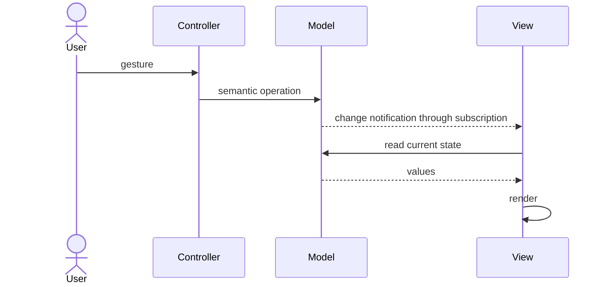

> **[Model-View-Controller](README.md)** › The Flow.

## 2. The Flow

An order screen shows **Pending**. The user clicks **Cancel**. The [Controller](../GLOSSARY.md#controller) interprets the click as a cancellation request, the [Model](../GLOSSARY.md#model) reflects the result, and the [View](../GLOSSARY.md#view) can refresh when it learns the represented information changed. That is the kind of interaction described by classic [MVC](../GLOSSARY.md#model-view-controller-mvc).

The diagram below shows **events and calls over time**, not which source files import which others. A change notification means “the represented information changed; refresh what you show,” not “the [Model](../GLOSSARY.md#model) must import a concrete UI component.”

### 2.1 The classic cycle

The [View](../GLOSSARY.md#view) knows how to read the [Model](../GLOSSARY.md#model); the [Controller](../GLOSSARY.md#controller) interprets the gesture. The [Model](../GLOSSARY.md#model) invokes registered listeners through an abstract notification mechanism, without naming concrete screens. It can have several observers. This is not an acyclic runtime pipeline: rendering reads back from the [Model](../GLOSSARY.md#model).

### 2.2 Why the Observer link is the hard part

Observation introduces lifetime and synchronization work: subscribe, perform an initial render, release the subscription, and avoid stale or redundant updates. A framework can perform some of that work, but architectural separation still requires an explicit owner for policy and screen behavior.

### 2.3 The variants change more than one connection

Fowler distinguishes several presentation approaches. They share separation goals but move responsibilities, rather than merely renaming identical objects.

| Approach | [View](../GLOSSARY.md#view) relationship | Input and synchronization |
| --- | --- | --- |
| Classic [MVC](../GLOSSARY.md#model-view-controller-mvc) | observes and reads [Model](../GLOSSARY.md#model) | [Controller](../GLOSSARY.md#controller) interprets input; [Model](../GLOSSARY.md#model) notifies |
| [Passive View](../GLOSSARY.md#passive-view) | no [Model](../GLOSSARY.md#model) access; driven through a view interface | [Presenter](../GLOSSARY.md#presenter)/[Controller](../GLOSSARY.md#controller) updates controls and interprets events |
| [Supervising Controller](../GLOSSARY.md#supervising-controller) | simple display binding can read [Model](../GLOSSARY.md#model) | [Controller](../GLOSSARY.md#controller) handles input and complex presentation updates |
| [Presentation Model](../GLOSSARY.md#presentation-model) | reads a screen-oriented state/behavior object | screen state is synchronized explicitly or through binding |
| [MVVM](../GLOSSARY.md#model-view-viewmodel-mvvm) | binds to a [ViewModel](../GLOSSARY.md#viewmodel)'s values/commands | binding plus commands; one-way or two-way depending on platform |

[MVP](../GLOSSARY.md#model-view-presenter-mvp) is an umbrella with historical variants, including passive and supervising arrangements. [Passive View](../GLOSSARY.md#passive-view) does not describe every [MVP](../GLOSSARY.md#model-view-presenter-mvp) implementation. [MVVM](../GLOSSARY.md#model-view-viewmodel-mvvm) does not require every value to have a two-way binding. Reactive rendering alone proves none of these role assignments.

### 2.4 Server-side "MVC" is a different animal

A web controller often receives one HTTP request, invokes application behavior, and selects a template or response. A server-rendered [View](../GLOSSARY.md#view) normally renders once rather than observing a long-lived interactive [Model](../GLOSSARY.md#model). Explain the actual request lifecycle instead of applying the Smalltalk cycle literally.

Next: **[MVC on the Frontend](3-mvc-on-the-frontend.md)** — intentional responsibility boundaries inside modern component frameworks.

## Sources

- [Reenskaug — Models, Views, Controllers (1979)](https://doi.org/10.5281/zenodo.3676092)
- [Fowler — GUI Architectures](https://martinfowler.com/eaaDev/uiArchs.html)
- [Fowler — Passive View](https://martinfowler.com/eaaDev/PassiveScreen.html)
- [Fowler — Supervising Controller](https://martinfowler.com/eaaDev/SupervisingPresenter.html)
- [Fowler — Presentation Model](https://martinfowler.com/eaaDev/PresentationModel.html)
