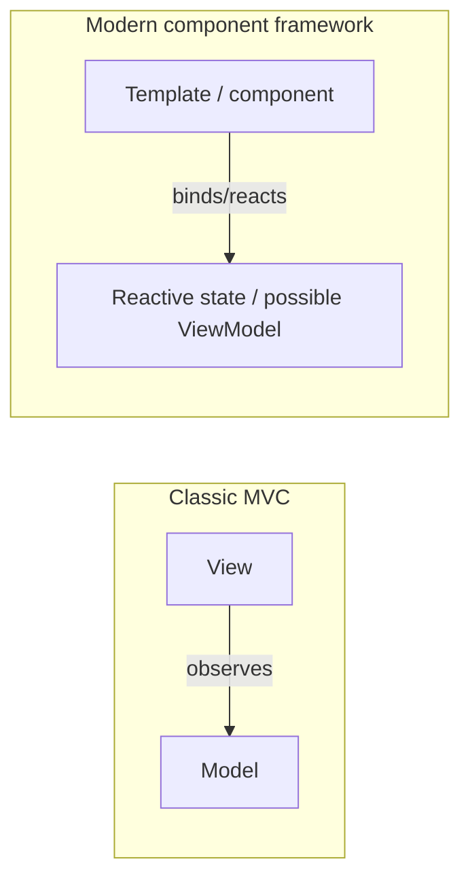
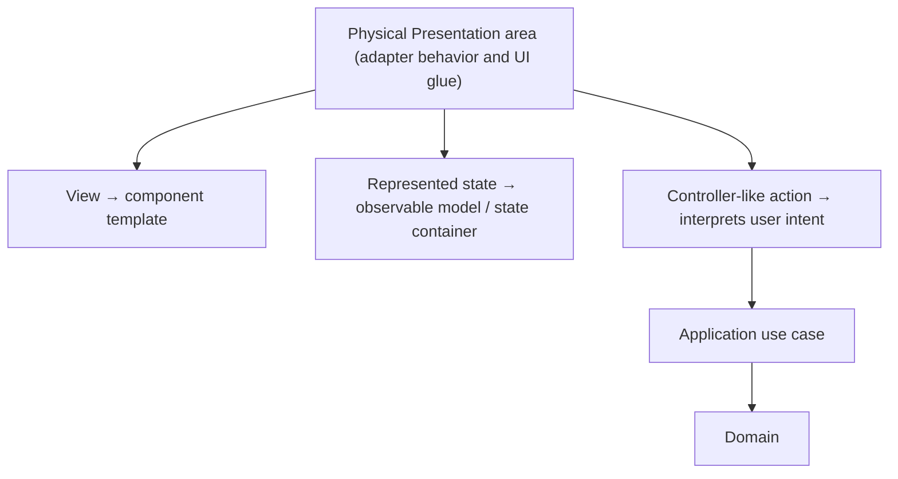

> **[Model-View-Controller](README.md)** › [MVC](../GLOSSARY.md#model-view-controller-mvc) on the Frontend. Full reference list: [References](references.md).

## 3. MVC on the Frontend

A React button can both display **Cancel** and handle its own click. That does not tell us whether the project follows classic [MVC](../GLOSSARY.md#model-view-controller-mvc): to answer that, we must identify who interprets the click, who owns the information being changed, and who updates the display.

Modern component frameworks are often described using [MVC](../GLOSSARY.md#model-view-controller-mvc)/[MVVM](../GLOSSARY.md#model-view-viewmodel-mvvm) vocabulary, but a framework does not choose one historical presentation pattern for the application. This page focuses on the useful distinction between rendering, interpreting user intent, and the application/model capabilities those interactions use.

---

### 3.1 Component frameworks do not automatically implement MVC or MVVM

Vue, React and Svelte provide reactive rendering mechanisms, so developers rarely reproduce the exact
observer/controller wiring of Smalltalk-era [MVC](../GLOSSARY.md#model-view-controller-mvc). That does **not** make those frameworks [MVVM](../GLOSSARY.md#model-view-viewmodel-mvvm) by default.
Reactivity is a mechanism; [MVC](../GLOSSARY.md#model-view-controller-mvc)/[MVVM](../GLOSSARY.md#model-view-viewmodel-mvvm) are responsibility patterns.

A project may intentionally implement [MVC](../GLOSSARY.md#model-view-controller-mvc)-like controllers, [MVVM](../GLOSSARY.md#model-view-viewmodel-mvvm)-like [ViewModels](../GLOSSARY.md#viewmodel), [Presentation Model](../GLOSSARY.md#presentation-model), or
a simpler component/state design on top of the same framework.

Use role names only when the responsibilities really match:

| Role | Possible frontend implementation |
|---|---|
| **[View](../GLOSSARY.md#view)** | component/template whose main job is rendering and forwarding intent |
| **[Controller](../GLOSSARY.md#controller)-like presentation action** | event/action [facade](../GLOSSARY.md#facade-pattern) that interprets a gesture |
| **[ViewModel](../GLOSSARY.md#viewmodel) / [Presentation Model](../GLOSSARY.md#presentation-model)** | hook/composable/[store](../GLOSSARY.md#store) [facade](../GLOSSARY.md#facade-pattern) that exposes view-oriented state and commands |
| **[Model](../GLOSSARY.md#model) side** | application/domain capabilities or another non-rendering model — not necessarily one object |

The same application does not need to use all four labels. Prefer the smallest vocabulary that makes
ownership clearer.

---

### 3.2 The failure mode: the fat component

[MVC](../GLOSSARY.md#model-view-controller-mvc)'s discipline matters most where frameworks make it easy to ignore. The dominant anti-pattern on the
frontend is the **fat component** — a single file that renders markup, holds business rules, *and* calls
the network. It has collapsed all three parts into one, losing every benefit of separation:

- the rules cannot be tested without mounting the UI;
- the same rule gets re-implemented in the next component that needs it;
- a design change risks breaking business behavior, because they share a file.

The fix is separated responsibilities: move authoritative business/application rules inward, keep
view-specific state in [Presentation](../GLOSSARY.md#presentation-layer), isolate technical I/O behind its proper boundary, and let the
component focus on rendering and forwarding intent. A read-only reactive component is not automatically [Passive View](../GLOSSARY.md#passive-view): that pattern excludes [Model](../GLOSSARY.md#model) access and uses an externally driven view interface. Choose the arrangement that exposes useful test boundaries for the actual feature.

---

### 3.3 How MVC sits inside Onion and Clean

[MVC](../GLOSSARY.md#model-view-controller-mvc) organizes the presentation tier; Onion and Clean organize the whole app. They compose cleanly:

When [MVC](../GLOSSARY.md#model-view-controller-mvc)-style presentation lives inside Clean/Onion, a controller-like action normally delegates
policy-bearing work to an **[Application](../GLOSSARY.md#application-layer) [use case](../GLOSSARY.md#use-case)** rather than embedding the rule itself. The UI may still
have local [Presentation](../GLOSSARY.md#presentation-layer) state; the [Domain](../GLOSSARY.md#domain)/[Application](../GLOSSARY.md#application-layer) boundaries remain independently defined.

Put plainly: use [MVC](../GLOSSARY.md#model-view-controller-mvc) terminology only where it improves the presentation design, and use Clean/Onion
boundaries to decide where application/domain policy and infrastructure belong.

---

Next: **[Testing in MVC](4-testing-in-mvc.md)** — why [separated presentation](../GLOSSARY.md#separated-presentation) is, above all, a testability
decision.
