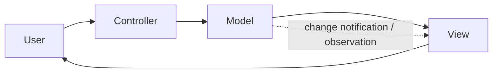
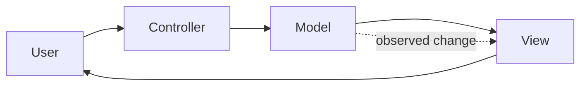
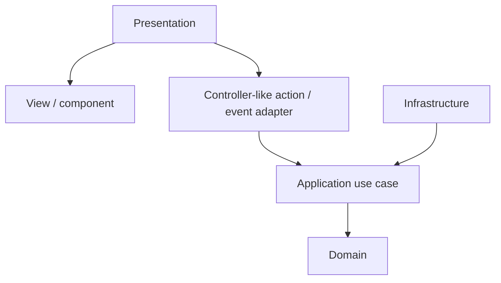
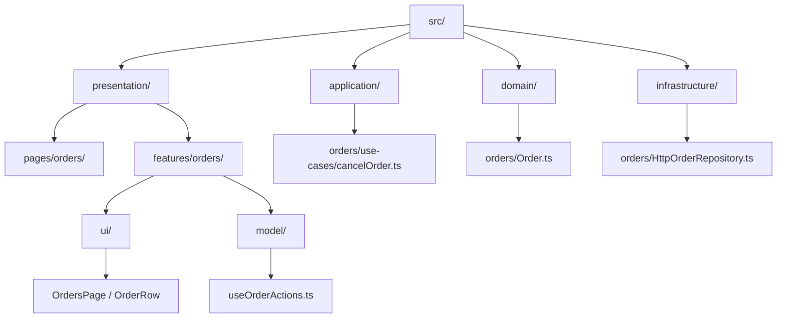
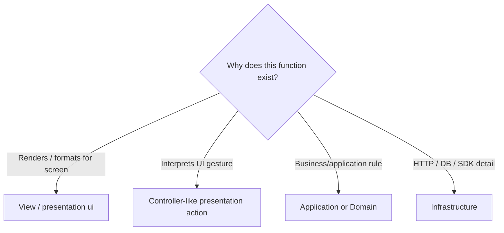
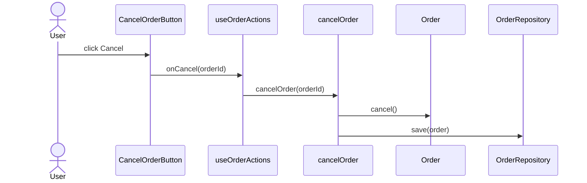

# Model-View-Controller (MVC)

> A presentation pattern with a long history and many incompatible modern interpretations.

← [Repository home](../README.md) · [Glossary](../GLOSSARY.md) · [Code placement](../foundations/code-placement.md) · [Naming](../conventions/naming-and-file-placement.md)

## 1. History and origin

Trygve Reenskaug developed the original [MVC](../GLOSSARY.md#model-view-controller-mvc) ideas while visiting Xerox PARC in **1978–1979**. His December 1979 note *[Models](../GLOSSARY.md#model)–[Views](../GLOSSARY.md#view)–[Controllers](../GLOSSARY.md#controller)* defined the terms [Model](../GLOSSARY.md#model), [View](../GLOSSARY.md#view) and [Controller](../GLOSSARY.md#controller) for interactive user interfaces.

Original report: https://doi.org/10.5281/zenodo.3676092

The label later evolved across Smalltalk, desktop frameworks, server-side web frameworks and JavaScript libraries. "[MVC](../GLOSSARY.md#model-view-controller-mvc)" therefore has to be interpreted in context rather than treated as one universal folder layout.

## 2. What problem does MVC solve?

The original problem is **[separated presentation](../GLOSSARY.md#separated-presentation)**: avoid mixing the information/behavior being represented with how it is displayed and how input is interpreted.

[MVC](../GLOSSARY.md#model-view-controller-mvc) does not define database architecture, application-layer [ports](../GLOSSARY.md#port), deployment topology or domain boundaries. It is primarily a presentation pattern.

## 3. When MVC is a strong fit

[MVC](../GLOSSARY.md#model-view-controller-mvc) is useful when:

- one [Model](../GLOSSARY.md#model) can drive multiple [Views](../GLOSSARY.md#view);
- interpretation of user input deserves an explicit owner;
- rendering and interaction logic are becoming entangled;
- the framework being used has a genuine [MVC](../GLOSSARY.md#model-view-controller-mvc) interaction model;
- independent testing of [Model](../GLOSSARY.md#model)/[Controller](../GLOSSARY.md#controller) behavior has value.

## 4. When MVC is a weak fit or poor label

Avoid forcing [MVC](../GLOSSARY.md#model-view-controller-mvc) onto every component framework.

It is a weak fit when:

- a framework deliberately combines input/rendering responsibilities differently;
- introducing explicit [Controllers](../GLOSSARY.md#controller) adds indirection without simplifying behavior;
- "[Model](../GLOSSARY.md#model)" is being used as a vague synonym for every non-UI file;
- the mapping requires redefining every [MVC](../GLOSSARY.md#model-view-controller-mvc) role merely to preserve the acronym.

Modern React/Vue/Svelte applications can apply separated-presentation ideas without literally reproducing classic Smalltalk [MVC](../GLOSSARY.md#model-view-controller-mvc).

## 5. Mental model and roles

| Role | Owns | Put here | Do not put here |
| --- | --- | --- | --- |
| [Model](../GLOSSARY.md#model) | represented information and behavior | state/rules independent from concrete UI | DOM/widget rendering, controller-specific input handling |
| [View](../GLOSSARY.md#view) | presentation of state | rendering, templates, display formatting, forwarding gestures | authoritative business/application policy |
| [Controller](../GLOSSARY.md#controller) | interpretation of input | deciding what a gesture means and invoking the relevant operation | rendering, persistent domain state, business [invariants](../GLOSSARY.md#invariant) |

### Important scope rule

In a Clean/Onion application:

- [MVC](../GLOSSARY.md#model-view-controller-mvc) [Model](../GLOSSARY.md#model) does **not** automatically mean `domain/`;
- [Controller](../GLOSSARY.md#controller) does **not** automatically mean an [Application](../GLOSSARY.md#application-layer) [use case](../GLOSSARY.md#use-case);
- [View](../GLOSSARY.md#view)/[Controller](../GLOSSARY.md#controller) responsibilities usually live in [Presentation](../GLOSSARY.md#presentation-layer);
- business/application policy can sit behind [MVC](../GLOSSARY.md#model-view-controller-mvc) in [Domain](../GLOSSARY.md#domain)/[Application](../GLOSSARY.md#application-layer).

[MVC](../GLOSSARY.md#model-view-controller-mvc) and Clean/Onion answer different questions.

## 6. Practical isolation inside a layered application

A modern layered mapping can look like this:

Why isolate the [Controller](../GLOSSARY.md#controller)-like [Presentation](../GLOSSARY.md#presentation-layer) action from the [use case](../GLOSSARY.md#use-case)?

- user gestures change with UI design;
- application operations should survive a UI redesign;
- business [invariants](../GLOSSARY.md#invariant) should survive both.

The [View](../GLOSSARY.md#view) should not call an HTTP client simply because the button lives nearby if the operation contains application policy that has its own boundary.

## 7. Physical structure

This repository uses [MVC](../GLOSSARY.md#model-view-controller-mvc) vocabulary **inside** the [Presentation](../GLOSSARY.md#presentation-layer) area of a layered application:

| Path | Owns | Why | Must not contain |
| --- | --- | --- | --- |
| `presentation/pages/` | route/screen composition | [Views](../GLOSSARY.md#view) need an outer composition point | domain [invariants](../GLOSSARY.md#invariant), HTTP [adapters](../GLOSSARY.md#adapter) |
| `presentation/features/<feature>/ui/` | feature rendering | colocates [View](../GLOSSARY.md#view) concerns with feature | application/domain policy |
| `presentation/features/<feature>/model/` | controller-like actions or presentation state | interprets UI intent without rendering | concrete DB/HTTP details |
| `application/` | policy-bearing operations | [MVC](../GLOSSARY.md#model-view-controller-mvc) should delegate non-presentation workflows inward | React/DOM/controller rendering |
| `domain/` | business truth | [Model](../GLOSSARY.md#model)-side business meaning stays framework independent | UI/controller framework mechanics |
| `infrastructure/` | technical I/O | external mechanisms remain replaceable | [View](../GLOSSARY.md#view) code |

This is one practical mapping, not a claim that classic [MVC](../GLOSSARY.md#model-view-controller-mvc) defined these folders.

## 8. Where does a new function go?

First decide whether the function is even an [MVC](../GLOSSARY.md#model-view-controller-mvc) [Presentation](../GLOSSARY.md#presentation-layer) concern:

| Function | Owner | Why |
| --- | --- | --- |
| `renderOrderRow()` | [View](../GLOSSARY.md#view) | display concern |
| `onCancelClick(orderId)` | [Controller](../GLOSSARY.md#controller)-like [Presentation](../GLOSSARY.md#presentation-layer) action | interprets gesture |
| `cancelOrder(orderId)` | [Application](../GLOSSARY.md#application-layer) | application operation |
| `Order.cancel()` | [Domain](../GLOSSARY.md#domain) | business [invariant](../GLOSSARY.md#invariant) |
| `requestCancelOrder()` HTTP implementation | [Infrastructure](../GLOSSARY.md#infrastructure) | transport detail |

Do not create a `controllers/` folder merely because a function receives an event. The folder should exist only if [Controller](../GLOSSARY.md#controller) is a stable responsibility in the chosen UI architecture.

## 9. Naming

Use **[Naming and File Placement Conventions](../conventions/naming-and-file-placement.md)**.

Recommended examples:

| Responsibility | Example |
| --- | --- |
| route [View](../GLOSSARY.md#view) | `OrdersPage.tsx` |
| feature [View](../GLOSSARY.md#view) | `OrderRow.tsx` |
| controller-like hook/[facade](../GLOSSARY.md#facade-pattern) | `useOrderActions.ts` |
| application operation | `cancelOrder.ts` |
| [domain entity](../GLOSSARY.md#domain-entity) | `Order.ts` |

Do not name an [Application](../GLOSSARY.md#application-layer) [use case](../GLOSSARY.md#use-case) `OrderController` merely because the UI invokes it. Names should expose the role actually owned by the file.

## 10. First feature end to end

Requirement:

> Clicking "Cancel" should cancel an order. Shipped orders must be rejected, and a valid cancellation must be persisted.

| Artifact | File | Role/owner | Why here |
| --- | --- | --- | --- |
| cancel button + display | `presentation/features/orders/ui/CancelOrderButton.tsx` | [View](../GLOSSARY.md#view) | rendering + gesture capture |
| gesture interpretation | `presentation/features/orders/model/useOrderActions.ts` | [Controller](../GLOSSARY.md#controller)-like [Presentation](../GLOSSARY.md#presentation-layer) | translates click into semantic operation |
| cancellation operation | `application/orders/use-cases/cancelOrder.ts` | [Application](../GLOSSARY.md#application-layer) | workflow policy |
| cancellation [invariant](../GLOSSARY.md#invariant) | `domain/orders/Order.ts` | [Domain](../GLOSSARY.md#domain) | business truth |
| persistence implementation | `infrastructure/orders/HttpOrderRepository.ts` | [Infrastructure](../GLOSSARY.md#infrastructure) | technical I/O |

The [Controller](../GLOSSARY.md#controller)-like [Presentation](../GLOSSARY.md#presentation-layer) code interprets the gesture. It does not become the owner of the business rule.

## 11. Testing

| Scope | Test | Why |
| --- | --- | --- |
| [Model](../GLOSSARY.md#model)/domain behavior | pure unit test | no UI required |
| [Controller](../GLOSSARY.md#controller)-like [Presentation](../GLOSSARY.md#presentation-layer) action | [fake](../GLOSSARY.md#fake) application operation | verifies gesture → semantic operation |
| [View](../GLOSSARY.md#view) | component/render test | verifies rendering and event forwarding |
| [Application](../GLOSSARY.md#application-layer)/[Infrastructure](../GLOSSARY.md#infrastructure) | test according to their architecture | outside [MVC](../GLOSSARY.md#model-view-controller-mvc)'s own scope |
| End-to-end | critical user flow | verifies complete integration |

See **[Testing in MVC](./4-testing-in-mvc.md)** for the deeper treatment.

## 12. Trade-offs and failure modes

Common decay modes:

- **fat [Controller](../GLOSSARY.md#controller)** — business rules accumulate in input handlers;
- **fat [View](../GLOSSARY.md#view)** — networking/workflow policy sits inside rendering code;
- **everything is [Model](../GLOSSARY.md#model)** — the term loses architectural meaning;
- **framework relabeling** — React/Vue/Svelte mechanics are renamed [MVC](../GLOSSARY.md#model-view-controller-mvc) without matching responsibilities;
- **duplicate orchestration** — [Controllers](../GLOSSARY.md#controller) reimplement [Application](../GLOSSARY.md#application-layer) [use cases](../GLOSSARY.md#use-case).

[MVC](../GLOSSARY.md#model-view-controller-mvc) is useful only when the role separation makes ownership clearer than the framework's simpler native structure.

## 13. Learning path

1. **[The Three Parts](./1-the-three-parts.md)**
2. **[The Flow](./2-the-flow.md)**
3. **[MVC on the Frontend](./3-mvc-on-the-frontend.md)**
4. **[Testing](./4-testing-in-mvc.md)**

For cross-layer placement, continue with **[Code Placement](../foundations/code-placement.md)** and one of the whole-application architecture guides.

## Sources

- Trygve Reenskaug, *[Models](../GLOSSARY.md#model)–[Views](../GLOSSARY.md#view)–[Controllers](../GLOSSARY.md#controller)* (1979): https://doi.org/10.5281/zenodo.3676092
- Martin Fowler, *GUI Architectures*: https://martinfowler.com/eaaDev/uiArchs.html
- Martin Fowler, *[Presentation Model](../GLOSSARY.md#presentation-model)*: https://martinfowler.com/eaaDev/PresentationModel.html
