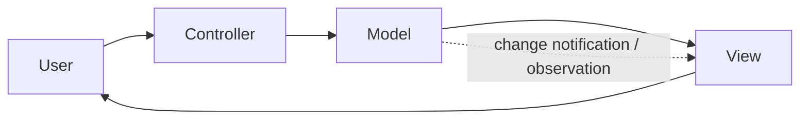
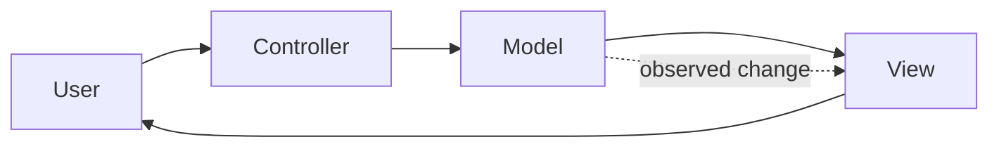
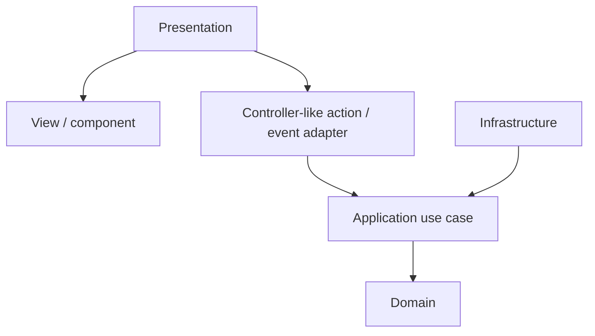
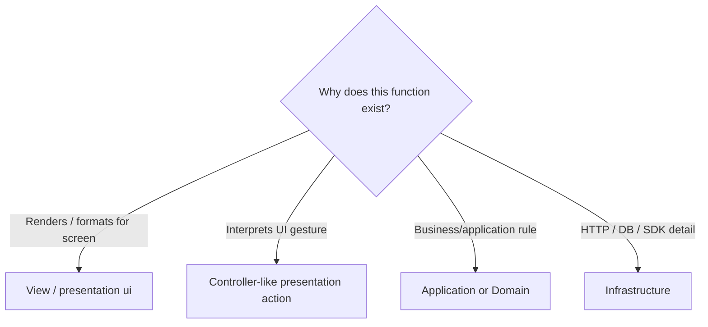
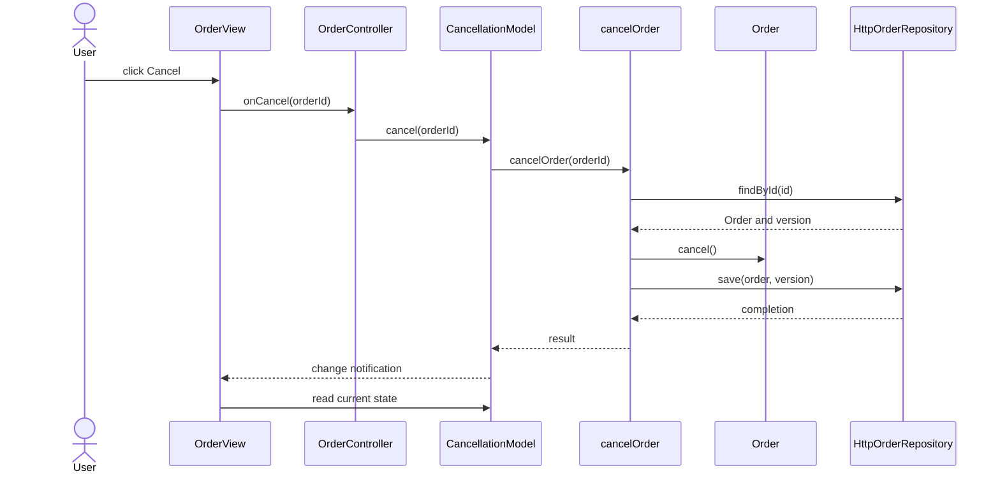

<a id="model-view-controller-for-the-frontend"></a>
<a id="read-this-first-mvc-is-a-different-kind-of-thing"></a>

# Model-View-Controller (MVC)

> A presentation pattern with a long history and many incompatible modern interpretations.

← [Repository home](../README.md) · [Glossary](../GLOSSARY.md) · [Code placement](../foundations/code-placement.md) · [Naming](../conventions/naming-and-file-placement.md)

## 1. History and origin

Trygve Reenskaug developed the original [MVC](../GLOSSARY.md#model-view-controller-mvc) ideas while visiting Xerox PARC in **1978–1979**. His December 1979 note *[Models](../GLOSSARY.md#model)–[Views](../GLOSSARY.md#view)–[Controllers](../GLOSSARY.md#controller)* defined the terms [Model](../GLOSSARY.md#model), [View](../GLOSSARY.md#view) and [Controller](../GLOSSARY.md#controller) for interactive user interfaces.

Original report: https://doi.org/10.5281/zenodo.3676092

The label later evolved across Smalltalk, desktop frameworks, server-side web frameworks and JavaScript libraries. "[MVC](../GLOSSARY.md#model-view-controller-mvc)" therefore has to be interpreted in context rather than treated as one universal folder layout.

## 2. What problem does MVC solve?

Consider an order screen with a **Cancel** button. The screen must show the current status, interpret the click as a cancellation request, and update the information after the operation. If all three jobs are buried in one UI handler, it becomes difficult to change the screen or test the behavior independently.

In classic [MVC](../GLOSSARY.md#model-view-controller-mvc), the **[Model](../GLOSSARY.md#model)** represents the relevant information and behavior, the **[View](../GLOSSARY.md#view)** displays it, and the **[Controller](../GLOSSARY.md#controller)** interprets the user's action. In a classic interactive implementation, the displayed screen can observe changes to the represented information and redraw. This separation is called **[separated presentation](../GLOSSARY.md#separated-presentation)**. It is about UI responsibilities, not a mandatory three-folder structure for an entire backend.

In the diagram, follow the user's action through the [Controller](../GLOSSARY.md#controller) and [Model](../GLOSSARY.md#model). The dotted connection indicates that the [View](../GLOSSARY.md#view) can be notified when the represented information changes; the diagram is a conceptual interaction, not a source-import policy.



[MVC](../GLOSSARY.md#model-view-controller-mvc) does not define database architecture, application-layer [ports](../GLOSSARY.md#port), deployment topology or domain boundaries. It is primarily a presentation pattern.

## 3. When MVC is a strong fit

[MVC](../GLOSSARY.md#model-view-controller-mvc) is useful when:

- one [Model](../GLOSSARY.md#model) can drive multiple [Views](../GLOSSARY.md#view);
- interpretation of user input deserves an explicit owner;
- rendering and interaction logic are becoming entangled;
- the framework being used has a genuine [MVC](../GLOSSARY.md#model-view-controller-mvc) interaction model;
- independent testing of [Model](../GLOSSARY.md#model)/[Controller](../GLOSSARY.md#controller) behavior has value.

## 4. When MVC is a weak fit or poor label

Avoid forcing [MVC](../GLOSSARY.md#model-view-controller-mvc) onto every component framework.

It is a weak fit when:

- a framework deliberately combines input/rendering responsibilities differently;
- introducing explicit [Controllers](../GLOSSARY.md#controller) adds indirection without simplifying behavior;
- "[Model](../GLOSSARY.md#model)" is being used as a vague synonym for every non-UI file;
- the mapping requires redefining every [MVC](../GLOSSARY.md#model-view-controller-mvc) role merely to preserve the acronym.

Modern React/Vue/Svelte applications can apply separated-presentation ideas without literally reproducing classic Smalltalk [MVC](../GLOSSARY.md#model-view-controller-mvc).

<a id="the-triad-in-one-picture"></a>

## 5. Mental model and roles



| Role | Owns | Put here | Do not put here |
| --- | --- | --- | --- |
| [Model](../GLOSSARY.md#model) | represented information and behavior | state/rules independent from concrete UI | DOM/widget rendering, controller-specific input handling |
| [View](../GLOSSARY.md#view) | presentation of state | rendering, templates, display formatting, forwarding gestures | authoritative business/application policy |
| [Controller](../GLOSSARY.md#controller) | interpretation of input | deciding what a gesture means and invoking the relevant operation | rendering, persistent domain state, business [invariants](../GLOSSARY.md#invariant) |

<a id="a-warning-about-the-acronym"></a>

### Important scope rule

In a Clean/Onion application:

- [MVC](../GLOSSARY.md#model-view-controller-mvc) [Model](../GLOSSARY.md#model) does **not** automatically mean `domain/`;
- [Controller](../GLOSSARY.md#controller) does **not** automatically mean an [Application](../GLOSSARY.md#application-layer) [use case](../GLOSSARY.md#use-case);
- [View](../GLOSSARY.md#view)/[Controller](../GLOSSARY.md#controller) responsibilities usually live in [Presentation](../GLOSSARY.md#presentation-layer);
- business/application policy can sit behind [MVC](../GLOSSARY.md#model-view-controller-mvc) in [Domain](../GLOSSARY.md#domain)/[Application](../GLOSSARY.md#application-layer).

[MVC](../GLOSSARY.md#model-view-controller-mvc) and Clean/Onion answer different questions.

## 6. Practical isolation inside a layered application

A modern layered mapping can look like this:



Why isolate the [Controller](../GLOSSARY.md#controller)-like [Presentation](../GLOSSARY.md#presentation-layer) action from the [use case](../GLOSSARY.md#use-case)?

- user gestures change with UI design;
- application operations should survive a UI redesign;
- business [invariants](../GLOSSARY.md#invariant) should survive both.

The [View](../GLOSSARY.md#view) should not call an HTTP client simply because the button lives nearby if the operation contains application policy that has its own boundary.

## 7. Physical structure

Keep the canonical `domain/`, `application/`, `infrastructure/`, `presentation/` and `composition/` layers. [MVC](../GLOSSARY.md#model-view-controller-mvc) roles describe how [Presentation](../GLOSSARY.md#presentation-layer) interprets gestures and renders the represented data; they do not introduce another top-level architecture.

| Exact file under `src/` | Responsibility | Keep out |
| --- | --- | --- |
| `presentation/orders/pages/OrdersPage.tsx` | Screen composition | Business rules and HTTP implementations |
| `presentation/orders/components/OrderRow/OrderRow.tsx` | [View](../GLOSSARY.md#view) rendering/gesture capture | Persistence details |
| `presentation/orders/hooks/useOrderActions.ts` | [Controller](../GLOSSARY.md#controller)-like action that interprets UI intent | Authoritative cancellation validity |
| `presentation/orders/state/orders.state.ts` | [View](../GLOSSARY.md#view)/interaction state, when shared | [Domain](../GLOSSARY.md#domain) [invariants](../GLOSSARY.md#invariant) |
| `application/orders/use-cases/cancelOrder.ts` | Operation orchestration | React |
| `domain/orders/Order.ts` | Business rule | [View](../GLOSSARY.md#view) controls |
| `infrastructure/http/orders/adapters/HttpOrderRepository.ts` | Outbound HTTP implementation | Rendering |
| `composition/bootstrap.ts` | Dependency assembly | Business decisions |

[Presentation](../GLOSSARY.md#presentation-layer) begins with the same capability-owned pages/components/hooks/state convention as the [canonical frontend guide](../frontend/README.md). These paths are handbook conventions, not a filesystem prescribed by classic [MVC](../GLOSSARY.md#model-view-controller-mvc). The [backend guide](../backend/README.md) separately places incoming HTTP/CLI code.

## 8. Where does a new function go?

First decide whether the function is even an [MVC](../GLOSSARY.md#model-view-controller-mvc) [Presentation](../GLOSSARY.md#presentation-layer) concern:



| Function | Owner | Why |
| --- | --- | --- |
| `renderOrderRow()` | [View](../GLOSSARY.md#view) | display concern |
| `onCancelClick(orderId)` | [Controller](../GLOSSARY.md#controller)-like [Presentation](../GLOSSARY.md#presentation-layer) action | interprets gesture |
| `cancelOrder(orderId)` | [Application](../GLOSSARY.md#application-layer) | application operation |
| `Order.cancel()` | [Domain](../GLOSSARY.md#domain) | business [invariant](../GLOSSARY.md#invariant) |
| `requestCancelOrder()` HTTP implementation | [Infrastructure](../GLOSSARY.md#infrastructure) | transport detail |

Do not create a `controllers/` folder merely because a function receives an event. The folder should exist only if [Controller](../GLOSSARY.md#controller) is a stable responsibility in the chosen UI architecture.

Types and helpers follow the same ownership rule:

| Artifact | Owner | Reason |
| --- | --- | --- |
| component props, focus helper | [Presentation](../GLOSSARY.md#presentation-layer) UI | concrete control needs |
| view state, display formatter, [facade](../GLOSSARY.md#facade-pattern) hook | [Presentation model](../GLOSSARY.md#presentation-model)/controller boundary | screen-oriented behavior |
| command/result and [port](../GLOSSARY.md#port) | [Application](../GLOSSARY.md#application-layer) | operation contract |
| business value and [invariant](../GLOSSARY.md#invariant) helper | [Domain](../GLOSSARY.md#domain) | authoritative business meaning |
| API [DTO](../GLOSSARY.md#data-transfer-object-dto) and [DTO](../GLOSSARY.md#data-transfer-object-dto) [mapper](../GLOSSARY.md#mapper) | [Infrastructure](../GLOSSARY.md#infrastructure) | external representation |
| concrete construction | Composition | executable assembly |

Source references may point from [View](../GLOSSARY.md#view)/[Controller](../GLOSSARY.md#controller) or [ViewModel](../GLOSSARY.md#viewmodel) to their inward model/application contract. The represented [Model](../GLOSSARY.md#model) must not name concrete controls. In the strict layering convention here, [Presentation](../GLOSSARY.md#presentation-layer) cannot import [Infrastructure](../GLOSSARY.md#infrastructure) or a container; [type-only imports](../GLOSSARY.md#type-only-import) count. Runtime state notifications are distinct from these source references.

## 9. Naming

Use **[Naming and File Placement Conventions](../conventions/naming-and-file-placement.md)**.

Recommended examples:

| Responsibility | Example |
| --- | --- |
| route [View](../GLOSSARY.md#view) | `OrdersPage.tsx` |
| feature [View](../GLOSSARY.md#view) | `OrderRow.tsx` |
| controller-like hook/[facade](../GLOSSARY.md#facade-pattern) | `useOrderActions.ts` |
| application operation | `cancelOrder.ts` |
| [domain entity](../GLOSSARY.md#domain-entity) | `Order.ts` |

Do not name an [Application](../GLOSSARY.md#application-layer) [use case](../GLOSSARY.md#use-case) `OrderController` merely because the UI invokes it. Names should expose the role actually owned by the file.

## 10. First feature end to end

Requirement:

> Clicking "Cancel" should cancel an order. Shipped orders must be rejected, and a valid cancellation must be persisted.

| Artifact | File | Role/owner | Why here |
| --- | --- | --- | --- |
| cancel button + display | `presentation/orders/components/CancelOrderButton/CancelOrderButton.tsx` | [View](../GLOSSARY.md#view) | rendering + gesture capture |
| gesture interpretation | `presentation/orders/hooks/useOrderActions.ts` | [Controller](../GLOSSARY.md#controller)-like [Presentation](../GLOSSARY.md#presentation-layer) | translates click into semantic operation |
| cancellation operation | `application/orders/use-cases/cancelOrder.ts` | [Application](../GLOSSARY.md#application-layer) | workflow policy |
| cancellation [invariant](../GLOSSARY.md#invariant) | `domain/orders/Order.ts` | [Domain](../GLOSSARY.md#domain) | business truth |
| persistence implementation | `infrastructure/http/orders/adapters/HttpOrderRepository.ts` | [Infrastructure](../GLOSSARY.md#infrastructure) | technical I/O |



The [Controller](../GLOSSARY.md#controller)-like [Presentation](../GLOSSARY.md#presentation-layer) code interprets the gesture. It does not become the owner of the business rule.

The table above gives a possible React adaptation. The implementation below uses DOM controls with an observing [Model](../GLOSSARY.md#model) and explicit [Controller](../GLOSSARY.md#controller), so its filenames differ deliberately.

### Complete client implementation

**Shared example ownership.** The [Domain](../GLOSSARY.md#domain), [Application](../GLOSSARY.md#application-layer) and [Infrastructure](../GLOSSARY.md#infrastructure) blocks in this complete example are synchronized from [the canonical order-cancellation walkthrough](../clean-architecture/4-building-a-feature.md). Edit the canonical version and run `npm run sync:examples`; `npm run check:examples` rejects drift. This page owns its presentation-pattern-specific interaction and composition example.

This example chooses an observing [View](../GLOSSARY.md#view): it reads represented state, the [Controller](../GLOSSARY.md#controller) interprets input, and the [Model](../GLOSSARY.md#model) delegates cancellation to [Application](../GLOSSARY.md#application-layer). The small wrapper contains represented operation state; it is not the whole [Domain](../GLOSSARY.md#domain) layer.

The business rule belongs in `domain/orders/Order.ts`; the operation, result, persistence failure and [port](../GLOSSARY.md#port) belong in `application/orders/use-cases/cancelOrder.ts`. [DTO](../GLOSSARY.md#data-transfer-object-dto) validation/mapping and the concrete repository belong in `infrastructure/http/orders/adapters/HttpOrderRepository.ts`. [Presentation](../GLOSSARY.md#presentation-layer) owns gestures and feedback; `composition/bootstrap.ts` selects implementations. These are documentation conventions. A small file may contain cohesive contracts and functions; split them when ownership or change pressure requires it.

```ts
// domain/orders/Order.ts
export const ORDER_STATUSES = ['pending', 'shipped', 'cancelled'] as const
export type OrderStatus = (typeof ORDER_STATUSES)[number]

export function isOrderStatus(value: unknown): value is OrderStatus {
  return ORDER_STATUSES.some(status => status === value)
}

export class ShippedOrderCannotBeCancelled extends Error {}
export class Order {
  readonly id: string
  #status: OrderStatus
  constructor(id: string, status: OrderStatus) { this.id = id; this.#status = status }
  get status(): OrderStatus { return this.#status }
  cancel(): void {
    if (this.#status === 'shipped') throw new ShippedOrderCannotBeCancelled()
    this.#status = 'cancelled'
  }
}
```

```ts
// application/orders/use-cases/cancelOrder.ts
import { Order, ShippedOrderCannotBeCancelled } from '@/domain/orders/Order'

export interface OrderRepository {
  findById(id: string): Promise<{ order: Order; version: string } | null>
  save(order: Order, expectedVersion: string): Promise<void>
}
export type CancelResult =
  | { ok: true; status: 'cancelled' }
  | { ok: false; reason: 'not-found' | 'shipped' | 'conflict' | 'unavailable' }
export type CancelOrder = (id: string) => Promise<CancelResult>
export class PersistenceFailure extends Error {
  readonly reason: 'conflict' | 'unavailable'
  constructor(reason: 'conflict' | 'unavailable') { super(reason); this.reason = reason }
}
export function makeCancelOrder(orders: OrderRepository): CancelOrder {
  return async id => {
    try {
      const loaded = await orders.findById(id)
      if (!loaded) return { ok: false, reason: 'not-found' }
      loaded.order.cancel()
      await orders.save(loaded.order, loaded.version)
      return { ok: true, status: 'cancelled' }
    } catch (error) {
      if (error instanceof ShippedOrderCannotBeCancelled) return { ok: false, reason: 'shipped' }
      if (error instanceof PersistenceFailure) return { ok: false, reason: error.reason }
      throw error // programming defects are not normal business outcomes
    }
  }
}
```

```ts
// infrastructure/http/orders/adapters/HttpOrderRepository.ts
import { Order, isOrderStatus, type OrderStatus } from '@/domain/orders/Order'
import { PersistenceFailure, type OrderRepository } from '@/application/orders/use-cases/cancelOrder'

// Adapter-owned transport contract. A concrete fetch driver implements it.
export interface OrderTransport {
  get(path: string): Promise<{ data: unknown; version: string } | null>
  put(path: string, data: unknown, version: string): Promise<void>
}
type ApiOrderDto = { id: string; status: string } // external wire shape
function parseOrderDto(data: unknown): { id: string; status: OrderStatus } {
  if (typeof data !== 'object' || data === null) throw new PersistenceFailure('unavailable')
  const dto = data as Record<string, unknown>
  if (typeof dto.id !== 'string' || !isOrderStatus(dto.status)) {
    throw new PersistenceFailure('unavailable')
  }
  return { id: dto.id, status: dto.status }
}
function toOrderDto(order: Order): ApiOrderDto { return { id: order.id, status: order.status } }

export class HttpOrderRepository implements OrderRepository {
  readonly #transport: OrderTransport
  constructor(transport: OrderTransport) { this.#transport = transport }
  async findById(id: string) {
    const response = await this.#transport.get('/orders/' + encodeURIComponent(id))
    if (!response) return null
    const dto = parseOrderDto(response.data)
    if (dto.id !== id) throw new PersistenceFailure('unavailable')
    return { order: new Order(dto.id, dto.status), version: response.version }
  }
  async save(order: Order, expectedVersion: string): Promise<void> {
    await this.#transport.put('/orders/' + encodeURIComponent(order.id), toOrderDto(order), expectedVersion)
  }
}
```

The external response is treated as `unknown` until its fields are checked. The [adapter](../GLOSSARY.md#adapter) owns the transport shape (`id` and response parsing), but reuses `isOrderStatus` from [Domain](../GLOSSARY.md#domain) for valid business values. `OrderStatus` and its runtime checker are derived from the same `ORDER_STATUSES` definition; this HTTP implementation must not maintain another status list.

```ts
// presentation/orders/state/CancellationModel.ts
import type { CancelOrder } from '@/application/orders/use-cases/cancelOrder'
export class CancellationModel {
  busy = false
  message = ''
  readonly #cancelOrder: CancelOrder
  readonly #listeners = new Set<() => void>()
  constructor(cancelOrder: CancelOrder) { this.#cancelOrder = cancelOrder }
  subscribe(listener: () => void) {
    this.#listeners.add(listener)
    return () => { this.#listeners.delete(listener) }
  }
  #changed() { for (const listener of this.#listeners) listener() }
  async cancel(id: string) {
    if (this.busy) return
    this.busy = true; this.message = ''; this.#changed()
    try {
      const result = await this.#cancelOrder(id)
      this.message = result.ok ? 'Cancelled' : 'Cannot cancel: ' + result.reason
    } catch { this.message = 'Unexpected failure' }
    finally { this.busy = false; this.#changed() }
  }
}
```

```ts
// presentation/orders/components/OrderView/OrderController.ts
import type { CancellationModel } from '@/presentation/orders/state/CancellationModel'
export function makeOrderController(model: CancellationModel) {
  return { onCancel: (id: string) => model.cancel(id) }
}
```

```ts
// presentation/orders/components/OrderView/OrderView.ts
import type { CancellationModel } from '@/presentation/orders/state/CancellationModel'
export function mountOrderView(root: HTMLElement, id: string, model: CancellationModel, controller: { onCancel(id: string): Promise<void> }) {
  const button = document.createElement('button')
  button.textContent = 'Cancel order'
  const feedback = document.createElement('p')
  feedback.setAttribute('role', 'status')
  root.append(button, feedback)
  const render = () => {
    button.disabled = model.busy
    feedback.textContent = model.busy ? 'Cancelling…' : model.message
  }
  const onClick = () => { void controller.onCancel(id) }
  const unsubscribe = model.subscribe(render)
  button.addEventListener('click', onClick)
  render()
  return () => {
    unsubscribe(); button.removeEventListener('click', onClick)
    button.remove(); feedback.remove()
  }
}
```

```ts
// composition/bootstrap.ts
import { makeCancelOrder, PersistenceFailure } from '@/application/orders/use-cases/cancelOrder'
import { HttpOrderRepository, type OrderTransport } from '@/infrastructure/http/orders/adapters/HttpOrderRepository'
import { CancellationModel } from '@/presentation/orders/state/CancellationModel'
import { makeOrderController } from '@/presentation/orders/components/OrderView/OrderController'
import { mountOrderView } from '@/presentation/orders/components/OrderView/OrderView'

async function request(path: string, init?: RequestInit): Promise<Response> {
  try { return await fetch(path, init) }
  catch { throw new PersistenceFailure('unavailable') }
}
const transport: OrderTransport = {
  async get(path) {
    const response = await request(path)
    if (response.status === 404) return null
    const version = response.headers.get('ETag')
    if (!response.ok || !version) throw new PersistenceFailure('unavailable')
    try { return { data: await response.json(), version } }
    catch { throw new PersistenceFailure('unavailable') }
  },
  async put(path, data, version) {
    const response = await request(path, {
      method: 'PUT',
      headers: { 'Content-Type': 'application/json', 'If-Match': version },
      body: JSON.stringify(data),
    })
    if (response.status === 409 || response.status === 412) throw new PersistenceFailure('conflict')
    if (!response.ok) throw new PersistenceFailure('unavailable')
  },
}
export function startOrders(root: HTMLElement, orderId: string) {
  const cancelOrder = makeCancelOrder(new HttpOrderRepository(transport))
  const model = new CancellationModel(cancelOrder)
  return mountOrderView(root, orderId, model, makeOrderController(model))
}
```

Call `startOrders(root, 'order-1')` and retain cleanup. The [View](../GLOSSARY.md#view) renders initially, observes changes and unsubscribes. The [Controller](../GLOSSARY.md#controller) does not compute the business [invariant](../GLOSSARY.md#invariant); the application operation invokes [Domain](../GLOSSARY.md#domain).

The API must return a strong ETag on GET and atomically enforce `If-Match` on PUT. It must authorize cancellation and reject shipped orders using authoritative current state; client validation alone cannot guarantee this under concurrent writes. This is a complete client feature, not a backend implementation. See [the expanded walkthrough](../clean-architecture/4-building-a-feature.md) for boundary explanations and limits.

## 11. Testing

| Scope | Test | Why |
| --- | --- | --- |
| [Model](../GLOSSARY.md#model)/domain behavior | pure unit test | no UI required |
| [Controller](../GLOSSARY.md#controller)-like [Presentation](../GLOSSARY.md#presentation-layer) action | [fake](../GLOSSARY.md#fake) application operation | verifies gesture → semantic operation |
| [View](../GLOSSARY.md#view) | component/render test | verifies rendering and event forwarding |
| [Application](../GLOSSARY.md#application-layer)/[Infrastructure](../GLOSSARY.md#infrastructure) | test according to their architecture | outside [MVC](../GLOSSARY.md#model-view-controller-mvc)'s own scope |
| End-to-end | critical user flow | verifies complete integration |

See **[Testing in MVC](./4-testing-in-mvc.md)** for the deeper treatment.

## 12. Trade-offs and failure modes

Common decay modes:

- **fat [Controller](../GLOSSARY.md#controller)** — business rules accumulate in input handlers;
- **fat [View](../GLOSSARY.md#view)** — networking/workflow policy sits inside rendering code;
- **everything is [Model](../GLOSSARY.md#model)** — the term loses architectural meaning;
- **framework relabeling** — React/Vue/Svelte mechanics are renamed [MVC](../GLOSSARY.md#model-view-controller-mvc) without matching responsibilities;
- **duplicate orchestration** — [Controllers](../GLOSSARY.md#controller) reimplement [Application](../GLOSSARY.md#application-layer) [use cases](../GLOSSARY.md#use-case).

[MVC](../GLOSSARY.md#model-view-controller-mvc) is useful only when the role separation makes ownership clearer than the framework's simpler native structure.

<a id="contents"></a>

<a id="where-to-start"></a>

## 13. Learning path

1. **[The Three Parts](./1-the-three-parts.md)**
2. **[The Flow](./2-the-flow.md)**
3. **[MVC on the Frontend](./3-mvc-on-the-frontend.md)**
4. **[Testing](./4-testing-in-mvc.md)**

For cross-layer placement, continue with **[Code Placement](../foundations/code-placement.md)** and one of the whole-application architecture guides.

## Sources

- Trygve Reenskaug, *[Models](../GLOSSARY.md#model)–[Views](../GLOSSARY.md#view)–[Controllers](../GLOSSARY.md#controller)* (1979): https://doi.org/10.5281/zenodo.3676092
- Martin Fowler, *GUI Architectures*: https://martinfowler.com/eaaDev/uiArchs.html
- Martin Fowler, *[Presentation Model](../GLOSSARY.md#presentation-model)*: https://martinfowler.com/eaaDev/PresentationModel.html
