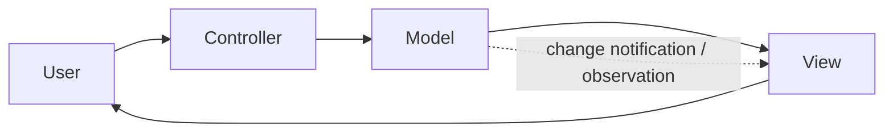
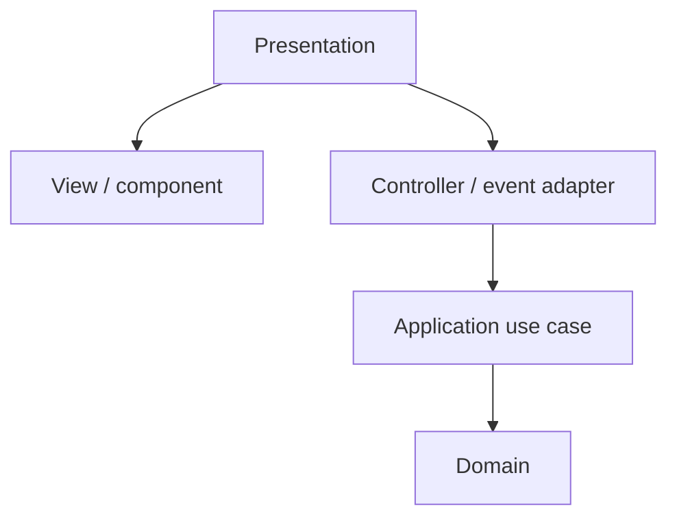
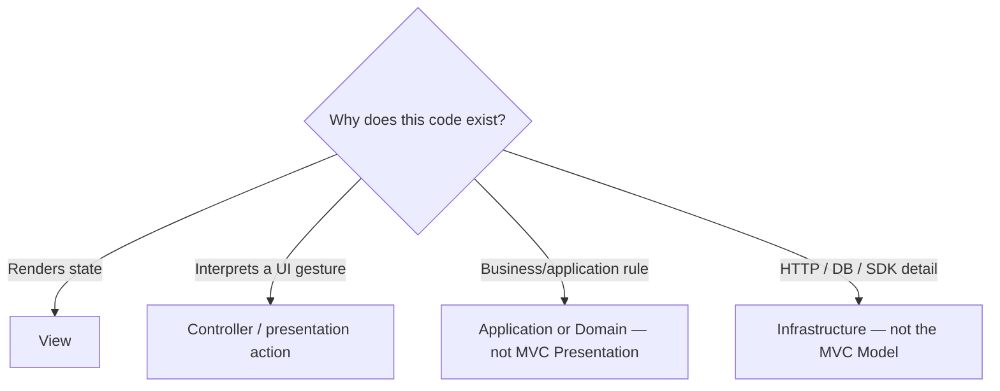

# Model-View-Controller (MVC)

> A presentation pattern with a long history and many incompatible modern interpretations.

← [Repository home](../README.md) · [Glossary](../GLOSSARY.md) · [Naming](../conventions/naming-and-file-placement.md)

## 1. History

Trygve Reenskaug developed the original [MVC](../GLOSSARY.md#model-view-controller-mvc) ideas while visiting Xerox PARC in **1978–1979**. His December 1979 note *[Models](../GLOSSARY.md#model)–[Views](../GLOSSARY.md#view)–[Controllers](../GLOSSARY.md#controller)* defined [Model](../GLOSSARY.md#model), [View](../GLOSSARY.md#view) and [Controller](../GLOSSARY.md#controller) in the context of interactive user interfaces.

Original report: https://doi.org/10.5281/zenodo.3676092

The term later evolved across Smalltalk, desktop frameworks, server-side web frameworks and JavaScript libraries. Therefore "[MVC](../GLOSSARY.md#model-view-controller-mvc)" must always be interpreted in context.

## 2. What problem does MVC solve?

[MVC](../GLOSSARY.md#model-view-controller-mvc) separates:

- the information/behavior being represented;
- how it is presented;
- how user input is interpreted.

## 3. When it fits

[MVC](../GLOSSARY.md#model-view-controller-mvc) is useful when:

- one [Model](../GLOSSARY.md#model) can have multiple [Views](../GLOSSARY.md#view);
- input interpretation deserves separation from rendering;
- a framework explicitly follows an [MVC](../GLOSSARY.md#model-view-controller-mvc)-style interaction model;
- presentation responsibilities are becoming entangled.

## 4. When it is a poor label

Avoid forcing "[MVC](../GLOSSARY.md#model-view-controller-mvc)" onto every component framework.

Modern React/Vue/Svelte component architectures combine responsibilities differently from classic Smalltalk [MVC](../GLOSSARY.md#model-view-controller-mvc). Server-side "[MVC](../GLOSSARY.md#model-view-controller-mvc)" frameworks also use the term differently.

If the mapping requires redefining every role, use the actual framework architecture instead of preserving the acronym.

## 5. The three roles

| Role | Owns | Should not own |
| --- | --- | --- |
| [Model](../GLOSSARY.md#model) | represented data/behavior | concrete [View](../GLOSSARY.md#view)/[Controller](../GLOSSARY.md#controller) mechanics |
| [View](../GLOSSARY.md#view) | presentation of [Model](../GLOSSARY.md#model)/state | business/application policy |
| [Controller](../GLOSSARY.md#controller) | interpretation of user input | rendering or persistent business state |

In a Clean/Onion system, the [MVC](../GLOSSARY.md#model-view-controller-mvc) [Model](../GLOSSARY.md#model) does **not** automatically equal the [Domain](../GLOSSARY.md#domain) layer. [Presentation](../GLOSSARY.md#presentation-layer) patterns and whole-application architectures operate at different scales.

## 6. A practical layered mapping

A controller can translate user intent into an [Application](../GLOSSARY.md#application-layer) command rather than directly embedding business policy.

## 7. File placement example

| Artifact | Example path | Reason |
| --- | --- | --- |
| route/page [View](../GLOSSARY.md#view) | `presentation/pages/orders/OrdersPage.tsx` | route rendering |
| feature controller/event [adapter](../GLOSSARY.md#adapter) | `presentation/features/orders/model/useOrderActions.ts` | interprets UI intent |
| business operation | `application/orders/use-cases/cancelOrder.ts` | application policy |
| business [invariant](../GLOSSARY.md#invariant) | `domain/orders/Order.ts` | domain truth |

Use [Code Placement](../foundations/code-placement.md) for cross-layer placement.

## 8. Where does a new function go?

[MVC](../GLOSSARY.md#model-view-controller-mvc) only classifies **presentation roles**. In a layered application, decide the architectural owner first and the [MVC](../GLOSSARY.md#model-view-controller-mvc) role second.

Examples:

| Code | Owner |
| --- | --- |
| render an order row | [View](../GLOSSARY.md#view) |
| turn a click into `cancelOrder(id)` | [Controller](../GLOSSARY.md#controller)/presentation action |
| reject cancellation after shipment | [Domain](../GLOSSARY.md#domain)/[Application](../GLOSSARY.md#application-layer) |
| perform the HTTP request | [Infrastructure](../GLOSSARY.md#infrastructure) |

## 9. Naming

Before creating a file, use **[Naming and File Placement Conventions](../conventions/naming-and-file-placement.md)**.

Important distinction:

- `OrdersPage.tsx` describes a [View](../GLOSSARY.md#view);
- `useOrderActions.ts` can act as a presentation controller/action facade;
- `cancelOrder.ts` is an application [use case](../GLOSSARY.md#use-case), not a [Controller](../GLOSSARY.md#controller) merely because a button invokes it.

## 10. Learning path

1. [The Three Parts](./1-the-three-parts.md)
2. [The Flow](./2-the-flow.md)
3. [MVC on the Frontend](./3-mvc-on-the-frontend.md)
4. [Testing](./4-testing-in-mvc.md)

## Sources

- Trygve Reenskaug, *[Models](../GLOSSARY.md#model)–[Views](../GLOSSARY.md#view)–[Controllers](../GLOSSARY.md#controller)* (1979): https://doi.org/10.5281/zenodo.3676092
- Martin Fowler, *GUI Architectures*: https://martinfowler.com/eaaDev/uiArchs.html
