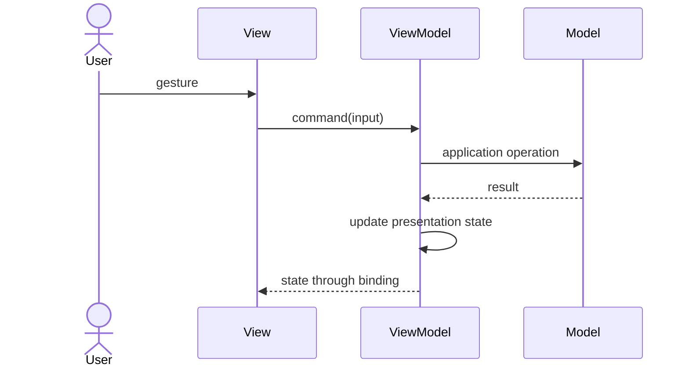

> **[Model-View-ViewModel](README.md)** › The Binding.

## 2. The Binding

[Data binding](../GLOSSARY.md#data-binding) synchronizes displayed values with a presentation contract. It can reduce hand-written synchronization, but still relies on notifications, subscriptions or dependency tracking underneath. Architecture continues to determine what the values mean.

### 2.1 The MVVM cycle



This is a runtime interaction. Source dependencies keep the [Model](../GLOSSARY.md#model) independent of concrete controls. The binding renders initial state and later changes; it must release resources when the [View](../GLOSSARY.md#view) is removed.

### 2.2 What the binding replaces — and what it doesn't

A binding framework can manage change propagation and control updates. It does not decide business ownership, reject every wrong event argument, handle every race, or prevent policy in a template. Manual subscriptions remain legitimate where the platform requires them.

For the class in [The Three Parts](1-the-three-parts.md), a small DOM binding can be explicit:

```js
// Complete binding; receives an existing button, feedback element and ViewModel.
export function bindCancel(button, feedback, vm, id) {
  const render = () => {
    button.disabled = vm.busy
    feedback.textContent = vm.busy ? 'Cancelling…' : vm.message
  }
  const onClick = () => { void vm.cancel(id) }
  const unsubscribe = vm.subscribe(render)
  button.addEventListener('click', onClick)
  render()
  return () => {
    unsubscribe()
    button.removeEventListener('click', onClick)
  }
}
```

The caller owns element creation/removal. A React Hook version should use React state or an appropriate external-store subscription API, rather than instantiate a mutable class and expect React to observe it.

<a id="23-two-way-binding-one-way-flow--both-are-mvvm"></a>

### 2.3 Two-way binding and one-way flow

Two-way binding can write input values back into a [ViewModel](../GLOSSARY.md#viewmodel) property. One-way display binding plus explicit commands separates read and write paths. Both can support a deliberately designed [ViewModel](../GLOSSARY.md#viewmodel), but one-way flow alone does not establish [MVVM](../GLOSSARY.md#model-view-viewmodel-mvvm).

WPF binding modes vary by property/control; [MVVM](../GLOSSARY.md#model-view-viewmodel-mvvm) does not mandate two-way binding everywhere. In React, values normally flow through props/state and gestures invoke handlers; React itself does not require a separate [ViewModel](../GLOSSARY.md#viewmodel).

### 2.4 The variants, restated from MVVM's side

| Approach | Main synchronization responsibility |
| --- | --- |
| Classic [MVC](../GLOSSARY.md#model-view-controller-mvc) | [Model](../GLOSSARY.md#model) observation and [View](../GLOSSARY.md#view) reads |
| [Passive View](../GLOSSARY.md#passive-view) | [Presenter](../GLOSSARY.md#presenter)/[Controller](../GLOSSARY.md#controller) updates a view interface |
| [Supervising Controller](../GLOSSARY.md#supervising-controller) | simple binding plus explicit complex updates |
| [Presentation Model](../GLOSSARY.md#presentation-model)/[MVVM](../GLOSSARY.md#model-view-viewmodel-mvvm) | a screen-oriented state/command contract and its binding |

These are distinct role arrangements. Do not infer the pattern solely from a framework name.

### 2.5 The cost ledger

Additional screen state can duplicate application state; bindings can have lifecycle/debugging costs; async commands need pending/error and stale-result policies. Measure performance before adding [memoization](../GLOSSARY.md#memoization) or bypassing bindings. A tiny component may be clearer with [local state](../GLOSSARY.md#local-state) than with another class or [facade](../GLOSSARY.md#facade-pattern).

Next: **[MVVM on the Frontend](3-mvvm-on-the-frontend.md)**.

## Sources

- [Fowler — Presentation Model](https://martinfowler.com/eaaDev/PresentationModel.html)
- [Microsoft — WPF Data Binding Overview](https://learn.microsoft.com/en-us/dotnet/desktop/wpf/data/)
- [React — Sharing State Between Components](https://react.dev/learn/sharing-state-between-components)
- [React — useSyncExternalStore](https://react.dev/reference/react/useSyncExternalStore)
