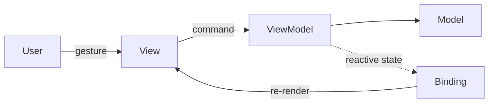
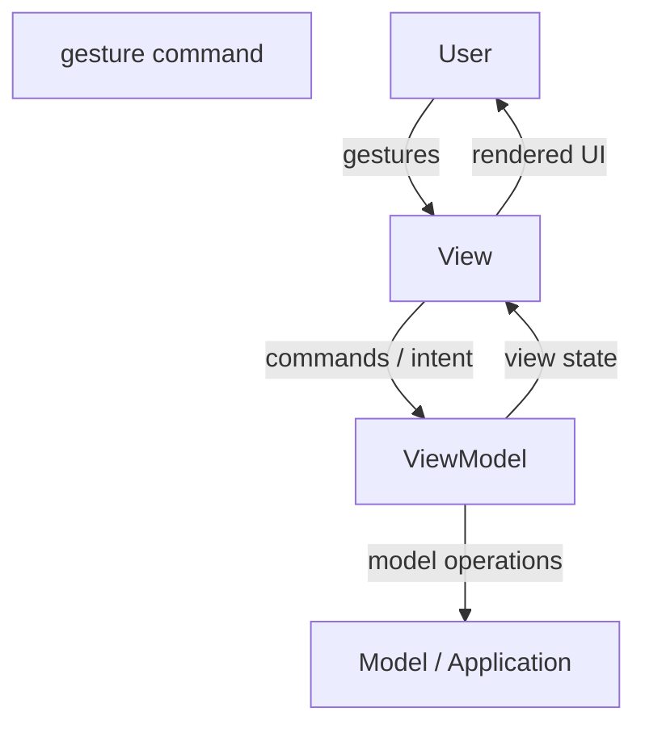

> **[Model-View-ViewModel](README.md)** › The Binding. Full reference list: [References](references.md).

## 2. The Binding

[MVC](../GLOSSARY.md#model-view-controller-mvc)'s evolution was, at heart, a search for a less manual way to keep [View](../GLOSSARY.md#view) and [Model](../GLOSSARY.md#model) in sync (see
[the MVC guide §2.2](../model-view-controller/2-the-flow.md#22-why-the-observer-link-is-the-hard-part)).
[MVVM](../GLOSSARY.md#model-view-viewmodel-mvvm) is where that search ended: the synchronization is handed to a **binding layer** the framework
provides. This page traces the resulting cycle, then names what the convenience costs.

---

### 2.1 The MVVM cycle

Compare with [classic MVC's cycle](../model-view-controller/2-the-flow.md#21-the-classic-cycle):
steps 1–3 are the old [Controller](../GLOSSARY.md#controller) path under a new name, and steps 4–5 are the old observer link —
automated. No [View](../GLOSSARY.md#view) subscribes to anything; no [Model](../GLOSSARY.md#model) broadcasts to anyone. The developer declares
*what maps to what*, and the framework maintains the mapping [Gossman 2005].

---

### 2.2 What the binding replaces — and what it doesn't

The binding removes the **plumbing**: subscription bookkeeping, stale-listener bugs, the tedium of
wiring every [View](../GLOSSARY.md#view) to every relevant [Model](../GLOSSARY.md#model). It does not remove the **discipline**. Nothing in a
binding layer stops a template from embedding business logic in an expression, or a [ViewModel](../GLOSSARY.md#viewmodel) from
swallowing the domain whole. The separation of the three parts is still a choice the author makes;
the framework only makes the honest version cheap [Fowler, GUI Architectures].

This is worth stating because binding's convenience is exactly what enables the fat component: when
any state is one `useState`/`ref()` away and any request one handler away, collapsing all three parts
into one file is the path of least resistance. The pattern's value is choosing not to.

---

### 2.3 Two-way binding, one-way flow — both are MVVM

Gossman's original WPF formulation leaned on **two-way binding**: an input field writes straight into
a [ViewModel](../GLOSSARY.md#viewmodel) property, and the property writes back into the field [Gossman 2005]. Later practice —
Redux, Elm, React's one-way data flow — narrowed the write path: the [View](../GLOSSARY.md#view) may only *read* state and
*dispatch* commands; every mutation flows through an explicit action.

Do not mistake that narrowing for a different pattern. The roles are unchanged — display state in a
[ViewModel](../GLOSSARY.md#viewmodel)-shaped object, a declarative [View](../GLOSSARY.md#view) bound to it, commands carrying intent. What one-way flow
changes is the *write discipline*, trading some of two-way binding's convenience for predictability:
no hidden write-backs, every change attributable to a dispatched action. Vue's `v-model` and React's
controlled components are two positions on this dial, not two architectures.

---

### 2.4 The variants, restated from MVVM's side

The [MVC guide's comparison](../model-view-controller/2-the-flow.md#23-the-variants-one-rewired-connection)
maps the family from [MVC](../GLOSSARY.md#model-view-controller-mvc)'s viewpoint. From [MVVM](../GLOSSARY.md#model-view-viewmodel-mvvm)'s side, the essential column is *who writes the
synchronization code*:

| Pattern | Sync mechanism | Who writes it |
|---|---|---|
| **[MVC](../GLOSSARY.md#model-view-controller-mvc)** (classic) | [View](../GLOSSARY.md#view) observes [Model](../GLOSSARY.md#model) | you |
| **MVP** | Presenter pushes into a passive [View](../GLOSSARY.md#view) | you |
| **[MVVM](../GLOSSARY.md#model-view-viewmodel-mvvm)** | binding layer syncs [View](../GLOSSARY.md#view) ↔ [ViewModel](../GLOSSARY.md#viewmodel) | the framework |

All three share the [Model](../GLOSSARY.md#model) and the separated-presentation principle. [MVVM](../GLOSSARY.md#model-view-viewmodel-mvvm) is simply the point where
the synchronization became declarative — which is why it, and not classic [MVC](../GLOSSARY.md#model-view-controller-mvc), is the honest name
for what component frameworks do [Fowler, GUI Architectures; Gossman 2005].

---

### 2.5 The cost ledger

Binding is not free, and the pattern's own author published the bill within months of the pattern
[Gossman 2006]. His three disadvantages, verbatim, then one the community added since:

- **Overkill at the low end.** "For simple UI, M-V-VM can be overkill." A screen with no state
  worth naming does not need a [ViewModel](../GLOSSARY.md#viewmodel) extracted from it.
- **Debuggability.** "Data-binding for all its wonders is declarative and harder to debug than nice
  imperative stuff where you just set breakpoints." A hand-written observer fails with a stack
  trace; a binding fails silently — a value simply never appears. Framework devtools exist
  precisely to give the invisible wiring a surface again.
- **Overhead at scale.** Binding "does tend to create a lot of general book-keeping data around" —
  Gossman measured bindings heavier than the objects being bound and recovered ~100 MB by replacing
  them in one hot path. Every mature binding framework grows the same escape hatches (memoized
  [selectors](../GLOSSARY.md#selector), `computed`, list virtualization) for the spots where declarative sync is too slow.
- **Gravity** (the community's addition). Because the [ViewModel](../GLOSSARY.md#viewmodel) is the easiest place to put
  anything, it attracts everything. The counter-forces are the two prohibitions of
  [§1.3](1-the-three-parts.md#13-viewmodel) and the review discipline of
  [§3.2](3-mvvm-on-the-frontend.md#32-the-failure-mode-the-fat-viewmodel).

The trade has proven overwhelmingly worth it — every major frontend framework made it — but it is a
trade, and knowing what was traded is what keeps the pattern honest.

---

Next: **[MVVM on the Frontend](3-mvvm-on-the-frontend.md)** — [stores](../GLOSSARY.md#store), hooks, and composables as
[ViewModels](../GLOSSARY.md#viewmodel), and how the triad sits inside a Clean or Onion application.
