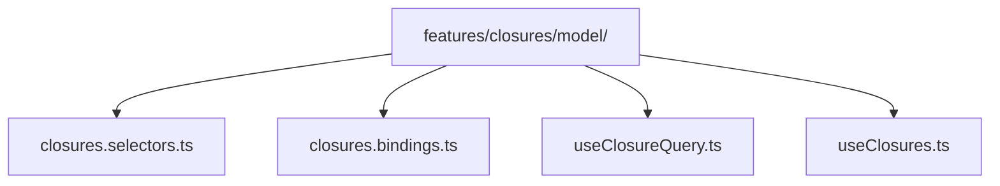
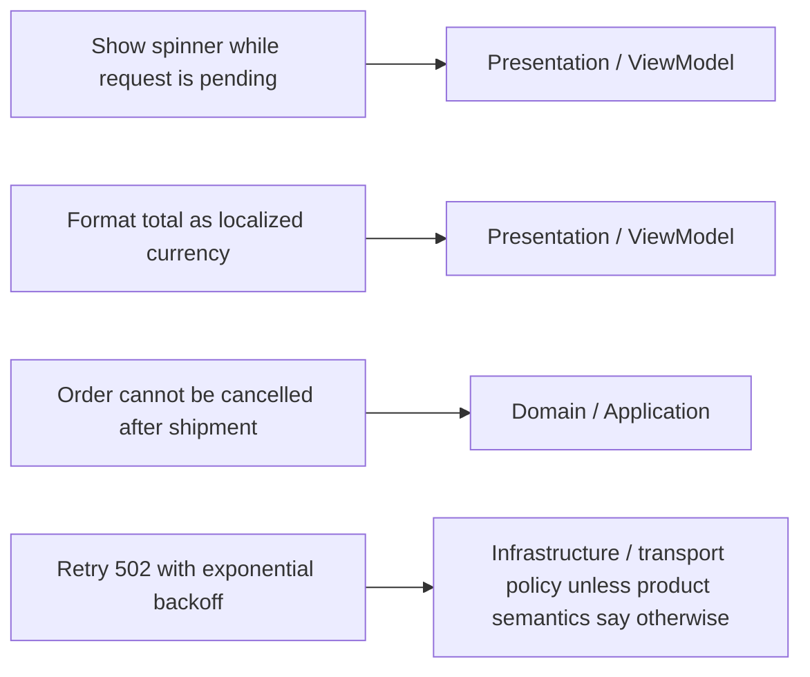
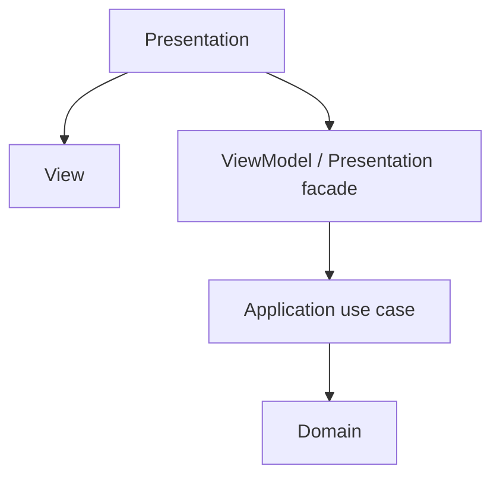

> **[Model-View-ViewModel](README.md)** › MVVM on the Frontend. Full reference list: [References](references.md).

# 3. MVVM on the Frontend

Modern component frameworks provide reactive rendering mechanisms that make separated-presentation patterns convenient. They do not select MVVM for you.

This chapter shows how MVVM/Presentation Model responsibilities **can** be mapped onto a frontend without claiming every store or hook is automatically a ViewModel.

---

## 3.1 The honest mapping

A useful mapping in a layered frontend is:

| MVVM role | Possible frontend owner |
| --- | --- |
| View | component render/template + strictly local rendering behavior |
| ViewModel | feature facade/custom hook/composable/state holder exposing view-oriented state + operations |
| Model | application/domain capabilities consumed behind the ViewModel; not necessarily one object |

The mapping is role-based, not class-based.

A ViewModel can be distributed across a small set of Presentation modules when ownership remains clear:



The public facade is what the View depends on.

Example:

```ts
export interface ClosuresViewModel {
  readonly rows: readonly ClosureRow[]
  readonly busy: boolean
  readonly error: string | null

  query(input: QueryInput): Promise<void>
  reset(): void
}

export function useClosures(): ClosuresViewModel {
  const state = useClosuresState()
  const actions = useClosuresActions()

  return {
    rows: state.rows,
    busy: state.busy,
    error: state.error,
    query: actions.query,
    reset: actions.reset,
  }
}
```

A React hook has not become a ViewModel merely because its name starts with `use`. It fills that role when it intentionally presents state/operations for a View while hiding lower-level mechanisms.

---

## 3.2 The failure mode: the fat ViewModel

The ViewModel is a convenient place to put logic, which makes it a common coupling hotspot.

Warning signs:

- authoritative pricing/eligibility rules live in selectors;
- HTTP response codes are interpreted throughout the hook;
- storage and transport clients are imported directly;
- unrelated workflows accumulate in one huge `useFeature()`;
- state-library action mechanics leak through the public API.

Ask:

> Does this behavior exist because of the screen, or because of the business/application?

Examples:



A large public facade can remain useful while internal responsibilities are split into focused hooks/modules.

---

## 3.3 How MVVM sits inside Onion and Clean

MVVM and Clean/Onion answer different questions.

MVVM:

```text
How is presentation state/behavior separated from rendering?
```

Clean/Onion:

```text
How do application/domain policies depend on external mechanisms?
```

A strict layered mapping can be:



Infrastructure implements ports required inward and is wired at composition.

That does **not** mean an MVVM command must always be exactly one use-case call. A ViewModel can coordinate UI-only concerns around an application operation. The boundary is semantic: business/application policy stays inward; view behavior stays in Presentation.

Likewise, not every application needs an explicit use-case layer. This repository adds one when following Clean/Onion because those architectural styles require a place for application policy; MVVM alone does not.

See **[Frontend Architecture](../frontend/README.md)** for the repository's current feature/state organization guidance.

---

<a id="34-the-pattern-in-the-wild"></a>

## 3.4 Related implementations in the wild

The following ecosystems use concepts compatible with MVVM or Presentation Model, but they should not be used to claim all modern UI frameworks "are MVVM":

- **Microsoft/.NET UI** has explicit MVVM guidance and a long MVVM lineage.
- **Android** recommends UI state holders such as `ViewModel` and unidirectional data flow. This is compatible with MVVM-like separation but Android's architecture guidance is broader than one historical pattern name.
- **Airbnb Mavericks** uses immutable state + ViewModel concepts on Android.
- **Vue** historically documents MVVM inspiration while explicitly saying Vue is not strictly associated with MVVM.

The engineering takeaway is the recurring separation of rendering from testable state/behavior—not a need to relabel every framework architecture MVVM.

---

Next: **[Testing in MVVM](4-testing-in-mvvm.md)**.

## Sources

- Martin Fowler, "Presentation Model": https://martinfowler.com/eaaDev/PresentationModel.html
- Martin Fowler, "GUI Architectures": https://martinfowler.com/eaaDev/uiArchs.html
- Vue 2 documentation, instance/MVVM note: https://v2.vuejs.org/v2/guide/instance.html
