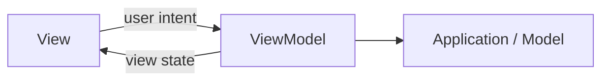
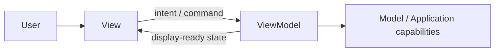
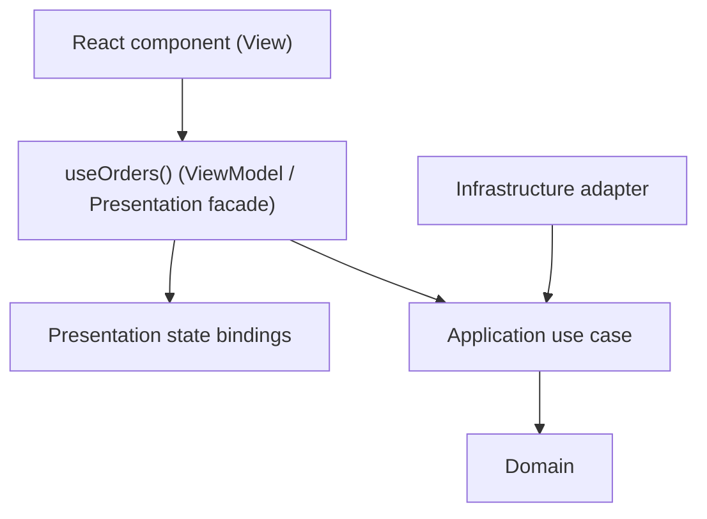
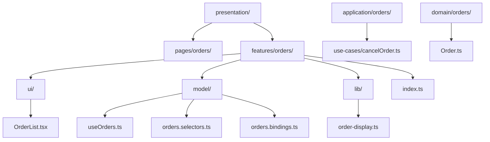
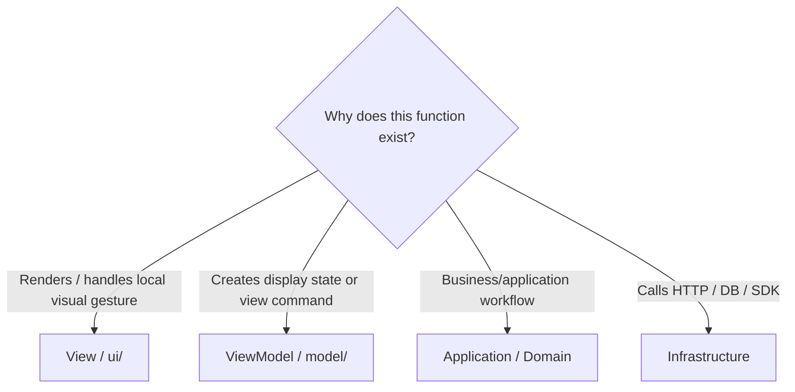
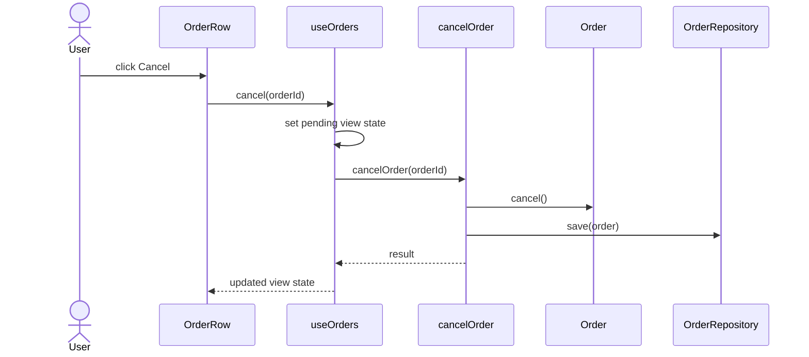

# Model-View-ViewModel (MVVM)

> A presentation pattern that separates rendering from view-oriented state and behavior.

← [Repository home](../README.md) · [Glossary](../GLOSSARY.md) · [Code placement](../foundations/code-placement.md) · [Naming](../conventions/naming-and-file-placement.md) · [Frontend architecture](../frontend/README.md)

## 1. History and origin

Martin Fowler described **[Presentation Model](../GLOSSARY.md#presentation-model)** in 2004: an abstraction that contains a [View](../GLOSSARY.md#view)'s state and behavior while remaining independent of concrete UI controls.

In **2005**, John Gossman introduced the [MVVM](../GLOSSARY.md#model-view-viewmodel-mvvm) name in the WPF ecosystem, describing a variation of [MVC](../GLOSSARY.md#model-view-controller-mvc) tailored to declarative UI and binding.

Sources:

- https://martinfowler.com/eaaDev/PresentationModel.html
- https://learn.microsoft.com/en-us/archive/msdn-magazine/2009/february/patterns-wpf-apps-with-the-model-view-viewmodel-design-pattern

## 2. What problem does MVVM solve?

Stateful UI code easily mixes:

- rendering;
- loading/error state;
- formatting;
- commands;
- presentation validation;
- subscriptions;
- application/business rules;
- transport calls.

[MVVM](../GLOSSARY.md#model-view-viewmodel-mvvm) separates the rendering surface from the state and behavior needed by that rendering surface.

[MVVM](../GLOSSARY.md#model-view-viewmodel-mvvm) does not define persistence architecture, domain boundaries, transport [adapters](../GLOSSARY.md#adapter) or deployment.

## 3. When MVVM is a strong fit

It is useful for:

- rich stateful screens;
- UI behavior that benefits from headless tests;
- several UI elements sharing one view-oriented state holder;
- declarative/reactive frameworks where rendering can bind to a stable view contract;
- complex forms/workflows where rendering should stay comparatively simple.

## 4. When MVVM is weak or unnecessary

A dedicated [ViewModel](../GLOSSARY.md#viewmodel) can be overhead when:

- the screen is tiny;
- UI state is trivial and local component state is clearer;
- the [ViewModel](../GLOSSARY.md#viewmodel) only forwards values without adding a boundary;
- the [ViewModel](../GLOSSARY.md#viewmodel) becomes a generic service containing unrelated features.

React, Vue and Svelte do **not** become [MVVM](../GLOSSARY.md#model-view-viewmodel-mvvm) merely because they are reactive.

## 5. Mental model and roles

| Role | Owns | Put here | Do not put here |
| --- | --- | --- | --- |
| [View](../GLOSSARY.md#view) | rendering and user gestures | component/template, local visual state | authoritative business rules, transport clients |
| [ViewModel](../GLOSSARY.md#viewmodel) | view-oriented state and behavior | loading flags, display derivation, commands/facade, UI-specific orchestration | database/HTTP implementations, business [invariants](../GLOSSARY.md#invariant) |
| [Model](../GLOSSARY.md#model) | non-[View](../GLOSSARY.md#view) application/domain capabilities | domain/application state and operations according to the wider architecture | concrete [View](../GLOSSARY.md#view) controls |

"[Model](../GLOSSARY.md#model)" is overloaded. In a Clean/Onion application it is not automatically identical to `domain/`.

## 6. Isolation in a layered React application

This repository uses a [ViewModel](../GLOSSARY.md#viewmodel)-like **public feature facade** when a screen is complex enough to justify it:

Why isolate it?

- React components can change without rewriting application policy;
- Redux/Zustand/other [store](../GLOSSARY.md#store) mechanics can stay behind a semantic feature API;
- UI-specific derived state can be tested without DOM rendering;
- [Application](../GLOSSARY.md#application-layer)/[Domain](../GLOSSARY.md#domain) never need to know React.

A hook is a [ViewModel](../GLOSSARY.md#viewmodel) only when it intentionally exposes a view contract. The `use` prefix alone does not create the architectural role.

## 7. Physical structure

A feature-oriented [Presentation](../GLOSSARY.md#presentation-layer) structure:

| Path | Owns | Why | Must not contain |
| --- | --- | --- | --- |
| `features/orders/ui/` | [Views](../GLOSSARY.md#view)/components | rendering belongs to feature | business [invariants](../GLOSSARY.md#invariant), HTTP clients |
| `features/orders/model/` | [ViewModel](../GLOSSARY.md#viewmodel)/state/[selectors](../GLOSSARY.md#selector)/bindings | view-oriented behavior stays together | concrete [Infrastructure](../GLOSSARY.md#infrastructure) |
| `features/orders/lib/` | helpers still owned by Orders [Presentation](../GLOSSARY.md#presentation-layer) | prevents generic util dumping | unrelated cross-feature code |
| `features/orders/index.ts` | public feature API | hides internal state implementation | automatic `export *` of every internal |
| `application/orders/` | application operations | [ViewModel](../GLOSSARY.md#viewmodel) delegates policy-bearing work inward | React/Redux mechanisms |
| `domain/orders/` | business meaning | survives UI redesign | view state |

Not every feature needs all of these files. Split only when each responsibility becomes meaningful.

## 8. Where does a new function go?

Examples:

| Function/type | Owner |
| --- | --- |
| `formatTotalForScreen()` | [ViewModel](../GLOSSARY.md#viewmodel)/[Presentation](../GLOSSARY.md#presentation-layer) helper |
| `isSaving` derived flag | [ViewModel](../GLOSSARY.md#viewmodel)/[selector](../GLOSSARY.md#selector) |
| `cancel()` command exposed to the [View](../GLOSSARY.md#view) | [ViewModel](../GLOSSARY.md#viewmodel) facade |
| `cancelOrder(id)` workflow | [Application](../GLOSSARY.md#application-layer) |
| `Order.cancel()` [invariant](../GLOSSARY.md#invariant) | [Domain](../GLOSSARY.md#domain) |
| HTTP request implementation | [Infrastructure](../GLOSSARY.md#infrastructure) |

Do not move business rules into the [ViewModel](../GLOSSARY.md#viewmodel) merely because they are easy to express as a computed/[selector](../GLOSSARY.md#selector).

## 9. Naming

Use **[Naming and File Placement Conventions](../conventions/naming-and-file-placement.md)**.

For React specifically, official React guidance requires:

- component names to start with a capital letter;
- custom Hook names to start with `use` followed by a capitalized word.

Recommended examples:

| Role | Example |
| --- | --- |
| [View](../GLOSSARY.md#view) | `OrdersPage.tsx`, `OrderRow.tsx` |
| public [ViewModel](../GLOSSARY.md#viewmodel) hook | `useOrders.ts` |
| [selector](../GLOSSARY.md#selector) | `orders.selectors.ts` |
| state binding | `orders.bindings.ts` |
| application operation | `cancelOrder.ts` |

The suffixes such as `.selectors.ts` are documentation conventions, not React or [MVVM](../GLOSSARY.md#model-view-viewmodel-mvvm) requirements.

## 10. First feature end to end

Requirement:

> The Orders screen lets a user cancel an order and displays pending/error state. Shipped orders must not be cancelled.

| Artifact | File | Owner | Why |
| --- | --- | --- | --- |
| button/row rendering | `presentation/features/orders/ui/OrderRow.tsx` | [View](../GLOSSARY.md#view) | renders and forwards intent |
| `busy`, error and `cancel()` command | `presentation/features/orders/model/useOrders.ts` | [ViewModel](../GLOSSARY.md#viewmodel) | state/behavior exists for the [View](../GLOSSARY.md#view) |
| shared [store](../GLOSSARY.md#store) [selector](../GLOSSARY.md#selector) if needed | `presentation/features/orders/model/orders.selectors.ts` | [Presentation](../GLOSSARY.md#presentation-layer) | derives client view state |
| cancellation workflow | `application/orders/use-cases/cancelOrder.ts` | [Application](../GLOSSARY.md#application-layer) | policy-bearing operation |
| cancellation [invariant](../GLOSSARY.md#invariant) | `domain/orders/Order.ts` | [Domain](../GLOSSARY.md#domain) | business truth |
| HTTP persistence | `infrastructure/orders/HttpOrderRepository.ts` | [Infrastructure](../GLOSSARY.md#infrastructure) | technical I/O |

If the screen is tiny and no reusable/headless presentation behavior exists, using local component state directly can be simpler than inventing a [ViewModel](../GLOSSARY.md#viewmodel).

## 11. Testing

| Scope | What to test |
| --- | --- |
| [ViewModel](../GLOSSARY.md#viewmodel) | view state derivation, commands, result mapping without DOM where possible |
| [View](../GLOSSARY.md#view) | rendering and gesture forwarding |
| [Application](../GLOSSARY.md#application-layer)/[Domain](../GLOSSARY.md#domain) | policy independently of [MVVM](../GLOSSARY.md#model-view-viewmodel-mvvm) |
| [Infrastructure](../GLOSSARY.md#infrastructure) | transport/persistence independently of [MVVM](../GLOSSARY.md#model-view-viewmodel-mvvm) |
| End-to-end | critical user journey |

The point of a [ViewModel](../GLOSSARY.md#viewmodel) boundary is that presentation behavior can be tested without needing concrete UI controls.

See **[Testing in MVVM](./4-testing-in-mvvm.md)**.

## 12. Trade-offs and failure modes

Costs:

- another abstraction between [View](../GLOSSARY.md#view) and application/model;
- possible duplication between local component state and [ViewModel](../GLOSSARY.md#viewmodel) state;
- temptation to move every operation into one facade.

Common failures:

- **God [ViewModel](../GLOSSARY.md#viewmodel)** — unrelated workflows accumulate in one hook/class;
- **domain leakage** — business [invariants](../GLOSSARY.md#invariant) move into [selectors](../GLOSSARY.md#selector)/computed values;
- **transport leakage** — HTTP/SDK status codes become the [ViewModel](../GLOSSARY.md#viewmodel)'s public language;
- **[store](../GLOSSARY.md#store) leakage** — components must understand Redux actions/[thunk](../GLOSSARY.md#thunk) lifecycle even though the [ViewModel](../GLOSSARY.md#viewmodel) is supposed to hide them;
- **pass-through [ViewModel](../GLOSSARY.md#viewmodel)** — an abstraction exists but adds no useful ownership boundary;
- **framework relabeling** — every React hook is called a [ViewModel](../GLOSSARY.md#viewmodel) regardless of responsibility.

## 13. Learning path

1. **[The Three Parts](./1-the-three-parts.md)**
2. **[Binding](./2-the-binding.md)**
3. **[MVVM on the Frontend](./3-mvvm-on-the-frontend.md)**
4. **[Testing](./4-testing-in-mvvm.md)**
5. **[React + Redux Toolkit](./5-mvvm-in-react-redux.md)**

For broader frontend feature/state organization, continue with **[Frontend Architecture](../frontend/README.md)**.

## Sources

- Martin Fowler, *[Presentation Model](../GLOSSARY.md#presentation-model)*: https://martinfowler.com/eaaDev/PresentationModel.html
- Martin Fowler, *GUI Architectures*: https://martinfowler.com/eaaDev/uiArchs.html
- Microsoft, *WPF Apps With The [Model-View-ViewModel](../GLOSSARY.md#model-view-viewmodel-mvvm) Design Pattern*: https://learn.microsoft.com/en-us/archive/msdn-magazine/2009/february/patterns-wpf-apps-with-the-model-view-viewmodel-design-pattern
- React, custom Hook naming: https://react.dev/learn/reusing-logic-with-custom-hooks
