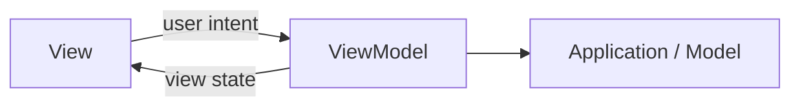
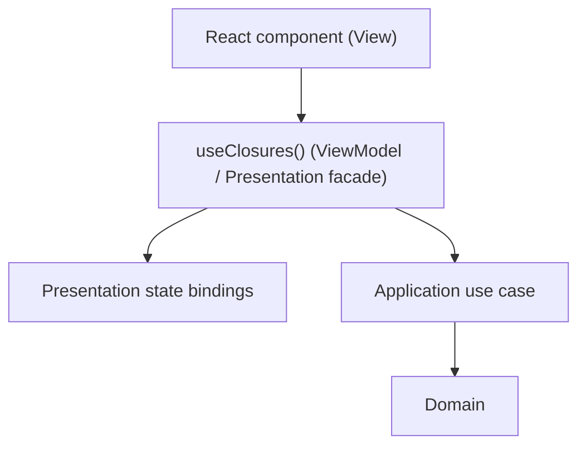

# Model-View-ViewModel (MVVM)

> A presentation pattern that separates rendering from view-oriented state and behavior.

← [Repository home](../README.md) · [Glossary](../GLOSSARY.md) · [Frontend architecture](../frontend/README.md)

## 1. History

Martin Fowler described **Presentation Model** in 2004: an abstraction containing the state and behavior of a View while remaining independent of concrete UI controls.

In **2005**, John Gossman introduced the MVVM name in the WPF ecosystem. Microsoft literature later described MVVM as closely related to/specialized from Presentation Model for WPF-style binding.

References:

- https://martinfowler.com/eaaDev/PresentationModel.html
- https://learn.microsoft.com/en-us/archive/msdn-magazine/2009/february/patterns-wpf-apps-with-the-model-view-viewmodel-design-pattern

## 2. What problem does it solve?

UI components often accumulate:

- loading/error state;
- formatting;
- commands;
- validation for presentation;
- subscriptions;
- business rules;
- transport calls.

MVVM separates the rendering surface from the state/behavior needed by that rendering surface.

## 3. When MVVM is useful

Strong fit:

- rich stateful screens;
- UI logic that benefits from headless tests;
- multiple visual representations over the same presentation state;
- declarative binding/reactive UI frameworks;
- complex forms/workflows where rendering should stay simple.

## 4. When it is unnecessary

A dedicated ViewModel can be overhead when:

- the screen is tiny;
- UI state is trivial;
- direct local component state is clearer;
- creating a ViewModel only forwards values without adding a useful boundary.

Microsoft's own MVVM literature explicitly discusses the overhead for simple models/screens.

## 5. Roles

| Role | Owns | Does not automatically own |
| --- | --- | --- |
| View | rendering + user gestures | domain/application rules |
| ViewModel | view-oriented state, derived display values, commands | HTTP/DB details or authoritative business invariants |
| Model | non-view application/domain capabilities | concrete View controls |

The word "Model" is overloaded. In a Clean/Onion application it is not automatically identical to `domain/`.

## 6. React mapping used in this repository

React is **not MVVM by default**.

A feature may intentionally use this mapping:

The hook is a ViewModel only when it genuinely exposes a view-oriented contract and hides lower-level mechanisms.

## 7. Where files go

| Artifact | Example path |
| --- | --- |
| View | `features/closures/ui/QueryFilters/QueryFilters.tsx` |
| public ViewModel facade | `features/closures/model/useClosures.ts` |
| selectors | `features/closures/model/closures.selectors.ts` |
| Redux binding | `features/closures/model/closures.bindings.ts` |
| use case | `application/closures/use-cases/executeClosure.ts` |

## 8. Naming

React requires:

- component names to begin with a capital letter;
- custom hooks to begin with `use`.

See [Naming and File Placement Conventions](../conventions/naming-and-file-placement.md).

## 9. Learning path

1. [The Three Parts](./1-the-three-parts.md)
2. [Binding](./2-the-binding.md)
3. [MVVM on the Frontend](./3-mvvm-on-the-frontend.md)
4. [Testing](./4-testing-in-mvvm.md)
5. [React + Redux Toolkit](./5-mvvm-in-react-redux.md)

## Sources

- Martin Fowler, *Presentation Model*: https://martinfowler.com/eaaDev/PresentationModel.html
- Martin Fowler, *GUI Architectures*: https://martinfowler.com/eaaDev/uiArchs.html
- Microsoft, *WPF Apps With The Model-View-ViewModel Design Pattern*: https://learn.microsoft.com/en-us/archive/msdn-magazine/2009/february/patterns-wpf-apps-with-the-model-view-viewmodel-design-pattern
