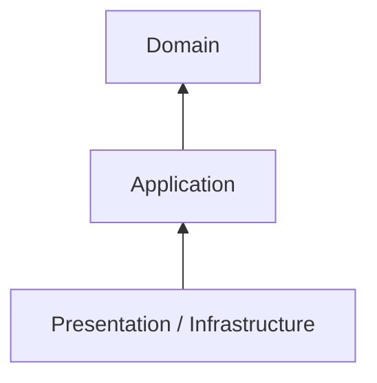
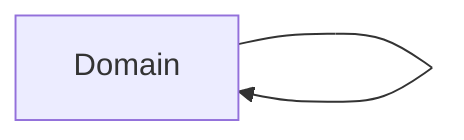
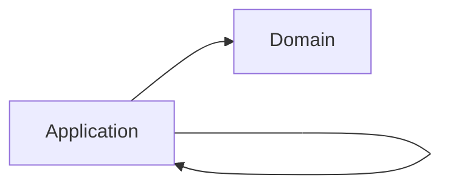
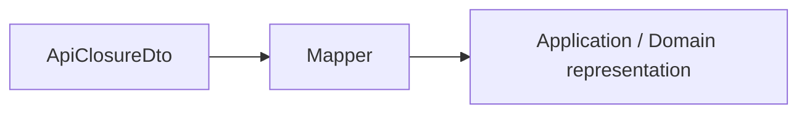
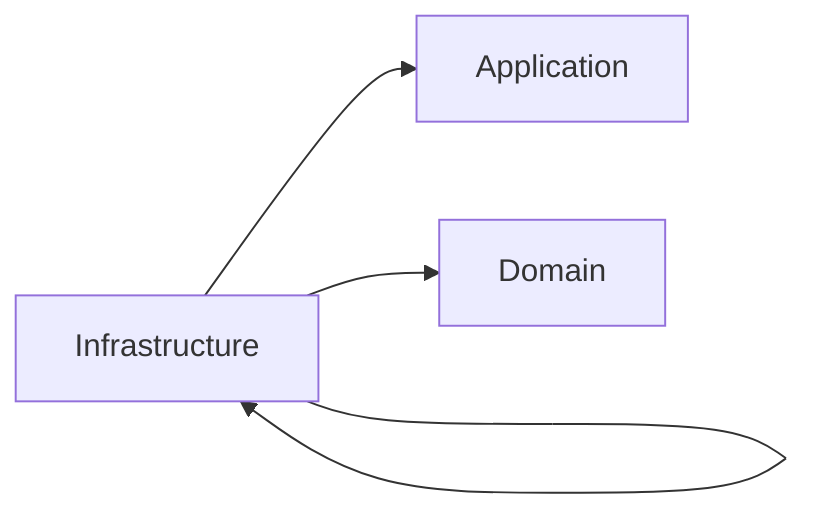
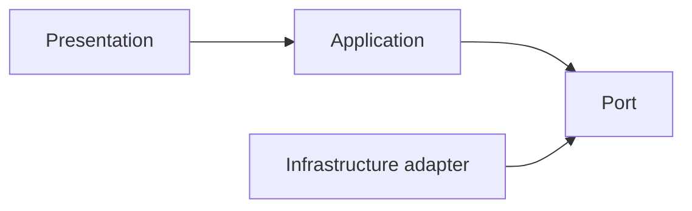
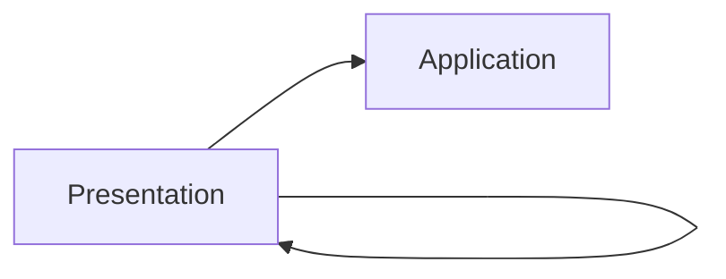
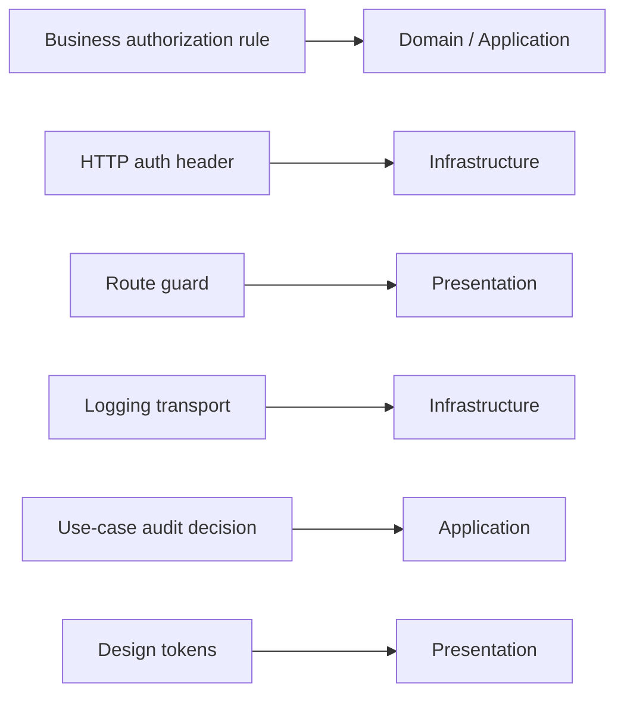

> **[Onion Architecture](README.md)** › The Rings.

<a id="3-the-rings-the-four-layers"></a>
<a id="3-the-rings"></a>

<a id="3-the-four-layers"></a>

# 1. The Rings

Suppose an analyst changes a ticket's status. The rule deciding whether that change is allowed should stay valid whether the analyst uses React or a mobile app and whether the ticket is saved through HTTP or a database. We put that business rule nearest the center, the operation coordinating the change around it, and the technical UI/storage details outside.

This guide uses four practical areas to explain [Onion Architecture](../GLOSSARY.md#onion-architecture):



The drawing is a dependency model, not a call-stack diagram. Runtime control can move outward through injected [ports](../GLOSSARY.md#port) while source dependencies still point inward.

---

<a id="31-domain-innermost"></a>

## 1.1 Domain (innermost)

### Responsibility

Own business concepts, [invariants](../GLOSSARY.md#invariant) and behavior that are independent of delivery and infrastructure mechanisms.

Typical contents:

- entities;
- [value objects](../GLOSSARY.md#value-object);
- [domain services](../GLOSSARY.md#domain-service) when behavior does not naturally belong to one entity/[value object](../GLOSSARY.md#value-object);
- [domain events](../GLOSSARY.md#domain-event);
- [domain errors](../GLOSSARY.md#domain-error);
- policies/[invariants](../GLOSSARY.md#invariant).

The following is a responsibility excerpt; imports and supporting types are omitted. For a complete executable feature, follow the [cancellation walkthrough](../clean-architecture/4-building-a-feature.md).

Example:

```ts
export class ClosurePeriod {
  private constructor(
    readonly startsOn: LocalDate,
    readonly endsOn: LocalDate,
  ) {}

  static create(startsOn: LocalDate, endsOn: LocalDate) {
    if (endsOn.isBefore(startsOn)) {
      throw new InvalidClosurePeriod()
    }

    return new ClosurePeriod(startsOn, endsOn)
  }
}
```

### Must not know

[Domain](../GLOSSARY.md#domain) should not import:

- React/Vue/Svelte;
- Redux/Pinia/Zustand;
- browser storage;
- HTTP clients;
- [ORM](../GLOSSARY.md#orm)/database APIs;
- generated transport types;
- CSS/Panda/Tailwind;
- routers/controllers.

### Dependency direction



"Depends on nothing" is useful shorthand for "depends on no outer [application layer](../GLOSSARY.md#application-layer)". [Domain](../GLOSSARY.md#domain) code can of course depend on the language/runtime standard library and carefully chosen domain-safe libraries.

### Do not manufacture a rich domain

Not every application needs entity classes and [domain services](../GLOSSARY.md#domain-service).

If the system mainly transports data with little domain behavior, an anemic-looking model may honestly reflect the problem. Do not invent behavior merely to satisfy an architecture diagram.

---

<a id="32-application"></a>

## 1.2 Application

### Responsibility

Own application-specific policy: the operations the application performs and the capabilities those operations require.

Typical contents:

- [use cases](../GLOSSARY.md#use-case)/[application services](../GLOSSARY.md#application-service);
- commands/queries and results;
- input/output boundaries;
- [ports](../GLOSSARY.md#port) for required external capabilities;
- application errors;
- orchestration across [Domain](../GLOSSARY.md#domain) objects and [ports](../GLOSSARY.md#port).

The following is a responsibility excerpt; imports and supporting types are omitted. For a complete executable feature, follow the [cancellation walkthrough](../clean-architecture/4-building-a-feature.md).

Example:

```ts
export interface ExecuteClosureCommand {
  startsOn: LocalDate
  endsOn: LocalDate
  officeId: string
}

export interface ValidatedClosure {
  period: ClosurePeriod
  officeId: string
}

export interface ClosureGateway {
  enqueue(command: ValidatedClosure): Promise<ClosureJob>
}

export function makeExecuteClosure(deps: {
  gateway: ClosureGateway
}) {
  return async function execute(command: ExecuteClosureCommand) {
    const period = ClosurePeriod.create(command.startsOn, command.endsOn)

    return deps.gateway.enqueue({
      officeId: command.officeId,
      period,
    })
  }
}
```

### Must not know

[Application](../GLOSSARY.md#application-layer) should not import:

- concrete HTTP/database/storage [adapters](../GLOSSARY.md#adapter);
- React/Redux/UI framework state;
- [ORM](../GLOSSARY.md#orm) models;
- transport request/response objects;
- browser APIs such as `File` unless the application is intentionally browser-specific.

### Dependency direction



[Ports](../GLOSSARY.md#port) live here when they express capabilities required by application policy.

Do not create one [port](../GLOSSARY.md#port) per endpoint automatically. [Port](../GLOSSARY.md#port) granularity follows cohesive conversations/capabilities.

---

<a id="33-infrastructure"></a>

## 1.3 Infrastructure

### Responsibility

Adapt external technology to contracts understood by inner policy.

Typical contents:

- HTTP/API clients and [gateway](../GLOSSARY.md#gateway) implementations;
- persistence [adapters](../GLOSSARY.md#adapter);
- browser storage [adapters](../GLOSSARY.md#adapter);
- SDK wrappers;
- external [DTOs](../GLOSSARY.md#data-transfer-object-dto)/generated types;
- [mappers](../GLOSSARY.md#mapper);
- message-broker or realtime protocol clients;
- filesystem/object-storage implementations.

The following is a responsibility excerpt; imports and supporting types are omitted. For a complete executable feature, follow the [cancellation walkthrough](../clean-architecture/4-building-a-feature.md).

Example:

```ts
export class HttpClosureGateway implements ClosureGateway {
  constructor(private readonly http: HttpClient) {}

  async enqueue(command: ValidatedClosure): Promise<ClosureJob> {
    const dto = toExecuteClosureDto(command)
    const response = await this.http.post('/closures', dto)

    return fromClosureJobDto(response.data)
  }
}
```

The [adapter](../GLOSSARY.md#adapter) knows the inner contract. The [Application layer](../GLOSSARY.md#application-layer) does not know this class.

### Translation belongs at boundaries

External types should normally stop here:



Do not leak OpenAPI generated models, [ORM](../GLOSSARY.md#orm) records or SDK objects inward simply because their TypeScript shapes happen to match.

### Dependency direction



[Infrastructure](../GLOSSARY.md#infrastructure) must not depend on [Presentation](../GLOSSARY.md#presentation-layer).

---

<a id="34-presentation-outermost"></a>

## 1.4 Presentation (outermost)

### Responsibility

Own rendering, interaction and UI-specific state/behavior.

Typical contents:

- pages/routes/layouts;
- components;
- [view models](../GLOSSARY.md#viewmodel) / [Presentation Models](../GLOSSARY.md#presentation-model);
- [custom hooks](../GLOSSARY.md#custom-hook)/composables;
- UI state [stores](../GLOSSARY.md#store)/slices;
- [selectors](../GLOSSARY.md#selector)/computed values;
- [design-system](../GLOSSARY.md#design-system) primitives and styles;
- UI-specific validation/formatting.

The following is a responsibility excerpt; imports and supporting types are omitted. For a complete executable feature, follow the [cancellation walkthrough](../clean-architecture/4-building-a-feature.md).

Example:

```ts
export function useClosures() {
  const state = useClosuresState()
  const actions = useClosuresActions()

  return {
    rows: state.rows,
    busy: state.status === 'pending',
    query: actions.query,
    reset: actions.reset,
  }
}
```

### Presentation may contain real logic

Examples of [Presentation](../GLOSSARY.md#presentation-layer) logic:

- modal visibility;
- selected table rows;
- view sorting/filtering;
- loading/error affordances;
- focus management;
- responsive display state;
- formatting a domain/application result for the screen.

That is not business policy merely because it contains conditionals.

### Do not reach directly into Infrastructure when the chosen boundary forbids it

Recommended strict flow:



If a project deliberately allows [Presentation](../GLOSSARY.md#presentation-layer) to use a technical [adapter](../GLOSSARY.md#adapter) directly for a simple UI-only concern, document that as a scoped architectural decision. Do not present the leak as the canonical Onion boundary.

### Dependency direction

A strict default:



Some systems allow [Presentation](../GLOSSARY.md#presentation-layer) to import [Domain](../GLOSSARY.md#domain) types directly because [Domain](../GLOSSARY.md#domain) is inward. Others require all [Presentation](../GLOSSARY.md#presentation-layer) contracts to arrive through [Application](../GLOSSARY.md#application-layer). Pick and enforce one policy.

### Internal frontend architecture

Onion does not specify how [Presentation](../GLOSSARY.md#presentation-layer) itself should scale.

See:

- **[Presentation Architecture](../frontend/presentation-architecture.md)**
- **[State Management](../frontend/state-management.md)**
- **[Styling and Design Systems](../frontend/styling-and-design-system.md)**

---

<a id="35-composition-is-outside-the-rings-business-policy"></a>

## 1.5 Composition is outside the rings' business policy

The executable still needs a bootstrap location that knows concrete implementations:

```ts
const closureGateway = new HttpClosureGateway(http)
const executeClosure = makeExecuteClosure({ gateway: closureGateway })
const store = createAppStore({ executeClosure })
```

Composition is an outer assembly boundary, not another domain layer.

See **[Composition Root](../foundations/composition-root.md)**.

---

<a id="36-cross-cutting-concerns-still-need-owners"></a>

## 1.6 Cross-cutting concerns still need owners

"Cross-cutting" is not a license to create a globally imported utility layer.

Examples:



Separate the policy from the mechanism.

## Sources

- Jeffrey Palermo, [Onion Architecture](../GLOSSARY.md#onion-architecture) series: https://jeffreypalermo.com/2008/07/
- Alistair Cockburn, [Hexagonal Architecture](../GLOSSARY.md#hexagonal-architecture-ports-and-adapters): https://alistair.cockburn.us/hexagonal-architecture/
- Robert C. Martin, The [Clean Architecture](../GLOSSARY.md#clean-architecture): https://blog.cleancoder.com/uncle-bob/2012/08/13/the-clean-architecture.html
- Martin Fowler, [Presentation Model](../GLOSSARY.md#presentation-model): https://martinfowler.com/eaaDev/PresentationModel.html
