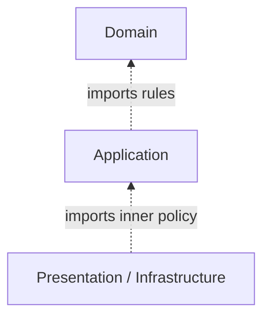
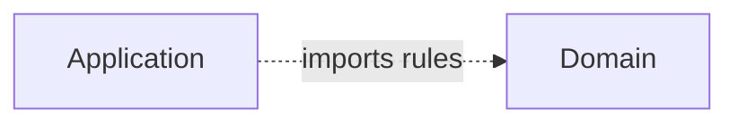
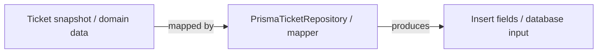
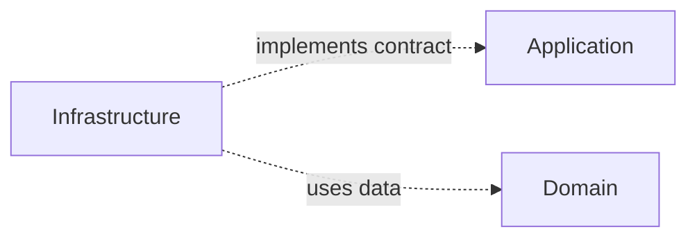
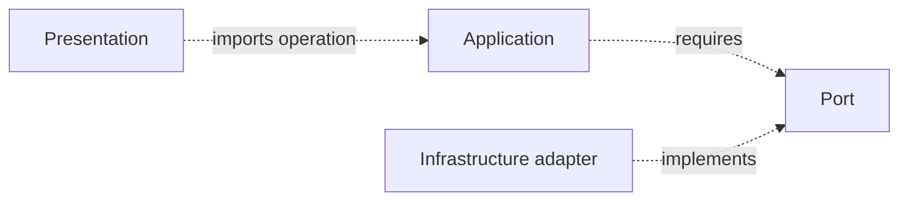
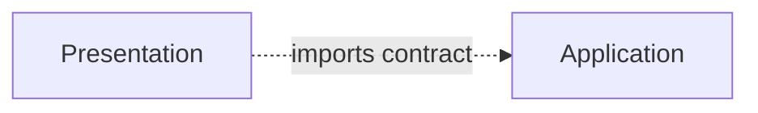
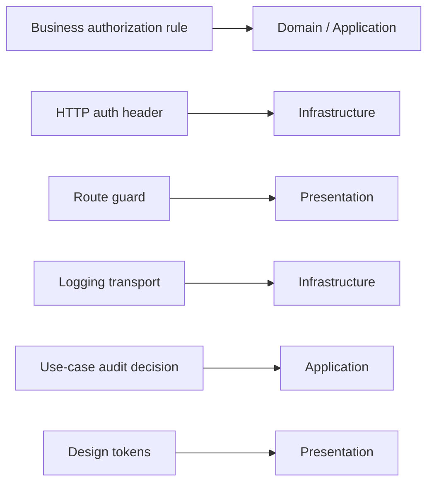

> **[Onion Architecture](README.md)** › The Rings.

<a id="3-the-rings-the-four-layers"></a>
<a id="3-the-rings"></a>

<a id="3-the-four-layers"></a>

# 1. The Rings

An analyst creates a support ticket about a failed invoice download. Its subject must be valid, the new ticket must start open, and the server must save it before reporting success. Changing the HTTP framework or database should not change those rules. Keep the ticket's meaning at the center, its creation workflow around it, and external delivery/storage outside.

We follow the [canonical TypeScript ticket](../backend/2-typescript-first-boundaries.md), rather than invent another domain for each ring. Its complete modules and tests are linked there. Small expressions below show their use, not replacement implementations. The backend support capability owns the persisted ticket; browser checks only improve feedback.

This guide uses four practical areas to explain [Onion Architecture](../GLOSSARY.md#onion-architecture):



The drawing is a dependency model, not a call-stack diagram. Runtime control can move outward through injected [ports](../GLOSSARY.md#port) while source dependencies still point inward.

---

<a id="31-domain-innermost"></a>

## 1.1 Domain (innermost)

### Responsibility

`Ticket.create` trims the subject, rejects an empty or overlong subject, and chooses `open`. [Domain](../GLOSSARY.md#domain) owns these business decisions independently of delivery and storage. An [invariant](../GLOSSARY.md#invariant) is a condition that valid tickets must always satisfy; creation enforces the subject rule here.

Typical contents:

- entities;
- [value objects](../GLOSSARY.md#value-object);
- [domain services](../GLOSSARY.md#domain-service) when behavior does not naturally belong to one entity/[value object](../GLOSSARY.md#value-object);
- [domain events](../GLOSSARY.md#domain-event);
- [domain errors](../GLOSSARY.md#domain-error);
- policies/[invariants](../GLOSSARY.md#invariant).

The following expression uses the canonical `domain/tickets/Ticket.ts` module. Its status vocabulary recognizes values but does not automatically define transitions or pick an initial state by list order.

Example:

```ts
const ticket = Ticket.create('T-42', '  Invoice download fails  ', 'PDF fails for INV-42.')
const data = ticket.snapshot() // normalized subject; status is open
```

### Must not know

[Domain](../GLOSSARY.md#domain) should not import:

- React/Vue/Svelte;
- Redux/Pinia/Zustand;
- browser storage;
- HTTP clients;
- [ORM](../GLOSSARY.md#orm)/database APIs;
- generated transport types;
- CSS/Panda/Tailwind;
- routers/controllers.

### Dependency direction

[Domain](../GLOSSARY.md#domain) imports other domain code when necessary and no outer application modules. A self-arrow adds nothing to that rule.

"Depends on nothing" is useful shorthand for "depends on no outer [application layer](../GLOSSARY.md#application-layer)". [Domain](../GLOSSARY.md#domain) code can of course depend on the language/runtime standard library and carefully chosen domain-safe libraries.

### Do not manufacture a rich domain

Not every application needs entity classes and [domain services](../GLOSSARY.md#domain-service).

If the system mainly transports data with little domain behavior, an anemic-looking model may honestly reflect the problem. Do not invent behavior merely to satisfy an architecture diagram.

---

<a id="32-application"></a>

## 1.2 Application

### Responsibility

Someone must ask for a valid ticket, await persistence, then report success or an expected failure. That workflow is `CreateTicket`, our application operation. It asks [Domain](../GLOSSARY.md#domain) to enforce the subject rule rather than repeating the limit.

Typical contents:

- [use cases](../GLOSSARY.md#use-case)/[application services](../GLOSSARY.md#application-service);
- commands/queries and results;
- input/output boundaries;
- [ports](../GLOSSARY.md#port) for required external capabilities;
- application errors;
- orchestration across [Domain](../GLOSSARY.md#domain) objects and [ports](../GLOSSARY.md#port).

The following expression assumes an assembled repository and identity generator, and uses the canonical `CreateTicket`. Its command and result are plain data, independent of HTTP. Awaiting persistence prevents premature success; recognized storage outages become `unavailable`, while unexpected defects propagate.

Example:

```ts
const createTicket = new CreateTicket(repository, makeId)
const result = await createTicket.execute({ subject: 'Invoice download fails', description: '' })
```

### Must not know

[Application](../GLOSSARY.md#application-layer) should not import:

- concrete HTTP/database/storage [adapters](../GLOSSARY.md#adapter);
- React/Redux/UI framework state;
- [ORM](../GLOSSARY.md#orm) models;
- transport request/response objects;
- browser APIs such as `File` unless the application is intentionally browser-specific.

### Dependency direction



[Ports](../GLOSSARY.md#port) live here when they express capabilities required by application policy.

`TicketRepository.insert(ticket)` belongs here because this workflow needs persistence. Palermo describes repository interfaces near the domain model; [the backend chapter](7-onion-on-the-backend.md) compares those choices by who needs the capability, without relocating every contract automatically.

Do not create one [port](../GLOSSARY.md#port) per endpoint automatically. [Port](../GLOSSARY.md#port) granularity follows cohesive conversations/capabilities.

---

<a id="33-infrastructure"></a>

## 1.3 Infrastructure

### Responsibility

The server needs to turn a valid ticket into stored data. `PrismaTicketRepository` maps a domain snapshot into database fields and invokes the database library. The memory implementation supplies the same insert contract for teaching/tests; it does not provide durability.

Typical contents:

- HTTP/API clients and [gateway](../GLOSSARY.md#gateway) implementations;
- persistence [adapters](../GLOSSARY.md#adapter);
- browser storage [adapters](../GLOSSARY.md#adapter);
- SDK wrappers;
- external [DTOs](../GLOSSARY.md#data-transfer-object-dto)/generated types;
- [mappers](../GLOSSARY.md#mapper);
- message-broker or realtime protocol clients;
- filesystem/object-storage implementations.

See the [complete memory implementation](../backend/2-typescript-first-boundaries.md) and [reviewed Prisma boundary](../backend/4-create-ticket-with-nestjs.md). The latter records safe technical diagnostics before translating a recognized outage; the client does not receive database details.

The [adapter](../GLOSSARY.md#adapter) knows the inner contract. The [Application layer](../GLOSSARY.md#application-layer) does not know this class.

### Translation belongs at boundaries

This insert maps outward from ticket data to database fields. Generated row/query types remain technical code. The arrows here show data translation, not source imports:



Do not leak OpenAPI generated models, [ORM](../GLOSSARY.md#orm) records or SDK objects inward simply because their TypeScript shapes happen to match.

If retrieval is added, checking row shape is insufficient: an [adapter](../GLOSSARY.md#adapter) must also use a domain-owned restoration factory to validate stored business values without resetting their status. The current creation-only example does not implement retrieval.

### Dependency direction



[Infrastructure](../GLOSSARY.md#infrastructure) must not depend on [Presentation](../GLOSSARY.md#presentation-layer).

---

<a id="34-presentation-outermost"></a>

## 1.4 Presentation (outermost)

### Responsibility

An HTTP caller sends unknown data and needs an HTTP reply. `TicketHttpHandler` asks its parser to check the body shape, calls `CreateTicket`, then maps the result to HTTP. An invalid shape is a delivery error; a blank subject is a domain rejection. Delivery does not duplicate the subject rule. [Presentation](../GLOSSARY.md#presentation-layer) also includes rendering and interaction in a browser client.

Typical contents:

- pages/routes/layouts;
- components;
- [view models](../GLOSSARY.md#viewmodel) / [Presentation Models](../GLOSSARY.md#presentation-model);
- [custom hooks](../GLOSSARY.md#custom-hook)/composables;
- UI state [stores](../GLOSSARY.md#store)/slices;
- [selectors](../GLOSSARY.md#selector)/computed values;
- [design-system](../GLOSSARY.md#design-system) primitives and styles;
- UI-specific validation/formatting.

The following expression uses the canonical plain HTTP handler. [The Nest controller](../backend/4-create-ticket-with-nestjs.md) adds framework routing. For a complete browser-client example, see [order cancellation](../clean-architecture/4-building-a-feature.md); its server owns the authoritative persisted order rules.

Example:

```ts
const handler = new TicketHttpHandler(createTicket)
const response = await handler.handle({ subject: 'Invoice download fails', description: '' })
```

### Presentation may contain real logic

Examples of [Presentation](../GLOSSARY.md#presentation-layer) logic:

- modal visibility;
- selected table rows;
- view sorting/filtering;
- loading/error affordances;
- focus management;
- responsive display state;
- formatting a domain/application result for the screen.

That is not business policy merely because it contains conditionals.

### Do not reach directly into Infrastructure when the chosen boundary forbids it

Recommended strict flow:



If a project deliberately allows [Presentation](../GLOSSARY.md#presentation-layer) to use a technical [adapter](../GLOSSARY.md#adapter) directly for a simple UI-only concern, document that as a scoped architectural decision. Do not present the leak as the canonical Onion boundary.

### Dependency direction

A strict default:



Some systems allow [Presentation](../GLOSSARY.md#presentation-layer) to import [Domain](../GLOSSARY.md#domain) types directly because [Domain](../GLOSSARY.md#domain) is inward. Others require all [Presentation](../GLOSSARY.md#presentation-layer) contracts to arrive through [Application](../GLOSSARY.md#application-layer). Pick and enforce one policy.

### Internal frontend architecture

Onion does not specify how [Presentation](../GLOSSARY.md#presentation-layer) itself should scale.

See:

- **[Presentation Architecture](../frontend/presentation-architecture.md)**
- **[State Management](../frontend/state-management.md)**
- **[Styling and Design Systems](../frontend/styling-and-design-system.md)**

---

<a id="35-composition-is-outside-the-rings-business-policy"></a>

## 1.5 Composition is outside the rings' business policy

The executable still needs a bootstrap location that knows concrete implementations:

```ts
const repository = new InMemoryTicketRepository()
const createTicket = new CreateTicket(repository, makeId)
const handler = new TicketHttpHandler(createTicket)
```

Composition is an outer assembly boundary, not another domain layer.

This excerpt omits imports and assumes `makeId` from the executable. [Canonical assembly](../backend/2-typescript-first-boundaries.md) includes them. Replacing memory changes this binding, not ticket policy. The [backend system view](7-onion-on-the-backend.md) shows calls, imports and wiring together.

See **[Composition Root](../foundations/composition-root.md)**.

---

<a id="36-cross-cutting-concerns-still-need-owners"></a>

## 1.6 Cross-cutting concerns still need owners

"Cross-cutting" is not a license to create a globally imported utility layer.

Examples:



Separate the policy from the mechanism.

The current ticket does not implement authentication, tenant isolation or reliable auditing. At larger scale, extend the narrow ticket API rather than letting Billing deep-import its controller or repository. [Backend exercises](../backend/6-boundary-exercises.md) test another caller and a competing quota requirement without a framework.

## Sources

- Jeffrey Palermo, [Onion Architecture](../GLOSSARY.md#onion-architecture) series: https://jeffreypalermo.com/2008/07/
- Alistair Cockburn, [Hexagonal Architecture](../GLOSSARY.md#hexagonal-architecture-ports-and-adapters): https://alistair.cockburn.us/hexagonal-architecture/
- Robert C. Martin, The [Clean Architecture](../GLOSSARY.md#clean-architecture): https://blog.cleancoder.com/uncle-bob/2012/08/13/the-clean-architecture.html
- Martin Fowler, [Presentation Model](../GLOSSARY.md#presentation-model): https://martinfowler.com/eaaDev/PresentationModel.html
