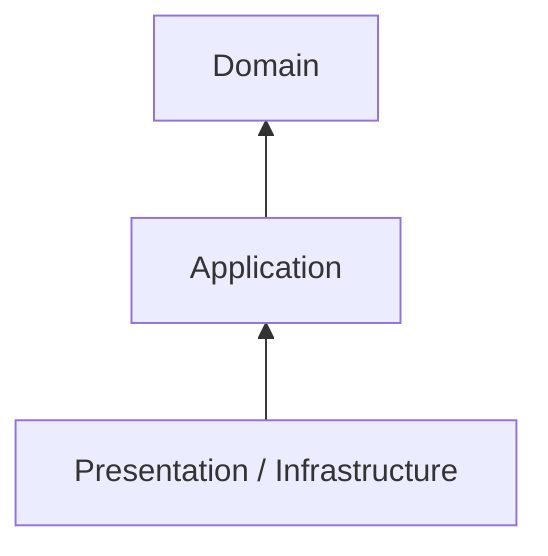
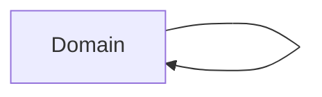
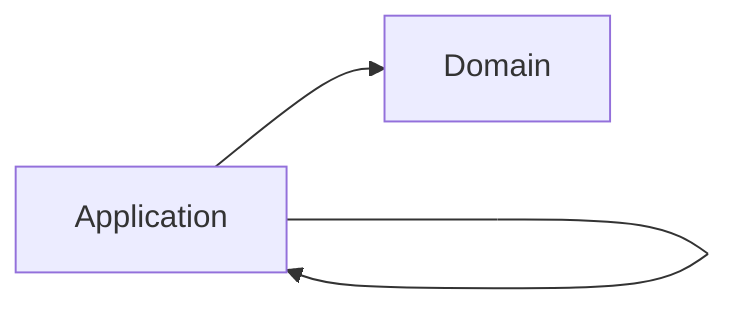
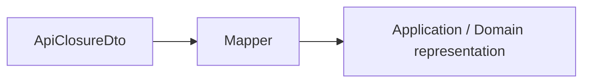
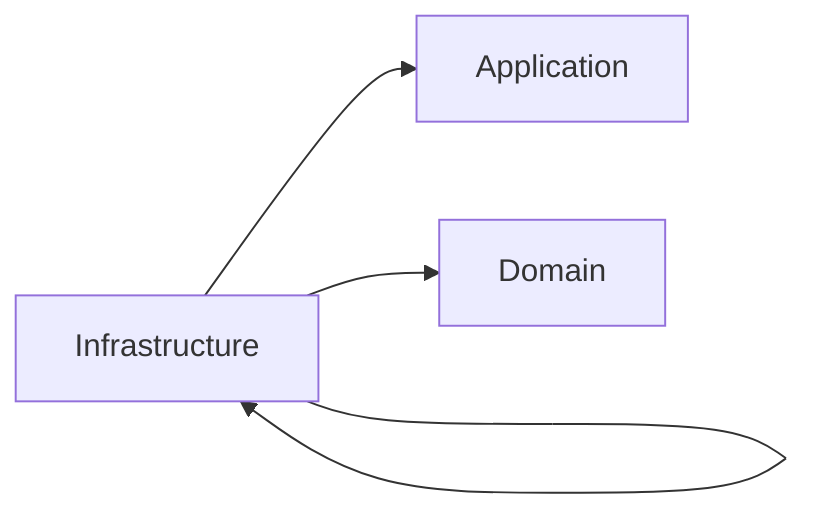
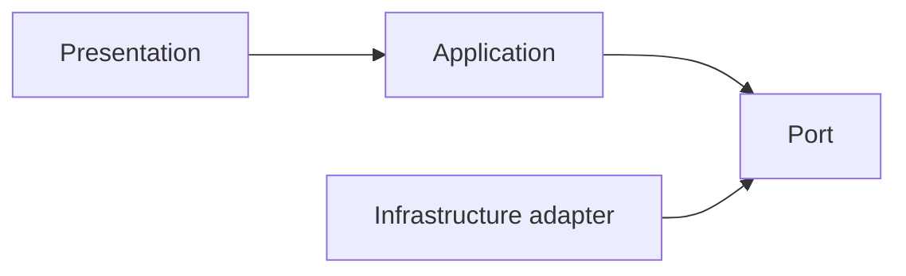
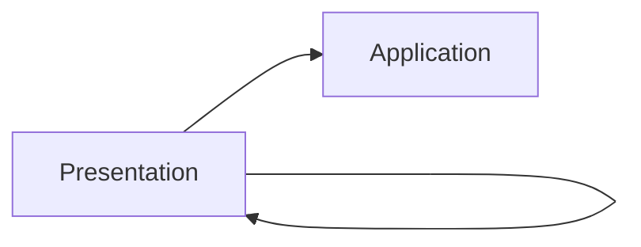
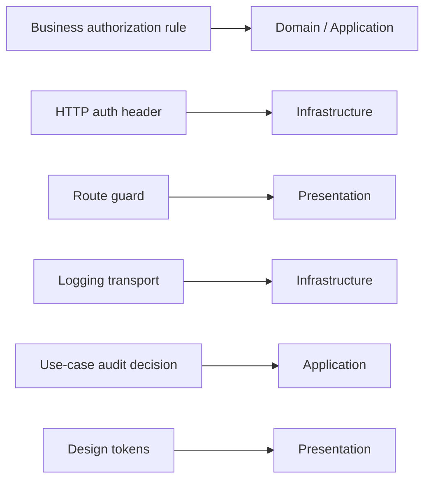

> **[Onion Architecture](README.md)** › The Rings.

# 3. The Rings

This guide uses four practical areas to explain Onion Architecture:



The drawing is a dependency model, not a call-stack diagram. Runtime control can move outward through injected ports while source dependencies still point inward.

---

## 3.1 Domain (innermost)

### Responsibility

Own business concepts, invariants and behavior that are independent of delivery and infrastructure mechanisms.

Typical contents:

- entities;
- value objects;
- domain services when behavior does not naturally belong to one entity/value object;
- domain events;
- domain errors;
- policies/invariants.

Example:

```ts
export class ClosurePeriod {
  private constructor(
    readonly startsOn: LocalDate,
    readonly endsOn: LocalDate,
  ) {}

  static create(startsOn: LocalDate, endsOn: LocalDate) {
    if (endsOn.isBefore(startsOn)) {
      throw new InvalidClosurePeriod()
    }

    return new ClosurePeriod(startsOn, endsOn)
  }
}
```

### Must not know

Domain should not import:

- React/Vue/Svelte;
- Redux/Pinia/Zustand;
- browser storage;
- HTTP clients;
- ORM/database APIs;
- generated transport types;
- CSS/Panda/Tailwind;
- routers/controllers.

### Dependency direction



"Depends on nothing" is useful shorthand for "depends on no outer application layer". Domain code can of course depend on the language/runtime standard library and carefully chosen domain-safe libraries.

### Do not manufacture a rich domain

Not every application needs entity classes and domain services.

If the system mainly transports data with little domain behavior, an anemic-looking model may honestly reflect the problem. Do not invent behavior merely to satisfy an architecture diagram.

---

## 3.2 Application

### Responsibility

Own application-specific policy: the operations the application performs and the capabilities those operations require.

Typical contents:

- use cases/application services;
- commands/queries and results;
- input/output boundaries;
- ports for required external capabilities;
- application errors;
- orchestration across Domain objects and ports.

Example:

```ts
export interface ClosureGateway {
  enqueue(command: ExecuteClosureCommand): Promise<ClosureJob>
}

export function makeExecuteClosure(deps: {
  gateway: ClosureGateway
}) {
  return async function execute(command: ExecuteClosureCommand) {
    const period = ClosurePeriod.create(command.startsOn, command.endsOn)

    return deps.gateway.enqueue({
      ...command,
      period,
    })
  }
}
```

### Must not know

Application should not import:

- concrete HTTP/database/storage adapters;
- React/Redux/UI framework state;
- ORM models;
- transport request/response objects;
- browser APIs such as `File` unless the application is intentionally browser-specific.

### Dependency direction



Ports live here when they express capabilities required by application policy.

Do not create one port per endpoint automatically. Port granularity follows cohesive conversations/capabilities.

---

## 3.3 Infrastructure

### Responsibility

Adapt external technology to contracts understood by inner policy.

Typical contents:

- HTTP/API clients and gateway implementations;
- persistence adapters;
- browser storage adapters;
- SDK wrappers;
- external DTOs/generated types;
- mappers;
- message-broker or realtime protocol clients;
- filesystem/object-storage implementations.

Example:

```ts
export class HttpClosureGateway implements ClosureGateway {
  constructor(private readonly http: HttpClient) {}

  async enqueue(command: ExecuteClosureCommand): Promise<ClosureJob> {
    const dto = toExecuteClosureDto(command)
    const response = await this.http.post('/closures', dto)

    return fromClosureJobDto(response.data)
  }
}
```

The adapter knows the inner contract. The Application layer does not know this class.

### Translation belongs at boundaries

External types should normally stop here:



Do not leak OpenAPI generated models, ORM records or SDK objects inward simply because their TypeScript shapes happen to match.

### Dependency direction



Infrastructure must not depend on Presentation.

---

## 3.4 Presentation (outermost)

### Responsibility

Own rendering, interaction and UI-specific state/behavior.

Typical contents:

- pages/routes/layouts;
- components;
- view models / Presentation Models;
- custom hooks/composables;
- UI state stores/slices;
- selectors/computed values;
- design-system primitives and styles;
- UI-specific validation/formatting.

Example:

```ts
export function useClosures() {
  const state = useClosuresState()
  const actions = useClosuresActions()

  return {
    rows: state.rows,
    busy: state.status !== 'idle',
    query: actions.query,
    reset: actions.reset,
  }
}
```

### Presentation may contain real logic

Examples of Presentation logic:

- modal visibility;
- selected table rows;
- view sorting/filtering;
- loading/error affordances;
- focus management;
- responsive display state;
- formatting a domain/application result for the screen.

That is not business policy merely because it contains conditionals.

### Do not reach directly into Infrastructure when the chosen boundary forbids it

Recommended strict flow:



If a project deliberately allows Presentation to use a technical adapter directly for a simple UI-only concern, document that as a scoped architectural decision. Do not present the leak as the canonical Onion boundary.

### Dependency direction

A strict default:



Some systems allow Presentation to import Domain types directly because Domain is inward. Others require all Presentation contracts to arrive through Application. Pick and enforce one policy.

### Internal frontend architecture

Onion does not specify how Presentation itself should scale.

See:

- **[Presentation Architecture](../frontend/presentation-architecture.md)**
- **[State Management](../frontend/state-management.md)**
- **[Styling and Design Systems](../frontend/styling-and-design-system.md)**

---

## 3.5 Composition is outside the rings' business policy

The executable still needs a bootstrap location that knows concrete implementations:

```ts
const closureGateway = new HttpClosureGateway(http)
const executeClosure = makeExecuteClosure({ gateway: closureGateway })
const store = createAppStore({ executeClosure })
```

Composition is an outer assembly boundary, not another domain layer.

See **[Composition Root](../foundations/composition-root.md)**.

---

## 3.6 Cross-cutting concerns still need owners

"Cross-cutting" is not a license to create a globally imported utility layer.

Examples:



Separate the policy from the mechanism.

## Sources

- Jeffrey Palermo, Onion Architecture series: https://jeffreypalermo.com/2008/07/
- Alistair Cockburn, Hexagonal Architecture: https://alistair.cockburn.us/hexagonal-architecture/
- Robert C. Martin, The Clean Architecture: https://blog.cleancoder.com/uncle-bob/2012/08/13/the-clean-architecture.html
- Martin Fowler, Presentation Model: https://martinfowler.com/eaaDev/PresentationModel.html
