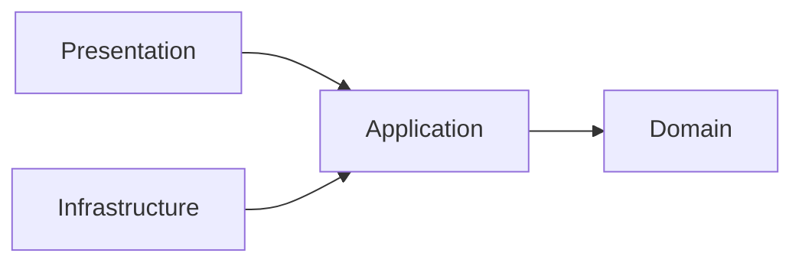
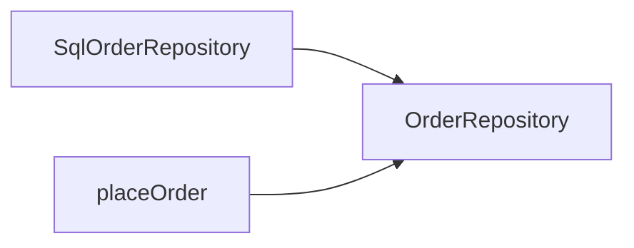
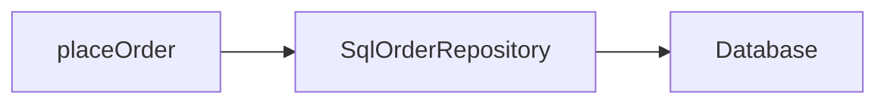
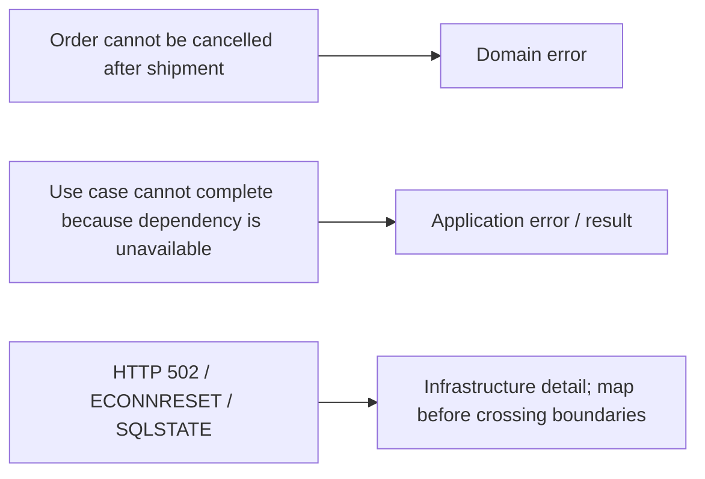
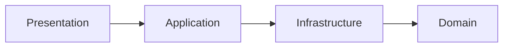

> **[Onion Architecture](README.md)** › Inward Dependencies.

# 2. Inward Dependencies

## 2.1 The principle

[Onion Architecture](../GLOSSARY.md#onion-architecture) protects the center from outer technology.



The important arrow is the **source-code dependency**.

Runtime flow may call an external system in the opposite direction through an injected [port](../GLOSSARY.md#port).

---

## 2.2 Dependency inversion

[Application](../GLOSSARY.md#application-layer) needs an external capability:

```ts
export interface OrderRepository {
  save(order: Order): Promise<void>
}
```

[Infrastructure](../GLOSSARY.md#infrastructure) supplies it:

```ts
export class SqlOrderRepository implements OrderRepository {
  // ...
}
```

[Application](../GLOSSARY.md#application-layer) consumes only the abstraction:

```ts
export function makePlaceOrder(deps: {
  orders: OrderRepository
}) {
  return async function placeOrder(command: PlaceOrderCommand) {
    const order = Order.place(command)
    await deps.orders.save(order)
    return order.id
  }
}
```

Composition connects both:

```ts
const orders = new SqlOrderRepository(db)
const placeOrder = makePlaceOrder({ orders })
```

Source dependency:



Runtime call:



No contradiction exists because dependency direction and control flow are different concepts.

---

## 2.3 Recommended import policy

| Area | Allowed dependencies | Forbidden by the default policy |
| --- | --- | --- |
| [Domain](../GLOSSARY.md#domain) | [Domain](../GLOSSARY.md#domain) | [Application](../GLOSSARY.md#application-layer), [Infrastructure](../GLOSSARY.md#infrastructure), [Presentation](../GLOSSARY.md#presentation-layer) |
| [Application](../GLOSSARY.md#application-layer) | [Application](../GLOSSARY.md#application-layer), [Domain](../GLOSSARY.md#domain) | [Infrastructure](../GLOSSARY.md#infrastructure), [Presentation](../GLOSSARY.md#presentation-layer) |
| [Infrastructure](../GLOSSARY.md#infrastructure) | [Infrastructure](../GLOSSARY.md#infrastructure), [Application](../GLOSSARY.md#application-layer), [Domain](../GLOSSARY.md#domain) | [Presentation](../GLOSSARY.md#presentation-layer) |
| [Presentation](../GLOSSARY.md#presentation-layer) | [Presentation](../GLOSSARY.md#presentation-layer), [Application](../GLOSSARY.md#application-layer); [Domain](../GLOSSARY.md#domain) only if the project explicitly allows it | [Infrastructure](../GLOSSARY.md#infrastructure) |

Composition is allowed to know the concrete modules required to assemble the executable.

This table is a [repository](../GLOSSARY.md#repository) convention for implementing Onion cleanly; Palermo's articles define the inward principle, not these exact folder names.

---

## 2.4 Type imports count

This still creates coupling:

```ts
import type { ApiUserDto } from '@/infrastructure/api'
```

inside [Application](../GLOSSARY.md#application-layer).

TypeScript erases it at runtime, but [Application](../GLOSSARY.md#application-layer) source now names an [Infrastructure](../GLOSSARY.md#infrastructure) concept.

Architectural rules operate on source dependencies, not only runtime bundle dependencies.

---

## 2.5 Re-exports do not change ownership

This does not magically make a [Domain](../GLOSSARY.md#domain) or [Infrastructure](../GLOSSARY.md#infrastructure) type an [Application](../GLOSSARY.md#application-layer) type:

```ts
// application/contract.ts
export type { ApiClosureDto } from '@/infrastructure'
```

[Presentation](../GLOSSARY.md#presentation-layer) importing it through `application/contract` still depends conceptually on an [Infrastructure](../GLOSSARY.md#infrastructure)-owned shape.

[Public APIs](../GLOSSARY.md#public-api) should expose concepts owned by the module, not launder unrelated types through a barrel.

---

## 2.6 External failures

Do not force every infrastructure error into a [Domain error](../GLOSSARY.md#domain-error).

Classify by meaning:



[Presentation](../GLOSSARY.md#presentation-layer) should receive an application/presentation-appropriate failure, not raw Axios/Prisma/driver exceptions.

---

## 2.7 Presentation and Infrastructure are siblings outside Application

Avoid the misleading linear stack:



That makes [Application](../GLOSSARY.md#application-layer) depend on [Infrastructure](../GLOSSARY.md#infrastructure) or suggests [Infrastructure](../GLOSSARY.md#infrastructure) is an inner service layer.

The intended model is:


[Infrastructure](../GLOSSARY.md#infrastructure) implements [Application](../GLOSSARY.md#application-layer)-owned [ports](../GLOSSARY.md#port).

---

## 2.8 Adding a capability

Do not blindly create four files/folders.

A policy-bearing capability may evolve inside-out:

1. identify [Domain](../GLOSSARY.md#domain) concept/[invariant](../GLOSSARY.md#invariant) if one exists;
2. define [Application](../GLOSSARY.md#application-layer) operation;
3. define only the external [ports](../GLOSSARY.md#port) the operation genuinely needs;
4. implement [Infrastructure](../GLOSSARY.md#infrastructure) [adapters](../GLOSSARY.md#adapter);
5. expose the operation to [Presentation](../GLOSSARY.md#presentation-layer);
6. wire concrete dependencies at composition;
7. add [architecture tests](../GLOSSARY.md#architecture-test) for important boundaries.

A CRUD screen with no meaningful domain policy may need much less structure.

---

## 2.9 Enforce imports

Treat the import matrix as executable policy.

See **[Executable Architecture](../foundations/architecture-testing.md)** for [AST](../GLOSSARY.md#abstract-syntax-tree-ast) tests and dependency-graph tools.

## Sources

- Jeffrey Palermo, [Onion Architecture](../GLOSSARY.md#onion-architecture) series: https://jeffreypalermo.com/2008/07/
- Alistair Cockburn, [Hexagonal Architecture](../GLOSSARY.md#hexagonal-architecture-ports-and-adapters): https://alistair.cockburn.us/hexagonal-architecture/
- Robert C. Martin, The [Clean Architecture](../GLOSSARY.md#clean-architecture): https://blog.cleancoder.com/uncle-bob/2012/08/13/the-clean-architecture.html
