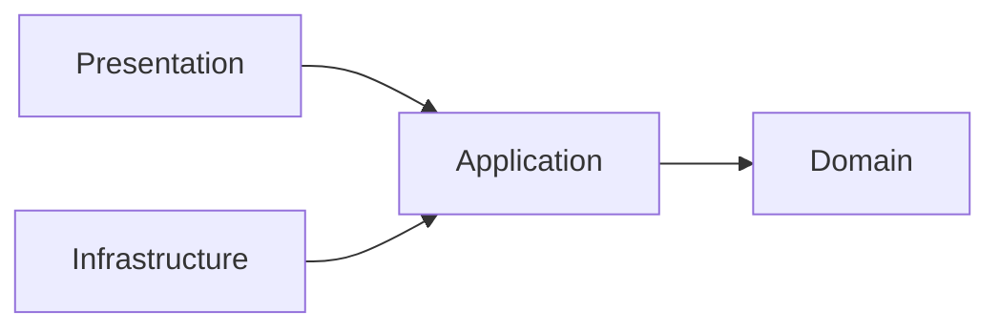
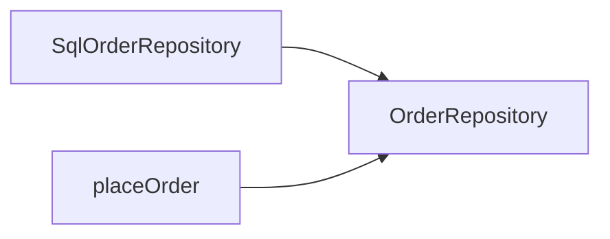
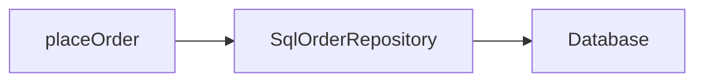
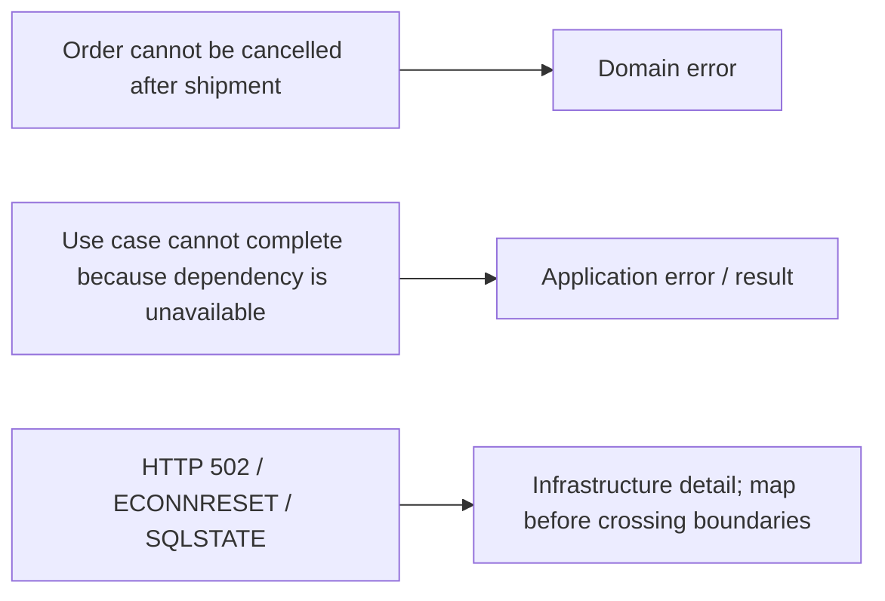
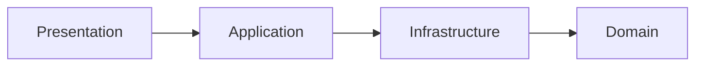

> **[Onion Architecture](README.md)** › Inward Dependencies.

# 2. Inward Dependencies

## 2.1 The principle

Onion Architecture protects the center from outer technology.



The important arrow is the **source-code dependency**.

Runtime flow may call an external system in the opposite direction through an injected port.

---

## 2.2 Dependency inversion

Application needs an external capability:

```ts
export interface OrderRepository {
  save(order: Order): Promise<void>
}
```

Infrastructure supplies it:

```ts
export class SqlOrderRepository implements OrderRepository {
  // ...
}
```

Application consumes only the abstraction:

```ts
export function makePlaceOrder(deps: {
  orders: OrderRepository
}) {
  return async function placeOrder(command: PlaceOrderCommand) {
    const order = Order.place(command)
    await deps.orders.save(order)
    return order.id
  }
}
```

Composition connects both:

```ts
const orders = new SqlOrderRepository(db)
const placeOrder = makePlaceOrder({ orders })
```

Source dependency:



Runtime call:



No contradiction exists because dependency direction and control flow are different concepts.

---

## 2.3 Recommended import policy

```text
Domain
  allowed: Domain
  forbidden: Application, Infrastructure, Presentation

Application
  allowed: Application, Domain
  forbidden: Infrastructure, Presentation

Infrastructure
  allowed: Infrastructure, Application, Domain
  forbidden: Presentation

Presentation
  allowed: Presentation, Application
  optional project policy: Domain
  forbidden by strict default: Infrastructure
```

Composition is allowed to know the concrete modules required to assemble the executable.

This table is a repository convention for implementing Onion cleanly; Palermo's articles define the inward principle, not these exact folder names.

---

## 2.4 Type imports count

This still creates coupling:

```ts
import type { ApiUserDto } from '@/infrastructure/api'
```

inside Application.

TypeScript erases it at runtime, but Application source now names an Infrastructure concept.

Architectural rules operate on source dependencies, not only runtime bundle dependencies.

---

## 2.5 Re-exports do not change ownership

This does not magically make a Domain or Infrastructure type an Application type:

```ts
// application/contract.ts
export type { ApiClosureDto } from '@/infrastructure'
```

Presentation importing it through `application/contract` still depends conceptually on an Infrastructure-owned shape.

Public APIs should expose concepts owned by the module, not launder unrelated types through a barrel.

---

## 2.6 External failures

Do not force every infrastructure error into a Domain error.

Classify by meaning:



Presentation should receive an application/presentation-appropriate failure, not raw Axios/Prisma/driver exceptions.

---

## 2.7 Presentation and Infrastructure are siblings outside Application

Avoid the misleading linear stack:



That makes Application depend on Infrastructure or suggests Infrastructure is an inner service layer.

The intended model is:


Infrastructure implements Application-owned ports.

---

## 2.8 Adding a capability

Do not blindly create four files/folders.

A policy-bearing capability may evolve inside-out:

1. identify Domain concept/invariant if one exists;
2. define Application operation;
3. define only the external ports the operation genuinely needs;
4. implement Infrastructure adapters;
5. expose the operation to Presentation;
6. wire concrete dependencies at composition;
7. add architecture tests for important boundaries.

A CRUD screen with no meaningful domain policy may need much less structure.

---

## 2.9 Enforce imports

Treat the import matrix as executable policy.

See **[Executable Architecture](../foundations/architecture-testing.md)** for AST tests and dependency-graph tools.

## Sources

- Jeffrey Palermo, Onion Architecture series: https://jeffreypalermo.com/2008/07/
- Alistair Cockburn, Hexagonal Architecture: https://alistair.cockburn.us/hexagonal-architecture/
- Robert C. Martin, The Clean Architecture: https://blog.cleancoder.com/uncle-bob/2012/08/13/the-clean-architecture.html
