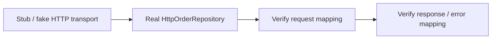
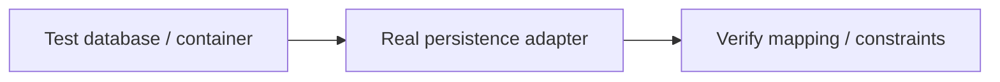
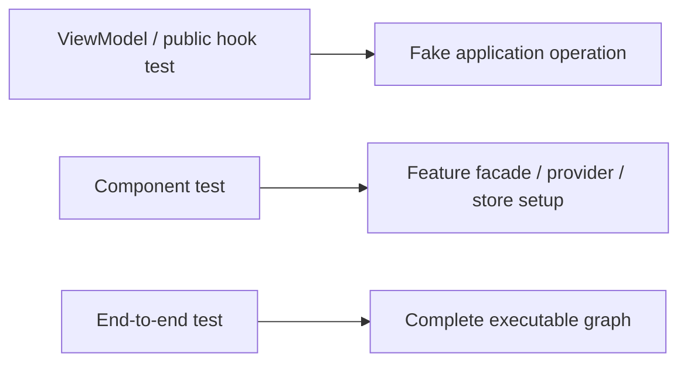
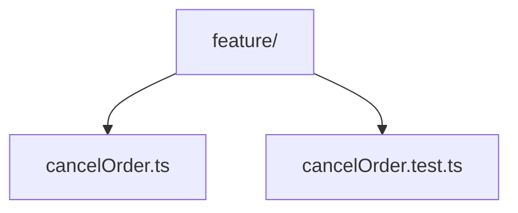

> **[Onion Architecture](README.md)** › Testing the Rings.

# 5. Testing the Rings

Testing should follow ownership boundaries rather than reproduce the entire application graph for every test.

The value of Onion Architecture is that inner policy can be tested without outer mechanisms.

---

## 5.1 Domain tests

Test business invariants with no framework, network or store.

```ts
test('a shipped order cannot be cancelled', () => {
  const order = Order.shipped(orderId)

  expect(() => order.cancel())
    .toThrow(ShippedOrderCannotBeCancelled)
})
```

Prefer state-based tests of observable business behavior over implementation-detail mocks.

---

## 5.2 Application tests

Replace required ports with small fakes/stubs:

```ts
class InMemoryOrders implements OrderRepository {
  byId = new Map<string, Order>()

  async findById(id: OrderId) {
    return this.byId.get(id.value) ?? null
  }

  async save(order: Order) {
    this.byId.set(order.id.value, order)
  }
}

test('cancel order persists the changed order', async () => {
  const orders = new InMemoryOrders()
  const order = Order.pending(orderId)
  orders.byId.set(orderId.value, order)

  const cancelOrder = makeCancelOrder({ orders })

  await cancelOrder(orderId)

  expect((await orders.findById(orderId))?.isCancelled())
    .toBe(true)
})
```

The test knows the port, not a concrete HTTP/database file path.

---

## 5.3 Infrastructure adapter tests

Test that the adapter correctly translates between external and inner representations.

For HTTP:



For persistence:



Do not mock the mapper you are trying to test.

---

## 5.4 Presentation tests

Test at the Presentation contract appropriate to the feature:



Avoid mocking Infrastructure directly from a component test when Presentation is designed to depend only on Application. That test would couple the component to a detail its production code should not know.

---

## 5.5 Contract tests for ports/adapters

When multiple adapters implement the same important port, reusable contract tests can assert common behavior.

Example:

```ts
export function orderRepositoryContract(
  makeRepository: () => Promise<OrderRepository>
) {
  test('saved order can be loaded', async () => {
    const repo = await makeRepository()
    const order = Order.pending(orderId)

    await repo.save(order)

    expect(await repo.findById(orderId))
      .toEqual(order)
  })
}
```

Run it against in-memory, SQL or other adapters where the semantics should match.

---

## 5.6 Architecture tests

Behavioral tests do not verify dependency direction.

Add separate checks for:

- forbidden layer imports;
- type-only imports;
- cross-feature deep imports;
- framework imports in Domain/Application;
- cycles;
- public API boundaries.

See **[Executable Architecture](../foundations/architecture-testing.md)**.

---

## 5.7 Test placement

Either colocation or a mirrored test tree can work.

Recommended default for unit/component tests:



Use dedicated integration/e2e directories where setup is shared or tests span several modules.

Do not make `__tests__` mandatory merely to make the tree look consistent.

---

## 5.8 Test doubles by purpose

Use the smallest double that expresses the test:

- **stub** — returns controlled values;
- **spy** — records interactions;
- **fake** — working lightweight implementation;
- **mock** — expectation-driven collaborator where interaction itself matters.

Avoid mocking everything by default. Excessive mocks couple tests to implementation structure and make refactoring expensive.

---

## 5.9 The pyramid is not a quota

Keep many fast tests around stable policy and fewer expensive tests around complete integration, but do not enforce arbitrary percentages.

Risk should determine coverage:

- pure invariant -> cheap unit tests;
- mapping/database behavior -> integration tests;
- critical user journey -> end-to-end tests.

## Sources

- Martin Fowler, "Mocks Aren't Stubs": https://martinfowler.com/articles/mocksArentStubs.html
- Ham Vocke, "The Practical Test Pyramid": https://martinfowler.com/articles/practical-test-pyramid.html
- Gerard Meszaros, *xUnit Test Patterns* (2007)
- Robert C. Martin, *Clean Architecture* (2017), Test Boundary
