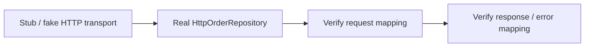
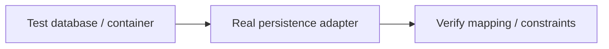
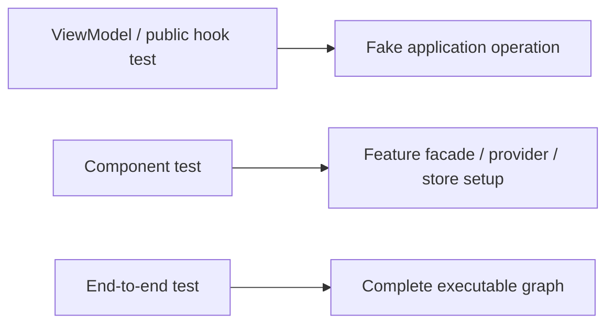
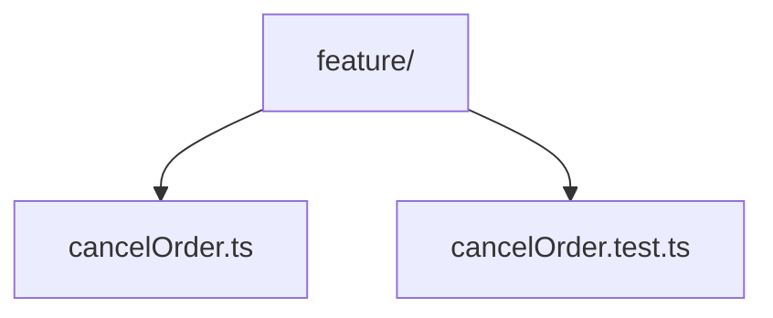

> **[Onion Architecture](README.md)** › Testing the Rings.

<a id="5-testing-the-layers"></a>
<a id="54-per-layer-testing"></a>
<a id="57-justification"></a>
<a id="5-testing-the-rings"></a>

<a id="51-tests-are-an-outer-ring"></a>

# 3. Testing the Rings

Testing should follow ownership boundaries rather than reproduce the entire application graph for every test.

The value of [Onion Architecture](../GLOSSARY.md#onion-architecture) is that inner policy can be tested without outer mechanisms.

---

<a id="domain-substitute-nothing"></a>
<a id="51-domain-tests"></a>

The code fragments assume Vitest imports plus `Order`, `OrderStatus`, `OrderRepository`, `makeCancelOrder` and `PersistenceFailure` from [the complete landing feature](README.md#11-first-feature-end-to-end). They illustrate test responsibilities; each implementation must supply fresh fixtures and its real integration setup.

## 3.1 Domain tests

Test business [invariants](../GLOSSARY.md#invariant) with no framework, network or [store](../GLOSSARY.md#store).

```ts
test('a shipped order cannot be cancelled', () => {
  const order = new Order('1', 'shipped')

  expect(() => order.cancel())
    .toThrow(ShippedOrderCannotBeCancelled)
})
```

Prefer state-based tests of observable business behavior over implementation-detail [mocks](../GLOSSARY.md#mock).

---

<a id="52-application-tests"></a>

<a id="application-substitute-the-port"></a>

## 3.2 Application tests

Replace required [ports](../GLOSSARY.md#port) with small [fakes](../GLOSSARY.md#fake)/[stubs](../GLOSSARY.md#stub):

```ts
// Vitest excerpt, using imports from the landing feature's complete files.
class InMemoryOrders implements OrderRepository {
  byId = new Map<string, { status: OrderStatus; version: string }>()
  async findById(id: string) {
    const record = this.byId.get(id)
    return record ? { order: new Order(id, record.status), version: record.version } : null
  }
  async save(order: Order, version: string) {
    if (this.byId.get(order.id)?.version !== version) throw new PersistenceFailure('conflict')
    this.byId.set(order.id, { status: order.status, version: version + ':next' })
  }
}
test('cancel order persists changed state', async () => {
  const orders = new InMemoryOrders()
  orders.byId.set('1', { status: 'pending', version: 'v1' })
  expect(await makeCancelOrder(orders)('1')).toEqual({ ok: true, status: 'cancelled' })
  expect((await orders.findById('1'))?.order.status).toBe('cancelled')
})
```

The test knows the [port](../GLOSSARY.md#port), not a concrete HTTP/database file path.

---

<a id="53-infrastructure-adapter-tests"></a>

<a id="infrastructure-substitute-the-transport-keep-the-mapping-real"></a>

## 3.3 Infrastructure adapter tests

Test that the [adapter](../GLOSSARY.md#adapter) correctly translates between external and inner representations.

For HTTP:



For persistence:



Do not [mock](../GLOSSARY.md#mock) the [mapper](../GLOSSARY.md#mapper) you are trying to test.

---

<a id="54-presentation-tests"></a>

<a id="presentation-substitute-the-use-case"></a>

## 3.4 Presentation tests

Test at the [Presentation](../GLOSSARY.md#presentation-layer) contract appropriate to the feature:



Avoid mocking [Infrastructure](../GLOSSARY.md#infrastructure) directly from a component test when [Presentation](../GLOSSARY.md#presentation-layer) is designed to depend only on [Application](../GLOSSARY.md#application-layer). That test would couple the component to a detail its production code should not know.

---

<a id="55-contract-tests-for-portsadapters"></a>

## 3.5 Contract tests for ports/adapters

When multiple [adapters](../GLOSSARY.md#adapter) implement the same important [port](../GLOSSARY.md#port), reusable [contract tests](../GLOSSARY.md#contract-test) can assert common behavior.

Example:

```ts
// Each implementation factory supplies a fresh repository seeded with pending order '1'.
export function orderRepositoryContract(makeSeededRepository: () => Promise<OrderRepository>) {
  test('a conditional save can be loaded', async () => {
    const repo = await makeSeededRepository()
    const loaded = await repo.findById('1')
    if (!loaded) throw new Error('contract fixture must seed order 1')
    loaded.order.cancel()
    await repo.save(loaded.order, loaded.version)
    expect((await repo.findById('1'))?.order.status).toBe('cancelled')
  })
}
```

Run it against in-memory, SQL or other [adapters](../GLOSSARY.md#adapter) where the semantics should match.

---

<a id="56-architecture-tests"></a>

## 3.6 Architecture tests

Behavioral tests do not verify dependency direction.

Add separate checks for:

- forbidden layer imports;
- [type-only imports](../GLOSSARY.md#type-only-import);
- cross-feature deep imports;
- framework imports in [Domain](../GLOSSARY.md#domain)/[Application](../GLOSSARY.md#application-layer);
- cycles;
- [public API](../GLOSSARY.md#public-api) boundaries.

See **[Executable Architecture](../foundations/architecture-testing.md)**.

---

<a id="57-test-placement"></a>

<a id="56-where-tests-live"></a>

## 3.7 Test placement

Either [colocation](../GLOSSARY.md#colocation) or a mirrored test tree can work.

Recommended default for unit/component tests:



Use dedicated integration/e2e directories where setup is shared or tests span several modules.

Do not make `__tests__` mandatory merely to make the tree look consistent.

---

<a id="58-test-doubles-by-purpose"></a>

<a id="52-a-vocabulary-for-substitutes"></a>

<a id="55-what-each-layers-tests-substitute"></a>

## 3.8 Test doubles by purpose

Use the smallest double that expresses the test:

- **[stub](../GLOSSARY.md#stub)** — returns controlled values;
- **[spy](../GLOSSARY.md#spy)** — records interactions;
- **[fake](../GLOSSARY.md#fake)** — working lightweight implementation;
- **[mock](../GLOSSARY.md#mock)** — expectation-driven collaborator where interaction itself matters.

Avoid mocking everything by default. Excessive [mocks](../GLOSSARY.md#mock) couple tests to implementation structure and make refactoring expensive.

---

<a id="53-the-test-pyramid-mapped-onto-the-onion"></a>
<a id="59-the-pyramid-is-not-a-quota"></a>

## 3.9 The pyramid is not a quota

Keep many fast tests around stable policy and fewer expensive tests around complete integration, but do not enforce arbitrary percentages.

Risk should determine coverage:

- pure [invariant](../GLOSSARY.md#invariant): cheap unit tests;
- mapping/database behavior: integration tests;
- critical user journey: end-to-end tests.

## Sources

- Martin Fowler, "[Mocks](../GLOSSARY.md#mock) Aren't [Stubs](../GLOSSARY.md#stub)": https://martinfowler.com/articles/mocksArentStubs.html
- Ham Vocke, "The Practical [Test Pyramid](../GLOSSARY.md#test-pyramid)": https://martinfowler.com/articles/practical-test-pyramid.html
- Gerard Meszaros, *xUnit Test Patterns* (2007)
- Robert C. Martin, *[Clean Architecture](../GLOSSARY.md#clean-architecture)* (2017), Test Boundary
