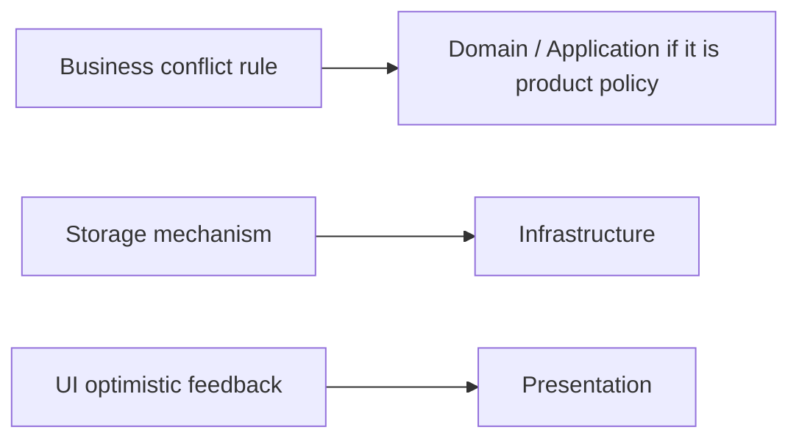
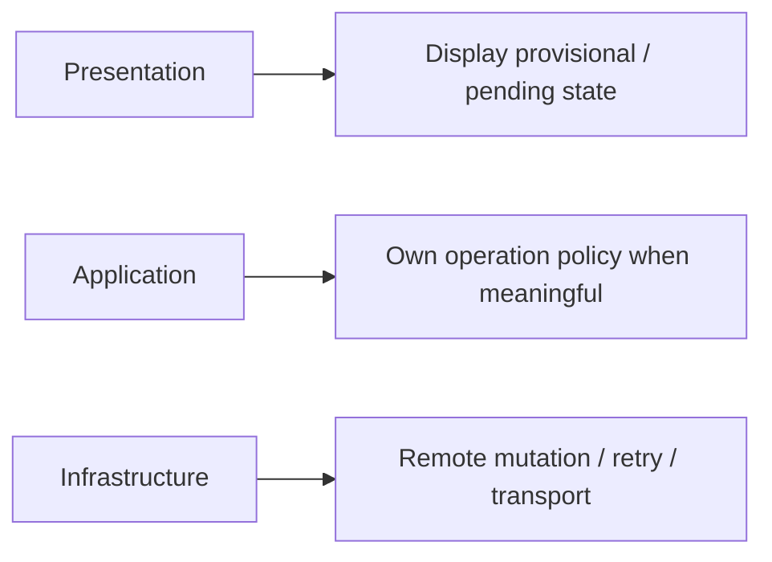
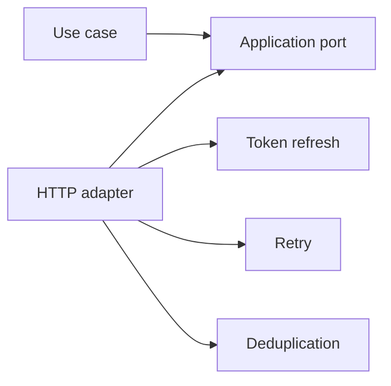
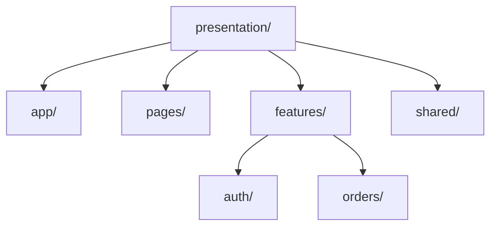
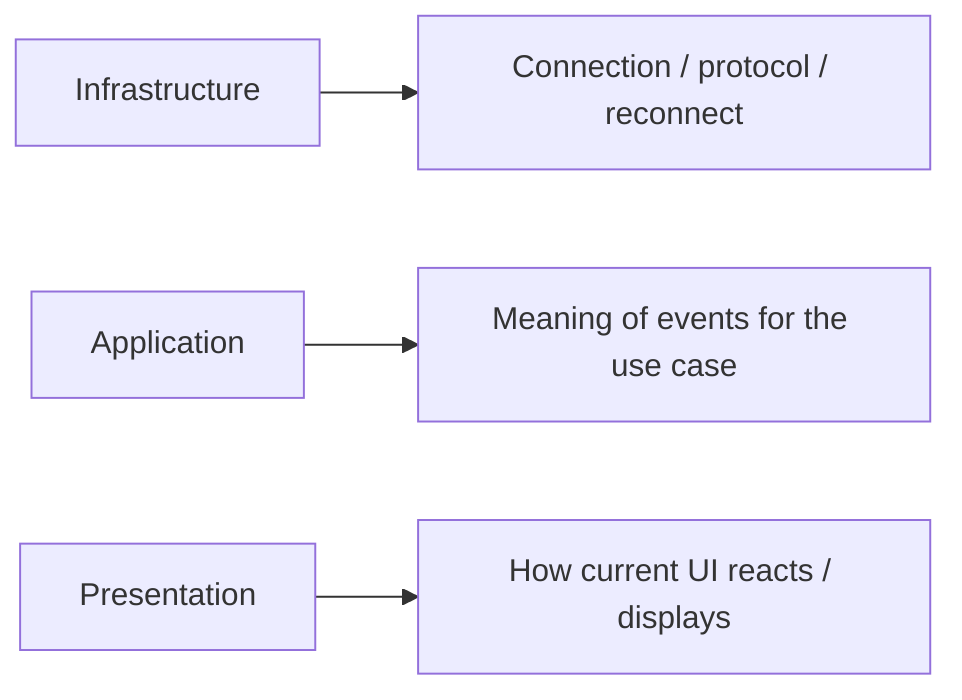

> **[Onion Architecture](README.md)** › Advanced Patterns.

# 8. Advanced Patterns

These patterns are **not part of the definition of [Onion Architecture](../GLOSSARY.md#onion-architecture)**. They are examples of production concerns that should be assigned to an owner without reversing dependency direction.

---

## 8.1 Offline data and synchronization

Offline caching, conflict resolution and synchronization are not automatically [Domain](../GLOSSARY.md#domain) concerns.

Separate:

For example, "last write wins" is only a correct domain rule if the product actually accepts that conflict policy. Do not call a timestamp overwrite strategy a [CRDT](../GLOSSARY.md#crdt) merely because it resolves conflicts.

A true [CRDT](../GLOSSARY.md#crdt) has mathematical convergence properties; a simple [LWW](../GLOSSARY.md#last-write-wins-lww) policy may be appropriate, but name it accurately.

---

## 8.2 Optimistic updates

Optimistic feedback usually spans concerns:

Rollback/reconciliation semantics belong where their meaning lives.

A generic [server-state](../GLOSSARY.md#server-state) library can own purely technical cache reconciliation when no application policy is being bypassed.

---

## 8.3 Token refresh and request deduplication

Transparent HTTP token refresh, request coalescing and transport retries are normally [Infrastructure](../GLOSSARY.md#infrastructure) concerns.

Inner policy should not receive raw `401`, Axios errors or retry counters unless those details have actual application meaning.

---

## 8.4 Feature ownership in Presentation

A growing [Presentation layer](../GLOSSARY.md#presentation-layer) benefits from feature ownership, but that is **frontend architecture inside the outer ring**, not an Onion ring.

The canonical guide is:

**[Frontend Presentation Architecture](../frontend/presentation-architecture.md)**

Recommended direction:

Do not duplicate the full frontend folder specification inside the Onion guide.

---

## 8.5 State libraries

Redux, Pinia, Zustand and equivalent state libraries are [Presentation](../GLOSSARY.md#presentation-layer) mechanisms.

They can call [Application](../GLOSSARY.md#application-layer) [use cases](../GLOSSARY.md#use-case) through injected dependencies/[adapters](../GLOSSARY.md#adapter) without becoming a new Onion layer.

See **[State Management and Side Effects](../frontend/state-management.md)**.

---

## 8.6 Design systems

CSS, Panda CSS, Tailwind, CSS Modules and component [recipes](../GLOSSARY.md#recipe) are [Presentation](../GLOSSARY.md#presentation-layer) mechanisms.

Token/[recipe](../GLOSSARY.md#recipe) architecture is documented centrally in:

**[Styling and Design-System Architecture](../frontend/styling-and-design-system.md)**.

---

## 8.7 Background and realtime work

WebSocket/SSE clients, message subscriptions and browser workers are outer mechanisms.

A useful split:

If reconnect policy itself is a product requirement, elevate that policy appropriately instead of assuming every retry rule is merely [Infrastructure](../GLOSSARY.md#infrastructure).

---

## 8.8 Do not add patterns by fashion

Before introducing [CQRS](../GLOSSARY.md#cqrs), [event sourcing](../GLOSSARY.md#event-sourcing), [CRDTs](../GLOSSARY.md#crdt), a [global state](../GLOSSARY.md#global-state) machine or a complex sync engine, identify the actual force:

- contention?
- offline editing?
- auditability?
- independent reads/writes?
- long-running workflows?
- distributed convergence?

A pattern without its motivating problem is architectural debt.

## Sources

- Jeffrey Palermo, [Onion Architecture](../GLOSSARY.md#onion-architecture): https://jeffreypalermo.com/2008/07/
- Redux, [Side Effects](../GLOSSARY.md#side-effect) Approaches: https://redux.js.org/usage/side-effects-approaches
- Shapiro et al., "Conflict-Free Replicated Data Types" (2011): https://inria.hal.science/inria-00609399/document
