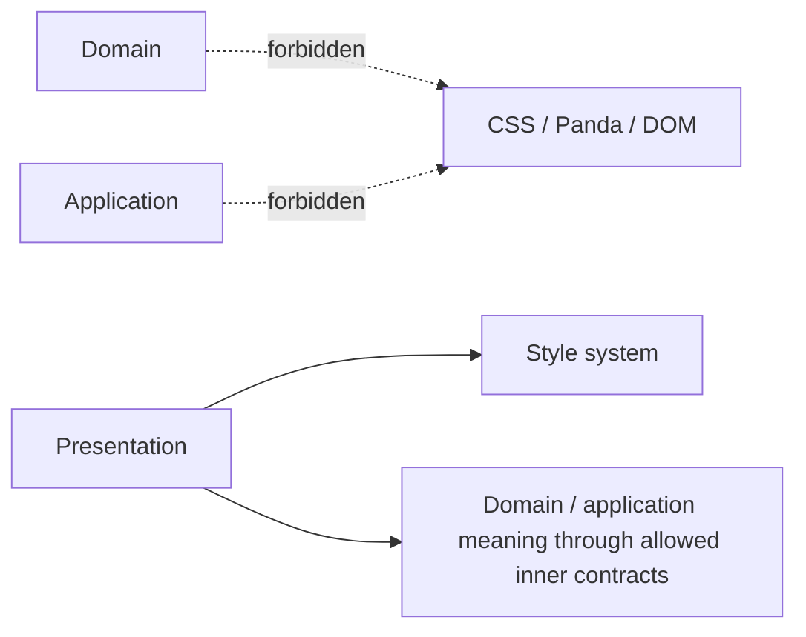
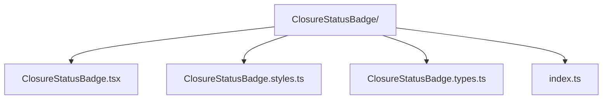

# Styling & Animation in an Onion Application

Styling and animation live in the **Presentation ring** because they exist to render and communicate UI state.

Onion Architecture does not prescribe CSS files, CSS-in-JS, Panda CSS, Tailwind, CSS Modules, GSAP or a particular folder tree.

The canonical repository guidance now lives in:

**[Frontend Styling and Design-System Architecture](../frontend/styling-and-design-system.md)**

That guide covers:

- primitive vs. semantic design tokens;
- Panda `sva` local slot recipes;
- `defineRecipe` / `defineSlotRecipe` for shared design-system recipes;
- component colocation;
- avoiding duplicate recipe ownership;
- global styles and keyframes;
- responsive policy;
- runtime inline values;
- variants vs. specificity escalation.

## Onion-specific rule

Presentation styling may depend on UI state and design-system contracts.

Inner layers must not depend on styling mechanisms:



A domain status may be mapped to a visual tone in Presentation:

```ts
function closureTone(status: ClosureStatus): BadgeTone {
  switch (status) {
    case 'completed':
      return 'success'
    case 'failed':
      return 'danger'
    default:
      return 'neutral'
  }
}
```

Do not put `color: 'green'` or `badgeVariant` into the Domain object.

## Colocation

Component-local visual concerns should normally travel with the component:



Shared design-system primitives belong to a shared design-system owner.

That is a Presentation organization choice, not a new ring.

## Sources

- Panda CSS documentation: https://panda-css.com/
- Kent C. Dodds, "Colocation": https://kentcdodds.com/blog/colocation
