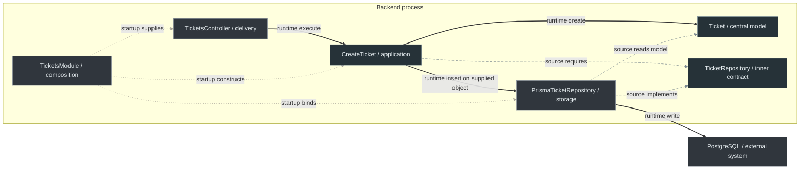

# 7. Onion Architecture on the Backend

← [Onion guide](README.md) · [Backend learning path](../backend/README.md) · [Clean on the backend](../clean-architecture/8-clean-on-the-backend.md)

An analyst submits a subject and description for a support ticket. Whether the request arrives through HTTP or a command line, the support capability must decide what makes that ticket valid and save it before reporting success. If those decisions import Nest or Prisma, replacing either tool can force us to revisit business behavior.

The [canonical ticket modules](../backend/2-typescript-first-boundaries.md) solve that concrete problem: `Ticket.create()` assigns the initial state and checks the subject; `CreateTicket.execute()` asks a supplied object to insert it; delivery translates the caller's data. This chapter reads that existing code through Onion's responsibilities. It does not create a second implementation.

## 1. What belongs at the center?

The support team requires a trimmed, nonblank subject bounded to 160 string units and an initial state of `open`. Those rules still make sense without a server, a table or a screen. `Ticket` records their business meaning and protects construction. This combination of business state and behavior is the **domain model** at Onion's center.

The status list owns the valid vocabulary; the creation factory owns the initial-state decision. Neither a [DTO](../GLOSSARY.md#data-transfer-object-dto) decorator nor a database default becomes another owner. The backend is authoritative for persisted tickets; frontend feedback cannot prevent another caller bypassing the form.

Around that model, code coordinates creating and saving. That is **[Application](../GLOSSARY.md#application-layer)**: the operation's workflow and the capabilities it requires. It should not parse HTTP headers or issue Prisma queries. A separate [domain service](../GLOSSARY.md#domain-service) would be justified only by business behavior that does not naturally belong to `Ticket`; the subject rule does not need one.

Jeffrey Palermo introduced Onion in 2008 to externalize infrastructure around an independent object model. His [original description](https://jeffreypalermo.com/2008/07/the-onion-architecture-part-1/) and [four tenets](https://jeffreypalermo.com/2008/08/the-onion-architecture-part-3/) motivate these responsibilities, not specific TypeScript folders. This fits meaningful, long-lived ticket policy; a disposable CRUD utility may need less mapping and fewer files.

## 2. Why does the storage contract belong inward?

The operation needs an object with `insert(ticket): Promise<void>`. That promise must complete before success is returned. `TicketRepository` records the requirement; it performs no database call and is not another runtime process. Its implementation may use memory or PostgreSQL.

| Actual artifact | Responsibility | Allowed source dependencies | Keep out |
| --- | --- | --- | --- |
| `Ticket`, `TICKET_STATUSES`, `INITIAL_TICKET_STATUS` | domain meaning and creation rules | domain code | Nest, generated records, caller [DTOs](../GLOSSARY.md#data-transfer-object-dto) |
| `CreateTicket`, command/result | creation workflow | domain and application contracts | SQL, HTTP statuses, concrete storage |
| `TicketRepository` | the required insert capability | domain data/behavior | Prisma client types or transaction handles |
| `TicketsController`, parser/pipe | external invocation and HTTP translation | application API, local delivery code and Nest | initial-state or subject-policy copies |
| `PrismaTicketRepository` | technical write, mapping and failure translation | inward model/contract plus Prisma | ownership of ticket validity |
| `TicketsModule` | startup object construction and binding | the concrete pieces it assembles | business decisions |

Here the **[Application](../GLOSSARY.md#application-layer) owner** needs persistence, so its contract lives there. Palermo describes repository interfaces in a layer immediately around the domain model. Other Onion implementations can put a business-owned repository abstraction in a domain-services area. Decide by who requires and owns the conversation; do not relocate every interface to `domain/` merely to match a picture. In both placements, the concrete database implementation stays outside and depends toward the contract.

The canonical physical hierarchy is layer first: `domain/`, `application/`, `infrastructure/`, `presentation/` and `composition/`, with capabilities inside each layer. HTTP/CLI delivery belongs to [Presentation](../GLOSSARY.md#presentation-layer). These are handbook conventions, not Palermo's filesystem prescription. The [placement and naming guide](../backend/README.md#place-your-first-feature), [Scaling example](../foundations/code-placement.md#12-grow-capabilities-inside-each-layer) and [public entry points](../backend/4-create-ticket-with-nestjs.md#4-wire-memory-first) explain the choices without adding another folder taxonomy.

## 3. Trace source, startup and runtime separately

At startup, `TicketsModule` creates the storage object and supplies it to the plain operation. During a request, `TicketsController` invokes that operation; the operation creates a ticket and calls the injected storage object directly. The interface is only the source contract both refer to.

Solid paths below mean **runtime calls**; long dashes show selected **source requirements/implementation**; short dotted paths mean **startup wiring**. The table above also states the controller's import of the operation and the operation's import of [Domain](../GLOSSARY.md#domain); those imports are omitted from the drawing to avoid overlapping their call arrows. PostgreSQL is outside the process boundary:

The inner code can compile and run with a supplied memory implementation, without installing Nest or Prisma. The [executable ticket check](../scripts/backend-ticket-example.test.mjs) verifies that property, creation behavior and forbidden source dependencies. This is not a claim that a deployed operation needs no working persistence.

The controller and repository combine translation with technical glue under the [canonical outer-module choice](../foundations/dependency-boundaries.md#combined-outer-modules). A controller's Nest dependency does not move ticket policy outward. A [Nest module](../GLOSSARY.md#nestjs-module)'s provider visibility does not enforce source privacy; other capabilities use the supported public entry points, not the parser or storage internals.

## 4. What changes when the product changes?

| Pressure | Single owner or boundary to change | What should remain stable |
| --- | --- | --- |
| Shorter subject limit or another status | domain factory/vocabulary; affected behavior tests and supported API consumers | no second rule in HTTP or Prisma |
| Storage field rename or another database | [adapter](../GLOSSARY.md#adapter) mapping, migration/setup and startup binding | `Ticket` validity and creation workflow |
| CLI or message consumer invokes creation | a new inbound [adapter](../GLOSSARY.md#adapter) parses its own input and establishes relevant permissions | the existing domain rule and operation |
| Tickets, Billing and Notifications have separate teams | each capability's supported operations and model ownership | consumers do not deep-import unrelated internals |
| Creation also consumes a shared quota | [Domain](../GLOSSARY.md#domain) defines capacity; [Application](../GLOSSARY.md#application-layer) requires a combined check/write; [Infrastructure](../GLOSSARY.md#infrastructure) implements atomicity and concurrency protection | the HTTP handler does not own a counter or transaction |

Storage can fail before or after a write commits. Mapping an outage to `unavailable` does not establish that nothing was saved or that a retry is safe. Identity/tenant verification, retry deduplication and reliable messaging require explicit product requirements; inward dependencies do not implement them.

## 5. Compare with Clean, then practise

Onion emphasizes the independent domain model and infrastructure outside its core. Clean names general business policy, application policy, boundary translation and mechanisms. The same ticket can satisfy both inward principles while their taxonomies and contract placement language differ. Neither requires [DDD](../GLOSSARY.md#domain-driven-design-ddd) patterns, a [DI container](../GLOSSARY.md#di-container) or an interface around every class. See [Palermo's later clarification](https://jeffreypalermo.com/2013/08/onion-architecture-part-4-after-four-years/) and [Martin's policy circles](https://blog.cleancoder.com/uncle-bob/2012/08/13/the-clean-architecture.html).

For returned results versus an optional [output port](../GLOSSARY.md#output-port)/[presenter](../GLOSSARY.md#presenter), read [Clean's application boundary](../clean-architecture/8-clean-on-the-backend.md#83-step-2--the-port-and-the-use-case-unchanged-shape). Both choices must keep the operation independent of HTTP representation.

Try [the boundary exercises](../backend/6-boundary-exercises.md): change ticket policy, invoke creation through a CLI, and reproduce a shared-quota race. They run as plain TypeScript checks. Database integration tests must separately verify persistence mapping, atomicity, real driver failures and shutdown; Nest integration tests must verify routing and delivery wiring. Those integrations are source-reviewed, not executed in this package.

## Sources

- [Palermo — Onion, part 1](https://jeffreypalermo.com/2008/07/the-onion-architecture-part-1/): central model and inward repository interfaces.
- [Palermo — Onion, part 3](https://jeffreypalermo.com/2008/08/the-onion-architecture-part-3/): inward coupling and independently executable core.
- [Palermo — Onion, part 4](https://jeffreypalermo.com/2013/08/onion-architecture-part-4-after-four-years/): variable implementation choices, [DDD](../GLOSSARY.md#domain-driven-design-ddd) and container independence.
- [Martin — Clean Architecture](https://blog.cleancoder.com/uncle-bob/2012/08/13/the-clean-architecture.html): the related policy/translation distinction.
- [Backend references](../backend/references.md): official sources for the shared implementation.
