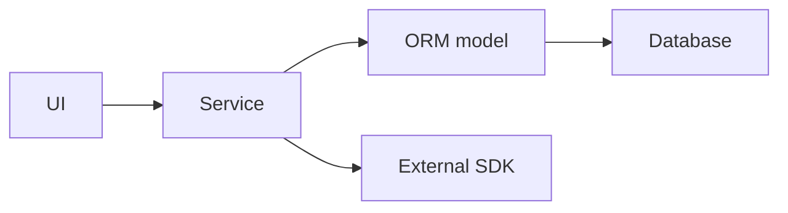
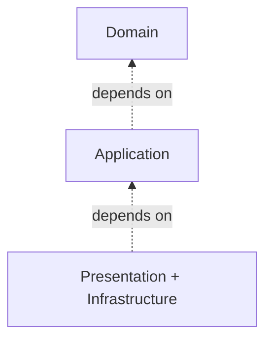
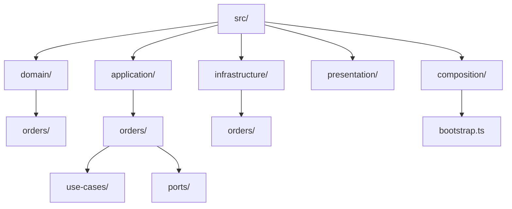
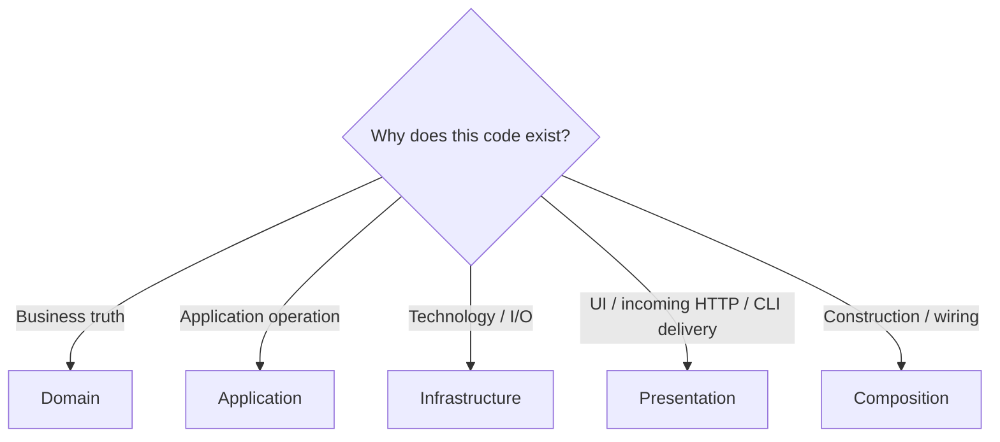
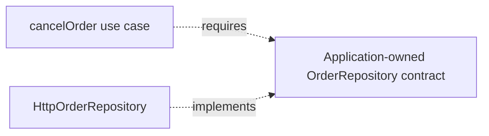
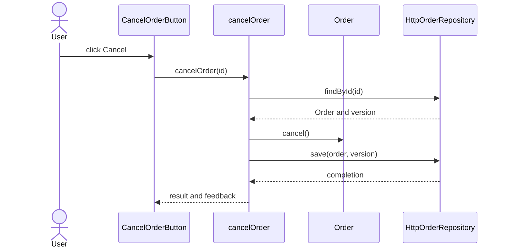
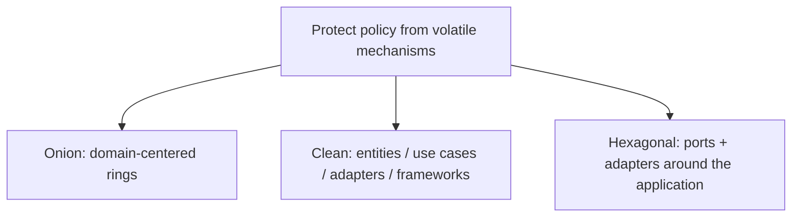

<a id="onion-architecture-for-the-frontend"></a>

# Onion Architecture

> A progressive guide to Jeffrey Palermo's domain-centered architecture.

← [Repository home](../README.md) · [Glossary](../GLOSSARY.md) · [Code placement](../foundations/code-placement.md) · [Naming](../conventions/naming-and-file-placement.md)

For a server-side application, first follow [Backend Architecture](../backend/README.md), then [Onion on the backend](7-onion-on-the-backend.md). Follow the same ticket from its domain rules through its operation, required storage capability and HTTP/database [adapters](../GLOSSARY.md#adapter).

<a id="1-introduction--purpose"></a>

## 1. History and origin

Jeffrey Palermo published the [Onion Architecture](../GLOSSARY.md#onion-architecture) series in **2008**. His goal was to keep long-lived business applications from becoming organized around databases, UI frameworks and other infrastructure.

Palermo's framing places the **domain model at the center** and requires dependencies to point inward.

Primary source: https://jeffreypalermo.com/2008/07/

## 2. What problem does it solve?

Suppose our ticket platform decides that a resolved ticket cannot be assigned to an analyst again. That decision is about tickets, not about the table in which they are stored. If the rule is written against an [ORM](../GLOSSARY.md#orm) row (the database library's representation of the record), replacing the database tool can force changes to ticket behavior.

[Onion Architecture](../GLOSSARY.md#onion-architecture) puts such business rules at the center, in code that does not need to know which database, HTTP client, or UI happens to be in use. Other parts call that code and handle the technical details around it.

A common failure is infrastructure-driven design:



When [ORM](../GLOSSARY.md#orm)/API/framework models become the application's language:

- domain rules inherit infrastructure constraints;
- tests require technical systems;
- technology migrations become business rewrites;
- application policy becomes difficult to identify.

Onion reverses that ownership: external mechanisms adapt to application/domain contracts.

It does **not** automatically solve UI architecture, distributed-system reliability, team topology, deployment or domain discovery.

<a id="6-why-this-architecture"></a>

<a id="why-this-architecture"></a>

## 3. Strong-fit scenarios

Onion is a strong fit when:

- the domain has meaningful rules/behavior;
- the application is expected to live for years;
- infrastructure choices may change;
- multiple mechanisms surround the same business policy;
- independent testing of [Domain](../GLOSSARY.md#domain)/[Application](../GLOSSARY.md#application-layer) matters.

## 4. Weak-fit scenarios

It can be unnecessarily expensive for:

- tiny CRUD utilities;
- throwaway prototypes;
- applications with almost no domain behavior;
- simple content sites where abstractions protect little real volatility.

Palermo explicitly framed Onion for complex, long-lived business applications rather than every small site.

## 5. Mental model

Read the diagram from the center outward: the ticket rule lives at the center; an operation such as “assign ticket” uses that rule; the UI and database-facing code connect the outside world to that operation. The arrows below describe which source-code areas may depend on which others, **not** the order of HTTP calls at runtime.



[Presentation](../GLOSSARY.md#presentation-layer) and [Infrastructure](../GLOSSARY.md#infrastructure) are outer concerns. [Application](../GLOSSARY.md#application-layer) surrounds [Domain](../GLOSSARY.md#domain).

The central rule is simple:

> Outer code may depend inward; inner code must not know outer mechanisms.

<a id="domain"></a>

<a id="application"></a>

<a id="infrastructure"></a>

<a id="presentation"></a>

## 6. Rings and responsibilities

This repository uses four practical areas plus an executable composition boundary to implement the Onion idea. These are physical ownership conventions; Palermo also describes [Domain Services](../GLOSSARY.md#domain-service) and [Application Services](../GLOSSARY.md#application-service), rather than prescribing this exact four-folder taxonomy:

| Area | Owns | Put here | Do not put here | May depend on |
| --- | --- | --- | --- | --- |
| [Domain](../GLOSSARY.md#domain) | business concepts and [invariants](../GLOSSARY.md#invariant) | entities, [value objects](../GLOSSARY.md#value-object), domain policies/events | React, Redux, HTTP, [ORM](../GLOSSARY.md#orm), [DTOs](../GLOSSARY.md#data-transfer-object-dto) | [Domain](../GLOSSARY.md#domain) only |
| [Application](../GLOSSARY.md#application-layer) | application operations and required capabilities | [use cases](../GLOSSARY.md#use-case), commands/results, [ports](../GLOSSARY.md#port) | concrete UI/DB/HTTP implementations | [Application](../GLOSSARY.md#application-layer) + [Domain](../GLOSSARY.md#domain) |
| [Infrastructure](../GLOSSARY.md#infrastructure) | technical [adapters](../GLOSSARY.md#adapter) and external representations | HTTP/DB/storage/SDK implementations, [DTOs](../GLOSSARY.md#data-transfer-object-dto), [mappers](../GLOSSARY.md#mapper) | [Presentation](../GLOSSARY.md#presentation-layer) and authoritative business policy | [Infrastructure](../GLOSSARY.md#infrastructure) + [Application](../GLOSSARY.md#application-layer) + [Domain](../GLOSSARY.md#domain) |
| [Presentation](../GLOSSARY.md#presentation-layer) | views, interactions and view-oriented state | pages, components, hooks/[ViewModels](../GLOSSARY.md#viewmodel), UI [store](../GLOSSARY.md#store) | concrete [Infrastructure](../GLOSSARY.md#infrastructure) in the strict boundary used here | [Presentation](../GLOSSARY.md#presentation-layer) + [Application](../GLOSSARY.md#application-layer) |
| Composition | executable assembly | concrete construction/bootstrap | business rules | all concrete modules required for wiring |

### Why isolate the rings?

Different concerns change for different reasons.

- [Domain](../GLOSSARY.md#domain) changes when business rules change.
- [Application](../GLOSSARY.md#application-layer) changes when workflows change.
- [Infrastructure](../GLOSSARY.md#infrastructure) changes when technology/integrations change.
- [Presentation](../GLOSSARY.md#presentation-layer) changes when user interaction changes.

The purpose of the onion is to prevent outer change from forcing inner policy to change unnecessarily.

## 7. Recommended physical structure



| Path | Owns | Why | Must not contain |
| --- | --- | --- | --- |
| `domain/` | domain meaning/[invariants](../GLOSSARY.md#invariant) | center should survive technical replacement | HTTP/DB/UI/framework details |
| `application/` | use-case orchestration + [ports](../GLOSSARY.md#port) | policy declares what capabilities it needs | concrete [adapters](../GLOSSARY.md#adapter) |
| `infrastructure/` | concrete technologies | translates external mechanisms to inner contracts | presentation behavior |
| `presentation/` | UI interaction/view state and incoming HTTP/CLI delivery | isolates caller-specific change | database clients and outbound integration implementations |
| `composition/` | object graph/bootstrap | selects implementations without [service location](../GLOSSARY.md#service-locator) | domain/application branching |

The folder names and layer-first hierarchy are documentation conventions; the inward dependency direction is the architecture. Capabilities and sub-capabilities grow inside their layer, as [Scheduling illustrates](../foundations/code-placement.md#12-grow-capabilities-inside-each-layer). The [frontend structure](../frontend/README.md) and the [backend delivery paths](../backend/README.md#place-your-first-feature) use that same convention; Palermo did not prescribe this filesystem layout.


<a id="7-type-placement-in-onion-architecture"></a>

<a id="type-placement-in-onion-architecture"></a>

<a id="decision-rules"></a>

<a id="quick-reference"></a>

## 8. Where does code go?



| Code | Owner | Reason |
| --- | --- | --- |
| `Order.cancel()` | [Domain](../GLOSSARY.md#domain) | business [invariant](../GLOSSARY.md#invariant) |
| `cancelOrder(id)` | [Application](../GLOSSARY.md#application-layer) | use-case coordination |
| `OrderRepository` [port](../GLOSSARY.md#port) | [Application](../GLOSSARY.md#application-layer) | required capability expressed inward |
| `HttpOrderRepository` | [Infrastructure](../GLOSSARY.md#infrastructure) | concrete transport |
| `ApiOrderDto` | [Infrastructure](../GLOSSARY.md#infrastructure) | wire shape |
| `useOrders()` | [Presentation](../GLOSSARY.md#presentation-layer) | view-oriented [facade](../GLOSSARY.md#facade-pattern) |
| `CancelOrderButton.tsx` | [Presentation](../GLOSSARY.md#presentation-layer) | rendering/gesture |
| dependency construction | Composition | outer assembly |

For functions, types and helpers, use **[Code Placement](../foundations/code-placement.md)**.

<a id="import-rule"></a>

## 9. Why ports belong inward

Suppose cancellation requires persistence.

[Application](../GLOSSARY.md#application-layer) expresses the capability it needs:

```ts
// Signature excerpt; complete contracts follow in section 11.
export interface OrderRepository {
  findById(id: OrderId): Promise<Order | null>
  save(order: Order): Promise<void>
}
```

[Infrastructure](../GLOSSARY.md#infrastructure) implements that capability:

```ts
// infrastructure/http/orders/adapters/HttpOrderRepository.ts
export class HttpOrderRepository implements OrderRepository {
  // HTTP-specific details
}
```

The arrows here show **source-code contract relationships only**; `OrderRepository` is not an intermediary object that forwards calls at runtime.



[Application](../GLOSSARY.md#application-layer) owns the language "load/save orders". [Infrastructure](../GLOSSARY.md#infrastructure) owns HTTP and calls the external API at runtime after it has been injected into the operation. The [port](../GLOSSARY.md#port) itself makes no HTTP request.

This is [Dependency Inversion](../GLOSSARY.md#dependency-inversion-principle-dip): runtime control can reach outward while source dependencies remain inward.

<a id="8-naming--conventions-portable-defaults"></a>

<a id="naming--conventions"></a>

## 10. Naming

Follow **[Naming and File Placement Conventions](../conventions/naming-and-file-placement.md)**.

| Role | Recommended example |
| --- | --- |
| entity/[value object](../GLOSSARY.md#value-object) | `Order.ts`, `Money.ts` |
| [use case](../GLOSSARY.md#use-case) | `cancelOrder.ts` |
| [port](../GLOSSARY.md#port) | `OrderRepository.ts`, `PaymentGateway.ts` |
| concrete [adapter](../GLOSSARY.md#adapter) | `HttpOrderRepository.ts` |
| [DTO](../GLOSSARY.md#data-transfer-object-dto) | `OrderApiDto.ts` |
| [mapper](../GLOSSARY.md#mapper) | `mapOrderApiDto.ts` |
| [React component](../GLOSSARY.md#react-component) | `CancelOrderButton.tsx` |
| feature [facade](../GLOSSARY.md#facade-pattern) | `useOrders.ts` |

Avoid generic names such as `GenericService`, `CommonRepository`, `Manager` and `helpers.ts` when a capability owner can be named.

## 11. First feature end to end

Requirement:

> A user cancels an order. Shipped orders cannot be cancelled. A successful cancellation is persisted through HTTP.

| Artifact | File | Owner | Why here | Why not elsewhere |
| --- | --- | --- | --- | --- |
| [invariant](../GLOSSARY.md#invariant) | `domain/orders/Order.ts` | [Domain](../GLOSSARY.md#domain) | business truth | must not depend on UI/HTTP |
| required persistence capability | `application/orders/use-cases/cancelOrder.ts` | [Application](../GLOSSARY.md#application-layer) | [use case](../GLOSSARY.md#use-case) defines what it needs | [Infrastructure](../GLOSSARY.md#infrastructure) should not define inward policy |
| operation | `application/orders/use-cases/cancelOrder.ts` | [Application](../GLOSSARY.md#application-layer) | orchestrates load → domain behavior → save | [Domain](../GLOSSARY.md#domain) should not do I/O |
| HTTP [adapter](../GLOSSARY.md#adapter) | `infrastructure/http/orders/adapters/HttpOrderRepository.ts` | [Infrastructure](../GLOSSARY.md#infrastructure) | speaks transport | [Application](../GLOSSARY.md#application-layer) should not know HTTP |
| button | `presentation/orders/components/CancelOrderButton/CancelOrderButton.ts` | [Presentation](../GLOSSARY.md#presentation-layer) | renders + captures gesture | [invariant](../GLOSSARY.md#invariant) must not live in JSX |
| assembly | `composition/bootstrap.ts` | Composition | wires concrete objects | inner modules should not resolve dependencies |



The same capability can later receive another [adapter](../GLOSSARY.md#adapter) without changing the core policy.

### Complete client implementation

The order-cancellation example below runs in a browser client; the server remains authoritative for persisted orders. For the authoritative ticket backend, use [Onion on the backend](7-onion-on-the-backend.md) and its linked canonical TypeScript modules.

**Shared example ownership.** The [Domain](../GLOSSARY.md#domain), [Application](../GLOSSARY.md#application-layer) and [Infrastructure](../GLOSSARY.md#infrastructure) blocks in this complete example are synchronized from [the canonical order-cancellation walkthrough](../clean-architecture/4-building-a-feature.md). Edit the canonical version and run `npm run sync:examples`; `npm run check:examples` rejects drift. This page owns its presentation-pattern-specific interaction and composition example.

The business rule belongs in `domain/orders/Order.ts`; the operation, result, persistence failure and [port](../GLOSSARY.md#port) belong in `application/orders/use-cases/cancelOrder.ts`. [DTO](../GLOSSARY.md#data-transfer-object-dto) validation/mapping and the concrete repository belong in `infrastructure/http/orders/adapters/HttpOrderRepository.ts`. [Presentation](../GLOSSARY.md#presentation-layer) owns gestures and feedback; `composition/bootstrap.ts` selects implementations. These are documentation conventions. A small file may contain cohesive contracts and functions; split them when ownership or change pressure requires it.

```ts
// domain/orders/Order.ts
export const ORDER_STATUSES = ['pending', 'shipped', 'cancelled'] as const
export type OrderStatus = (typeof ORDER_STATUSES)[number]

export function isOrderStatus(value: unknown): value is OrderStatus {
  return ORDER_STATUSES.some(status => status === value)
}

export class ShippedOrderCannotBeCancelled extends Error {}
export class Order {
  readonly id: string
  #status: OrderStatus
  constructor(id: string, status: OrderStatus) { this.id = id; this.#status = status }
  get status(): OrderStatus { return this.#status }
  cancel(): void {
    if (this.#status === 'shipped') throw new ShippedOrderCannotBeCancelled()
    this.#status = 'cancelled'
  }
}
```

```ts
// application/orders/use-cases/cancelOrder.ts
import { Order, ShippedOrderCannotBeCancelled } from '@/domain/orders/Order'

export interface OrderRepository {
  findById(id: string): Promise<{ order: Order; version: string } | null>
  save(order: Order, expectedVersion: string): Promise<void>
}
export type CancelResult =
  | { ok: true; status: 'cancelled' }
  | { ok: false; reason: 'not-found' | 'shipped' | 'conflict' | 'unavailable' }
export type CancelOrder = (id: string) => Promise<CancelResult>
export class PersistenceFailure extends Error {
  readonly reason: 'conflict' | 'unavailable'
  constructor(reason: 'conflict' | 'unavailable') { super(reason); this.reason = reason }
}
export function makeCancelOrder(orders: OrderRepository): CancelOrder {
  return async id => {
    try {
      const loaded = await orders.findById(id)
      if (!loaded) return { ok: false, reason: 'not-found' }
      loaded.order.cancel()
      await orders.save(loaded.order, loaded.version)
      return { ok: true, status: 'cancelled' }
    } catch (error) {
      if (error instanceof ShippedOrderCannotBeCancelled) return { ok: false, reason: 'shipped' }
      if (error instanceof PersistenceFailure) return { ok: false, reason: error.reason }
      throw error // programming defects are not normal business outcomes
    }
  }
}
```

```ts
// infrastructure/http/orders/adapters/HttpOrderRepository.ts
import { Order, isOrderStatus, type OrderStatus } from '@/domain/orders/Order'
import { PersistenceFailure, type OrderRepository } from '@/application/orders/use-cases/cancelOrder'

// Adapter-owned transport contract. A concrete fetch driver implements it.
export interface OrderTransport {
  get(path: string): Promise<{ data: unknown; version: string } | null>
  put(path: string, data: unknown, version: string): Promise<void>
}
type ApiOrderDto = { id: string; status: string } // external wire shape
function parseOrderDto(data: unknown): { id: string; status: OrderStatus } {
  if (typeof data !== 'object' || data === null) throw new PersistenceFailure('unavailable')
  const dto = data as Record<string, unknown>
  if (typeof dto.id !== 'string' || !isOrderStatus(dto.status)) {
    throw new PersistenceFailure('unavailable')
  }
  return { id: dto.id, status: dto.status }
}
function toOrderDto(order: Order): ApiOrderDto { return { id: order.id, status: order.status } }

export class HttpOrderRepository implements OrderRepository {
  readonly #transport: OrderTransport
  constructor(transport: OrderTransport) { this.#transport = transport }
  async findById(id: string) {
    const response = await this.#transport.get('/orders/' + encodeURIComponent(id))
    if (!response) return null
    const dto = parseOrderDto(response.data)
    if (dto.id !== id) throw new PersistenceFailure('unavailable')
    return { order: new Order(dto.id, dto.status), version: response.version }
  }
  async save(order: Order, expectedVersion: string): Promise<void> {
    await this.#transport.put('/orders/' + encodeURIComponent(order.id), toOrderDto(order), expectedVersion)
  }
}
```

The external response is treated as `unknown` until its fields are checked. The [adapter](../GLOSSARY.md#adapter) owns the transport shape (`id` and response parsing), but reuses `isOrderStatus` from [Domain](../GLOSSARY.md#domain) for valid business values. `OrderStatus` and its runtime checker are derived from the same `ORDER_STATUSES` definition; this HTTP implementation must not maintain another status list.

```ts
// presentation/orders/components/CancelOrderButton/CancelOrderButton.ts
import type { CancelOrder } from '@/application/orders/use-cases/cancelOrder'

export function mountCancelOrderButton(root: HTMLElement, id: string, cancelOrder: CancelOrder) {
  const button = document.createElement('button')
  button.textContent = 'Cancel order'
  const feedback = document.createElement('p')
  feedback.setAttribute('role', 'status')
  root.append(button, feedback)
  let disposed = false
  async function onCancel() {
    if (button.disabled) return
    button.disabled = true
    feedback.textContent = 'Cancelling…'
    try {
      const result = await cancelOrder(id)
      if (!disposed) feedback.textContent = result.ok ? 'Cancelled' : `Cannot cancel: ${result.reason}`
    } catch {
      if (!disposed) feedback.textContent = 'Unexpected failure'
    } finally {
      if (!disposed) button.disabled = false
    }
  }
  button.addEventListener('click', onCancel)
  return () => {
    disposed = true
    button.removeEventListener('click', onCancel)
    button.remove(); feedback.remove()
  }
}
```

```ts
// composition/bootstrap.ts
import { makeCancelOrder, PersistenceFailure } from '@/application/orders/use-cases/cancelOrder'
import { HttpOrderRepository, type OrderTransport } from '@/infrastructure/http/orders/adapters/HttpOrderRepository'
import { mountCancelOrderButton } from '@/presentation/orders/components/CancelOrderButton/CancelOrderButton'

async function request(path: string, init?: RequestInit): Promise<Response> {
  try { return await fetch(path, init) }
  catch { throw new PersistenceFailure('unavailable') }
}
const transport: OrderTransport = {
  async get(path) {
    const response = await request(path)
    if (response.status === 404) return null
    const version = response.headers.get('ETag')
    if (!response.ok || !version) throw new PersistenceFailure('unavailable')
    try { return { data: await response.json(), version } }
    catch { throw new PersistenceFailure('unavailable') }
  },
  async put(path, data, version) {
    const response = await request(path, {
      method: 'PUT',
      headers: { 'Content-Type': 'application/json', 'If-Match': version },
      body: JSON.stringify(data),
    })
    if (response.status === 409 || response.status === 412) throw new PersistenceFailure('conflict')
    if (!response.ok) throw new PersistenceFailure('unavailable')
  },
}
export function startOrders(root: HTMLElement, orderId: string) {
  const cancelOrder = makeCancelOrder(new HttpOrderRepository(transport))
  return mountCancelOrderButton(root, orderId, cancelOrder)
}
```

The executable entry calls `startOrders(root, 'order-1')` with an existing DOM element and retains the returned cleanup function.

The API must return a strong ETag on GET and atomically enforce `If-Match` on PUT. It must authorize cancellation and reject shipped orders using authoritative current state; client validation alone cannot guarantee this under concurrent writes. This is a complete client feature, not a backend implementation. See [the expanded walkthrough](../clean-architecture/4-building-a-feature.md) for boundary explanations and limits.

## 12. Testing the rings

| Scope | What to test | Typical dependency |
| --- | --- | --- |
| [Domain](../GLOSSARY.md#domain) | [invariants](../GLOSSARY.md#invariant) and domain behavior | none outside [Domain](../GLOSSARY.md#domain) |
| [Application](../GLOSSARY.md#application-layer) | use-case orchestration | [fake](../GLOSSARY.md#fake)/[stub](../GLOSSARY.md#stub) [ports](../GLOSSARY.md#port) |
| [Infrastructure](../GLOSSARY.md#infrastructure) | mapping, persistence and transport integration | controlled external system |
| [Presentation](../GLOSSARY.md#presentation-layer) | view state and rendering | [fake](../GLOSSARY.md#fake) application capability |
| Architecture | import/dependency rules | source graph |
| End-to-end | critical journey | complete executable graph |

See **[Testing the Rings](./3-testing-in-onion.md)**.

<a id="avoid"></a>

## 13. Trade-offs and failure modes

Costs:

- more explicit boundaries and mapping;
- additional modules/files;
- object composition;
- learning cost for teams unfamiliar with dependency inversion.

Common failure modes:

- **[ORM](../GLOSSARY.md#orm)-centered domain** — database schema dictates business objects;
- **god [application service](../GLOSSARY.md#application-service)** — every capability enters one service;
- **god [port](../GLOSSARY.md#port)** — one interface contains unrelated external conversations;
- **[service locator](../GLOSSARY.md#service-locator)** — inner code reaches into the container;
- **outer-type leakage** — browser/SDK/[ORM](../GLOSSARY.md#orm)/transport types appear inward;
- **ceremonial onion** — directories exist but imports still point outward;
- **over-modeling** — rich [Domain](../GLOSSARY.md#domain) abstractions are invented for behavior that does not exist.

<a id="contents"></a>

## 14. Progressive learning path

Read in this order:

1. **[The Rings](./1-the-rings.md)**
2. **[Inward Dependencies](./2-inward-dependencies.md)**
3. **[Testing the Rings](./3-testing-in-onion.md)**
4. **[Advanced Patterns](./4-advanced-patterns.md)**
5. **[Styling & Animation](./5-styling-and-animation.md)**
6. **[Evolution & Scaling](./6-scaling.md)**
7. **[Onion on the Backend](./7-onion-on-the-backend.md)**

The first two chapters deepen placement and dependency rules already introduced here. Advanced topics come later.

## 15. Relationship to Clean and Hexagonal



They overlap strongly but are not identical taxonomies.

## Sources

- Jeffrey Palermo, "The [Onion Architecture](../GLOSSARY.md#onion-architecture)" series (2008): https://jeffreypalermo.com/2008/07/
- Robert C. Martin, "The [Clean Architecture](../GLOSSARY.md#clean-architecture)": https://blog.cleancoder.com/uncle-bob/2012/08/13/the-clean-architecture.html
- Alistair Cockburn, "[Hexagonal Architecture](../GLOSSARY.md#hexagonal-architecture-ports-and-adapters)": https://alistair.cockburn.us/hexagonal-architecture/
- Mark Seemann, "[Composition Root](../GLOSSARY.md#composition-root)": https://blog.ploeh.dk/2011/07/28/CompositionRoot/
