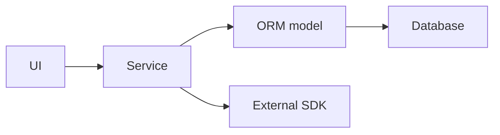
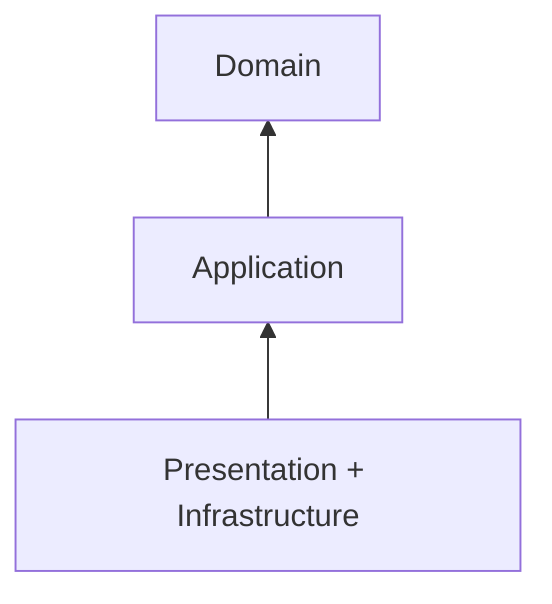
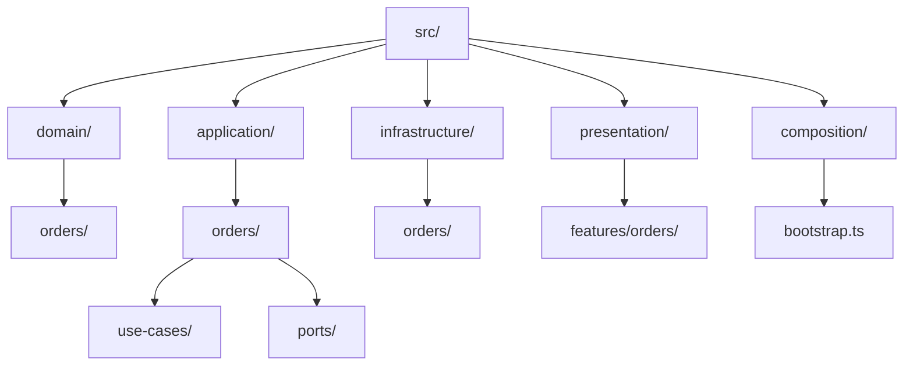
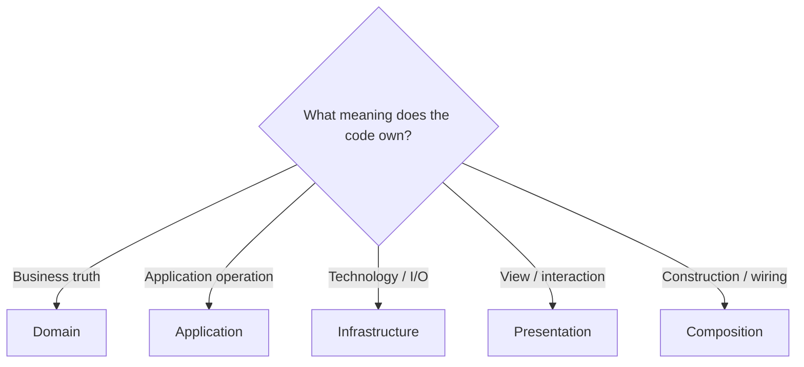
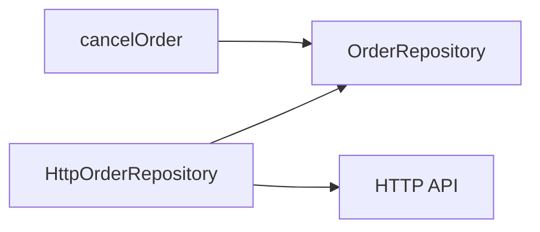
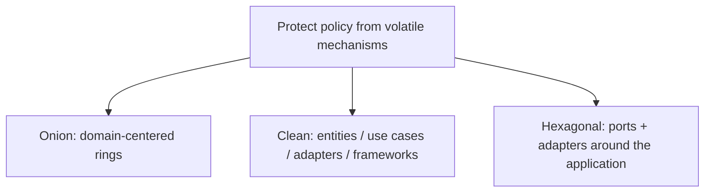

# Onion Architecture

> A progressive guide to Jeffrey Palermo's domain-centered architecture.

← [Repository home](../README.md) · [Glossary](../GLOSSARY.md) · [Code placement](../foundations/code-placement.md) · [Naming](../conventions/naming-and-file-placement.md)

## 1. History and origin

Jeffrey Palermo published the [Onion Architecture](../GLOSSARY.md#onion-architecture) series in **2008**. The central observation was that long-lived business applications often become coupled to database/UI/framework choices when infrastructure is allowed to define the application's shape.

Palermo's framing puts the **domain model at the center** and requires dependencies to point inward.

Primary source: https://jeffreypalermo.com/2008/07/

## 2. What problem does it solve?

The target problem is infrastructure-driven design:



When ORM/API/framework models become the application's language:

- domain rules inherit infrastructure constraints;
- tests require technical systems;
- technology migrations become business rewrites;
- application policy becomes difficult to identify.

[Onion Architecture](../GLOSSARY.md#onion-architecture) reverses that ownership: infrastructure adapts to the application/domain.

## 3. Strong-fit scenarios

Use Onion when:

- the domain has meaningful rules/behavior;
- the application is expected to live for years;
- infrastructure choices may change;
- multiple external mechanisms surround the same business policy;
- independent testing of [Domain](../GLOSSARY.md#domain)/[Application](../GLOSSARY.md#application-layer) matters.

## 4. Weak-fit scenarios

It can be too expensive for:

- tiny CRUD utilities;
- throwaway prototypes;
- applications with almost no domain behavior;
- simple content sites where infrastructure abstraction provides little value.

Palermo explicitly framed Onion for complex, long-lived business applications rather than every small site.

## 5. Mental model



[Presentation](../GLOSSARY.md#presentation-layer) and [Infrastructure](../GLOSSARY.md#infrastructure) are outer concerns. [Application](../GLOSSARY.md#application-layer) surrounds [Domain](../GLOSSARY.md#domain).

The important rule:

> Outer code may depend inward; inner code must not know outer mechanisms.

## 6. Rings and responsibilities

| Area | Owns | Typical files | Must not know |
| --- | --- | --- | --- |
| [Domain](../GLOSSARY.md#domain) | concepts, [invariants](../GLOSSARY.md#invariant), [value objects](../GLOSSARY.md#value-object), entities | `Order.ts`, `Money.ts` | React, Redux, HTTP, ORM |
| [Application](../GLOSSARY.md#application-layer) | [use cases](../GLOSSARY.md#use-case), required [ports](../GLOSSARY.md#port), application results | `cancelOrder.ts`, `OrderRepository.ts` | concrete HTTP/DB/UI |
| [Infrastructure](../GLOSSARY.md#infrastructure) | [adapters](../GLOSSARY.md#adapter) and external representations | `HttpOrderRepository.ts`, [DTO](../GLOSSARY.md#data-transfer-object-dto)/[mappers](../GLOSSARY.md#mapper) | [Presentation](../GLOSSARY.md#presentation-layer) |
| [Presentation](../GLOSSARY.md#presentation-layer) | views, view state, feature hooks, UI [store](../GLOSSARY.md#store) | `useOrders.ts`, components | concrete [Infrastructure](../GLOSSARY.md#infrastructure) in strict mode |
| Composition | concrete assembly | `bootstrap.ts` | business policy |

## 7. Recommended physical structure



The names are [repository](../GLOSSARY.md#repository) conventions; inward dependency direction is the architecture.

## 8. Where does code go?



Use the full **[Code Placement Guide](../foundations/code-placement.md)** for functions, types, [adapters](../GLOSSARY.md#adapter) and UI code.

## 9. Why ports are inside Application

Suppose cancellation needs persistence.

[Application](../GLOSSARY.md#application-layer) needs the capability:

```ts
export interface OrderRepository {
  findById(id: OrderId): Promise<Order | null>
  save(order: Order): Promise<void>
}
```

[Infrastructure](../GLOSSARY.md#infrastructure) implements it:

```ts
export class HttpOrderRepository implements OrderRepository {
  // HTTP-specific details
}
```



The [port](../GLOSSARY.md#port) belongs inward because **[Application](../GLOSSARY.md#application-layer) defines what it needs**. [Infrastructure](../GLOSSARY.md#infrastructure) adapts to that need.

## 10. Naming

Follow **[Naming and File Placement Conventions](../conventions/naming-and-file-placement.md)**.

Do not use names such as `GenericService`, `CommonRepository`, or `Manager` when a capability name exists.

## 11. Progressive learning path

1. **[The Rings](./1-the-rings.md)**
2. **[Inward Dependencies](./2-inward-dependencies.md)**
3. **[Testing the Rings](./3-testing-in-onion.md)**
4. **[Advanced Patterns](./4-advanced-patterns.md)**
5. **[Styling & Animation](./5-styling-and-animation.md)**
6. **[Evolution & Scaling](./6-scaling.md)**

## 12. Relationship to Clean and Hexagonal



They overlap strongly but are not identical taxonomies.

## Sources

- Jeffrey Palermo, [Onion Architecture](../GLOSSARY.md#onion-architecture) series (2008): https://jeffreypalermo.com/2008/07/
- Robert C. Martin, "The [Clean Architecture](../GLOSSARY.md#clean-architecture)": https://blog.cleancoder.com/uncle-bob/2012/08/13/the-clean-architecture.html
- Alistair Cockburn, "[Hexagonal Architecture](../GLOSSARY.md#hexagonal-architecture-ports-and-adapters)": https://alistair.cockburn.us/hexagonal-architecture/
