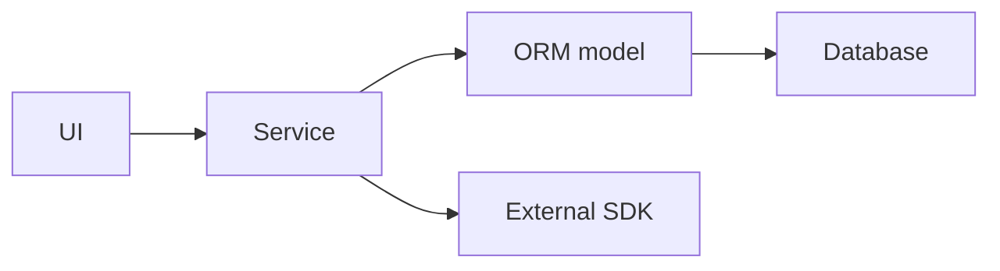
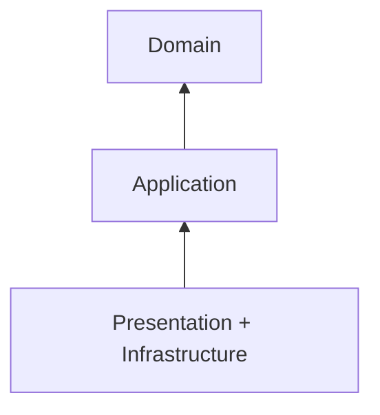
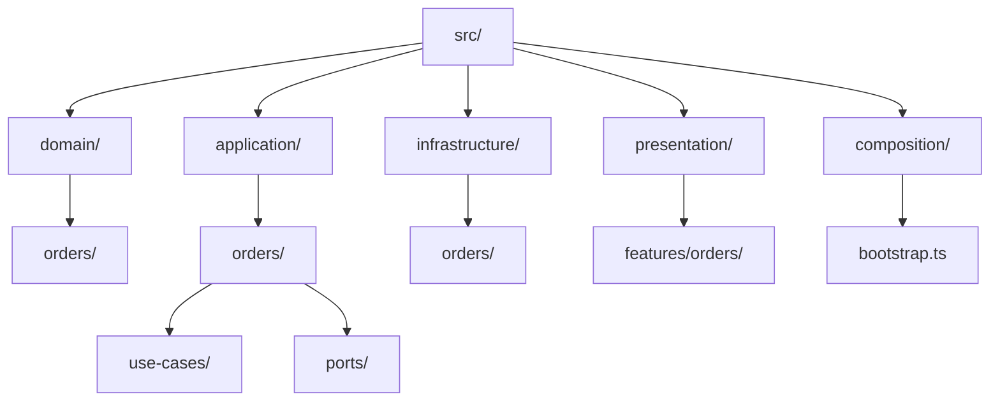
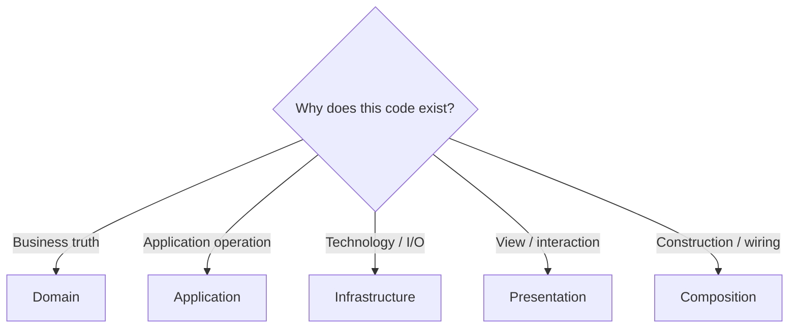
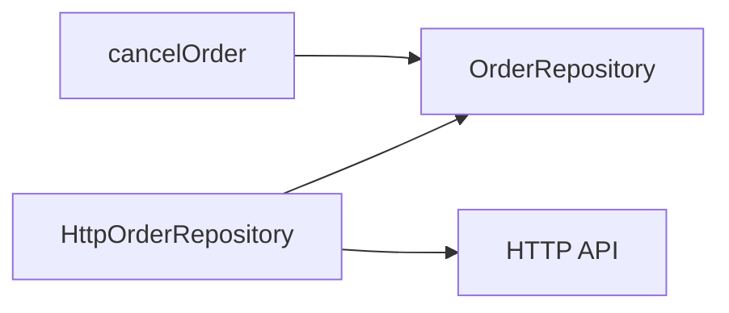
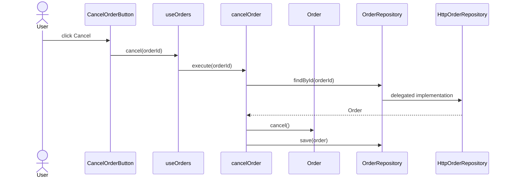
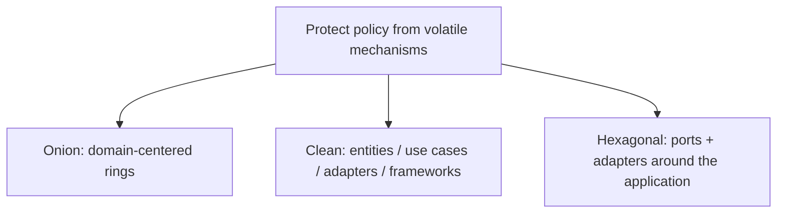

# Onion Architecture

> A progressive guide to Jeffrey Palermo's domain-centered architecture.

← [Repository home](../README.md) · [Glossary](../GLOSSARY.md) · [Code placement](../foundations/code-placement.md) · [Naming](../conventions/naming-and-file-placement.md)

## 1. History and origin

Jeffrey Palermo published the [Onion Architecture](../GLOSSARY.md#onion-architecture) series in **2008**. His goal was to keep long-lived business applications from becoming organized around databases, UI frameworks and other infrastructure.

Palermo's framing places the **domain model at the center** and requires dependencies to point inward.

Primary source: https://jeffreypalermo.com/2008/07/

## 2. What problem does it solve?

A common failure is infrastructure-driven design:



When ORM/API/framework models become the application's language:

- domain rules inherit infrastructure constraints;
- tests require technical systems;
- technology migrations become business rewrites;
- application policy becomes difficult to identify.

Onion reverses that ownership: external mechanisms adapt to application/domain contracts.

It does **not** automatically solve UI architecture, distributed-system reliability, team topology, deployment or domain discovery.

## 3. Strong-fit scenarios

Onion is a strong fit when:

- the domain has meaningful rules/behavior;
- the application is expected to live for years;
- infrastructure choices may change;
- multiple mechanisms surround the same business policy;
- independent testing of [Domain](../GLOSSARY.md#domain)/[Application](../GLOSSARY.md#application-layer) matters.

## 4. Weak-fit scenarios

It can be unnecessarily expensive for:

- tiny CRUD utilities;
- throwaway prototypes;
- applications with almost no domain behavior;
- simple content sites where abstractions protect little real volatility.

Palermo explicitly framed Onion for complex, long-lived business applications rather than every small site.

## 5. Mental model



[Presentation](../GLOSSARY.md#presentation-layer) and [Infrastructure](../GLOSSARY.md#infrastructure) are outer concerns. [Application](../GLOSSARY.md#application-layer) surrounds [Domain](../GLOSSARY.md#domain).

The central rule is simple:

> Outer code may depend inward; inner code must not know outer mechanisms.

## 6. Rings and responsibilities

This repository uses four practical areas to implement the Onion idea:

| Area | Owns | Put here | Do not put here | May depend on |
| --- | --- | --- | --- | --- |
| [Domain](../GLOSSARY.md#domain) | business concepts and [invariants](../GLOSSARY.md#invariant) | entities, [value objects](../GLOSSARY.md#value-object), domain policies/events | React, Redux, HTTP, ORM, [DTOs](../GLOSSARY.md#data-transfer-object-dto) | [Domain](../GLOSSARY.md#domain) only |
| [Application](../GLOSSARY.md#application-layer) | application operations and required capabilities | [use cases](../GLOSSARY.md#use-case), commands/results, [ports](../GLOSSARY.md#port) | concrete UI/DB/HTTP implementations | [Application](../GLOSSARY.md#application-layer) + [Domain](../GLOSSARY.md#domain) |
| [Infrastructure](../GLOSSARY.md#infrastructure) | technical [adapters](../GLOSSARY.md#adapter) and external representations | HTTP/DB/storage/SDK implementations, [DTOs](../GLOSSARY.md#data-transfer-object-dto), [mappers](../GLOSSARY.md#mapper) | [Presentation](../GLOSSARY.md#presentation-layer) and authoritative business policy | [Infrastructure](../GLOSSARY.md#infrastructure) + [Application](../GLOSSARY.md#application-layer) + [Domain](../GLOSSARY.md#domain) |
| [Presentation](../GLOSSARY.md#presentation-layer) | views, interactions and view-oriented state | pages, components, hooks/[ViewModels](../GLOSSARY.md#viewmodel), UI [store](../GLOSSARY.md#store) | concrete [Infrastructure](../GLOSSARY.md#infrastructure) in the strict boundary used here | [Presentation](../GLOSSARY.md#presentation-layer) + [Application](../GLOSSARY.md#application-layer) |
| Composition | executable assembly | concrete construction/bootstrap | business rules | all concrete modules required for wiring |

### Why isolate the rings?

Different concerns change for different reasons.

- [Domain](../GLOSSARY.md#domain) changes when business rules change.
- [Application](../GLOSSARY.md#application-layer) changes when workflows change.
- [Infrastructure](../GLOSSARY.md#infrastructure) changes when technology/integrations change.
- [Presentation](../GLOSSARY.md#presentation-layer) changes when user interaction changes.

The purpose of the onion is to prevent outer change from forcing inner policy to change unnecessarily.

## 7. Recommended physical structure



| Path | Owns | Why | Must not contain |
| --- | --- | --- | --- |
| `domain/` | domain meaning/[invariants](../GLOSSARY.md#invariant) | center should survive technical replacement | HTTP/DB/UI/framework details |
| `application/` | use-case orchestration + [ports](../GLOSSARY.md#port) | policy declares what capabilities it needs | concrete [adapters](../GLOSSARY.md#adapter) |
| `infrastructure/` | concrete technologies | translates external mechanisms to inner contracts | presentation behavior |
| `presentation/` | user interaction/view state | isolates UI-specific change | persistence/transport implementations in strict mode |
| `composition/` | object graph/bootstrap | selects implementations without [service location](../GLOSSARY.md#service-locator) | domain/application branching |

The folder names are documentation conventions. The inward dependency direction is the architecture.

## 8. Where does code go?



| Code | Owner | Reason |
| --- | --- | --- |
| `Order.cancel()` | [Domain](../GLOSSARY.md#domain) | business [invariant](../GLOSSARY.md#invariant) |
| `cancelOrder(id)` | [Application](../GLOSSARY.md#application-layer) | use-case coordination |
| `OrderRepository` [port](../GLOSSARY.md#port) | [Application](../GLOSSARY.md#application-layer) | required capability expressed inward |
| `HttpOrderRepository` | [Infrastructure](../GLOSSARY.md#infrastructure) | concrete transport |
| `ApiOrderDto` | [Infrastructure](../GLOSSARY.md#infrastructure) | wire shape |
| `useOrders()` | [Presentation](../GLOSSARY.md#presentation-layer) | view-oriented facade |
| `CancelOrderButton.tsx` | [Presentation](../GLOSSARY.md#presentation-layer) | rendering/gesture |
| dependency construction | Composition | outer assembly |

For functions, types and helpers, use **[Code Placement](../foundations/code-placement.md)**.

## 9. Why ports belong inward

Suppose cancellation requires persistence.

[Application](../GLOSSARY.md#application-layer) expresses the capability it needs:

```ts
// application/orders/ports/OrderRepository.ts
export interface OrderRepository {
  findById(id: OrderId): Promise<Order | null>
  save(order: Order): Promise<void>
}
```

[Infrastructure](../GLOSSARY.md#infrastructure) implements that capability:

```ts
// infrastructure/orders/HttpOrderRepository.ts
export class HttpOrderRepository implements OrderRepository {
  // HTTP-specific details
}
```



[Application](../GLOSSARY.md#application-layer) owns the language "load/save orders". [Infrastructure](../GLOSSARY.md#infrastructure) owns "HTTP".

This is [Dependency Inversion](../GLOSSARY.md#dependency-inversion-principle-dip): runtime control can reach outward while source dependencies remain inward.

## 10. Naming

Follow **[Naming and File Placement Conventions](../conventions/naming-and-file-placement.md)**.

| Role | Recommended example |
| --- | --- |
| entity/[value object](../GLOSSARY.md#value-object) | `Order.ts`, `Money.ts` |
| [use case](../GLOSSARY.md#use-case) | `cancelOrder.ts` |
| [port](../GLOSSARY.md#port) | `OrderRepository.ts`, `PaymentGateway.ts` |
| concrete [adapter](../GLOSSARY.md#adapter) | `HttpOrderRepository.ts` |
| [DTO](../GLOSSARY.md#data-transfer-object-dto) | `orderApi.dto.ts` |
| [mapper](../GLOSSARY.md#mapper) | `orderApi.mapper.ts` |
| React component | `CancelOrderButton.tsx` |
| feature facade | `useOrders.ts` |

Avoid generic names such as `GenericService`, `CommonRepository`, `Manager` and `helpers.ts` when a capability owner can be named.

## 11. First feature end to end

Requirement:

> A user cancels an order. Shipped orders cannot be cancelled. A successful cancellation is persisted through HTTP.

| Artifact | File | Owner | Why here | Why not elsewhere |
| --- | --- | --- | --- | --- |
| [invariant](../GLOSSARY.md#invariant) | `domain/orders/Order.ts` | [Domain](../GLOSSARY.md#domain) | business truth | must not depend on UI/HTTP |
| required persistence capability | `application/orders/ports/OrderRepository.ts` | [Application](../GLOSSARY.md#application-layer) | [use case](../GLOSSARY.md#use-case) defines what it needs | [Infrastructure](../GLOSSARY.md#infrastructure) should not define inward policy |
| operation | `application/orders/use-cases/cancelOrder.ts` | [Application](../GLOSSARY.md#application-layer) | orchestrates load → domain behavior → save | [Domain](../GLOSSARY.md#domain) should not do I/O |
| HTTP [adapter](../GLOSSARY.md#adapter) | `infrastructure/orders/HttpOrderRepository.ts` | [Infrastructure](../GLOSSARY.md#infrastructure) | speaks transport | [Application](../GLOSSARY.md#application-layer) should not know HTTP |
| feature facade | `presentation/features/orders/model/useOrders.ts` | [Presentation](../GLOSSARY.md#presentation-layer) | exposes UI-ready operation/state | [Application](../GLOSSARY.md#application-layer) should not know React |
| button | `presentation/features/orders/ui/CancelOrderButton.tsx` | [Presentation](../GLOSSARY.md#presentation-layer) | renders + captures gesture | [invariant](../GLOSSARY.md#invariant) must not live in JSX |
| assembly | `composition/bootstrap.ts` | Composition | wires concrete objects | inner modules should not resolve dependencies |



The same capability can later receive another [adapter](../GLOSSARY.md#adapter) without changing the core policy.

## 12. Testing the rings

| Scope | What to test | Typical dependency |
| --- | --- | --- |
| [Domain](../GLOSSARY.md#domain) | [invariants](../GLOSSARY.md#invariant) and domain behavior | none outside [Domain](../GLOSSARY.md#domain) |
| [Application](../GLOSSARY.md#application-layer) | use-case orchestration | [fake](../GLOSSARY.md#fake)/[stub](../GLOSSARY.md#stub) [ports](../GLOSSARY.md#port) |
| [Infrastructure](../GLOSSARY.md#infrastructure) | mapping, persistence and transport integration | controlled external system |
| [Presentation](../GLOSSARY.md#presentation-layer) | view state and rendering | [fake](../GLOSSARY.md#fake) application capability |
| Architecture | import/dependency rules | source graph |
| End-to-end | critical journey | complete executable graph |

See **[Testing the Rings](./3-testing-in-onion.md)**.

## 13. Trade-offs and failure modes

Costs:

- more explicit boundaries and mapping;
- additional modules/files;
- object composition;
- learning cost for teams unfamiliar with dependency inversion.

Common failure modes:

- **ORM-centered domain** — database schema dictates business objects;
- **god [application service](../GLOSSARY.md#application-service)** — every capability enters one service;
- **god [port](../GLOSSARY.md#port)** — one interface contains unrelated external conversations;
- **[service locator](../GLOSSARY.md#service-locator)** — inner code reaches into the container;
- **outer-type leakage** — browser/SDK/ORM/transport types appear inward;
- **ceremonial onion** — directories exist but imports still point outward;
- **over-modeling** — rich [Domain](../GLOSSARY.md#domain) abstractions are invented for behavior that does not exist.

## 14. Progressive learning path

Read in this order:

1. **[The Rings](./1-the-rings.md)**
2. **[Inward Dependencies](./2-inward-dependencies.md)**
3. **[Testing the Rings](./3-testing-in-onion.md)**
4. **[Advanced Patterns](./4-advanced-patterns.md)**
5. **[Styling & Animation](./5-styling-and-animation.md)**
6. **[Evolution & Scaling](./6-scaling.md)**

The first two chapters deepen placement and dependency rules already introduced here. Advanced topics come later.

## 15. Relationship to Clean and Hexagonal



They overlap strongly but are not identical taxonomies.

## Sources

- Jeffrey Palermo, "The [Onion Architecture](../GLOSSARY.md#onion-architecture)" series (2008): https://jeffreypalermo.com/2008/07/
- Robert C. Martin, "The [Clean Architecture](../GLOSSARY.md#clean-architecture)": https://blog.cleancoder.com/uncle-bob/2012/08/13/the-clean-architecture.html
- Alistair Cockburn, "[Hexagonal Architecture](../GLOSSARY.md#hexagonal-architecture-ports-and-adapters)": https://alistair.cockburn.us/hexagonal-architecture/
- Mark Seemann, "[Composition Root](../GLOSSARY.md#composition-root)": https://blog.ploeh.dk/2011/07/28/CompositionRoot/
